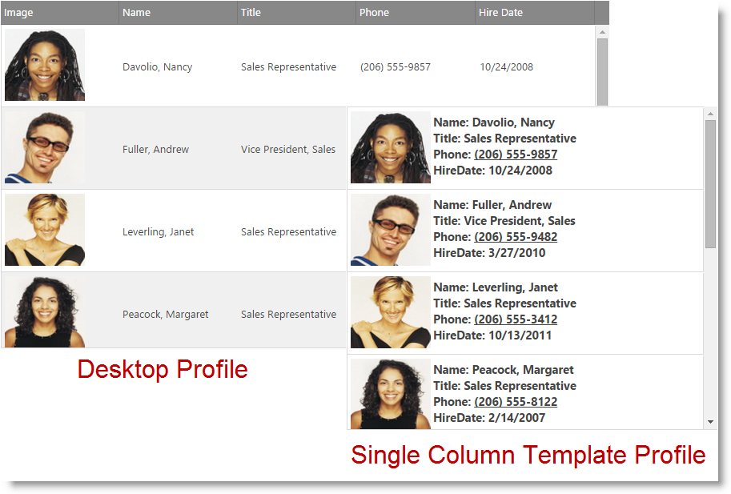

# 単一列テンプレートの構成 (igGrid、RWD モード)

import ApiLink from 'docs-template/components/mdx/ApiLink.astro';

# 単一列テンプレートの構成 (igGrid、RWD モード)

## トピックの概要

### 前提条件

以下の表は、このトピックを理解するための前提条件として必要な概念、トピック、および記事の一覧です。

- 概念
    - レスポンス Web デザイン
- トピック
    - [レスポンス Web デザイン (RWD) モードの概要 (igGrid)](/iggrid-responsive-web-design-mode-overview): このトピックは、`igGrid` コントロールの RWD モード機能およびこの機能が提供する機能性について概念的に説明します。
    - [レスポンス Web デザイン (RWD) モード構成を有効にする (igGrid)](/iggrid-enabling-responsive-web-design-mode): このトピックは、コード例を用いて、`igGrid` コントロールでレスポンス Web デザイン (RWD) モードを有効にする方法について説明します。
- 外部リソース
    -   [Wikipedia: レスポンシブ Web デザイン](https://ja.wikipedia.org/wiki/レスポンシブウェブデザイン)

#### このトピックの内容

このトピックは、以下のセクションで構成されます。

-   [**単一列テンプレートの概要**](#overview)
-   [**単一列テンプレートの構成**](#configuring)
-   [**関連コンテンツ**](#related-content)

##  単一列テンプレートの概要

レスポンシブ単一列テンプレートを使用すると、行のデータを現在のレイアウト モード (タブレットまたは携帯) に基づいて単一列に描画するカスタム テンプレートを定義できます。

これによりグリッドが小さいデバイスで描画される場合にデータのカスタム外観を作成できます。

>**注** RWD 単一列のテンプレートはページングのグリッド機能でのみサポートされます。その他のグリッド機能は現在このモードでサポートされません。

##  単一列テンプレートの構成

特定のプロファイルごとのテンプレートはレスポンシブ ウェブ デザイン モード機能の <ApiLink type="iggridresponsive" member="singleColumnTemplate" section="options" label="singleColumnTemplate" /> オプションで指定されます。 
現在のレイアウト モード (タブレットまたは携帯) に基づいて異なるテンプレートを指定し、データが表示される方法をカスタマイズできます。

以下のサンプルは、この構成がデバイス サイズに基づいたデータ レンダリングにどのように影響するかを示します。
さまざまなモードを表示するには、このサンプルをモバイル デバイスで開くか、ブラウザー ウィンドウをサイズ変更します。

   [レスポンシブ単一列テンプレート](\{environment:SamplesEmbedUrl\}/grid/responsive-single-column-template)

##  関連コンテンツ

###  トピック

このトピックに関連する追加情報については、以下のトピックを参照してください。

- [レスポンス Web デザイン (RWD) モードの概要 (igGrid)](/iggrid-responsive-web-design-mode-overview): このトピックは、`igGrid` コントロールの RWD モード機能およびこの機能が提供する機能性について概念的に説明します。
