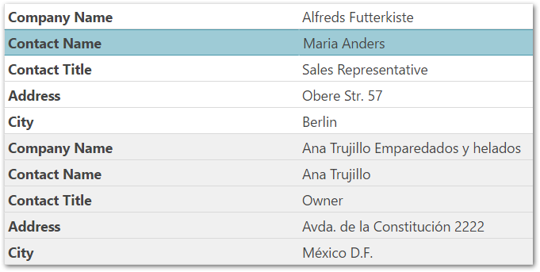

import ApiLink from 'docs-template/components/mdx/ApiLink.astro';

# 垂直列レンダリングの構成 (igGrid、RWD モード)

## トピックの概要

### 目的

このトピックは、`igGrid`™ における垂直列レンダリングの概要を提供し、その構成を説明して他の機能との統合における制限事項を示します。

### 前提条件

以下の表は、このトピックを理解するための前提条件として必要な概念、トピック、および記事の一覧です。

- 概念
    - レスポンス Web デザイン
- トピック
    - [レスポンス Web デザイン (RWD) モードの概要 (igGrid)](/iggrid-responsive-web-design-mode-overview): このトピックは、`igGrid` コントロールの RWD モード機能およびこの機能が提供する機能性について概念的に説明します。
    - [レスポンス Web デザイン (RWD) モード構成を有効にする (igGrid)](/iggrid-enabling-responsive-web-design-mode): このトピックは、コード例を用いて、`igGrid` コントロールでレスポンス Web デザイン (RWD) モードを有効にする方法について説明します。
- 外部リソース
    -   [Wikipedia: レスポンシブ Web デザイン](http://en.wikipedia.org/wiki/Responsive_web_design)


#### このトピックの内容

このトピックは、以下のセクションで構成されます。

-   [**垂直列レンダリングの概要**](#overview)
    -   [垂直列レンダリング構成の概要](#summary)
    -   [垂直列レンダリングの構成表](#chart)
	-   [レスポンシブ Web デザイン モードの無効化 - コード例](#examples)
-   [**コード例: JavaScript で垂直列レンダリングを無効にする**](#js-example)
    -   [コード](#js-example-code)
-   [**コード例: ASP.NET MVC で垂直列レンダリングを無効にする**](#mvc-example)
    -   [コード](#mvc-code)
-   [**非表示やページングおよびレスポンシブ構成テンプレートとの統合**](#feature-integration)
-   [**グリッドの機能使用時の制限事項**](#limitation)
-   [**プロパティ リファレンス**](#property-reference)
-   [**CSS クラス リファレンス**](#css-reference)
-   [**関連コンテンツ**](#related-content)
    -   [トピック](#topics)


## 垂直列レンダリングの概要

デフォルトで、Responsive 機能を有効にすると、垂直列を使用して `igGrid` を描画します。つまり、ブラウザーの幅がグリッドの幅より狭い場合、以下のスクリーンショットに示すように、グリッドがキー / 値ペアの一覧として描画されます。



`windowWidthToRenderVertically` オプションがこのビヘイビアーを制御します。オプションのデフォルト値は、特定サイズの列に対応するグリッド幅を計算して、ランタイム時に決定されます。デフォルトで、グリッド幅はリアルタイムで計算されます。

`allowedColumnWidthPerType` プロパティ メンバーを使用して列の幅を構成します。垂直レンダリングが強制実行される基準文字列の最小設定サイズは 120 ピクセル、数値列の最小幅は 50 ピクセルです。ウィンドウのサイズが最小列幅を下回ると、グリッドが垂直に描画されます。これは、必要に応じて最適な幅に設定できます。

垂直列レンダリングを無効にするには、`enableVerticalRendering` オプションを false に設定します。

グリッドを垂直に描画する場合、`ui-iggrid-responsive-vertical` クラスがグリッドのコンテナーに追加されます。したがって、このクラスを確認するだけで、グリッドの方向 (垂直または水平) を判断できます。

この機能に関しては、新たなイベントも追加されず、既存のイベントへのパラメーターも追加されません。

行はキー / 値ペアの一覧として描画され、`alternateRowStyles` オプションを true に設定している場合のみ、行 / レコードの交互スタイルが適用されます。

ヘッダーおよび値行の幅は、`propertiesColumnWidth` および `valuesColumnWidth` プロパティによって制御できます。

以下のサンプルでは、`igGrid` の垂直方向モードのレスポンス Web デザイン機能を紹介しています。レスポンシブ垂直レンダリング モードは、グリッド データを 2 つの列で描画します。左の列は、列のキャプションを含み、右の列はデータを含みます。

<div class="embed-sample">
   [レスポンシブ垂直レンダリング](&#123;environment:SamplesEmbedUrl&#125;/grid/responsive-vertical-rendering)
</div>

### 垂直列レンダリング構成の概要

Responsive 機能を有効にすると、デフォルトで、`igGrid`™ コントロールが垂直レンダリング モードを使用します。この設定を使用しない場合は、`windowWidthToRenderVertically` を明示的に構成して、このビヘイビアーの使用を止めます。

これは、JavaScript と ASP.NET MVC では異なります。

### 垂直列レンダリングの構成表

以下の表で、`igGrid` コントロールの垂直レンダリング モードを構成する方法を簡単に説明します。詳細は、表の後のコード例を参照してください。

垂直レンダリング モードを構成するには|以下を実行します。
---|---
JavaScript ファイル|RWD モード (機能名は `Responsive`) を `igGrid` の `features` 配列で構成します。<br />`windowWidthToRenderVertically` オプションの値をピクセルで設定します。
ASP.NET MVC|グリッドの `Features` メソッドに渡されるデリゲートで `Responsive` 機能をインスタンス化します。<br />`WindowWidthToRenderVertically` メソッドのパラメーター値をピクセルで設定します。


### レスポンシブ Web デザイン モードの無効化 - コード例

以下は、このトピックで使用したコード例を示しています。

- [JavaScript で垂直列レンダリングを無効にする](#js-example): JavaScript で `igGrid` のレスポンシブ垂直列レンダリングを無効化します。

- [ASP.NET MVC で垂直列レンダリングを無効にする](#mvc-example): ASP.NET MVC で `igGrid` のレスポンシブ垂直列レンダリングを無効化します。


## コード例: JavaScript で垂直列レンダリングを無効にする

以下の例は、AdventureWorks データベースからの製品表データにバインドされる `igGrid` インスタンスを作成します。

-   `igGrid` の `features `配列でレスポンシブ モードを有効にします。
-   `enableVerticalRendering` オプションを false に設定すると、垂直列レンダリングを無効化します。

### コード

以下のコードはこの例を実装します。

**JavaScript の場合:**

```js
$("#grid1").igGrid({
    height: "100%",
    width: "100%",
    columns: [
        { headerText: "Product ID", key: "ProductID", dataType: "number"},
        { headerText: "Product Name", key: "Name", dataType: "string" },
        { headerText: "Product Number", key: "ProductNumber", dataType: "string" }
    ],
    autoGenerateColumns: false,
    dataSource: adventureWorks,
    responseDataKey: "Records",
    features: [
        {
            name: "Responsive",
            enableVerticalRendering: false
        }
    ]
});
```


## コード例: ASP.NET MVC で垂直列レンダリングを無効にする

こ例は、View モデルとして定義されるカスタム Product オブジェクト コレクションにバインドされる `igGrid` インスタンスを作成します。

-   グリッドの `Features` メソッドに渡されるデリゲートで `Responsive` 機能をインスタンス化します。
-   `EnableVerticalRendering` メソッドに false を渡すと、垂直列レンダリングを無効化します。

### コード

以下のコードはこの例を実装します。

**C# の場合:**

```csharp
@using Infragistics.Web.Mvc
@model IQueryable<GridDataBinding.Models.Product>
@(Html.Infragistics()
	.Grid(Model)
	.ID("grid1")
	.AutoGenerateColumns(false)
	.Columns(col =>
	{
	    col.For(c => c.ProductID).HeaderText("Product ID");
	    col.For(c => c.Name).HeaderText("Product Name");
	    col.For(c => c.ProductNumber).HeaderText("Product Number");
	})
	.Features(feature =>
	{
	    features.Responsive().EnableVerticalRendering(false);
	})
	.DataBind().Render())
```


## 非表示やページングおよびレスポンシブ構成テンプレートとの統合

このモードに関して機能の統合は計画されていませんが、一部の機能をサポートしています。

-   ページング機能は、追加設定なしで使用できます。
-   非表示機能 (構成および API) は、垂直レンダリングの際に非表示の列を表示しないようにします。すなわち、列データを示す行が非表示になります。

> **注:** 列の非表示と垂直レンダリングを同時に使用することは推奨できません。

-   レスポンシブ構成で指定されたテンプレートなどのテンプレート化。ただし、このモードでは (右の列の) データ セルのみテンプレート化できます。


## グリッドの機能使用時の制限事項

垂直列レンダリング モードが有効な場合、レスポンシブ グリッドは以下の API 機能をサポートします。(ただし、この機能をサポートする UI は現在、実装されていません。)

-   [フィルタリング](/iggrid-filtering)
-   [並べ替え](/iggrid-sorting)
-   [非表示](/iggrid-column-hiding)

-   [選択](/iggrid-selection)機能は、選択が行識別のためにインデックスを使用する場合のみに UI により動作します。<ApiLink type="iggrid" member="primaryKey" section="options" label="primaryKey" /> を指定しなく、選択の永続化を無効にします。イベント引数、selectedCells/selectedRows プロパティ、および API は誤った結果を返します。
-   グリッドが垂直に描画されるとき、[GroupBy](/iggrid-groupby) や、[RowSelectors](../../02_Row Selectors/~igGrid_Row_Selectors.mdx)、[集計](/iggrid-column-summaries)、[更新](/iggrid-updating)、[仮想化](/iggrid-virtualization-overview)機能、および[階層](/ighierarchicalgrid-ighierarchicalgrid)モードはサポートされません。


## 垂直レンダリング プロパティ リファレンス

このセクションでは、`igGrid` コントロールの `Responsive` 機能を使用する際の垂直レンダリングに関連した各種プロパティについて説明します。

以下の表では、非バインド列のプロパティの目的と機能をまとめました。


| プロパティ | タイプ | 説明 | デフォルト値 |
| --- | --- | --- | --- |
| <ApiLink type="iggridresponsive" member="enableVerticalRendering" section="options" label="enableVerticalRendering" /> | bool | グリッドのレスポンシブ垂直レンダリングの ON と OFF を切替えます。 | true |
| <ApiLink type="iggridresponsive" member="windowWidthToRenderVertically" section="options" label="windowWidthToRenderVertically" /> | "string\|number\|null" | 内部でグリッドがコンテンツを垂直に描画するウィンドウの幅。デフォルトは null で、グリッドは `allowedColumnWidthPerType` 設定に基づきこのモードで描画するときを自動的に判断します。 | null |
| <ApiLink type="iggridresponsive" member="propertiesColumnWidth" section="options" label="propertiesColumnWidth" /> | "string \|number" | 垂直レンダリングが有効な左側のプロパティ列の幅 | “50%” |
| <ApiLink type="iggridresponsive" member="valuesColumnWidth" section="options" label="valuesColumnWidth" /> | "string \|number" | 垂直レンダリングが有効な右側の値列の幅 | “50%” |
| <ApiLink type="iggridresponsive" member="allowedColumnWidthPerType" section="options" label="allowedColumnWidthPerType" /> | "object" | `windowWidthToRenderVertically` が null の場合、グリッドの垂直レンダリングを強制実行する基準となる列の最小幅をプロパティのメンバーが決定します。たとえば、垂直レンダリングを強制実行する基準となる bool 列の最小幅は 50 ピクセルです。 | string: 120,, number: 50,, bool: 50,, date: 80,, object: 150 |


## CSS クラス リファレンス

このセクションでは、`igGrid` コントロールの [Responsive](/iggrid-responsive-web-design-mode-landingpage) 機能を使用する場合の垂直レンダリングに関連した各種 CSS クラスについて説明します。

以下は、垂直レンダリングが有効な場合に適用される CSS クラスを説明しています。

- <ApiLink type="iggridresponsive" label="ui-iggrid-responsive-vertical" />

	垂直レンダリングを有効にするとクラスをグリッド テーブルに適用します。このクラスがグリッドのコンテナーに追加されると、グリッドは垂直に描画されます。
	
	このクラスを確認すると、グリッドの描画方向 (垂直または水平) を判断できます。


## 関連コンテンツ

### トピック

このトピックの追加情報については、以下のトピックも合わせてご参照ください。


- [列非表示の構成 (igGrid、RWD モード)](/iggrid-responsive-web-design-mode-configuring-column-hiding): このトピックでは、コード例を用いて、レスポンス Web デザイン (RWD) モードで `igGrid` コントロール用に列を非表示にする方法について説明します。

- [列テンプレートの構成 (igGrid、RWD モード)](/iggrid-responsive-web-design-mode-configuring-row-and-column-templates): このトピックは、コード例を用いて `igGrid` コントロールの各 レスポンス Web デザイン (RWD) モード プロファイルに対して行と列を定義する方法、およびアクティブな RWD モードの切り替え時のテンプレートの自動変更を構成する方法について説明します。

- [カスタム レスポンス Web デザイン (RWD) プロファイルの作成 (igGrid)](/iggrid-responsive-web-design-mode-creating-custom-profile): このトピックは、コード例を使用して、`igGrid` コントロールのカスタム レスポンシブ Web デザイン (RWD) モード プロファイルを作成する方法について説明します。

- [ブートストラップ サポートの構成 (igGrid、RWD モード)](/iggrid-responsive-web-design-mode-configuring-bootstrap-support): このトピックは、Twitter Bootstrap の RWD クラスを用いて `igGrid` コントロールの レスポンス Web デザイン (RWD) モードを構成する方法について説明します。
