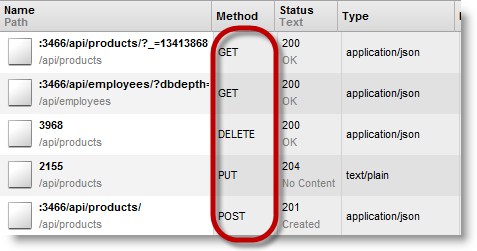
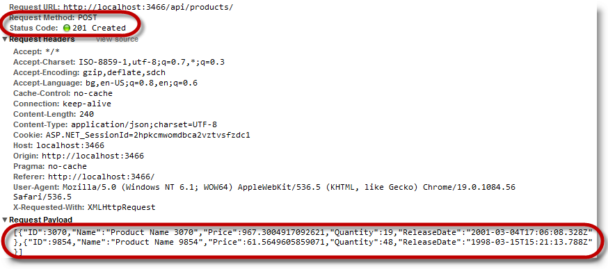
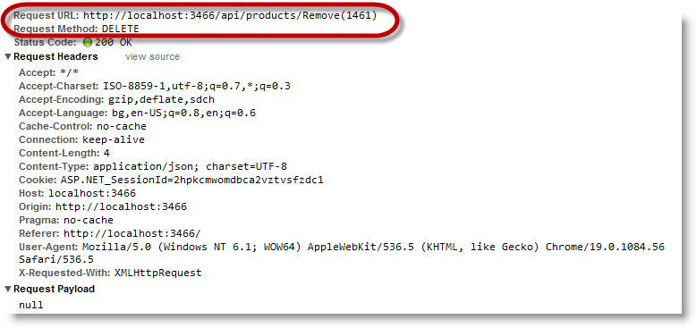
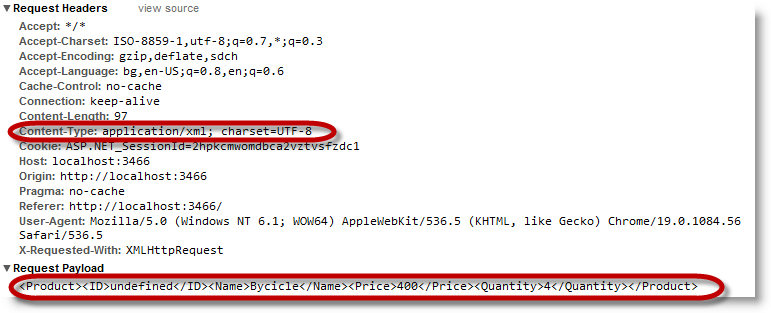

---
title: "REST の更新 (igGrid)"
slug: iggrid-rest-updating
---

# REST の更新 (igGrid)

## トピックの概要

### 目的

このトピックでは、REST サービスの `igGrid`™ サポートについて解説します。

### 前提条件

以下の表は、このトピックを理解するための前提条件として必要なトピックと記事の一覧です。

- 概念
	-   REST
	-   OData
	-   HTTP
- トピック
	- [igGrid の概要](/iggrid-overview): `igGrid` は、表形式データの表示および操作に使用される jQuery ベースのクライアント側グリッドです。そのライフサイクルはすべてクライアント側で完結しており、サーバー側のテクノロジとは無関係です。
	- [igGrid/igDataSource アーキテクチャの概要](/iggrid-igdatasource-architecture-overview): このドキュメントでは、`igDataSource` のアーキテクチャについて解説します。
	- [REST サービスへのバインド (igDataSource)](/igdatasource-binding-to-rest-services): このドキュメントでは、&#123;environment:ProductName&#125;™ データ ソースや `igDataSource` のコントロールに REST サービスをバインドする方法を紹介します。
- 外部リソース
	-   Representational State Transfer (REST)
	-   Open Data Protocol
	-   HTTP/1.1 RFC


#### このトピックの内容

このトピックは、以下のセクションで構成されます。

-   [概要](#introduction)
-   [igGrid REST プロパティ](#properties)
-   [コントロールの構成の概要](#configuration-summary)
-   [バッチ REST 要求の送信](#batch)
-   [カスタム スタイル URL](#custom-url)
-   [カスタム REST シリアライザーの作成](#custom-serializer)
-   [関連コンテンツ](#related-content)


## <a id="introduction"></a> 概要
#### igGrid REST の要点

REST フレームワークは、HTTP/1.1 プロトコルの上に作成します。その主な目的は、HTTP/1.1 動詞の GET、POST、PUT、DELETE を助けて、要求の操作のタイプを識別することです。

REST サポートを実現するため、`$.ig.RESTDataSource` タイプを作成しました。REST 設定は [`restSettings`](&#123;environment:jQueryApiUrl&#125;/ui.iggrid#options:restSettings) プロパティで構成します。`$.ig.RESTDataSource` は HTTP 動詞でデータを収集します。[`saveChanges`](&#123;environment:jQueryApiUrl&#125;/ui.iggrid#methods:saveChanges) メソッドを呼び出すと、`$.ig.RESTDataSource` は要求をシリアル化し、(`batch`の設定が true の場合は) それらをまとめて、(batch の設定が false) の場合は動詞タイプでグループ分けしたエンティティ チャンクごとに送信します。

デフォルトで、`$.ig.RESTDataSource` は JSON フォーマットをシリアル化します。他のフォーマットは、[`contentSerializer`](&#123;environment:jQueryApiUrl&#125;/ui.iggrid#options:restSettings.contentSerializer) 関数を実装すればサポートできます。

`igGrid` は内部的に `$.ig.RESTDataSource` を使用して REST バインディングをサポートしています。igGrid はすべての `$.ig.RESTDataSource` オプションを継承するため、これらのオプションは `igGrid` に直接設定できます。事実、`$.ig.RESTDataSource` を直接構成する必要はまったくありません。

ちなみに、`restSettings` は、`igGridUpdating` 機能が有効なときに使用します。`saveChanges` を呼び出すと、挿入した行はすべて POST 要求で送信され、削除された行はすべて DELETE 要求で送信され、更新された行はすべて PUT 要求で送信されます。

REST サポートはクライアント側に実装します。サーバー側では、REST サービスをプロデュースするテクノロジを使用できます。たとえば、ASP.NET MVC 4 WebAPI 実装の使用や、専用の ASP.NET MVC2/3 の作成が可能です。

REST 要求には 2 つのモードがあります。1 つはバッチモードで、もう 1 つは非バッチモードです。以上のモードは、データのパッケージ方法と、URL の構成が異なります。以下の表は、各 REST モードで定義された要求仕様をまとめたものです。

非バッチデフォルト URL パラメーター表:

HTTP メソッド/動詞|要求本体|URL パラメーター プレースホルダー|例
---|---|---|---
POST|シングル オブジェクト|/api/&#123;controller&#125;|/api/products
PUT|シングル オブジェクト|/api/&#123;controller&#125;/&#123;id&#125;|/api/products/1
DELETE|空|/api/&#123;controller&#125;/&#123;id&#125;|/api/products/1


バッチ デフォルト URL パラメーター テーブル:

HTTP メソッド/動詞|要求本体|URL パラメーター プレースホルダー|例
---|---|---|---
POST|オブジェクトの配列|/api/&#123;controller&#125;|/api/products
PUT|オブジェクトの配列|/api/&#123;controller&#125;/?index=&#123;id0&#125;&index=&#123;id1&#125;|/api/products/?index=3070&index=815
DELETE|空|/api/&#123;controller&#125;/?index=&#123;id0&#125;&index=&#123;id1&#125;|/api/products/?index=3070&index=815


> **注:** `igGrid` では、実行時に `restSettings` を動的に設定できます。

`url` を残りの設定の 1 つの動詞にだけ設定し、その `url` を他の動詞に使用することができます。この動作は、`url` オプションに対してだけ有効です。Batch オプションと Template オプションは動詞設定の間では再利用しません。

例:

次のコードは：

**JavaScript の場合:**

```js
restSettings: {
    create: {
        url: "/api/products/"
    }
}
```

次のように解釈します。

**JavaScript の場合:**

```js
restSettings: {
    create: {
        url: "/api/products/"
    },
    update: {
        url: "/api/products/"
    },
    remove: {
        url: "/api/products/"
    }
}
```

次のスクリーンショットは、[`saveChanges`](&#123;environment:jQueryApiUrl&#125;/ui.iggrid#methods:saveChanges) メソッドの実行時に `igGrid` が作成した要求です。




## <a id="properties"></a> igGrid REST オプション

以下の表は、`igGrid` REST 設定のオプション、およびデフォルト値と推奨値です。


| オプション | タイプ | 説明 | デフォルト値 |
| --- | --- | --- | --- |
| [restSettings](environment:jQueryApiUrl/ui.iggrid#options:restSettings) | object | REST 設定を収めたオブジェクトです。Create、Update、Delete の各要求には REST オプションがあります。 | - |
| [restSettings.create](environment:jQueryApiUrl/ui.iggrid#options:restSettings.create) | object | 作成要求の設定を保存したオブジェクトです。 | - |
| [restSettings.create.url](environment:jQueryApiUrl/ui.iggrid#options:restSettings.create.url) | string | このオプションは、要求の送信先であるリモート URL を指定します。 | null |
| [restSettings.create.template](environment:jQueryApiUrl/ui.iggrid#options:restSettings.create.template) | string | このオプションはリモート URL テンプレートを指定します。$&#123;id&#125; プレースホルダーは、リソース ID の代わりに使用します。 **注:**: このテンプレート オプションの設定は、url オプションより優先します。 **注:** このオプションが有効なのは非バッチ要求のコンテキスト内だけです。 | null |
| [restSettings.create.batch](environment:jQueryApiUrl/ui.iggrid#options:restSettings.create.batch) | false | このオプションは、作成要求をバッチで送信するかどうかを指定します。 | false |
| [restSettings.update](environment:jQueryApiUrl/ui.iggrid#options:restSettings.update) | object | 更新要求の設定を保存したオブジェクトです。 | - |
| [restSettings.update.url](environment:jQueryApiUrl/ui.iggrid#options:restSettings.update.url) | string | このオプションは、更新要求を送信するリモート URL を指定します。 | null |
| [restSettings.update.template](environment:jQueryApiUrl/ui.iggrid#options:restSettings.update.template) | string | このオプションはリモート URL テンプレートを指定します。$&#123;id&#125; プレースホルダーは、リソース ID の代わりに使用します。 **注:** このテンプレート オプションの設定は、url オプションより優先します。 **注:** このオプションが有効なのは非バッチ要求のコンテキスト内だけです。 | null |
| [restSettings.update.batch](environment:jQueryApiUrl/ui.iggrid#options:restSettings.update.batch) | false | このオプションは、更新要求をバッチで送信するかどうかを指定します。 | false |
| [restSettings.remove](environment:jQueryApiUrl/ui.iggrid#options:restSettings.remove) | object | 削除要求の設定を保存するオブジェクトです。 | - |
| [restSettings.remove.url](environment:jQueryApiUrl/ui.iggrid#options:restSettings.remove.url) | string | このオプションは、削除要求の送信先のリモート URL を指定します。 | null |
| [restSettings.remove.template](environment:jQueryApiUrl/ui.iggrid#options:restSettings.remove.template) | string | このオプションはリモート URL テンプレートを指定します。$&#123;id&#125; プレースホルダーは、リソース ID の代わりに使用します。 **注:** このテンプレート オプションの設定は、url オプションより優先します。 **注:** このオプションが有効なのは非バッチ要求のコンテキスト内だけです。 | null |
| [restSettings.remove.batch](environment:jQueryApiUrl/ui.iggrid#options:restSettings.remove.batch) | bool | このオプションは、削除要求をバッチで送信するかどうかを指定します。 | false |
| [restSettings.encodeRemoveInRequestUri](environment:jQueryApiUrl/ui.iggrid#options:restSettings.encodeRemoveInRequestUri) | bool | このオプションは、削除したリソースの ID を、キーインデックス付きのクエリー文字列として要求 URI で送信するかどうかを指定します。 **注:** このオプションは、バッチ要求のコンテキストでのみ有効です。 | true |
| [restSettings.contentSerializer](environment:jQueryApiUrl/ui.iggrid#options:restSettings.contentSerializer) | function | サーバーに送信したコンテンツをシリアル化するカスタム関数を指定します。 | null |
| [restSettings.contentType](environment:jQueryApiUrl/ui.iggrid#options:restSettings.contentType) | string | 要求のコンテンツタイプを指定します。 | 'application/json; charset=utf-8' |


## <a id="configuration-summary"></a> コントロールの構成の概要

| 構成可能な要素 | 詳細 | オプション |
| --- | --- | --- |
| [バッチ REST 要求の送信](#batch) | サーバーに対するデータの送信方法を選択できます。ひとつは、エントリごとに要求を作成する方法です。もうひとつは、複数のエントリをラップして 1 つの要求として送信する方法です。 | [restSettings.create.batch](environment:jQueryApiUrl/ui.iggrid#options:restSettings.create.batch) [restSettings.update.batch](environment:jQueryApiUrl/ui.iggrid#options:restSettings.update.batch) [restSettings.remove.batch](environment:jQueryApiUrl/ui.iggrid#options:restSettings.remove.batch) |
| [カスタム スタイル URL](#custom-url) | カスタム URL の定義方法を表示します。カスタム URL は OData 的な URL の作成時に使用できます。 | [restSettings.create.template](environment:jQueryApiUrl/ui.iggrid#options:restSettings.create.template) [restSettings.update.template](environment:jQueryApiUrl/ui.iggrid#options:restSettings.update.template) [restSettings.remove.template](environment:jQueryApiUrl/ui.iggrid#options:restSettings.remove.template) |
| [カスタム REST シリアライザーの作成](#custom-serializer) | $.ig.RESTDataSource は、そのままで JSON シリアル化をサポートしています。ただし、カスタム シリアライザーも実装できます。 | [restSettings.contentType](environment:jQueryApiUrl/ui.iggrid#options:restSettings.contentType) [restSettings.contentSerializer](environment:jQueryApiUrl/ui.iggrid#options:restSettings.contentSerializer) |


## <a id="batch"></a> バッチ REST 要求の送信

`$.ig.RESTDataSource` は 2 つのタイプのテンプレートをサポートしています。

-   非バッチモード - このモードでは、データ ソースは個々のエンティティを別々の Ajax 呼び出しでサーバーに送信します。
-   バッチ モード - このモードでは、データ ソースは動詞タイプ別にすべてのエンティティをラップし、それらを最高 3 つの Ajax 呼び出しでサーバーに送信します。

### オプションの設定

以下の表は、必要な構成とオプション設定の対応です。


目的:|使用するオプション|設定の選択肢:
---|---|---
新しいエンティティ用のバッチ REST 要求|[restSettings.create.batch](&#123;environment:jQueryApiUrl&#125;/ui.iggrid#options:restSettings.create.batch)|true
更新したエンティティ用にバッチ REST 要求を送信します。|[restSettings.update.batch](&#123;environment:jQueryApiUrl&#125;/ui.iggrid#options:restSettings.update.batch)|true
削除したエンティティ用にバッチ REST 要求を送信します。|[restSettings.remove.batch](&#123;environment:jQueryApiUrl&#125;/ui.iggrid#options:restSettings.remove.batch)|true


### 例

以下のスクリーンショットは、以下の設定による `$.ig.RESTDataSource` の動作を示します。

オプション|値
-------|-------
[restSettings.create.batch](&#123;environment:jQueryApiUrl&#125;/ui.iggrid#options:restSettings.create.batch)|true





## <a id="custom-url"></a> カスタム スタイル URL

デフォルトで、このトピックで前述したように `$.ig.RESTDataSource` は宛先 URL を作成します。サーバーに別のロジックがある場合、URL テンプレートで URL を定義できます。また、その URL テンプレートで OData 互換 URL も作成できます。

> **注:** 現在、テンプレート文字列でサポートしているプレースホルダーは $&#123;id&#125; のみです。

### オプションの設定

以下の表は、必要な構成とオプション設定の対応です。

目的:|使用するオプション|設定の選択肢:
---|---|---
PUT 要求のカスタム URL テンプレートを設定します。|[restSettings.update.template](&#123;environment:jQueryApiUrl&#125;/ui.iggrid#options:restSettings.update.template)|カスタム URL テンプレート文字列。たとえば: “/api/products/Update($&#123;id&#125;)”
DELETE 要求のカスタム URL テンプレートを設定します。|[restSettings.remove.template](&#123;environment:jQueryApiUrl&#125;/ui.iggrid#options:restSettings.remove.template)|カスタム URL テンプレート文字列。たとえば: “/api/products/Remove($&#123;id&#125;)”


### 例

以下のスクリーンショットは、以下の設定による `$.ig.RESTDataSource` の動作を示します。

オプション|値
-------|-------
[restSettings.remove.template](&#123;environment:jQueryApiUrl&#125;/ui.iggrid#options:restSettings.remove.template)|“/api/products/Remove($&#123;id&#125;)”





## <a id="custom-serializer"></a> カスタム REST シリアライザーの作成

`$.ig.RESTDataSource` は、そのままで JSON シリアル化をサポートしています。ただし、カスタムシリアライザーも実装できます。

### オプションの設定

以下の表は、必要な構成とオプション設定の対応です。

目的:|使用するオプション|設定の選択肢:
---|---|---
XML としてデータをシリアル化|[contentType](&#123;environment:jQueryApiUrl&#125;/ui.iggrid#options:restSettings.contentType) |“application/xml; charset=utf-8”
 | [contentSerializer](&#123;environment:jQueryApiUrl&#125;/ui.iggrid#options:restSettings.contentSerializer) | 引数を 1 つ受け取りシリアル化したデータを返す関数。 <br /> バッチ要求の場合、この引数はオブジェクトの配列になり、オブジェクトのタイプがデータ ソース エンティティのタイプと一致します。 <br /> 非バッチ要求の場合、この引数はタイプがデータ ソース エンティティのタイプと一致するオブジェクトになります。


### 例

以下のスクリーンショットは、以下の設定による `$.ig.RESTDataSource` の動作を示します。

- `contentType`
	- “application/xml; charset=utf-8”
- `contentSerializer` 
	- **JavaScript の場合:**
```js
		function (ds) {
		    // if ds contains JavaScript object literal like this: {"ID":9,"Name":"Product","Price":90.0,"Quantity":2 } then you can serialize it in XML like this
		    return "<Product><ID>" + ds.ID + "</ID><Name>" + ds.Name + "</Name><Price>" + ds.Price + "</Price><Quantity>" + ds.Quantity + "</Quantity></Product>";    
		}
```




## <a id="related-content"></a> 関連コンテンツ

### <a id="topics"></a> トピック

このトピックの追加情報については、以下のトピックも合わせてご参照ください。

- [Web サービスへのバインド](/iggrid-binding-to-web-services): このドキュメントでは、&#123;environment:ProductName&#125;™ グリッドまたは `igGrid` を oData プロトコルの Web ベース データ ソースにバインドする方法を説明します。

- [igGrid、OData、WCF の各データサービスの導入](/iggrid-getting-started-with-iggrid-odata-and-wcf-data-services): このトピックでは、ASP.NET Web アプリケーションに WCF データ サービスをセットアップし、`igGrid` の 2 つのオプションを設定して、リモート ページング、フィルタリング、ソーティングとともにクライアント側の jQuery グリッドをセットアップする方法を紹介します。


 

 


