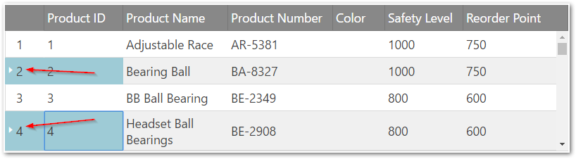
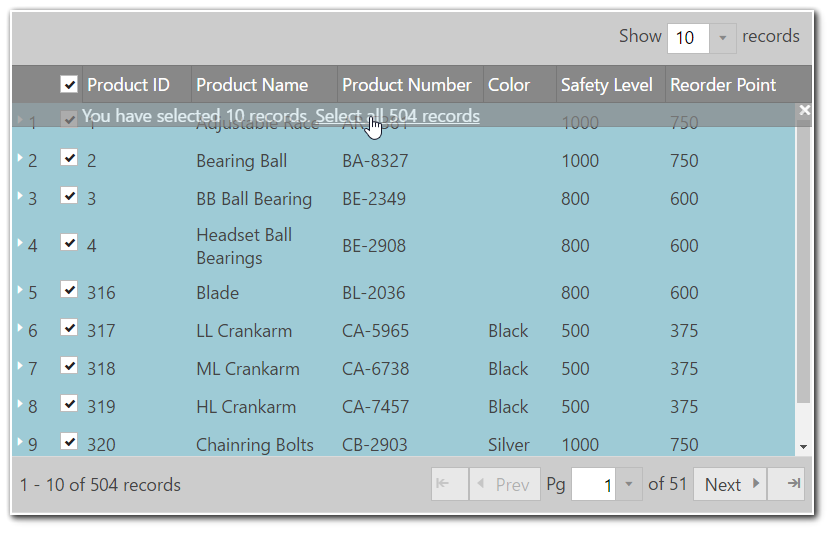
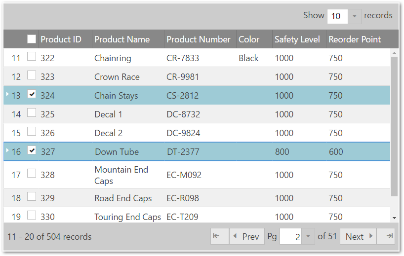
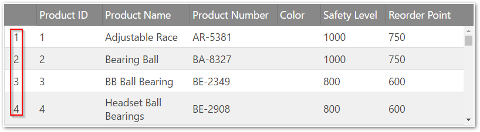

# 行セレクターの構成 (igGrid)

import ApiLink from 'docs-template/components/mdx/ApiLink.astro';

# 行セレクターの構成 (igGrid)


## トピックの概要

### 目的
このトピックでは、igGrid で行選択を構成する方法を紹介します。

### このトピックの内容
このトピックは、以下のセクションで構成されます。

-   [**RowSelectors 構成の概要**](#overview)
-   [**複数行選択を有効にする**](#multiple-row-selection)
    -   [プレビュー](#multiple-preview)
    -   [コード](#multiple-code)
-   [**すべてのページで選択の有効化**](#select-all-pages)
    -   [プレビュー](#selectall-preview)
    -   [すべて選択機能を有効にするプロパティ設定](#selectall-enabling)
    -   [コード](#selectall-code)
-   [**選択チェックボックスを追加する**](#adding-selection-checkboxes)
    -   [プレビュー](#checkboxes-preview)
    -   [チェックボックスを有効にするプロパティ設定](#checkboxes-enabling)
    -   [コード](#checkboxes-code)
-   [**行の番号付けを有効にする**](#row-numbering)
    -   [プレビュー](#row-numbering-preview)
    -   [行の番号付けを有効にするプロパティ設定](#row-numbering-enabling)
    -   [コード](#row-numbering-code)
-   [**チェックボックス状態変更イベントをキャンセルする**](#cancel-checkbox)
    -   [手順](#cancel-checkbox-steps)
-   [**関連トピック**](#topics)

### 前提条件 

以下の表は、このトピックを理解するために必要な前提条件です。

- トピック
	- まず「[行セレクターを有効にする](/iggrid-enabling-row-selectors)」トピックを読む必要があります。
- 外部リソース 
	- まず [jQuery on() API](http://api.jquery.com/on/) を読む必要があります。


## <a id="overview"></a> RowSelectors 構成の概要 

`igGrid`™ コントロールの `rowSelectors` ウィジェットは多数の構成オプションを公開しています。以下の表は、構成可能な画面要素とウィジェットから管理できるビヘイビアを示しています。一部のビヘイビア/機能については、チャートに続くブロックに詳細説明と例が記載されています。


構成可能なビヘイビア/機能|構成の詳細|構成プロパティ
---|---|---
複数行の選択|デフォルトで RowSelectors ウィジェットの行の番号付けが有効になっています。|-
選択チェックボックス|行セレクター列にチェックボックスを含むかどうかを判断します|<ApiLink type="iggridrowselectors" member="enableCheckBoxes" section="options" label="enableCheckBoxes" />
行の番号付け|プロパティが有効な場合、行セレクター列には行番号が入っています。|<ApiLink type="iggridrowselectors" member="enableRowNumbering" section="options" label="enableRowNumbering" />
チェックボックス状態変更イベントをキャンセルする|`checkBoxStateChanging` イベントにフックし、ある状態にあるそのイベントをキャンセルします。|-
行の番号付けシード|シードがデフォルト番号付けに追加されます。|<ApiLink type="iggridrowselectors" member="rowNumberingSeed" section="options" label="rowNumberingSeed" />
行セレクター列の幅。|行セレクター列の幅はプロパティを設定することで構成できます。|<ApiLink type="iggridrowselectors" member="rowSelectorColumnWidth" section="options" label="rowSelectorColumnWidth" />
構成可能イベント|これらのイベントの詳細情報は、プロパティ参照セクションのリストを参照してください。 [igGridRowSelectors イベント](/iggrid-rowselectors-events) | 
必須選択|選択機能を有効にすることを必須にします。選択が有効でない場合、例外がスローされます。|<ApiLink type="iggridrowselectors" member="requireSelection" section="options" label="requireSelection" />


## <a id="multiple-row-selection"></a> 複数行選択を有効にする

RowSelectors でセルまたは行を選択するには、グリッドの Selection 機能を初期化する必要があります。RowSelectors は Selection 機能を自動的に初期化しないため、必要に応じてユーザーに有効にしてもらいます。Selection 機能がなくても、行の番号付け機能などに RowSelectors を使用できます。以下の例では、複数選択が有効になっています。赤色の矢印は、行セレクター列を示します。

### <a id="multiple-preview"></a> プレビュー 
以下の図では、RowSelectors と複数選択機能が有効になっています。



### <a id="multiple-code"></a> コード 
**HTML の場合:**

```html
<script type="text/javascript">
$(function () {
    $("#grid").igGrid({
              autoGenerateColumns: true,
              dataSource: source,
              features: [
                {
                    name: 'RowSelectors'
                },
                {
                    name: 'Selection',
					mode: "cell",
                    multipleSelection: true
                }
            ]
     });
});
</script>
```

**Razor の場合:**

```csharp
@Html.Infragistics().Grid(Model)
    .AutoGenerateColumns(true)
    .Features(feature =>        {       
        feature.Selection().MultipleSelection(true);
        feature.RowSelectors();
    })
	.DataBind()
	.Render()
)
```

## <a id="select-all-pages"></a> すべてのページで選択の有効化

デフォルトで、複数選択モードに利用可能なヘッダー チェックボックスは現在のデータ ビューのすべての行をチェックします。グリッドの行セレクター機能およびページング機能は、"enableSelectAllForPaging" オプション (デフォルト値は true) を使用してすべてのページでレコードをすべて選択する機能を提供します。

ローカル ページングの場合、ヘッダー チェックボックスをクリックすると、すべてのページからの行を選択/選択解除するオプションを通知するオーバーレイが表示されます (以下の画面参照)。

> **注:** 「すべて選択」機能はリモート ページング機能をサポートしません。ヘッダー チェックボックスをクリックすると、現在のページのみの行が選択されます。

### <a id="selectall-preview"></a> プレビュー 
以下の画面は「すべて選択」機能を表示します。



### <a id="selectall-enabling"></a> 「すべて選択」機能を有効にするプロパティ設定 

以下の表は、プロパティ設定の推奨構成をマップしています。プロパティは igGridRowSelectors オプションを通じてアクセスされます。

プロパティ|設定
---|---
<ApiLink type="iggridrowselectors" member="enableSelectAllForPaging" section="options" label="enableSelectAllForPaging" /> |true
<ApiLink type="iggridrowselectors" member="enableCheckBoxes" section="options" label="enableCheckBoxes" />|true
<ApiLink type="iggridselection" member="multipleSelection" section="options" label="multipleSelection" />|true

### <a id="selectall-code"></a> コード 
**HTML の場合:**

```html
<script type="text/javascript">
  $(function () {
      $("#grid").igGrid({
                autoGenerateColumns: true,
                dataSource: source,
                features: [
                  {
                      name: 'RowSelectors',
                      enableCheckBoxes: true,
                      enableSelectAllForPaging: true
                  },
                  {
                      name: 'Selection',
                      multipleSelection: true
                  },
                  {
                      name: 'Paging',
                      type: "local",
                      pageSize: 10
                  }
              ]
       });    
   });
</script>
```

**Razor の場合:**

```csharp
@Html.Infragistics().Grid(Model)
    .AutoGenerateColumns(true)
    .Features(feature =>        {       
        feature.Selection().MultipleSelection(true);
      	feature.RowSelectors()
        	.EnableCheckBoxes(true)
            .EnableSelectAllForPaging(true);
        feature.Paging().PageSize(10);
    })
	.DataBind()
	.Render()
)
```

## <a id="adding-selection-checkboxes"></a> 選択チェックボックスを追加する 

選択チェックボックスは、`enableCheckBoxes` プロパティを true に設定して追加されます。チェックボックス機能が有効になっている場合、複数行を選択するときに Ctrl キーを押していなくてもよいように、複数選択を使用することをお勧めします。

複数選択が有効な場合、行セレクターの列ヘッダーにチェックボックスが表示されます。このチェックボックスはすべての行を一度に選択/選択解除します。ページング機能が有効な場合、現在のページのみの行を選択/選択解除します。

> **注: **チェックボックスを有効にする場合、`igGridSelection` は「row」選択モードを使用します。

### <a id="checkboxes-preview"></a> プレビュー 

以下の図は、両方のチェックボックス機能とページングが有効なグリッドを示します。



### <a id="checkboxes-enabling"></a> チェックボックスを有効にするプロパティ設定 

以下の表は、プロパティ設定の推奨構成をマップしています。プロパティは igGridRowSelectors オプションを通じてアクセスされます。

プロパティ|設定
---|---
<ApiLink type="iggridrowselectors" member="enableCheckBoxes" section="options" label="enableCheckBoxes" />|true

### <a id="checkboxes-code"></a> コード 

**HTML の場合:**

```html
<script type="text/javascript">
    $(function () {
        $("#grid").igGrid({
              autoGenerateColumns: true,
              dataSource: source,
              features: [
                {
                    name: 'RowSelectors', 
                    enableCheckBoxes: true
                },
                {
                    name: 'Selection',
                    multipleSelection: true
                }
              ]
        });
    });
</script>
```

**Razor の場合:**

```csharp
@Html.Infragistics().Grid(Model)
    .AutoGenerateColumns(true)
    .Features(feature =>         { 
        feature.Selection().MultipleSelection(true);
        feature.RowSelectors().EnableCheckBoxes(true);
     })
	.DataBind()
	.Render()
)
```

## <a id="row-numbering"></a> 行の番号付けを有効にする 

グリッドの行セレクター列は、行を連番で表示する場合に使用できます。これは `RowSelectors` 機能の `enableRowNumbering` オプションで管理されます。

### <a id="row-numbering-preview"></a> プレビュー 

図は、行番号が有効なグリッドを示します。



### <a id="row-numbering-enabling"></a> 行の番号付けを有効にするプロパティ設定 

以下の表は、プロパティ設定の推奨構成をマップしています。プロパティは `igGridRowSelectors` オプションを通じてアクセスされます。

0 以外の開始値を設定するには、`rowNumberingSeed` オプションを使用します。

プロパティ|設定
---|---
enableRowNumbering|true
rowNumberingSeed| 0

### <a id="row-numbering-code"></a> コード 

**JavaScript の場合:**

```js
<script type="text/javascript">
$(function () {
  $("#grid").igGrid({
         autoGenerateColumns: true,
         dataSource: source,
             features: [
                {
                    name: 'RowSelectors', 
                    enableRowNumbering: true
                }
            ]
    });
 });
</script>
```
 

**Razor の場合:**

```csharp
@Html.Infragistics().Grid(Model)
    .AutoGenerateColumns(true)
    .Features(feature =>        {
		feature.Selection().MultipleSelection(true);
        feature.RowSelectors().EnableRowNumbering(true);
    })
	.DataBind()
	.Render()
)
```

## <a id="cancel-checkbox"></a> チェックボックス状態変更イベントをキャンセルする 

`checkBoxStateChanging` イベントを処理することで、チェックボックス選択をキャンセルできます。

以下はプロセスの概念的概要です。

1.  `checkBoxStateChanging` イベントの処理
2.  イベントのキャンセル

### <a id="cancel-checkbox-steps"></a> 手順 
1.  `checkBoxStateChanging` イベントを処理します。
    1.  `checkBoxStateChanging` イベントが発生した場合に呼び出される関数を定義します。

        **JavaScript の場合:**

```js   
        function gridcheckboxStateChanging (evt, ui) {
         
        };   
```

    2.  ハンドラーを `igGrid` の `rowSelectorClicked` イベントに設定します。

		いったんハンドラーを定義したら、gridcheckboxStateChanging イベントのハンドラーとして設定する必要があります。
		
		jQuery では、これはウィジェットがインスタンス化されるときに行うことができます。
		
		ASP.NET MVC では、jQuery delegate() または bind() API を使用してイベントを添付する必要があります。このイベントの型は iggridrowselectorscheckboxstatechanging です。 
		
		**JavaScript の場合:**
		
```js
		$(function () {
		  $("#grid1").igGrid({
		       autoGenerateColumns: true,
		       dataSource: adventureWorks,
		       responseDataKey: 'Records',
		       features: [
	                {
	                     name: 'RowSelectors',
	                     enableCheckBoxes: true,
	                     checkBoxStateChanging: "gridcheckboxStateChanging"
	                },
	                {
	                     name: 'Selection'
	                }
		       ]
		  });
		});
```

2. イベントをキャンセルします。

	false を返すことでイベントをキャンセルします。
	
	**JavaScript の場合:**
	
```js     
	function gridcheckboxStateChanging (evt, ui) {
	   if (conditionNotMet)
	      return false;
	};   
```

##  <a id="topics"></a> 関連トピック 

以下は、その他の役立つトピックです。

-   [行セレクターを有効にする](/iggrid-enabling-row-selectors)
-   [行セレクターのイベント](/iggrid-rowselectors-events)

 
### <a id="samples"></a> サンプル

このサンプルでは、`igGrid` における行セレクターの構成方法を紹介します。

<div class="embed-sample">
   [行セレクターの構成](\{environment:SamplesEmbedUrl\}/grid/row-selectors)
</div>
 


