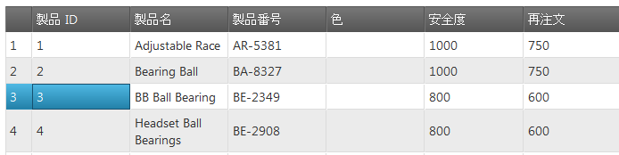

# 行セレクターの有効化 (igGrid)


## トピックの概要

### 目的

`igGrid`™ コントロールの `rowSelectors` ウィジェットを有効にする方法を紹介します。

### このトピックの構成
-   [**概要**](#intro)
-   [**プレビュー**](#preview)
-   [**要件**](#requirements)
    -   [全般的な要件](#general-requirements)
    -   [スクリプト要件](#script-requirements)
    -   [データベース要件](#database-requirements)
-   [**JQuery で RowSelectors を有効にする**](#jQuery)
-   [**MVC で RowSelectors を有効にする**](#mvc)
-   [**関連コンテンツ**](#related-content)
    -   [トピック](#topics)
    -   [サンプル](#samples)

## 概要

`rowSelectors` ウィジェットは、グリッドの最初の列の左側に配置された行セレクター列をクリックすることで、セルまたは行全体を選択する機能をユーザーに提供します。さらに、そのウィジェットは行の番号付け機能や行を選択するためのチェックボックスを備えています。

`igGrid` コントロールの行選択機能はデフォルトで無効のため、明示的に有効にする必要があります。

以下の例では、RowSelectors 機能を有効にしたグリッドが構成されています。

## プレビュー

以下は最終結果のプレビューです。



## 要件

### 全般的な要件
-   jQuery の要件
    -   グリッドがデータ ソースに接続されている HTML 形式の Web ページであること
    -   グリッドのコンテナとして機能するテーブル タグが HTML ページの本文に含まれていること

 

**HTML の場合:**

```html
<table id="grid">
</table>
```

-   MVC 固有の要件
    -   グリッドがデータ ソースに接続されている MS Visual Studio® の MVC 4 以後のプロジェクトであること
    -   &#123;environment:ProductNameMVC&#125; dll への参照があること - Infragistics.Web.Mvc.dll

### スクリプト要件

jQuery と MVC が jQuery ウィジェットを再描画するため、両方のサンプルに必要なスクリプトは同じです。次が必要になります。

グリッドとそのグループ化機能を実行するためには以下のスクリプトが必要とされます。

-   jQuery ライブラリ スクリプト
-   jQuery User Interface (UI) ライブラリ スクリプト
-   IG ライブラリ スクリプト (これはコントロールのコードを難読化したものです)

次のコード サンプルは、HTML ファイルのヘッダー セクションに追加されるスクリプトです。

**HTML の場合:**

```html
<script type="text/javascript" src="jquery.min.js"></script>
<script type="text/javascript" src="jquery-ui.min.js"></script>
<script type="text/javascript" src="infragistics.core.js"></script>
<script type="text/javascript" src="infragistics.lob.js"></script>
```

### データベース要件

このサンプルでは以下が使用されています。

-   MVC - Adventure Works データベース


## JQuery で RowSelectors を有効にする
 
1.  **データ ソースを設定します。**

    以下のコード スニペットで使用されているデータ ソースは、あくまでこの例のために使用されているだけです。

    **HTML の場合:**

```html
    <script type="text/javascript">
    source = [
             { "ProductID": 1, "Name": "Adjustable Race", "SafetyStockLevel": 1000, "ReorderPoint": 750, "StandardCost": 0.0000 }, 
             { "ProductID": 2, "Name": "Bearing Ball", "SafetyStockLevel": 1000, "ReorderPoint": 750, "StandardCost": 0.0000 }, 
             { "ProductID": 3, "Name": "BB Ball Bearing", "SafetyStockLevel": 800, "ReorderPoint": 600, "StandardCost": 0.0000 },
             { "ProductID": 4, "Name": "Headset Ball Bearings", "SafetyStockLevel": 800, "ReorderPoint": 600, "StandardCost": 0.0000 }]

    </script>
```

2.  **igGrid を作成し、RowSelectors 機能を有効にします。**

    `$(document).ready()` イベント ハンドラーの中で、`igGrid` を作成し、グリッドの RowSelectors 機能を構成します。選択できるよう、RowSelectors 機能を有効にしている場合は、igGrid で Selection 機能を有効にすることをお勧めします。

    > **注:**
	>  選択が有効でない場合も、RowSelectors は行の番号付け機能用などに使用できる点に注意してください。この設定では、例外を防止するために `requiredSelection` オプションを false に設定してください。

    **JavaScript の場合:**

```js
    $("#grid").igGrid({
        autoGenerateColumns: true,
           dataSource: source,
           features: [
                {
                    name: 'RowSelectors'
                },
                {
                    name: 'Selection'                
                }
            ]
    });
```

3.  **ファイルを保存します。**
4.  (オプション) **結果を確認します。**

    結果を検証するために、ファイルを開きます。上記のプレビューに示すような結果になっているはずです。

## MVC で RowSelectors を有効にする

1.  **MVC Controller メソッドを作成します。**

    MVC Controller メソッドを作成し、Model からデータを取得して View を呼び出します。

    **C# の場合:**

```csharp
    public ActionResult Default()
    {
        var ds = this.DataRepository.GetDataContext().Products.Take(4);
        return View(ds);
    }
```

2.  **igGrid をインスタンス化します。**

    RowSelectors 機能を有効にした `igGrid` をインスタンス化します。

    > **注:**
    > 選択が有効でない場合でも、RowSelectors を使用して行の番号付けなどができる点にご注意ください。この設定では、例外を防止するために `requiredSelection` オプションを false に設定してください。

    **ASPX の場合:**

```csharp
    <%= Html.Infragistics().Grid(Model)
        .AutoGenerateColumns(true)
        .Features(feature =>{
            feature.Selection();
            feature.RowSelectors();
            }).DataBind()
        .Render()
    %>
```

    **CSHTML の場合:**

```csharp
    @( Html.Infragistics().Grid(Model)
        .AutoGenerateColumns(true)
        .Features(feature =>{
            feature.Selection();
            feature.RowSelectors();
            }).DataBind()
        .Render()
    )
```

3.  **ファイルを保存します。**
4.  (オプション) **結果を確認します。**

    結果を検証するために、MVC プロジェクトを実行して、ファイルを開きます。上記のプレビューに示すような結果になっているはずです。


## 関連コンテンツ

### トピック

以下は、その他の役立つトピックです。

- [行セレクターの構成](/iggrid-configuring-row-selectors)

- [&#123;environment:ProductName&#125; で JavaScript リソースを使用](/deployment-guide-javascript-resources)

- [&#123;environment:ProductName&#125; のスタイル設定とテーマ設定](/deployment-guide-styling-and-theming)

### サンプル

-   [行セレクター](&#123;environment:SamplesUrl&#125;/grid/selection)

 

 


