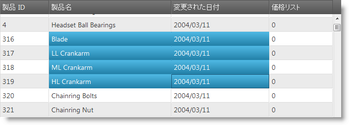
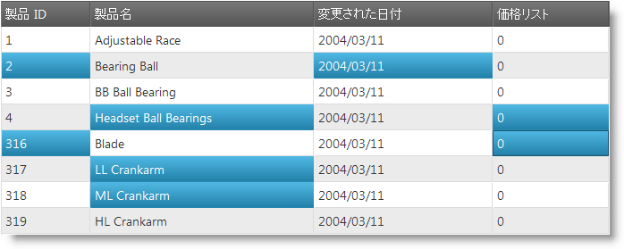

import ApiLink from 'docs-template/components/mdx/ApiLink.astro';

# セルの複数選択概要 (igGrid)

## トピックの概要

### 目的

このトピックでは、`igGrid`™ コントロールに対するデスクトップとタッチ環境の両方の複数セル選択を構成する方法を説明します。

### 前提条件

以下の表は、このトピックを理解するための前提条件として必要なトピックを示しています。

- [&#123;environment:ProductName&#125; コントロールのタッチ サポート](/touch-support-for-igniteui-for-jquery-controls): このトピックは、タッチ対話をサポートするために行われた &#123;environment:ProductName&#125; コントロールの更新を紹介します。

- [igGrid 選択](/iggrid-selection-overview): このトピックでは、`igGrid` 選択の有効化と使用法を説明します。

### このトピックの内容

このトピックは、以下のセクションで構成されます。

-   [**概要**](#introduction)
-   **セルの複数選択**
-   -   [セルの複数選択概要](#overview)
    -   [ドラッグによるセルの複数選択](#dragging)
    -   [複数クリック/タップによるセルの複数選択](#clicks-taps)
-   [**プロパティ リファレンス**](#property-reference)
-   [**関連コンテンツ**](#related-content)
    -   [トピック](#topics)
    -   [サンプル](#samples)

## 概要

`igGrid` 選択機能は、グリッド内の単一および複数セル選択を有効にします。単一セル選択は、ひとつのセルをクリックする (デスクトップ) かまたはセルをタップする (タッチ) ことで行われ、複数選択は、デスクトップとタッチどちらの環境でもグリッドの適切な構成で可能になります。

`igHierarchicalGrid`™ は内部的に `igGrid` コントロールを使用し、すべての `igGrid` 機能を使用するよう設計されています。設計機能は　`igHierarchicalGrid` インスタンス内で引き継ぎ可能ではありません。このことは、選択は親グリッド ウィジェットで一度構成されることを意味しています。一度親グリッドで有効化されると、選択機能は子レイアウトを含む全グリッドで利用可能になります。

## セルの複数選択

### セルの複数選択概要

次は、`igGrid` コントロール内で複数セルを選択する方法についていくつかの異なる方法を要約しています。詳細は、概要表の後に記載されています。

- [ドラッグによるセルの複数選択](#dragging): ある複数セルの領域を選択できるようにするために構成が必要なプロパティを詳しく説明します。

- [複数クリック/タップによるセルの選択](#clicks-taps): 不連続な複数セルを選択できるようにするために構成が必要なプロパティを詳しく説明します。

> **注:** 複数選択を可能にするためには、デフォルト値が　false なため、`multipleSelection` プロパティを true に設定する必要があります。

### ドラッグによるセルの複数選択

ユーザーがデスクトップ・プラットフォームでドラッグによって複数セルを選択することを可能にする `igGrid` 選択プロパティは <ApiLink type="iggridselection" member="mouseDragSelect" section="options" label="mouseDragSelect" /> と呼ばれ、`true` に設定しなければなりません。

タッチによる対応する複数セル選択のプロパティは、<ApiLink type="iggridselection" member="touchDragSelect" section="options" label="touchDragSelect" /> で、これも `true` に設定します。

> **注:** デフォルトでは、どちらのプロパティも `true` に設定されているため、明示的な構成がなくてもユーザーは複数セルを選択することができます。

導入に関する詳細については関連サンプルをご覧ください。

#### 関連サンプル:

-   [igGrid 選択](&#123;environment:SamplesUrl&#125;/grid/selection)

### 複数クリック/タップによるセルの複数選択

不連続なセル (ランダムな位置) の選択を可能にするためには、デスクトップ環境では **CTRL** を押しながらセルをクリックします。同じ機能をタッチ環境で行うには、<ApiLink type="iggridselection" member="multipleCellSelectOnClick" section="options" label="multipleCellSelectOnClick" /> プロパティを `true` に設定する必要があります。このプロパティを設定することの効果は、ユーザーが新しいセルをクリックするたびに既存の選択が、キーボードで **CTRL** を押していたかのように保持されることです。タッチ対応環境では、不連続な選択を行うためにこの動作が利用できます。

導入に関する詳細については関連サンプルをご覧ください。

## プロパティ リファレンス

このセクションでは、`igGrid` 複数セル選択プロパティについて説明します。

次の表は、igGrid コントロールに対して複数選択を可能にする関連プロパティについて概要を示します。

プロパティ|デフォルト値|説明
---|---|---
<ApiLink type="iggridselection" member="multipleSelection" section="options" label="multipleSelection" /> |false|複数選択の有効化、無効化
<ApiLink type="iggridselection" member="multipleCellSelectOnClick" section="options" label="multipleCellSelectOnClick" /> |false|セルがクリックまたはタップされた時に CTRL キーが押されているのと同じように複数選択を有効化、無効化します。
<ApiLink type="iggridselection" member="mouseDragSelect" section="options" label="mouseDragSelect" /> |true|マウスのドラッグによる選択を有効化、無効化します。
<ApiLink type="iggridselection" member="touchDragSelect" section="options" label="touchDragSelect" /> |true|ドラッグ ジェスチャによる選択を有効化、無効化します。

## 関連コンテンツ

### トピック

このトピックの追加情報については、以下のトピックも合わせてご参照ください。

- [&#123;environment:ProductName&#125; コントロールのタッチ サポート](/touch-support-for-igniteui-for-jquery-controls): このトピックは、タッチ対話をサポートするために行われた &#123;environment:ProductName&#125; コントロールの更新を紹介します。

- [igGrid 選択](/iggrid-selection-overview): このトピックでは、`igGrid` 選択の有効化と使用法を説明します。

- [igHierarchicalGrid 選択の有効化](/jquery-ighierarchical-grid-selection-overview): `igHierarchicalGrid` コントロールに関する選択を構成する方法を説明します。

### サンプル

このトピックについては、以下のサンプルも参照してください。

- [選択](&#123;environment:SamplesUrl&#125;/grid/selection): このサンプルは、`igGrid` コントロールでのセル選択の構成を説明します。

 

 

