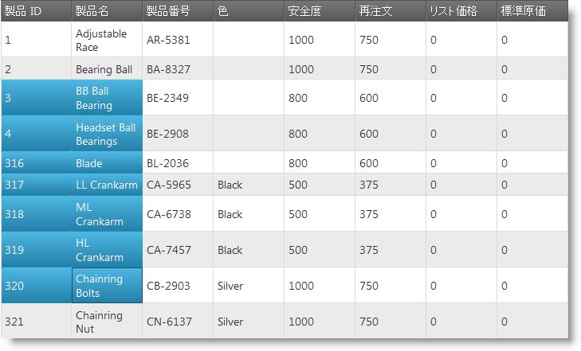
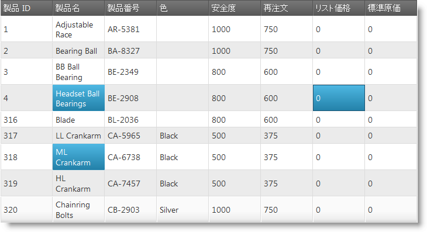

import ApiLink from 'docs-template/components/mdx/ApiLink.astro';

# 選択の概要 (igGrid)

## トピックの概要

### 目的
このトピックでは、`igGrid`™ コントロールの選択機能について説明します。

選択機能によって `igGrid`™ コントロールの行およびセルの選択が可能になります。その機能は Microsoft® Windows Explorer および Microsoft® Excel の選択およびアクティブ化動作を厳密に踏襲したものです。

グリッド選択は、堅牢なクライアント側イベント サポートに付属し、実行時にコントロール動作の管理に必要なツールを提供します。

### このトピックの内容

このトピックは、以下のセクションで構成されます。

-   [**概要**](#overview)
-   [**選択の永続化**](#selection-persistence)
-   [**選択の有効化**](#enabling-selection)
-   [**セル/行の選択/選択解除**](#select-unselect)
    -   [行の選択](#select-row)
    -   [行の選択解除](#unselect-row)
    -   [選択した行の取得](#get-rows)
    -   [セルの選択](#select-cell)
    -   [セルの選択解除](#unselect-cell)
    -   [選択済みセルの取得](#get-cells)
    -   [選択のクリア](#clear-selection)
-   [**選択モード**](#selection-modes)
    -   [単一選択](#single-selection)
    -   [複数選択](#multiple-selection)
    -   [行の選択](#row-selection)
    -   [セル選択](#cell-selection)
-   [**セル イベント**](#selection-events)
-   [**選択プロパティ**](#selection-properties)
-   [**選択 CSS クラス**](#selection-classes)
-	[**キーボード操作**](#keyboard-interaction)
-   [**関連コンテンツ**](#related-content)
    -   [トピック](#topics)
    -   [サンプル](#samples)

 

## <a id="overview"></a> 概要
選択は jQuery UI ウィジェットとして実装され、同様に任意の jQuery UI ウィジェットのライフサイクルに従います。

`igGrid` コントロールの選択機能は、選択とアクティブ化の両方を担当します。グリッドの「アクティブ化」には複数の意味があります。一方、アクティブ化はキーボード ナビゲーションを指します。アクティブ化がオフになると、キーボードのアクティブ化が無効になります。一方、Explorer ナビゲーションのように **CTRL** キーを押したまま、矢印キーを押すと、特定のアクティブ スタイルがセルと行に適用されます。選択スタイルは適用されません。

セルは、より従来の感覚で選択することもできます。セルはマウスまたはキーボードのいずれかで選択できます。マウスでセルを選択する場合、複数の選択が可能になります。たとえば **CTRL** キーを押したままにして、連続していない複数のファイルを選択します。SHIFT キーを押したままにして、連続した複数のファイルを選択します。マウスを使用したその他の選択方法として、次の方法があります。

-   マウスをドラッグし、選択されたファイルを四角で囲んでも、任意の選択ができます。

**図 1: マウスのドラッグ操作により連続選択がある igGrid コントロール**



**図 2: 複数セルの選択が有効になっている igGrid コントロール**




## <a id="selection-persistence"></a> 選択の永続化 

`igGrid` 状態の間に選択の永続化は 14.1 リリースの新機能です。以前のデフォルト動作を置き換えます。

> **注:**
> 選択の永続化はデフォルトで True です。これは重大な変更です。

`igGridSelection` を有効にする場合、<ApiLink type="iggridselection" member="persist" section="options" label="persist" /> モードにあります。つまり、選択した行およびセルは、グリッドの並べ替え、列フィルタリングなどのその他の機能と操作したか、データ バインドした後に選択は残ります。

選択の永続化は `igHierarchicalGrid` にも実装されています。

以下のサンプルは、選択機能の永続化機能を紹介します。

<div class="embed-sample">
   [機能の永続化](&#123;environment:SamplesEmbedUrl&#125;/grid/feature-persistence)
</div>

永続化は、行および列を識別する機能に依存します。

行インデックスは変更可能なため、この機能には使用できません。`igGridSelection` はグリッドのユーザー定義のプライマリ キーを使用するか、レコードのプロパティ値に基づく行の一意識別子を生成します。

この内部の識別子はグリッドの描画時間を少し増加します。また、大きいデータ セットで 2 つのレコードが同じ識別子を生成する小さい可能性があります。

> **注:**
> アプリケーションで選択の永続化が有効の場合、一意のプライマリ キーを提供してください。

ユーザーがグリッドと操作した後に選択をクリアする現在の動作に戻るには、<ApiLink type="iggridselection" member="persist" section="options" label="persist" /> オプションで機能を無効にできます。以下はコード スニペットです。

**JavaScript の場合:**

```js
features: [
  { 
     name: “Selection”, 
     persist: false 
  }
] 
```


## <a id="enabling-selection"></a> 選択の有効化 

選択を開始するには、まず必要な JavaScript および CSS の依存関係を組み込む必要があります。必要な依存関係を組み込む最も簡単な方法は、スクリプトとスタイルを組み合わせて縮小したものを使用することです。

**HTML の場合:**

```html
<link type="text/css" href="infragistics.theme.css" rel="stylesheet" />
<link type="text/css" href="infragistics.css" rel="stylesheet" />
<script type="text/javascript" src="jquery.min.js"></script>
<script type="text/javascript" src="jquery-ui.min.js"></script>
<script type="text/javascript" src="infragistics.core.js"></script>
<script type="text/javascript" src="infragistics.lob.js"></script>
```

選択に最小限必要な Infragistics スクリプトだけを組み込む場合は、次を参照するだけで組み込むことができます。

**HTML の場合:**

```html
<script type="text/javascript" src="infragistics.util.js"></script>
<script type="text/javascript" src="infragistics.util.jquery.js"></script>
<script type="text/javascript" src="infragistics.dataSource.js"></script>
<script type="text/javascript" src="infragistics.ui.shared.js"></script>
<script type="text/javascript" src="infragistics.ui.grid.framework.js"></script>
<script type="text/javascript" src="infragistics.ui.grid.selection.js"></script>
```

必要なスクリプトを組み込んだ後は、`igGrid` の選択機能を有効にするのは Selection という名前のオブジェクトをコントロールの Features 配列に追加するのと同様に簡単です。デフォルトでは、選択モードは Row に設定されており、行の選択が可能になります。また、アクティブ化はデフォルトで有効になっています。

次のコード スニペットは、その機能の有効化を示しています。

**JavaScript の場合:**

```js
$("#grid1").igGrid({
   dataSource: products,
   responseDataKey: 'Records',
   tabIndex: 1,
   features: [{
      name: 'Selection',
      mode: 'row',
      multipleSelection: true,
      activation: true
   }]
});
```

**ASPX の場合:**

```csharp
<%=
   Html.
   Infragistics().
   Grid(Model).
   ID("grid1").
   PrimaryKey("ProductID").
   Features(features => {
      features.
      Selection().
      Mode(SelectionMode.Row).
      MultipleSelection(true).
      Activation(true);
   }).
   Virtualization(false).
   DataSourceUrl(Url.Action("SelectionApiGetData")).
   DataBind().
   Render()%>
```

**Razor の場合:**

```csharp
@{
   Html.
   Infragistics().
   Grid(Model).
   ID("grid1").
   PrimaryKey("ProductID").
   Features(features => {
      features.
      Selection().
      Mode(SelectionMode.Row).
      MultipleSelection(true).
      Activation(true);
   }).
   Virtualization(false).
   DataSourceUrl(Url.Action("SelectionApiGetData")).
   DataBind().
   Render()
}
```

## <a id="select-unselect"></a> セル/行の選択/選択解除 

ユーザーはマウスまたはキーボードを使用してセル/行を選択できます。セル/行をコードで選択するには、`igGrid` コントロールの `igGridSelection` コンポーネントの公開されたプロパティおよびメソッドを使用できます。次の例では、実行可能なアクションの一部を一覧にしています。

### <a id="select-row"></a> 行の選択 

**JavaScript の場合:**

```js
$('#grid1').igGridSelection('selectRow', indexOfRowToSelect);
```

### <a id="unselect-row"></a> 行の選択解除 

**JavaScript の場合:**

```js
$('#grid1').igGridSelection('deselectRow', indexOfRowToDeselect);
```

### <a id="get-rows"></a> 選択した行の取得 

このメソッドのバリエーションは、`element` および `index` など使用可能なプロパティを備えた JSON 配列を返します。

**JavaScript の場合:**

```js
var rows = $('#grid1').igGridSelection('selectedRows');
```

### <a id="select-cell"></a> セルの選択 

**JavaScript の場合:**

```js
$('#grid1').igGridSelection('selectCell', rowIndex, columnIndex);
```

### <a id="unselect-cell"></a> セルの選択解除 

**JavaScript の場合:**

```js
$('#grid1').igGridSelection('deselectCell', rowIndex, columnIndex);
```

### <a id="get-cells"></a> 選択済みセルの取得 
このメソッドのバリエーションは、`element`、`row`、`index`、`rowIndex`、および `columnKey` など使用可能なプロパティを備えた JSON 配列を返します。

**JavaScript の場合:**

```js
var cells = $('#grid1').igGridSelection('selectedCells');
```

### <a id="clear-selection"></a> 選択のクリア 

**JavaScript の場合:**

```js
$('#grid1').igGridSelection('clearSelection');
```


## <a id="selection-modes"></a> 選択モード
 
`igGrid` コントロールの選択機能では、グリッドのセルの単一選択および複数選択が可能です。

### <a id="single-selection"></a> 単一選択 

単一選択を有効にして、セルまたは行をクリックして選択できます。

### <a id="multiple-selection"></a> 複数選択 

複数選択を有効に設定すると、以下を実行できます:

-   単一選択の場合はクリックします。
-   複数の連続選択の場合はクリック アンド ドラッグします。
-   複数の連続選択の場合は Shift キーを押しながらクリックします。
-   複数の不連続選択の場合は Ctrl キーを押しながらクリックします。

### <a id="row-selection"></a> 行の選択 

行選択を有効にするには、モードを「row」に設定するか、それを設定しないまま(行選択はデフォルト動作です) 選択機能を有効にして、グリッドの行を選択します。

行選択を有効にすると、ユーザーはいずれかの行のセルをクリックして、行を選択できます。また、このドキュメントで以前にリストしたセル選択の例に示すように、公開されたメソッドを使用してコードの行を選択することもできます。

### <a id="cell-selection"></a> セル選択 

セル選択を有効にするには、選択動作を初期化する際に選択モードを「cell」に設定する必要があります。

セル選択を有効にした後でセルを選択する方法はいくつかあります。まず、セルをクリックするか、キーボードでセルまでナビゲートすることでセルを選択できます。また、このドキュメントで以前にリストしたセル選択の例に示すように、メソッドを使用してコードの行を選択および選択解除することもできます。


## <a id="selection-events"></a>セル イベント 

`igGrid` コントロールは、選択された機能の中で最も一般的かつ、発生する可能性が高いイベントをサポートします。コントロールの行およびセルの選択変更中および変更済みイベントにバインドできます (前者はキャンセルできます)。アクティブなセルまたはロールの変更が使用でき、あらゆる選択アクションがコードで管理できるようになるとイベントが発生します。

クライアント側イベントには次の 2 種類の方法でバインドできます。

-   アプリケーションの任意の場所からバインドする:

    **JavaScript の場合:**

```js
    $("#grid1").bind("iggridselectionrowselectionchanged", handler);
```

イベントの処理については、このトピックを参照してください:

[&#123;environment:ProductName&#125; でイベントの使用](/using-events-in-igniteui-for-jquery)

-   選択機能を初期化する場合にオプションとしてイベント名を指定してバインドする (最初にイベントをバインドした場合と異なり、イベント名は大文字と小文字を区別しません):

    **JavaScript の場合:**

```js
    {
       name: 'Selection',
       mode: 'cell',
       multipleSelection: true,
       cellSelectionChanging: handler,
       <other Selection options>
    }
```

呼び方があるとすれば、ご使用の「ハンドラー」を次のように定義する必要があります。

**JavaScript の場合:**

```js
function handler(event, args) {

}
```

`args` はオブジェクトです。イベントごとにそれぞれ以下で詳しく説明します。

**グリッド行オブジェクト:**

```js
{
	element:<element of the grid row TR> ,	
	id:<primaryKey value or null if undefined>,	
	index: <index of the grid row TR>
}
```
 

**グリッド セル オブジェクト:**

```js
{
	element: <cell TD>,
	row: <parent of the cell, that is the row TR>,
	rowId: <primaryKey value or null if undefined>,
	index: <col index>,
	rowIndex: <the row index>,
	columnKey: <column key>
}
```

 

選択機能は以下のクライアント側イベントを公開します。


| イベント名 | 引数 (args) パラメーター |
| --- | --- |
| rowSelectionChanging | **row:** 現在選択されているグリッド行。, **selectedRows:** 現在選択されている行の配列。, **selectedFixedRows:** ある場合、固定行の配列, **owner:** 選択ウィジェット オブジェクトへの参照。, **startIndex:** 開始行のインデックス (複数選択) - オプション, **endIndex:** 終了行のインデックス (複数選択) - オプション |
| rowSelectionChanged | `rowSelectionChanging` と同じですが、行「selectedRows」には選択に追加された新しい行が入っています。 **注:** このイベントには `startIndex` プロパティと `endIndex` プロパティはありません。 |
| cellSelectionChanging | **cell:** 現在選択されているセル。, **firstRowIndex:** 選択された最初の行のインデックス。, **lastRowIndex:** 選択された最後の行のインデックス。, **firstColumnIndex:** 選択された最初の列のインデックス。, **lastColumnIndex:** 選択された最後の列のインデックス。, **注:** 最後の 4 つのプロパティは、連続複数選択の場合にのみ使用されます。 **selectedCells:** 現在選択されているセルの配列。, **owner:** 選択ウィジェット オブジェクトへの参照。 |
| cellSelectionChanged | 上記と同じですが、`firstRowIndex`、`lastRowIndex`、`firstColumnIndex`、および `lastColumnIndex` はそれ以上表示されず、同時に `selectedCells` に新しい選択が入っています。 |
| activeCellChanging | **cell:** アクティブになろうとしているセルへの参照。, このイベントはキャンセルできます。 |
| activeCellChanged | **cell:** 新しいアクティブ セルへの参照。 |
| activeRowChanging | **row:** アクティブになろうとしている行への参照。, このイベントはキャンセルできます。 |
| activeRowChanged | **row:** 新しいアクティブ行。 |


> **注:** SHIFT キーを押して連続選択を行うと、バッチ全体に対して 1 回だけイベントが発生します。

## <a id="selection-properties"></a> 選択プロパティ 

次のテーブルには、選択機能でサポートされているプロパティの詳細情報が記載されています。

プロパティ名|タイプおよびデフォルト値|説明
---|---|---
multipleSelection|ブール型 (デフォルト: False)|複数選択を有効または無効にします。
mouseDragSelect|ブール型 (デフォルト: True)|マウスをドラッグして連続選択できます。
mode|文字列 (デフォルト: 「row」)|**row** または **cell** のいずれかになります。
wrapAround|ブール型 (デフォルト: True)|最初または最後の行またはセルになると、反対方向に処理を継続します。
activation|ブール型 (デフォルト: True)|セルおよび行のアクティブ化を有効または無効にします - アクティブ スタイル。
touchDragSelect|ブール型 (デフォルト: True)|連続タッチ イベントで有効/無効を選択します。セルの選択およびタッチパネル対応環境でのみ利用できます。
multipleCellSelectOnClick|ブール型 (デフォルト: False)|true の場合、CTRL を押したままのようにセルを複数選択できます。モードが行に設定されている場合、このオプションは無視されます。このオプションは、タッチパネル環境で断続的に複数の選択をする際に便利です。


## <a id="selection-classes"></a> 選択 CSS クラス 
選択機能の外観をカスタマイズする場合は、次のテーブルを使用できます。

CSS クラス|説明
---|---
ui-iggrid-selectedcell <br />ui-state-active |選択されたすべてのセルに適用されるクラス。
ui-iggrid-selectedrow <br />ui-state-active |選択されたすべての行に適用されるクラス。
ui-iggrid-activecell <br />ui-state-focus |アクティブなすべてのセルに適用されるクラス。
ui-iggrid-activerow <br />ui-state-focus |アクティブなすべての行に適用されるクラス。

## <a id="keyboard-interaction"></a> キーボード操作
特定の行が選択された場合に、以下のキー操作が利用できます。

-	UP: 現在選択されている行の上の行へ選択を移動。最初の行が選択されている場合、選択が最後の行に移動。
-	DOWN: 現在選択されている行の下の行へ選択を移動。最後の行が選択されている場合、最初の行に選択を移動。
-	SPACE/ENTER: アクティブな行を選択/選択解除。

複数選択が有効な場合:

-	SHIFT+UP/DOWN: 押下時に複数行の選択を許可。
-	CTRL+ UP/DOWN: 選択を変更せずにアクティブな行へ移動。アクティブな行を移動してキーボードによる複数行の選択を許可し、SPACE で現在アクティブな行を選択/選択解除。

特定のセルが選択された場合に、以下のキー操作が利用できます。

-	UP: 現在選択されているセルの上のセルへ選択を移動。最初の行のセルが選択されている場合、同じ列の最後のセルへ選択が移動。
-	DOWN: 現在選択されている行の下の行へ選択を移動。最後の行が選択されている場合、最初の行に選択を移動。
-	LEFT: 現在のセルの左へ選択を移動。行の最初のセルが選択されている場合、前の行の最後のセルへ選択を移動。最初の行の最初のセルが選択されている場合、グリッドの最後の行の最後のセルへ選択を移動。
-	RIGHT: 現在のセルの右へ選択を移動。行の最後のセルが選択されている場合、次の行の最初のセルへ選択を移動。最終行の最後のセルが選択されている場合、次の行の最初のセルへ選択を移動。
-	SPACE/ENTER: 現在のセルを選択/選択解除。igHierarchicalGrid では、現在選択されているアクティブなセルが展開/縮小ボタンを含むセルです。行の子グリッドを展開/縮小します。

igHierarchicalGrid の選択では、デフォルトで UP/DOWN/LEFT/RIGHT キーでの子グリッドへの移動を スキップします。(<ApiLink type="iggridselection" member="skipChildren" section="options" label="skipChildren" /> オプションを参照)。

## <a id="related-content"></a> 関連コンテンツ

### <a id="topics"></a> トピック

-   [igGrid の概要](/iggrid-overview)
-   [ページング (igGrid)](/iggrid-paging)
-   [フィルタリング (igGrid)](/iggrid-filtering)
-   [並べ替えの概要 (igGrid)](/iggrid-sorting-overview)

### <a id="samples"></a> サンプル

-   [選択](&#123;environment:SamplesUrl&#125;/grid/selection)

