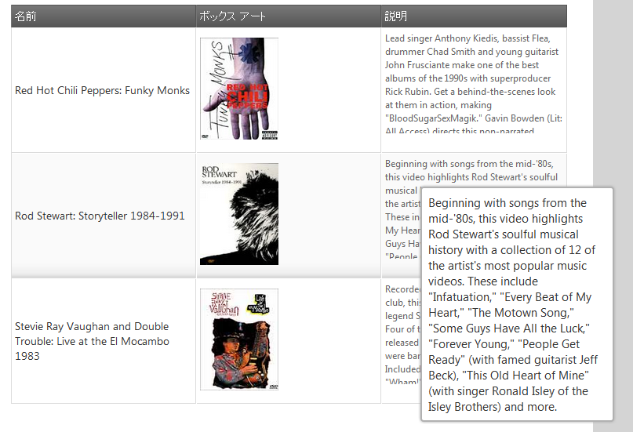

---
title: "ツールチップの有効化 (igGrid)"
slug: iggrid-enabling-tooltips
---

# ツールチップの有効化 (igGrid)

## トピックの概要

### 目的

このトピックでは、jQuery と MVC の両方について、Tooltip ウィジェットを `igGrid`™ へ追加する方法を示しています。これにより、マウスをホバーしたときにグリッド セル上にツールチップを表示させることができます。

### このトピックの内容

このトピックは、以下のセクションで構成されます。

-   [**概要**](#intro)
-   [**プレビュー**](#preview)
-   [**要件**](#requirements)
    -   [一般的な要件](#general-requirements)
    -   [スクリプト要件](#script-requirements)
-   [**jQuery igGrid ツールチップを追加する**](#adding-jquery)
-   [**MVC igGrid ツールチップを追加する**](#adding-mvc)
-   [**関連トピック**](#related-content)

## <a id="intro"></a> 概要 
ツールチップを有効にするには、Tooltip ウィジェットの名前を設定します。`columnSettings` プロパティを使用して、列ごとに個々にツールチップを構成できます。次の例では、画像が含まれている 1 つの列を除きすべての列でツールチップを表示するよう構成されています。第 2 列の個別のツールチップが省略されていた場合、ツールチップは表示されていたでしょう。デフォルトでは、ツールチップは常に表示されているためです。つまり、visibility: "always" です。Visibility プロパティが明示的に設定されていない場合、これは visibility: "always" に相当します。

## <a id="preview"></a> プレビュー

以下は、手順例の最終結果のプレビューです。最終結果は jQuery と MVC で同じです。



## <a id="requirements"></a> 要件

### <a id="general-requirements"></a> 一般的な要件 
-   jQuery の要件
    -   [`igGrid`](/controls/iggrid/overview) がデータ ソースに接続されている HTML 形式の Web ページであること。
-   MVC 固有の要件
    -   [[&#123;environment:ProductNameMVC&#125; Grid](/controls/iggrid/overview) がデータ ソースに接続されている MS Visual Studio® の MVC 4 以後のプロジェクトであること
    -   &#123;environment:ProductNameMVC&#125; dll への参照があること - Infragistics.Web.Mvc.dll

### <a id="script-requirements"></a> スクリプト要件 
&#123;environment:ProductNameMVC&#125; が jQuery ウィジェットをレンダリングするため、&#123;environment:ProductName&#125; と &#123;environment:ProductNameMVC&#125; のサンプルに必要とされるスクリプトは同じです。
グリッドとそのグループ化機能を実行するためには以下のスクリプトが必要とされます。

-   jQuery ライブラリ スクリプト
-   jQuery User Interface (UI) ライブラリ スクリプト
-   IG ライブラリ スクリプト (これはコントロールのコードを難読化したものです)

次のコード サンプルは、HTML ファイルのヘッダー コードに追加されるスクリプトです。

**HTML の場合:**

```html
<script type="text/javascript" src="jquery.min.js"></script>
<script type="text/javascript" src="jquery-ui.min.js"></script>
<script type="text/javascript" src="infragistics.core.js"></script>
<script type="text/javascript" src="infragistics.lob.js"></script>
```

## <a id="adding-jquery"></a> jQuery igGrid ツールチップを追加する 

`$(document).ready()` イベント ハンドラー内でまず `igGrid` を作成し、次にツールチップを構成します。以下のサンプルでは、Movie Name 列と Movie Synopsis 列 (columnKeys Name と Synopsis) のツールチップが有効になっており、Image 列 (columnKey BoxArt) のツールチップは無効になっています。

**JavaScript の場合:**

```js
$("#grid1").igGrid({
    
    features: [
        {
            name: "Tooltips",
            columnSettings: [
                { columnKey: "Name", allowTooltips: true },
                { columnKey: "BoxArt", allowTooltips: false },
                { columnKey: "Synopsis", allowTooltips: true }
            ],
            visibility: "always",
            showDelay: 1000,
            hideDelay: 500
        }
    ]
});
```

結果を確認するには、ブラウザーで HTML ファイルを開きます。上記のプレビューで示すように、ツールチップは第 1 列と第 3 列のセルにマウスをホバーするたびに表示されるはずです。

## <a id="adding-mvc"></a> &#123;environment:ProductNameMVC&#125; igGrid ツールチップを追加する 

igGrid 自体を定義すると同時に、ツールチップ機能とその構成値をすべて定義します。

**C# の場合:**

```csharp
<%= Html.Infragistics().Grid(Model)
.ID("grid1")
.Features(features => {
    features.Tooltips()
    .Visibility(TooltipsVisibility.Always)
    .ColumnSettings(settings =>
    {
        settings.ColumnSetting().ColumnKey("Name").AllowTooltips(true);
        settings.ColumnSetting().ColumnKey("BoxArt").AllowTooltips(false);
        settings.ColumnSetting().ColumnKey("Synopsis").AllowTooltips(true);
     })
    .ShowDelay(100);
})
.DataBind()
.Render()%>
```

結果を検証するために、アプリケーションを実行します。上記のプレビューで示すように、ツールチップは第 1 列と第 3 列のセルにマウスをホバーするたびに表示されるはずです。

## <a id="related-content"></a> 関連トピック 

以下は、その他の役立つトピックです。

- [igGrid の概要](/controls/iggrid/overview)

- [igGrid ツールチップの概要](/controls/iggrid/features/tooltips/tooltips-overview)

- [igGrid の既知の問題](/controls/iggrid/known-issues)

 

 


