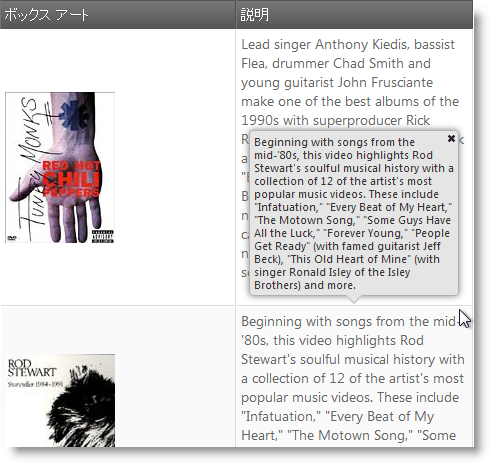

---
title: "グリッド ツールチップのスタイル設定 (igGrid)"
slug: iggrid-popover-style-for-tooltips
---

# グリッド ツールチップのスタイル設定 (igGrid)

## トピックの概要

### 目的

このトピックでは、ツールチップ ポップオーバー スタイルを構成する方法を示します。

### 前提条件

以下の表は、このトピックを理解するための前提条件として必要なトピックを示しています。

- [&#123;environment:ProductName&#125; コントロールのタッチ サポート](/general-and-getting-started/touch-support-for-igniteui-for-jquery-controls): このトピックは、タッチ対話をサポートするために行われた jQuery コントロールの更新を紹介します。

- [igGrid™ ツールチップの概要](/controls/iggrid/features/tooltips/tooltips-overview): このトピックは、`igGrid` ツールチップを有効にして使用する方法を示します。

### このトピックの内容

このトピックは、以下のセクションで構成されます。

-   [**igGrid ツールチップ ポップオーバー スタイル**](#summary)
-   [**ポップオーバー スタイルを設定**](#popover)
-   -   [概要](#popover-overview)
    -   [プロパティ設定](#popover-property)
    -   [例](#popover-example)
-   [**Style プロパティ**](#style)
-   [**関連コンテンツ**](#related-content)
    -   [トピック](#topics)

##  igGrid ツールチップ ポップオーバー スタイル

以下の表は、 `igGrid` ツールチップ スタイル プロパティの構成可能な項目を示しています。詳細は、概要表の後に記載されています。

構成可能な要素|詳細|プロパティ
---|---|---
タッチ デバイス用ツールチップ スタイルを構成|`igGrid` ツールチップをポップオーバーとして表示し、タッチ デバイスをサポートするよう構成します。|[style](&#123;environment:jQueryApiUrl&#125;/ui.iggridtooltips#options:style)

##  ポップオーバー スタイルを設定

###  概要

セル上をホバーすると通常のツールチップが表示され、カーソルの右下の角に現れます。しかし、タッチ プラットフォームには、ホバー状態がありません。さらに、ツールチップの一部はユーザーの指で隠れ、別のツールチップを表示する以外非表示にする方法がありません。したがって、タッチ環境では、ポップオーバーという、より自然なツールチップ状態が追加されました。ポップオーバー スタイルをアクティブにすると、クリックまたはタップしたとき現れ、セルの上に表示され、タッチに特化されたレイアウトになります。上に充分な空間がない場合、ポップオーバーは別の位置 (下、左、右の順) に表示されます。タッチしたセルの回りに空間がない場合、ポップオーバーは画面のサイズを超えます。ポップオーバー自体にユーザーがそれを非表示にできるに閉じるボタンがあります。「toolip」スタイルはプレーン テキストとして描画され、「popover」コンテンツは HTML として描画されます。最後に、タップしてホールドしてポップオーバー内のテキストを選択できます。

###  プロパティ設定

以下の表は、ポップオーバーを有効にするために設定する必要があるプロパティを示します。

目的:|使用するプロパティ:|設定の選択肢:
---|---|---
クリック／タップでポップオーバー ツールチップを表示|[style](&#123;environment:jQueryApiUrl&#125;/ui.iggridtooltips#options:style)|popover

###  例

以下のスクリーンショットは、以下の設定の結果として `igGrid` ツールチップがどのように見えるかを示しています。

プロパティ|値
---|---
[name](&#123;environment:jQueryApiUrl&#125;/ui.iggridtooltips#options:name)|`Tooltips`
[style](&#123;environment:jQueryApiUrl&#125;/ui.iggridtooltips#options:style)|`popover`
[visibility](&#123;environment:jQueryApiUrl&#125;/ui.iggridtooltips#options:visibility)|`always`

> **注:** 以下の表は、[style](&#123;environment:jQueryApiUrl&#125;/ui.iggridtooltips#options:style) を popover に設定すると無視されるツールチップ プロパティを示します。理由は、これらがデスクトップ固有でタッチ ブラウザでは機能しないためです。

プロパティ|popover スタイルが有効なときの状態
---|---
[hideDelay](&#123;environment:jQueryApiUrl&#125;/ui.iggridtooltips#options:hideDelay)|無視
[showDelay](&#123;environment:jQueryApiUrl&#125;/ui.iggridtooltips#options:showDelay)|無視
[cursorLeftOffset](&#123;environment:jQueryApiUrl&#125;/ui.iggridtooltips#options:cursorLeftOffset)|無視
[cursorTopOffset](&#123;environment:jQueryApiUrl&#125;/ui.iggridtooltips#options:cursorTopOffset)|無視

##  Style プロパティ

下の表は、ツールチップ機能のスタイル プロパティについて説明し、デフォルト値および推奨値を示しています。

| プロパティ | タイプ | 説明 | デフォルト値 |
| --- | --- | --- | --- |
| [style](environment:jQueryApiUrl/ui.iggridtooltips#options:style) | string | このプロパティでは、`igGrid` ツールチップ機能の外観と動作を変更できます。, 推奨値:, `popover` | tooltip |

##  関連コンテンツ

###  トピック

このトピックの追加情報については、以下のトピックも合わせてご参照ください。

- [igGrid ツールチップの概要](/controls/iggrid/features/tooltips/tooltips-overview): `igGrid` ツールチップのプロパティと動作を示すトピック。

- [&#123;environment:ProductName&#125; コントロールのタッチ サポート](/general-and-getting-started/touch-support-for-igniteui-for-jquery-controls): このトピックは、タッチ対話をサポートするために行われた jQuery コントロールの更新を紹介します。

 

 

