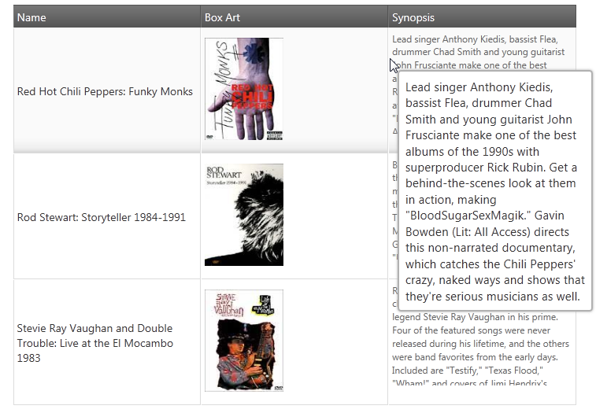

# ツールチップの概要 (igGrid)

import ApiLink from 'docs-template/components/mdx/ApiLink.astro';

# ツールチップの概要 (igGrid)

## トピックの概要

### 目的
このトピックは、`igGrid`™ のツールチップ ウィジェットとその主な機能を紹介します。

### このトピックの内容
このトピックは、以下のセクションで構成されます。

- [概要](#introduction)
- [主要機能](#features)
- [関連トピック](#topics)

##  概要 

`igGrid` では、ツールチップの主な目的はセル全体の内容を表示し、ツールチップ コンテナー内のテキストをユーザーが選択してコピーできるようにすることです (グリッド セルに記入するにはテキストが長すぎる場合などに便利です。下の画像を参照してください)。マウス ポインターを `igGrid` セルの上に置くと、ツールチップが表示されます。

`igGrid` のツールチップ機能はツールチップ ウィジェットにより提供されます。機能については、以下の[主要機能](#features)セクションに示します。

##  主要機能 

以下の表では、ツールチップ ウィジェットの主要機能とそれらを管理するプロパティの概要を説明します。

| 機能 | 説明 | jQuery プロパティ | MVC プロパティ |
| --- | --- | --- | --- |
| 可視性管理 | ツールチップ ウィジェットの動作モード (ツールチップの表示/非表示など) | <ApiLink type="iggridtooltips" member="visibility" section="options" label="visibility" />, <ApiLink type="iggridtooltips" member="style" section="options" label="style" /> | [Visibility](Infragistics.Web.Mvc~Infragistics.Web.Mvc.GridTooltips~Visibility.html), [Style](Infragistics.Web.Mvc~Infragistics.Web.Mvc.GridTooltips~Style.html) |
| 構成可能な列 | 列ごとにツールチップの表示状態を構成できます (列のセルにツールチップを表示させるかどうかなど)。 | <ApiLink type="iggridtooltips" member="columnSettings" section="options" label="columnSettings" /> | [ColumnSettings](Infragistics.Web.Mvc~Infragistics.Web.Mvc.GridTooltips~ColumnSettings.html) |
| アニメーションのタイミング管理 | 構成可能なツールチップの表示時間と遅延時間 (ミリ秒) とツールチップを表示/非表示するアニメーションの継続時間 | <ApiLink type="iggridtooltips" member="showDelay" section="options" label="showDelay" />, <ApiLink type="iggridtooltips" member="hideDelay" section="options" label="hideDelay" />, <ApiLink type="iggridtooltips" member="fadeTimespan" section="options" label="fadeTimespan" /> | [ShowDelay](Infragistics.Web.Mvc~Infragistics.Web.Mvc.GridTooltips~ShowDelay.html), [HideDelay](Infragistics.Web.Mvc~Infragistics.Web.Mvc.GridTooltips~HideDelay.html), [FadeTimespan](Infragistics.Web.Mvc~Infragistics.Web.Mvc.GridTooltips~FadeTimespan.html) |
| 位置のカスタマイズ | マウス ポインターからのオフセットとして指定される構成可能なツールチップの表示位置 | <ApiLink type="iggridtooltips" member="cursorLeftOffset" section="options" label="cursorLeftOffset" />, <ApiLink type="iggridtooltips" member="cursorTopOffset" section="options" label="cursorTopOffset" /> | [CursorLeftOffset](Infragistics.Web.Mvc~Infragistics.Web.Mvc.GridTooltips~CursorLeftOffset.html), [CursorTopOffset](Infragistics.Web.Mvc~Infragistics.Web.Mvc.GridTooltips~CursorTopOffset.html) |
| クライアント イベント | ツールチップ ウィジェットのライフサイクル中に処理できる特殊なイベント ツールチップの各状態のイベントがあります。, showing, shown, hiding, hidden | <ApiLink type="iggridtooltips" member="tooltipShowing" section="events" label="tooltipShowing" />, <ApiLink type="iggridtooltips" member="tooltipShown" section="events" label="tooltipShown" />, <ApiLink type="iggridtooltips" member="tooltipHiding" section="events" label="tooltipHiding" />, <ApiLink type="iggridtooltips" member="tooltipHidden" section="events" label="tooltipHidden" /> |  |
| 外観 | ツールチップのスタイルや位置を設定します。「tooltip」と「popover」の 2 つのモードがあります。, 「tooltip」スタイルでは、マウス カーソルに応じてツールチップの位置を決めます (ツールチップがマウス カーソルの隣に表示されます)。ツールチップの内容はプレーンテキストとして表示されます。, 「popover」スタイルは、igPopover コントロールのインスタンスを初期化します。矢印で示すターゲット TD 要素に応じてツールチップの位置を決めます。ツールチップの内容は HTML として表示されます。, jQuery UI CSS Framework クラスを変更するすると、外観をカスタマイズできます。 | <ApiLink type="iggridtooltips" member="style" section="options" label="style" /> | [Style](Infragistics.Web.Mvc~Infragistics.Web.Mvc.GridTooltips~Style.html) |

ツールチップ ウィジェットのプロパティの説明は、<ApiLink type="iggridtooltips" label="jQuery" /> および [MVC](Infragistics.Web.Mvc~Infragistics.Web.Mvc.GridTooltips_members.html) API ドキュメントを参照してください。

##  関連トピック 

以下は、その他の役立つトピックです。

- [igGrid ツールチップの有効化](/iggrid-enabling-tooltips)

- [igGrid ツールチップの使用](/iggrid-using-tooltips)

- [igGrid の既知の問題および重大な変更](/iggrid-known-issues)

 

 

