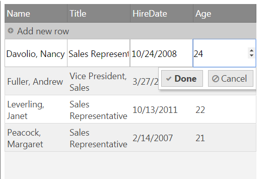

import ApiLink from 'docs-template/components/mdx/ApiLink.astro';

# カスタム エディター プロバイダーの実装

## トピックの概要

### 目的
このトピックは、igEditorProvider クラスを拡張するカスタム エディター プロバイダーを実装プロセスについて説明します。
ビジュアライゼーションに使用するエディター タイプやエディターの検証ロジックをカスタマイズしたエディター プロバイダーを実装することにより、編集エクスペリエンスを完全にカスタマイズできます。


### このトピックの内容
このトピックは、以下のセクションで構成されます。

-   [**概要**](#overview)
-   [**ビルトイン エディター タイプ**](#editors)
- 	[**カスタム エディター プロバイダーの実装**](#customProviders)
	- [**HTML 5 number INPUT をエディター プロバイダーへラップする方法の例**](#example)
- 	[**関連トピック**](#topics)
- 	[**関連サンプル**](#samples)

## <a id="overview"></a>概要

編集モード エディターで行またはセルが編集されているときのアップロード機能これらのエディターは、更新機能で共通の編集コミュニケーション インターフェイスを提供するエディター プロバイダー抽象化によって実装されています。

更新機能は、エンドユーザーに高度なエクスペリエンスを提供する [&#123;environment:ProductName&#125; エディター](igEditors-LandingPage.html) をラップするエディター プロバイダーのセットとともに提供されます。

## <a id="editors"></a> ビルトイン エディター タイプ

エディター プロバーダーのタイプは、テキスト、数値、火付/時間、日付の選択、タイムピッカー、マスク エディター、ブール値、パーセンテージ、通貨、コンボ、評価が含まれます。

> **注**: すべてのエディター プロバイダーは infragistics.ui.grid.shared.js ファイルで定義されます。

すべてのタイプが以下の共通クラス "$.ig.EditorProvider" または "$.ig.EditorProviderBase" ($.ig.EditorProvider クラスから順番に継承) の 1 つから継承されます。
 EditorProvider クラスは、このクラスから継承する新しい Classes を作成する extend メソッド基本クラス実装から継承します。
2 つの主要クラスのプロパティ:

**JavaScript の場合**
```
$.ig.EditorProvider = $.ig.EditorProvider || Class.extend({
		createEditor: function (callbacks, key, editorOptions, tabIndex, format, element) { ... },
		keyDown: function (evt, ui) { ... }, 
		attachErrorEvents: function (errorShowing, errorShown, errorHidden) { ... }, 
		getEditor: function () { ... }, 
		refreshValue: function () { ... },
		getValue: function () { ... },
		setValue: function (val) { ... }, 
		setFocus: function (toggle)  { ... }, 
		setSize: function (width, height) { ... }, 
		removeFromParent: function () { ... }, 
		destroy: function () { ... },
		validator: function () { ... }, 
		validate: function () { ... }, 
		requestValidate: function (evt) { ... },
		isValid: function () { ... }
		});
		
$.ig.EditorProviderBase = $.ig.EditorProviderBase || $.ig.EditorProvider.extend({		
		createEditor: function (callbacks, key, editorOptions, tabIndex, format, element) { ... },
		destroy: function () { ... },
		isValid: function () { ... },
		refreshValue: function () { ... },
		removeFromParent: function () { ... }, 
		setFocus: function (toggle)  { ... }, 
		setSize: function (width, height) { ... },
		textChanged: function(evt, ui) { ... },
		validator: function () { ... }
	});
```

基本クラスの 1 つから特定の各エディター タイプを継承し、新しい特定のメソッドを追加、または既存のメソッドを上書きします。
以下は、すべてのエディター タイプ、クラス、継承元です。

エディター タイプ|クラス名|派生元:
------------|------------|--------------
テキスト エディター プロバイダー|$.ig.EditorProviderText |$.ig.EditorProviderBase
数値エディター プロバイダー|$.ig.EditorProviderNumeric |$.ig.EditorProviderBase
通貨エディター プロバイダー|$.ig.EditorProviderCurrency |$.ig.EditorProviderBase
パーセント エディター プロバイダー|$.ig.EditorProviderPercent |$.ig.EditorProviderBase
マスク エディター プロバイダー|$.ig.EditorProviderMask |$.ig.EditorProviderBase
日付エディター プロバイダー|$.ig.EditorProviderDate |$.ig.EditorProviderBase
日付ピッカー エディター プロバイダー|$.ig.EditorProviderDatePicker |$.ig.EditorProviderBase
タイムピッカー エディター プロバイダー|$.ig.EditorProviderTimePicker |$.ig.EditorProviderBase
ブール値エディター プロバイダー|$.ig.EditorProviderBoolean |$.ig.EditorProviderBase
コンボ エディター プロバイダー|$.ig.EditorProviderCombo |$.ig.EditorProvider
レーティング エディター プロバイダー|$.ig.EditorProviderRating |$.ig.EditorProvider

> **注**: $.ig.EditorProviderBase クラスが追加メソッドを定義することに注意してください。これは主にテキストを表示するエディターに当てはまります。レーティング エディター プロバイダーなどには当てはまりません。
	そのためテキストを表示しないエディターは $.ig.EditorProvider クラスを継承する必要があります。

## <a id="customProviders"></a> カスタム エディター プロバイダーの実装


カスタム エディター プロバイダー インスタンスは、$.ig.EditorProvider/$.ig.EditorProviderBase を拡張、または以下のパブリック メソッドを定義する必要があります。

**JavaScript の場合**

```
createEditor: function (callbacks, key, editorOptions, tabIndex, format, element) {
	//Used to initialize the editor
	
	//Arguments:
	//callbacks - list of callback methods - keyDown and textChanged
	//key - the key of the column to which this editor belongs
	//editorOptions - the editorOptions defined in the Updating feature's columnSettings for this column
	//tabIndex - the tabIndex of the editor
	//format - the format applied to the column
	//element - the editor's main DOM element. When creating a custom editor a new DOM element should be assigned to this argument and the element should be returned as the result of the method.
},
attachErrorEvents: function (errorShowing, errorShown, errorHidden) {
	//used to attach igvalidator error events
},
getEditor: function () {
	//gets editor instance
},
refreshValue: function () {
	//refreshes value - used in cases like MaskEditors where the value needs to be proccessed before being applied.
},
getValue: function () {
	//gets value from editor. Updating uses this method to pass the current editor value as the new value for the cell when you exit edit mode for the cell.
},
setValue: function (val) {
	//sets value to the editor. Updating uses this method to set the current cell value from the cell to the editor when you enter edit mode for a cell.
},
setSize: function (width, height) {
	//sets current size(width and height) for the editor
},
setFocus: function () {
	//sets focus to the editor
},
removeFromParent: function () {
	//used to detach the editor from the current parent cell element. 
},
destroy: function () {
	//destroys the editor.
	//If there are any additional DOM elements or event handles associated with the editor they should also be removed.
},
validator: function () {
	//If a validator (igValitor) should be used to validate the editor value, this method should return it. Otherwise return null.
},
validate: function (noLabel) {
	//Triggered when validation is required. Should return the result from isValid method for the validator (if there is a validator), otherwise return true.
},
isValid: function () 
	//returns if the validation is successful or not. If value is valid it should return true, otherwise it should return false.
},
keyDown: function(evt) {
	//keydown handler is required for every editor
	//Should notify Updating that a key has been pressed, so that DOM elements (like the Done/Cancel buttons) can be updated accordingly.
}
```
既存の igEditorProvider または igEditorProviderBase を拡張する場合、以下のメソッドをプロトタイプ オブジェクトでカスタムエディタープロバイダーの同じ名前でメソッドを指定し、オーバーライドする必要があります。 

```
createEditor: function (callbacks, key, editorOptions, tabIndex, format, element) {},
getValue: function () {},
setValue: function (val) {},
keyDown: function(evt) {},
destroy: function() {}
```
    
createEditor メソッドは、新しい DOM 要素を作成し、特定の列でエディターとして使用される要素として割り当てます。 
getValue および setValue メソッドは、値をセルから取得してエディターに適用 (またはエディターから取得してセルに適用) する方法を指定します。
keyDown は、変更が適用されていることを更新機能に通知するために使用されます。更新機能の UI (完了/キャンセル ボタン) の状態を更新できます。
関連コールバックは、更新機能に変更を通知するために呼び出されます。

```
keyDown: function(evt) {
	var ui = {};
	ui.owner = this.editor.element;
	ui.owner.element = this.editor.element;
	this.callbacks.keyDown(evt, ui, this.columnKey);
	//if value is valid trigger textChanged
	this.callbacks.textChanged(evt, ui, this.columnKey);
}
```


### <a id="example"></a> HTML 5 number INPUT をエディター プロバイダーへラップする方法の例

この手順では、シンプルな HTML 5 number INPUT をエディター プロバイダーへラップする方法を示します。

1.  特定の列に対するigGrid 更新の列設定で、igGrid のインスタンスの作成とカスタム エディターの定義

	**JavaScript の場合**

```
	var northwindEmployees = [
        { "ID": 1, "Name": "Davolio, Nancy", "Title": "Sales Representative", "HireDate": "\/Date(1224795600000)\/", "Country": "USA", "Age": 22 },
        { "ID": 2, "Name": "Fuller, Andrew", "Title": "Vice President, Sales", "HireDate": "\/Date(1269640800000)\/", "Country": "USA", "Age": 22},
        { "ID": 3, "Name": "Leverling, Janet", "Title": "Sales Representative", "HireDate": "\/Date(1318453200000)\/", "Country": "USA", "Age": 22 },
        { "ID": 4, "Name": "Peacock, Margaret", "Title": "Sales Representative", "HireDate": "\/Date(1171404000000)\/", "Country": "USA", "Age": 21 }
    ]
	$("#grid1").igGrid({
    dataSource: northwindEmployees,
    primaryKey: "ID",
    width: "500px",
    height: "600px",
    autoCommit: true,
    autoGenerateColumns: false,
    columns: [
        { headerText: "Employee ID", key: "ID", dataType: "number", hidden: true },
        { headerText: "Name", key: "Name", dataType: "string" },
        { headerText: "Title", key: "Title", dataType: "string" },                   
        { headerText: "HireDate", key: "HireDate", dataType: "date" },
		{ headerText: "Age", key: "Age", dataType: "number" }
    ],
    features: [
        {
            name: "Updating",
            enableAddRow: true,
            enableDeleteRow: false,
            editMode: "row",
            columnSettings: [
                {
                    columnKey: "Age",
                    editorProvider: new $.ig.EditorProviderInput()
                }												
            ]
        }
    ]
    
```

2. デフォルトの EditorProvider を拡張したカスタム エディター プロバイダーの作成、およびデフォルトメソッドを上書きします。

	**JavaScript の場合**
```
    $.ig.EditorProviderInput = $.ig.EditorProviderInput || $.ig.EditorProvider.extend({
		createEditor: function (callbacks, key, editorOptions, tabIndex, format, element) {
			element = element || $('<input/>');
			element.attr("type", "number");
			  
			// call parent createEditor
			this._super(callbacks, key, editorOptions, tabIndex, format, element);
			
			element.on("keydown", $.proxy(this.keyDown, this));
	 
			this.editor = {};
			this.editor.element = element;
			return element;
		},
		keyDown: function(evt) {
			var ui = {};
			ui.owner = this.editor.element;
			ui.owner.element = this.editor.element;
			this.callbacks.keyDown(evt, ui, this.columnKey);
			
			//// enable "Done" button only for numeric character
			if ((evt.keyCode >= 48 && evt.keyCode <= 57) || (evt.keyCode >= 96 && evt.keyCode <= 105)) {
				this.callbacks.textChanged(evt, ui, this.columnKey);
			}
		},			
		setSize: function (width, height) {
			this.editor.element.css({
			width: width - 2,
			height: height - 2,
			borderWidth: "1px"
		});
		},
		attachErrorEvents: function (errorShowing, errorShown, errorHidden) { },
		getValue: function () {
			return this.editor.element.val();
		},
		setValue: function (val) {
			this.editor.element.val(val);
		},
		destroy: function () {
			this.editor.remove();
		}
    });
```

3. 結果の検証

	
	
	表示エディターは、値をセルから (またはセルに) 取得または設定する HTML 5 number INPUT です。
	
## <a id="topics"></a> 関連トピック 
以下は、その他の役立つトピックです。

- 	[更新の概要 (igGrid)](/iggrid-updating)
- 	[igEditors](igEditors-LandingPage.html)
-   <ApiLink type="igGridUpdating" label="igGridUpdating API マニュアル" />
 
## <a id="samples"></a> 関連サンプル 

-	[基本編集](&#123;environment:NewSamplesUrl&#125;/grid/basic-editing)
-	[編集 - カスタム エディター プロバイダー](&#123;environment:NewSamplesUrl&#125;/grid/editing-custom-editor-provider)
