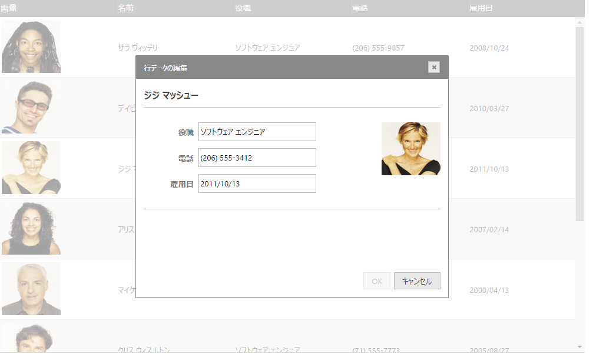

---
title: "行編集ダイアログの構成 (igGrid)"
slug: iggrid-updating-dialog-configuring
---

# 行編集ダイアログの構成 (igGrid)

## トピックの概要

### 目的

このトピックでは、行編集ダイアログと組み合わせた `igGrid`™ コントロールの更新機能の使用方法を説明します。
editorsTemplate は、グリッド`の列コレクションの各列で実行され、dialogTemplate は編集中のレコードのために描画されます。


### 前提条件

以下の表は、このトピックを理解するための前提条件として必要なトピックと記事の一覧です。

- [igGrid の概要](/controls/iggrid/overview): `igGrid` は、表形式データの表示および操作に使用される jQuery ベースのクライアント側グリッドです。そのライフサイクル全体はクライアント側に存在し、サーバー側の技術からは独立しています。

- [更新の概要 (igGrid)](/controls/iggrid/features/updating/updating): このトピックでは、`igGrid`™ コントロールの更新機能の使用方法を説明します。

- [igTemplating](../../../../../06_Infragistics-Templating-Engine/01_igTemplating Overview.mdx): このトピックでは、Infragistics® テンプレート化エンジンの使用方法について説明します。


### このトピックの内容

このトピックは、以下のセクションで構成されます。

- [**概要**](#introduction)
- [**JavaScript での行編集ダイアログの構成**](#javascript)
	- [概要](#js-overview)
	- [手順](#js-steps)
- [**ASP.NET MVC での行編集ダイアログの構成**](#mvc)
	- [要件](#mvc-requirements)
	- [概要](#mvc-overview)
	- [手順](#mvc-steps)
- [**関連コンテンツ**](#related-content)


## <a id="introduction"></a> 概要

行編集ダイアログを使用すると、インライン編集の場合とは異なり、ポップアップ ダイアログ内でレコードを編集できるようになります。

この機能は `igGridUpdating` ウィジェットの一部として実装されます。`editMode` オプションに「dialog」という新しい値が追加されています。この値を指定すると、行編集ダイアログが有効になります。新しいダイアログは異なるテンプレートを使用し、複雑なカスタム編集ダイアログの構築を可能にします。




行テンプレートは、新たに追加された `rowEditDialogOptions` オプションのさまざまなプロパティを設定するして定義します。これらのオプションを以下の表に示します。

オプション|説明
---|---
animationDuration|開く操作と閉じる操作のためにアニメーション時間を指定します。
dialogTemplate|編集中のレコードに対し描画されるテンプレートを指定します。
dialogTemplateSelector|編集中のレコードに対し描画されるテンプレートにセレクター指定します。
editorsTemplate|グリッドの列コレクションの各列 (showReadonlyEditors が false の場合は読み書きの列のみ) に実行するテンプレートを指定します。エディターとして使用する要素に 「data-editor-for-$&#123;key&#125;」を追加します。値をレンダリングするために、$&#123;key&#125; テンプレート タグを選択したテンプレート エンジンの構文で置き換える必要があります。列のエディターがダイアログ マークアップで指定されている場合、テンプレートは描画されるデータから除外されます。「data-render-tmpl」属性を持つ要素がダイアログのテンプレートに含まれない場合、このプロパティは無視されます。editorsTemplate と editorsTemplateSelector の両方が設定されている場合は、editorsTemplateSelector が使用されます。
editorsTemplateSelector|グリッドの列コレクションの各列で実行されるテンプレートに、セレクターを指定します。エディターとして使用される要素に 「data-editor-for-$&#123;key&#125;」を追加します。値をレンダリングするために、$&#123;key&#125; テンプレートのタグを、選択したテンプレート エンジンで置き換える必要があります。列のエディターがダイアログ マークアップで指定されている場合、テンプレートが描画されるデータから除外されます。「data-render-tmpl」属性を持つ要素がダイアログ マークアップに含まれていない場合、このプロパティは無視されます。editorsTemplate と editorsTemplateSelector の両方が設定されている場合は、editorsTemplateSelector が使用されます。
namesColumnWidth|デフォルトの列編集ダイアログで、列名を含む列の幅を制御します。
showEditorsForHiddenColumns|エディターが非表示列に描画する必要がある場合に制御します。
width|デフォルトの列編集ダイアログの幅を制御します。
height|デフォルトの列編集ダイアログの高さを制御します。
showDoneCancelButtons|ダイアログの [完了] ボタンと [キャンセル] ボタンの表示を制御します。無効なエンドユーザーが編集を停止する場合は、[ENTER] キーと [ESC] キーのみが使用できます。
captionLabel|ダイアログのキャプションを指定します。設定されていない場合、$.ig.GridUpdating.locale.rowEditDialogCaptionLabel が使用されます。


## <a id="javascript"></a> JavaScript での行編集ダイアログの構成
ここでは、`igGrid` で行編集ダイアログを構成する手順を示します。

### <a id="js-overview"></a> 概要

以下はプロセスの概要です。

1.  [必要な JavaScript および CSS ファイルの参照](#js-reference-resources)
2.  [サンプル データの定義](#js-define-data)
3.  [行編集ダイアログ行テンプレート用のテンプレート要素の定義](#js-define-template)
4.  [HTML プレースホルダーの定義](#js-define-html)
5.  [igGrid インスタンスの作成](#js-instantiate-grid)
6.  [rowEditDialogBeforeOpen クライアント側イベントの処理](#js-handle-event)

### <a id="js-steps"></a> 手順

以下の手順では、`igGrid` で行編集ダイアログを構成する方法を示します。

1. 必要な JavaScript および CSS ファイルを参照します。 <a id="js-reference-resources"></a>

	次のコード スニペットでは、`igGrid` の更新機能を参照するために Infragistics Loader が使用されています。
	
	**HTML の場合:**
	
```html
	<script src="jquery.min.js" type="text/javascript"></script>
	<script src="jquery-ui.min.js" type="text/javascript"></script> 
	<script src="infragistics.loader.js"></script>
	<script type="text/javascript">
	    $.ig.loader({
	        scriptPath: "http://localhost/ig_ui/js/",
	        cssPath: "http://localhost/ig_ui/css/",
	        resources: "igGrid.Selection,igGrid.Updating"
	    });
	</script>
```

2. バインドするデータを定義します。 <a id="js-define-data"></a>	

	次のコードは、オブジェクトの JavaScript 配列を定義します。
	
	このデータが `igGrid` のデータ ソースとして使用されます。
	
	**JavaScript の場合:**
	
```js
	var namedData = new Array();
	namedData[0] = { "ProductID": 1, "UnitsInStock": 100, "ProductDescription": "Laptop", "UnitPrice": "$1000", "DateCol": "24/7/2012" };
	namedData[1] = { "ProductID": 2, "UnitsInStock": 15, "ProductDescription": "Hamburger" };
	namedData[2] = { "ProductID": 3, "UnitsInStock": 4.356, "ProductDescription": "Beer", "UnitPrice": "$1000" };
	namedData[3] = { "ProductID": 4, "UnitsInStock": null, "ProductDescription": null, "UnitPrice": null };
	namedData[4] = { "ProductID": 5, "UnitsInStock": "65", "ProductDescription": "trainers", "UnitPrice": "$1000", "DateCol": "24/6/2012" };
```

3. 行編集ダイアログ テンプレート用のテンプレート要素を定義します。 <a id="js-define-template"></a>

	次のコードでは、行編集ダイアログ用の行テンプレートとして使用するテンプレート要素が定義されています。カスタムの書式設定やスタイルは、このテンプレート要素を使用して指定できます。
	
	**HTML の場合:**
	
```html
	<script id="dialogTemplate" type="text/html">
	<div style="float: left;">
			<table style="width: 100%;">
				<colgroup>
					<col style="width: 30%;" />
					<col style="width: 70%;" />
				</colgroup>
				<tbody data-render-tmpl="true">
				</tbody>
			</table>
		</div>
	<script>
	<script id="editorsTemplate" type="text/html">
        <tr>
           <td style="text-align:right;color:#777;"><strong${headerText}</strong></td>
            <td><input data-editor-for-${key}="true" /></td>
</tr>
    </script>
```

4. HTML プレースホルダーを定義します。 <a id="js-define-html"></a>

	**HTML の場合:**
	
```html
	<table id="grid1"></table>
```

5. `igGrid` をインスタンス化します。 <a id="js-instantiate-grid"></a>
	
	次のコードは更新機能を有効にします。`editMode` は 「dialog」に設定されています。
	
	行編集ダイアログのコンテナーは、`containment` プロパティで owner に設定されています。したがって、行編集ダイアログはグリッド領域内でのみドラッグ可能です。
	
	列設定値が定義され、ProductID 列が `ReadOnly` になるように設定されています。`showReadonlyEditors` オプションは *false* になっているため、無効な列 (この場合、ProductID 列) がダイアログ ウィンドウにエディターとして表示されることはありません。
	
	`dialogTemplateSelector` プロパティは、手順 3 で定義したテンプレートの ID を参照しています。
	
	**JavaScript の場合:**
	
```js
	$.ig.loader(function () {
	$("#grid1").igGrid({
	    height: "300px",
	    width: "600px",
	    columns: [
	            { headerText: "Product ID", key: "ProductID", width: "100px", dataType: "number" },
	            { headerText: "Units In Stock", key: "UnitsInStock", width: "100px", dataType: "number", format: 'double' },
	            { headerText: "Product Description", key: "ProductDescription", width: "150px", dataType: "string" },
	            { headerText: "Date Column", key: "DateCol", width: "100px", dataType: "date" },
	            { headerText: "Unit Price", key: "UnitPrice", width: "100px", dataType: "integer" }
	            ],
	    autoGenerateColumns: false,
	    dataSource: namedData,
	    primaryKey: "ProductID",
	    features: [
	      {
	            name: "Selection",
	            mode: "row",
	            multipleSelection: true
	      },
	      {
	            name: 'Updating',
	            startEditTriggers: 'enter dblclick',
	            editMode: 'dialog',
				rowEditDialogOptions:{
					dialogTemplateSelector: "#dialogTemplate",
					editorsTemplateSelector: "#editorsTemplate",
	               	containment: "owner",
	            	showReadonlyEditors: false,

				}
	            
	      }]
	});
```

6. `rowEditDialogBeforeOpen` クライアント側イベントを処理します。 <a id="js-handle-event"></a>

	次のコードは `rowEditDialogBeforeOpen` クライアント側イベントを処理します。このコードは、`igGridUpdating` ウィジェットと行編集ダイアログ DOM 要素への参照を提供します。
	**JavaScript の場合:**
	
```js
	 $(document).delegate(".selector", "iggridupdatingroweditdialogbeforeopen", function (evt, ui) { 
	           var gridUpdating = ui.owner;
	           var gridID = ui.owner.element.context.id;
	           var dialogWindow = ui.dialogElement;
	  });
```


## <a id="mvc"></a> ASP.NET MVC での行編集ダイアログの構成

ここでは、`igGrid` で行編集ダイアログを構成する手順を示します。

### <a id="mvc-requirements"></a> 要件

この手順を実行するには、以下が必要です。

-   Microsoft® Visual Studio 2010 またはそれ以降のバージョンのインストール
-   バージョン 4 以降の ASP.NET MVC Framework のインストール
-   AdventureWorks データベースのインストール
-   Infragistics.Web.Mvc.dll アセンブリへの参照
-   必要な &#123;environment:ProductName&#125; JavaScript とテーマ リソース

### <a id="mvc-overview"></a> 概要

以下はプロセスの概要です。

1.  [必要な JavaScript および CSS ファイルの参照](#mvc-reference-resources)
2.  [モデルの定義](#mvc-define-model)
3.  [行編集ダイアログ行テンプレート用のテンプレート要素の定義](#mvc-template)
4.  [ビューの定義](#mvc-define-view)
5.  [コントローラーの定義](#mvc-define-controller)
6.  [rowEditDialogOpening クライアント側イベントの処理](#mvc-event)

### <a id="mvc-steps"></a> 手順

`igGrid` で行編集ダイアログを構成する手順を以下に示します。


1. 必要な JavaScript および CSS ファイルを参照します。 <a id="mvc-reference-resources"></a>

	Index.cshtml ビューで、必要な JavaScript 参照を追加して、Infragistics ローダーのインスタンスを作成します。
	
	次のコード スニペットは、Infragistics ローダーを使用して `igGrid` リソースを参照しています。
	
	**HTML の場合:**
	
```html
	<script src="jquery.min.js" type="text/javascript"></script>
	<script src="jquery-ui.min.js" type="text/javascript"></script> 
	<script src="infragistics.loader.js"></script>
```
	
	**ASPX の場合:**
	
```csharp
	<%= Html.Infragistics().Loader()
	        .ScriptPath("http://localhost/ig_ui/js/")
	        .CssPath("http://localhost/ig_ui/css/")
	        .Render()
	    %>
```

2. モデルを定義します。 <a id="mvc-define-model"></a>

	AdventureWorks データベースの Product テーブルに関する ADO.NET エンティティー データ モデルを追加します。
	
3. 行編集ダイアログ用の dialogTemplate および editorTemplate を定義します。 <a id="mvc-template"></a>

	次のコードでは、行編集ダイアログ用のテンプレートが定義されています。カスタムの書式設定やスタイルは、このテンプレート要素を使用して指定できます。
	
	**HTML の場合:**
	
```html
	 <script id="dialogTemplate" type="text/html">

		<div style="float: left;">
			<table style="width: 100%;">
				<colgroup>
					<col style="width: 30%;" />
					<col style="width: 70%;" />
				</colgroup>
				<tbody data-render-tmpl="true">
				</tbody>
			</table>
		</div>
	</script>
    <script id="editorsTemplate" type="text/html">
        <tr>
           <td style="text-align:right;color:#777;"><strong${headerText}</strong></td>
            <td><input data-editor-for-${key}="true" /></td>
</tr>
    </script>
```

4. ビューを定義します。 <a id="mvc-define-view"></a>

	Index.cshtml ビューを開き、以下のコードを追加します。
	
	次のコードは更新機能を有効にします。`EditMode` は「Dialog」に設定されています。
	
	行編集ダイアログの `containment` オプションは「owner」に設定されていますしたがって、行編集ダイアログはグリッド領域内でのみドラッグ可能です。
	
	下のコード スニペットでは、ModifiedDate の `EditorType` が `DatePicker` になるように指定され、必須入力データと定義されています。したがって、`DatePicker` エディターが表示されることになり、このフィールドに値を入力しなかった場合は検証エラー メッセージが表示されます。
	
	ProductID 列は `ReadOnly` になるように設定されています。`showReadonlyEditors` オプションは false になっているため、無効な列がダイアログ ウィンドウにエディターとして表示されることはありません。
	
	`DialogTemplateSelector` オプションは、前述で定義した `x-jquery-tmpl` テンプレートの ID を参照しています。
	
	**ASPX の場合:**
	
```csharp
	 <%= Html.Infragistics().Grid(Model).ID("grid1")
	        .PrimaryKey("ProductID")
	        .AutoGenerateColumns(false)
	        .AutoGenerateLayouts(false)
	        .Virtualization(false)
	        .LocalSchemaTransform(true)
	        .RenderCheckboxes(true)
	        .Columns(column =>
	        {
	            column.For(x => x.ProductID).HeaderText(“Product ID”).Width("150px"); 
	            column.For(x => x.Name).HeaderText(“Name”).Width("200px");
	            column.For(x => x.ModifiedDate).HeaderText(“Modified Date”).Width("200px");           
	            column.For(x => x.MakeFlag).DataType("bool").HeaderText(“Make Flag”).Width("150px");
	            column.For(x => x.ListPrice).HeaderText(“List Price”).Width("150px");
	        })
	        .Features(features => {
	        features.Sorting().Type(OpType.Local);
	        features.Paging().PageSize(30).Type(OpType.Local);
	        features.Selection().Mode(SelectionMode.Row);
	        features.Updating().EnableAddRow(false).EnableDeleteRow(true)                
	            .EditMode(GridEditMode.Dialog)
                RowEditDialogOptions(opt =>
            	{
                	opt.Containment("owner");
                	opt.DialogTemplateSelector("#dialogTemplate");
					opt.EditorsTemplateSelector("#editorsTemplate");
                    opt.ShowReadonlyEditors(false);
                	opt.Width("300px");
                	opt.Height("400px");
            })
	           .ColumnSettings(settings =>
	            {
	                settings.ColumnSetting().ColumnKey("ProductID").ReadOnly(true);
	                settings.ColumnSetting().ColumnKey("Name").EditorType(ColumnEditorType.Mask);
	                settings.ColumnSetting().ColumnKey("ModifiedDate").EditorType(ColumnEditorType.DatePicker).EditorOptions("minValue: new Date(1955, 1, 19), maxValue: new Date(), required: true");                      
	                settings.ColumnSetting().ColumnKey("ListPrice").EditorType(ColumnEditorType.Currency).EditorOptions("button: 'spin', minValue: 0, maxValue: 100000, validatorOptions: {}");                   
	            });            
			})  
	        .DataBind()
	        .Height("500px")
	        .Width("100%")
	        .Render()%>
```

5. コントローラーを定義します。 <a id="mvc-define-controller"></a>

	Home コントローラーのインデックス アクション メソッドで、Products データを AdventureWorks データベースから抽出し、そのデータをビューと共に返します。
	
	**C# の場合:**
	
```csharp
	  public ActionResult Editing()
	        {
	            var ctx = new AdventureWorksDataContext(this.DataRepository.GetDataContext().Connection);
	            var ds = ctx.ProductAllDatas.Take(40);      
	            return View("RowEditDialog", ds);
	        }
```

6. `rowEditDialogOpening` クライアント側イベントを処理します。 <a id="mvc-event"></a>

	次のコードは、`rowEditDialoBeforeOpen` クライアント側イベントを処理し、`igGridUpdating` ウィジェットおよび行編集ダイアログ DOM 要素への参照を提供します。
	
	**JavaScript の場合:**
	
```js
	$("#grid1").live("iggridupdatingroweditdialogbeforeopen ", function (event, ui) {
	           var gridUpdating = ui.owner;
	           var gridID = ui.owner.element.context.id;
	           var dialogWindow = ui.dialogElement;
	   });
```


## <a id="related-content"></a> 関連コンテンツ

### トピック

このトピックの追加情報については、以下のトピックも合わせてご参照ください。

- [行編集ダイアログ](/controls/iggrid/features/updating/row-template/updating-roweditdialog): このドキュメントでは、行編集ダイアログで使用される具体的なプロパティとメソッドについて説明します。


### サンプル

このトピックについては、以下のサンプルも参照してください。

- [行編集ダイアログ](&#123;environment:SamplesUrl&#125;/grid/row-edit-dialog): このサンプルでは、`igGrid` における行編集ダイアログの構成方法を紹介します。

- [階層グリッド行編集ダイアログ](&#123;environment:SamplesUrl&#125;/hierarchical-grid/row-edit-dialog): このサンプルでは、`igHierarchicalGrid` における行編集ダイアログの構成方法を紹介します。


 

 


