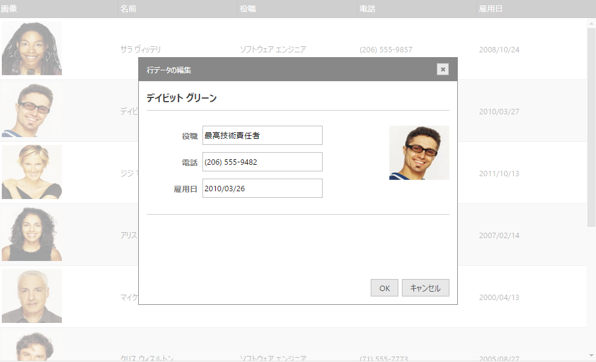

import ApiLink from 'docs-template/components/mdx/ApiLink.astro';

# 行編集ダイアログの概要 (igGrid)

## トピックの概要

### 目的

このドキュメントでは、行編集ダイアログを使用するときのプロパティとメソッドを説明します。

### 前提条件

以下は、このトピックを理解するための前提条件として必要なトピックと記事の一覧です。

- [igGrid の概要](/iggrid-overview): `igGrid` は、表形式データの表示および操作に使用される jQuery ベースのクライアント側グリッドです。そのライフサイクル全体はクライアント側に存在し、サーバー側の技術からは独立しています。

- [更新の概要 (igGrid)](/iggrid-updating): このトピックでは、`igGrid`™ コントロールの更新機能の使用方法を説明します。

- [igTemplating](../../../../../06_Infragistics-Templating-Engine/~Infragistics Templating Engine.mdx): このトピックでは、Infragistics® テンプレート エンジンの使用方法を説明します。


### このトピックの内容

このトピックは、以下のセクションで構成されます。

-   [概要](#introduction)
-   [行編集ダイアログの定義](#definition)
-   [行編集ダイアログのプロパティのリファレンス](#property-reference)
-   [行編集ダイアログのイベントのリファレンス](#events-reference)
-   [関連コンテンツ](#related-content)


## <a id="introduction"></a> 概要

バージョン 12.2 以降、`igGrid` の更新機能には、行編集ダイアログが用意され、インライン編集より強力なポップアップ ダイアログのレコード編集機能が備わりました。

この機能は、グリッド更新機能の一部として実装します。`editMode` プロパティには、現在の「row」と「cell」以外に新しい値「dialog」が加わりました。


| プロパティ | タイプ | 説明 | デフォルト値 |
| --- | --- | --- | --- |
| <ApiLink type="iggridupdating" member="editMode" section="options" label="editMode" /> | “row\|cell\|**dialog**\|none\|null” | `editMode` プロパティには、新しい値 **dialog** を追加しました。 | row |


行ダイアログは、ダイアログ ウィンドウとして描画します。以下に例を示します。



完了とキャンセルをクリックすると、`editMode`: 「row」の使用時と同じ結果が得られます。

`startEditTriggers` Updating プロパティで指定したトリガーで行編集ダイアログが開きます (*click*、*dblClick*、*enter*、*F2* など)。

行編集ダイアログを自動的に生成する場合は、列のデータ タイプが基準になります。行編集ダイアログは、更新機能に `columnSettings` を読み取り、描画するエディターをこれで決めます。

無効なエディター (`readOnly`: true) のレンダリングは `showReadonlyEditors` プロパティにより制御します。`showReadonlyEditors` が *true* のとき、無効な列は行編集ダイアログ ウィンドウに描画されますが、機能はしません。`showReadonlyEditors` が *false* のとき、`readOnly` 列は行編集ダイアログ ウィンドウのエディターに描画されません。

行編集ダイアログには検証統合機能があります。検証は、列設定の`検証`プロパティを読み取って行います。エンド ユーザーが無効な値を入力すると検証メッセージは行編集ダイアログにインラインで描画されます。

パブリック API メソッド <ApiLink type="igGridUpdating" member="startEdit" section="methods" label="startEdit" /> と <ApiLink type="igGridUpdating" member="endEdit" section="methods" label="endEdit" /> では、行編集ダイアログを開閉できます。


## <a id="definition"></a> 行編集ダイアログの定義

このセクションでは、行編集ダイアログのさまざまな定義方法を説明します。

行ダイアログは、以下の方法で定義できます。

1.  自動的に生成された行編集ダイアログ

	どちらのテンプレート設定も使用しない場合、ウィジェットが 2 つの列の表を含むデフォルトのダイアログを生成します。左の列はグリッドの各列のヘッダー テキストを表示します。右の列にはエディターが含まれています。エディターのタイプは、その列とデータ型の `columnSettings` に基づきます。

	**JavaScript の場合:**
	
```js
	{
		name: "Updating",
		enableAddRow: true,
		editMode: "dialog",
		enableDeleteRow: true,
		columnSettings: [
			{
				columnKey: "OrderID",
				readOnly: true
			},
			{
				columnKey: "ShipName",
				defaultValue: names[1],
				editorOptions: {
					button: "dropdown",
					listItems: names,
					readOnly: true,
					dropDownOnReadOnly: true
				}
			}
		]
	}
```

2.  `dialogTemplate` プロパティと `editorsTemplate` プロパティによりテンプレート文字列として指定します。

	これらのオプションの 1 つまたは両方が設定されていると、ウィジェットが、選択したテンプレート エンジンを使用してダイアログを作成します。 
	
	2.1.`dialogTemplate` は、編集中のレコードのために描画されるテンプレートです。このテンプレートで、ユーザーは、グリッドのデータ ソースの要素にネイティブな任意のプロパティを使用できます。
	テンプレートがウィジェットを描画した後、特殊な属性 

	- `data-editor-for-<columnKey>` - ここでは `<columnKey>` が付いた要素の検索がグリッド列の 1 つのキーです。1 つの要素のみが列ごとに条件をパスする限り、それぞれの要素にエディターが作成されます。
	
	- `data-render-tmpl` -この属性が付いた要素は `editorsTemplate `オプションで指定したテンプレートのコンテナーとして使用されます。この属性を持つ要素が見つからない場合、`editorsTemplate` により指定されたテンプレートは実行されません。

	2.2.`editorsTemplate` は、`showReadonlyEditors` および `showEditorsForHiddenColumns` オプションにより内部的に修正できる列のコレクションのために描画されるテンプレートです。この 2 つのオプションは、テンプレート エンジンに渡すコレクションに含める列をコントロールします。また、`dialogTemplate` で指定したエディターを含む列は除外されます。グリッドの列コレクション オブジェクトでネイティブなすべてのプロパティは、このテンプレートで使用できます。エディターは、`data-editor for <columnKey  >` 属性を持つことを要求されますが、その利用は、選択したテンプレート エンジンに基づき、`${key}` テンプレート タグ (たとえば、`data-editor for ${key}`) または類似する要素を使用するテンプレート エンジンに委ねる必要があります。
	
	**ASPX の場合:**
	
```csharp
	<%= (Html.Infragistics().Grid(Model).ID("grid1").Height("400px").Width("100%")
		// Grid Definition
		.Features(features => {
			features.Updating()                
				.EditMode(GridEditMode.Dialog)
				.ShowReadonlyEditors(true)
				.StartEditTriggers(GridStartEditTriggers.Click)
				.RowEditDialogOptions(options => {
		           		options.Containment("owner")
		           		.DialogTemplate("<table><colgroup><col></col><col></col></colgroup><tbody data-render-tmpl></tbody></table>")
		           		.EditorsTemplate("<tr><td>${headerText}</td><td><input data-editor-for-${key} /></td>
</tr>")
		           		.Width("400px");
			});
		})
		.DataBind()
		.Render()
	%>
```
	
	**JavaScript の場合:**
	
```js
	features: [
		{ 
			name: "Updating",
			startEditTriggers: 'enter,dblclick',    
			editMode: 'dialog',      
			showReadonlyEditors: false,      
		  	rowEditDialogOptions: {
				editorsColumnWidth: 100,
				dialogTemplate: "<table><colgroup><col></col><col></col></colgroup><tbody data-render-tmpl></tbody></table>",
				editorsTemplate: "<tr><td>${headerText}</td><td><input data-editor-for-${key} /></td>
</tr>"
			}
		}
	]
```

3.  `dialogTemplateSelector` プロパティおよび `editorsTemplateSelector` プロパティを使用するテンプレート要素の参照。

	2 のすべての規則がここでも適用されます。selector プロパティは、コントロールに文字列を引数として渡すよりも、テンプレートを html のページに追加する方が便利な場合に使用します。
	
	`editorsTemplateSelector` と `editorsTemplate` の両方が設定されている場合は、`editorsTemplateSelector` が使用されます。`dialogTemplateSelector` オプションおよび `dialogTemplate` オプションの場合も同様です。
	
	**JavaScript の場合:**
	
```js
	<script id="dialogTemplate" type="text/html">	
		<div style="float: left;">
			<strong>${Name}</strong><br />
			<table style="width: 100%;">
				<colgroup>
					<col style="width: 30%;" />
					<col style="width: 70%;" />
				</colgroup>
				<tbody data-render-tmpl="true">
				</tbody>
			</table>
		</div>
	</script>

	<script id="editorsTemplate" type="text/html">
		<tr>
			<td><strong>${headerText}</strong></td>
			<td><input data-editor-for-${key}="true"/></td>
</tr>
	</script>
	//Inside the grid Definition
	..    
	features: [      
		{
			name: 'Updating',
			startEditTriggers: 'enter,dblclick',
			editMode: 'dialog',	    
			showReadonlyEditors: false,
			rowEditDialogOptions: {
				dialogTemplateSelector: "#dialogTemplate",
				editorsTemplateSelector: "#editorsTemplate"
			},
			columnSettings: [
				{
					columnKey: "ProductID",
					editorType: 'numeric',
					readOnly: true
				},
				{
					columnKey: "ProductDescription",
					editorOptions: { readOnly: true }
				},
				{
					columnKey: "DateCol",
					editorType: 'datepicker',
					validation: true,
					editorOptions: { required: true }
				},
				{
					columnKey: "UnitPrice",
					editorType: 'currency',
					validation: true,
					editorOptions: { button: 'spin', required: true }
				}
			]
		}
	]
	…
```


## <a id="property-reference"></a> 行編集ダイアログのプロパティのリファレンス

このセクションでは、`igGrid` コントロールの更新機能を使用するときの行編集ダイアログ関連の各種プロパティについて説明します。

以下に、非バインド列のプロパティの目的と機能を簡単に説明します。

- <ApiLink type="iggridupdating" member="showReadonlyEditors" section="options" label="showReadonlyEditors" />

	このプロパティは、特定の列で編集が無効な場合に使用します (`readOnly: true`)。

	デフォルトは TRUE です。無効な列は行編集ダイアログ ウィンドウに描画されますが、機能しません。

	FALSE の場合、無効な列はエディターには描画されません。

- <ApiLink type="iggridupdating" member="rowEditDialogOptions.containment" section="options" label="containment" />

	このプロパティはダイアログの親コンテナーを設定します。デフォルト値は「owner」で、行編集ダイアログはグリッド領域でのみドラッグできます。

	このプロパティを「window」に設定すると、ダイアログはウィンドウのどこにでもドラッグできます。

- <ApiLink type="iggridupdating" member="rowEditDialogOptions.dialogTemplate" section="options" label="dialogTemplate" />

	編集中のレコードに対し描画されるテンプレート (またはレコードを作成していない場合は、デフォルトのキーと値のペア) を指定します。 
	コントロールがeditorsTemplate オプションで指定されたエディターのテンプレートを描画する場所を指定する、「data-render-tmpl」属性を使用する要素を含む場合があります。カスタム ダイアログの場合、要素は 'data-editor-for-&lt;columnKey&gt;' 
	属性を使用することができます。columnKey は、編集でエディターまたは入力により使用される列のキーです。
	dialogTemplate と dialogTemplateSelector の両方が設定されている場合は、dialogTemplateSelector が使用されます。
	既定のテンプレートは `<table><colgroup><col></col><col></col></colgroup><tbody data-render-tmpl></tbody></table>` です。
	
	**JavaScript の場合:**
	
```js
	features: [
		{ 
			name: "Updating",
			startEditTriggers: 'enter,dblclick',    
			editMode: 'dialog',      
			showReadonlyEditors: false,      
			rowEditDialogOptions: {
	        		dialogTemplate:"<table><colgroup><col></col><col></col></colgroup><tbody data-render-tmpl></tbody></table>"
			}
		}
	]
```
    
- <ApiLink type="iggridupdating" member="rowEditDialogOptions.editorsTemplate" section="options" label="editorsTemplate" />

	グリッドの列コレクションの各列に実行するテンプレートを指定します。エディターとして使用される要素に 'data-editor-for-$&#123;key&#125;' を追加します。$&#123;key&#125; テンプレート タグは、
	値をレンダリングするために選択したテンプレート エンジンの構文で置き換える必要があります。列のどのエディターもダイアログ マークアップで指定されている場合は、
	テンプレートが描画されるデータから除外されます。
	「data-render-tmpl」属性を持つ要素がダイアログ テンプレートに含まれていない場合、このプロパティは無視されます。 
	
	**JavaScript の場合:**
	
```js
	features: [
		{ 
			name: "Updating",
			startEditTriggers: 'enter,dblclick',    
			editMode: 'dialog',      
			showReadonlyEditors: false,      
			rowEditDialogOptions: {
				dialogTemplate:"<table><colgroup><col></col><col></col></colgroup><tbody data-render-tmpl></tbody></table>"
			}
		}
	]
``` 

- <ApiLink type="iggridupdating" member="rowEditDialogOptions.dialogTemplateSelector" section="options" label="dialogTemplateSelector" />

	編集中のレコードに対し描画されるテンプレートにセレクター (またはレコードを作成していない場合は、デフォルトのキーと値のペア) を指定します。コントロールがeditorsTemplate オプションで指定されたエディターのテンプレートを描画する場所を指定する、「data-render-tmpl」属性を使用する要素を含む場合があります。カスタム ダイアログの場合、要素に'data-editor-for-&lt;columnKey&gt;'属性を追加できます。columnKey は、編集でエディターまたは入力により使用される列のキーです。editorsTemplate と editorsTemplateSelector の両方が設定されている場合は、editorsTemplateSelector が使用されます。	既定のテンプレートは `<table><colgroup><col></col><col></col></colgroup><tbody data-render-tmpl></tbody></table>` です。
	
**JavaScript の場合:**
	
```js
	
	<script id="dialogTemplate" type="text/html">
		<div style="float: left;">
			<strong>${Name}</strong><br />
			<table style="width: 100%;">
				<colgroup>
					<col style="width: 30%;" />
					<col style="width: 70%;" />
				</colgroup>
				<tbody data-render-tmpl="true">
				</tbody>
			</table>
		</div>
	</script>
```
    
- <ApiLink type="iggridupdating" member="rowEditDialogOptions.editorsTemplateSelector" section="options" label="editorsTemplateSelector" />
 
グリッドの列コレクションの各列で実行されるテンプレートに、セレクターを指定します。エディターとして使用される要素に 「data-editor-for-$&#123;key&#125;」を追加します。値をレンダリングするために、$&#123;key&#125; テンプレートのタグを、選択したテンプレート エンジンで置き換える必要があります。列のエディターがダイアログ マークアップで指定されている場合、テンプレートは描画されるデータから除外されます。「data-render-tmpl」属性を持つ要素がダイアログ マークアップに含まれていない場合、このプロパティは無視されます。editorsTemplate と editorsTemplateSelector の両方が設定されている場合は、editorsTemplateSelector が使用されます。既定のテンプレートは、`&lt;tr&gt;&lt;td&gt;$&#123;headerText&#125;&lt;/td&gt;&lt;td&gt;<input data-editor />&lt;/td&gt;
&lt;/tr&gt;` です。
	
**JavaScript の場合:**
	
```js	
	<script id="editorsTemplate" type="text/html">
		<tr>
			<td><strong>${headerText}</strong></td>
			<td><input data-editor-for-${key}="true"/></td>
</tr>
	</script>
```

- <ApiLink type="iggridupdating" member="rowEditDialogOptions.height" section="options" label="height" />

	このプロパティは行編集ダイアログの高さをピクセル単位で制御します。
	
	デフォルト値は 350 です。文字列 (“350px”) または数字 (350) で指定できます。


- <ApiLink type="iggridupdating" member="rowEditDialogOptions.width" section="options" label="width" />

	このプロパティは行編集ダイアログの幅をピクセル単位で制御します。
	
	デフォルト値は 370 です。文字列 (“370px”) または数字 (370) で指定できます。
	

- <ApiLink type="iggridupdating" member="rowEditDialogOptions.namesColumnWidth" section="options" label="namesColumnWidth" />

	デフォルトの列編集ダイアログで、列名を含む列の幅を制御します。値は数字で指定します。デフォルト値は 150 です。
	
	

- <ApiLink type="iggridupdating" member="startEditTriggers" section="options" label="startEditTriggers" />

	`startEditTriggers` updating プロパティで指定したトリガーで行編集ダイアログが開きます (*click*、*dblClick*、*enter*、*F2* など)。

- <ApiLink type="iggridupdating" member="doneLabel" section="options" label="doneLabel" />

	このプロパティは、行編集ダイアログの [*完了*] ボタンのテキストを制御します。

- <ApiLink type="iggridupdating" member="cancelLabel" section="options" label="cancelLabel" />

	このプロパティは、行編集ダイアログの [*キャンセル*] ボタンのテキストを制御します。


## <a id="events-reference"></a> 行編集ダイアログのイベントのリファレンス

このセクションでは、`igGrid` コントロールの更新機能を使用するときの行編集ダイアログ関連の各種プロパティについて説明します。

以下の表は、行編集ダイアログを有効にしたときに発生するイベントを示します。

イベントはテンプレートの表示時や非表示時に発生します。

テンプレート コンテンツをレンダリングすると、イベントの引数に編集する現在のデータ行を取り込みます。これにより、開発者がレンダリングを完全に制御できます。

ハンドラー関数は引数として `evt` と `ui` を受け取ります。`ui.owner` は `igGridUpdating` への参照情報、`ui.dialogElement` は、行変数ダイアログ DOM 要素への参照を受け取るために使用できます。

現在のデータ行への参照を取得するには、`ui.dialogElement.data('tr')` を使用してください。

|イベント|説明|
|---|---|
|<ApiLink type="iggridupdating" member="rowEditDialogBeforeOpen" section="events" label="rowEditDialogBeforeOpen" />|このイベントは行編集ダイアログが開く前に発生します。キャンセルはできません。|
|<ApiLink type="iggridupdating" member="rowEditDialogAfterOpen" section="events" label="rowEditDialogAfterOpen" />|このイベントは行編集ダイアログが開いてから発生します。|
|<ApiLink type="iggridupdating" member="rowEditDialogContentsRendered" section="events" label="rowEditDialogContentsRendered" />|このイベントは行編集ダイアログのコンテンツのレンダリングのあとに発生します。|
|<ApiLink type="iggridupdating" member="rowEditDialogBeforeClose" section="events" label="rowEditDialogBeforeClose" />|このイベントは行編集ダイアログが閉じる前に発生します。キャンセルはできません。|
|<ApiLink type="iggridupdating" member="rowEditDialogAfterClose" section="events" label="rowEditDialogAfterClose" />|このイベントは行編集ダイアログが閉じた後にに発生します。|

## <a id="related-content"></a> 関連コンテンツ

### トピック

このトピックの追加情報については、以下のトピックも合わせてご参照ください。

- [行ダイアログ テンプレートの構成](igGrid-Updating-RowEditDialog-Configuring.html): このトピックでは、行編集ダイアログと組み合わせた `igGrid`™ コントロールの更新機能の使用方法を説明します。

### サンプル

このトピックについては、以下のサンプルも参照してください。

<div class="embed-sample">
   [行編集ダイアログ](&#123;environment:SamplesEmbedUrl&#125;/grid/row-edit-dialog)
</div>