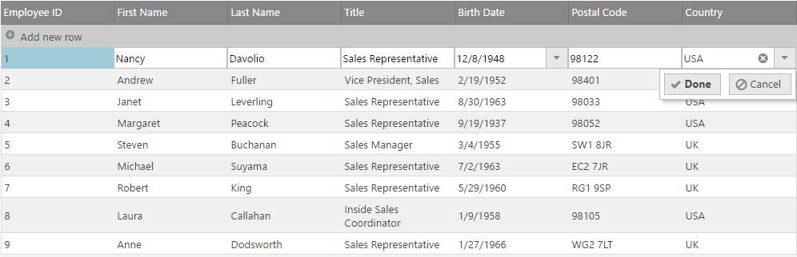

import ApiLink from 'docs-template/components/mdx/ApiLink.astro';

# 更新の概要 (igGrid)

## トピックの概要

### 目的
このトピックでは、`igGrid`™ コントロールの更新機能の使用方法を説明します。

### このトピックの内容
このトピックは、以下のセクションで構成されます。

-   [**概要**](#overview)
    -   [ユーザー相互作用チャート](#user-interactions)
    -   [構成と検討事項](#configuration-considerations)
-   [**更新を有効にする**](#enable)
    -   [JavaScript で igLoader を使用して必要な CSS および JavaScript 参照の追加](#required)
    -   [CSS および JavaScript 参照を静的に読み込む - 更新のみに必要](#minimal-required)
-   [**&#123;environment:ProductFamilyName&#125; CLI で更新機能が有効化されている igGrid の追加**](#adding-using-CLI)
-   [**行の追加、更新、削除を無効にする**](#disable-row-add-delete)
-   [**列の設定およびエディター**](#column-settings-editors)
    -   [columnSettings オブジェクトの取得](#retrieving-columnsettings)
    -   [columnSettings の使用例およびエディターの追加](#columnsettings-example)
-   [**AddNewRow に PrimaryKey を追加**](#adding-primarykey)
-   [**バッチ更新**](#batch)
    -   [サーバーに対する変更を保持](#persist-changes)
    -   [dataDirty イベントの処理](#datadirty-event)
    -   [例: dataDirty イベントでのデータのコミット](#example-committing-data)
-   [**UI の更新**](#ui)
    -   [セルをプログラムで開始および編集 (UI の更新を使用)](#programmatically-start-edit)
-   [**ローカライズのサポート**](#localization)
-   [**更新 API**](#api)
    -   [行をプログラムで追加](#api-add-row)
    -   [行をプログラムで削除](#api-delete-row)
    -   [行をプログラムで更新](#api-update-row)
-   [**クライアント側イベント**](#client-events)
-   [**カスタマイズの更新**](#customization)
    -   [初期化後の更新機能オプションの設定](#setting-option)
-   [**キーボード操作**](#keyboard-interaction)
-   [**関連トピック**](#topics)


## 概要
`igGrid`™ コントロールの更新機能には 3 種類の操作があります: 新しい行の更新、追加、および行の削除です。デフォルトでは、これらのすべての機能が有効です。

更新機能は、個々のセル (セル編集モード) または行全体 (行編集モード) で有効にすることができます。行編集モードでは、行のすべてのセルを更新できます。

### ユーザー相互作用チャート
下の表は、更新機能のユーザー操作機能を簡単にまとめたものです。

目的|方法|相互作用の詳細
---|---|---
更新のキャンセル|[キャンセル] ボタンをクリック、ESC キーを押下|更新をキャンセルするとすべての編集が破棄され、以前コミットした値に戻ります。
更新のコミット|[完了] ボタンをクリック、ENTER キーを押下|更新のコミットによって、グリッドで以前コミットした値に置き換えられ、編集モードが終了します。
更新をコミットして次のセルを編集|TAB キーを押下|現在のセルに対する更新をコミットし、次の編集可能なセルを編集モードにします。次のセルは、同じ行のすぐ右側のセルになり、最後の列に値をコミットした場合は、次の行の最初の編集可能なセルになります。この操作は、`editMode` が cell に設定されている時のみサポートされます。


**図 1: ユーザー インターフェイスを更新する igGrid コントロール行**  


`autoCommit` が有効な場合、編集行のアクションによってデータ ソースの更新が実行されます。`autoCommit` が有効ではない場合、ページング、並べ替え、またはフィルタリングなどの、グリッドを再バインドする操作中にデータ ソースを更新する必要があります。グリッド内の変更の検出は `dataDirty` イベントによって管理され、これによってデータをデータ ソースにコミットするタイミングを制御できます。

`autoCommit` オプション値は `aggregateTransactions` オプションの機能に影響します。`aggregateTransactions` オプションは、保留トランザクション (基本データ ソースに保存されない一時トランザクション) で操作します。保留トランザクションは、`autoCommit` が false に設定される場合のみに利用可能です。

> **注:** グリッドの更新機能は jQuery UI ウィジェットとして実装されているため、jQuery UI ウィジェットの一般的な標準ライフサイクルに従います。


### 構成と検討事項

-   以下のエディターがサポートされています。
    -   基本入力エディター - 文字列
    -   数値エディター
    -   日付/時刻エディター
    -   日付ピッカー
	-	タイムピッカー
    -   マスク エディター
    -   ブール値
    -   パーセンテージ
    -   通貨
    -   コンボ
    -   レーティング
-   定義済みの検証
-   編集アクションの構成をサポート - クリック、ダブル クリック時、F2、ENTER キーの押下時
-   バッチ更新 - 構成可能な様々な状況において、変更がデータ ソースにコミットされます。
    -   セルがフォーカスを失った直後
    -   行が変更された時
    -   列が変更された時
    -   手動 - ユーザーが、ボタンの押下によって更新が完了したことを指定した時

> **注:**
> 
> コンボ エディターが Updating 機能で構成される場合、`igCombo` スクリプト ファイル (infragistics.ui.combo.js) はページに参照する必要があります。
> 
> 日付ピッカー エディターが Updating 機能で構成される場合、jQuery UI Datepicker コントロールおよびそのローカライズ ファイルはページに参照する必要があります。


## 更新を有効にする
更新機能を有効にすることで、グリッド内のデータを追加、削除、または更新することができます。


### JavaScript で igLoader を使用して必要な CSS および JavaScript 参照の追加

&#123;environment:ProductName&#125; ライブラリのコントロールで必要な JavaScript および CSS リソースの読み込みには、`igLoader`™ コントロールを使用することをお勧めします。最初に、`igLoader` スクリプトをページに追加します。

**HTML の場合:**

```js
<script type="text/javascript" src="ig_ui/js/infragistics.loader.js"></script>
```

HTML ビューでは、以下のように `igLoader` のインスタンスを作成する必要があります。

**JavaScript の場合:**

```js
<script  type="text/javascript">
$.ig.loader({  
	scriptPath: "/ig_ui/js/",
	cssPath: "/ig_ui/css/",
	resources: "igGrid.Updating"
});
</script>
```

### CSS および JavaScript参照を静的に読み込む - 更新のみに必要

**HTML の場合:**

```html
<script src="scripts/jquery.min.js" type="text/javascript"></script>
<script src="scripts/ig_ui/js/modules/infragistics.ui.grid.updating.js" type="text/javascript"></script>
<script src="scripts/ig_ui/js/modules/infragistics.ui.grid.shared.js" type="text/javascript"></script>
<script src="scripts/ig_ui/js/modules/infragistics.ui.editors.js" type="text/javascript"></script>
```

以下に、`igGrid` を構成して更新をサポートする方法が示されています。

**JavaScript の場合:**

```js
$("#grid1").igGrid({
	primaryKey: "ProductID",
    columns: [
        { headerText: "Product ID", key: "ProductID", dataType: "number" },
        { headerText: "Product Name", key: "Name", dataType: "string" },
        { headerText: "ProductNumber", key: "ProductNumber", dataType: "string" }
    ],
    dataSource: “adventureWorks.php”,
    responseDataKey: 'Records',
    features: [
        {
            name : 'Updating'
        }
	]
});
```

> **注:** 更新するには、プライマリ キー列の `primaryKey` オプションおよび `dataType` プロパティを設定する必要があります。設定されない場合、基本のデータ ソースは正しく操作しない可能性があります。

**Razor の場合:**

```csharp
<%= Html.Infragistics().Grid(Model)
.ID("grid1")
.PrimaryKey("ProductID")
.UpdateUrl(Url.Action("UpdatingSaveChanges"))
.Columns(column =>
    {
        column.For(x => x.ProductID).HeaderText("Product ID").Width("100px");
        column.For(x => x.Name).HeaderText("Product Name").Width("200px");
        column.For(x => x.ProductNumber).HeaderText("Product Number").Width("200px");
    })
.Features(features => {
        features.Updating();
    })
.Height("500")
.DataSourceUrl(Url.Action("UpdatingGetData"))
.DataBind()
.Render()%>
```

## 行の追加、更新、削除を無効にする

**JavaScript の場合:**

```js
$("#grid1").igGrid({
    columns: [
        { headerText: "Product ID", key: "ProductID", dataType: "number" },
        { headerText: "Product Name", key: "Name", dataType: "string" },
        { headerText: "ProductNumber", key: "ProductNumber", dataType: "string" }
    ],
	dataSource: “adventureWorks.php”,
    responseDataKey: 'Records',
    features: [
        {
            name : 'Updating',
            enableAddRow: true,
            enableDeleteRow: true,
            editMode: 'none'
        }
    ]
});
```

**Razor の場合:**

```csharp
<%=Html.Infragistics().Grid(Model).ID("grid1").PrimaryKey("ProductID").UpdateUrl(Url.Action("UpdatingSaveChanges")).Columns(column =>
    {
        column.For(x => x.ProductID).HeaderText("Product ID").Width("100px");
        column.For(x => x.Name).HeaderText("Product Name").Width("200px");
        column.For(x => x.ProductNumber).HeaderText("Product Number").Width("200px");
    }).Features(features => {
        features.Updating()
            .EnableDeleteRow(true)
            .EnableAddRow(true)
            .EditMode(GridEditMode.None);            
	}).Height("500").DataSourceUrl(Url.Action("UpdatingGetData"))
	.DataBind().Render()%>
```

## 列の設定およびエディター
列はそれぞれ、以下の表に記載された `columnSettings` オプションで構成できます。

プロパティ名 (括弧内はデフォルト値)|説明
---|---
<ApiLink type="igGridUpdating" member="columnSettings.columnKey" section="options" label="columnKey" /> (null)|この列設定を適用する列のキー
<ApiLink type="igGridUpdating" member="columnSettings.editorProvider" section="options" label="editorProvider" /> |$.ig.EditorProvider または　$.ig.EditorProviderBase を拡張し、そのメンバー メソッドを実装するカスタム エディター プロバイダー。
<ApiLink type="igGridUpdating" member="columnSettings.editorType" section="options" label="editorType" /> (null)|igEditor のカスタム タイプ (「text」、「numeric」、「datepicker」、「combo」、「rating」など)。
<ApiLink type="igGridUpdating" member="columnSettings.editorOptions" section="options" label="editorOptions" /> (null)|特定の igEditor がサポートするカスタム オプション。コンボおよびレーティングの場合、これは igCombo または igRating で利用できるオプションを提供します。
<ApiLink type="igGridUpdating" member="columnSettings.required" section="options" label="required" /> (false)|必須の入力の検証を有効にします。
<ApiLink type="igGridUpdating" member="columnSettings.readOnly" section="options" label="readOnly" /> (false)|列のセルを編集不可にします。
<ApiLink type="igGridUpdating" member="columnSettings.validation" section="options" label="validation" /> (false)|igEditor の値の検証を有効にします。
<ApiLink type="igGridUpdating" member="columnSettings.defaultValue" section="options" label="defaultValue" /> (null)|Add-New-Row の列のセルのデフォルト値。


### columnSettings の更新

**JavaScript の場合:**

```js
$("#grid").igGrid({
    features: [
        {
            name: "Updating",
            columnSettings: [
                {
                    columnKey : "Name",
                    defaultValue: "Infragistics",
                    editorType: "text",
                    editorOptions: {
                        buttonType: "dropdown",
                        listItems: names,
                        readOnly: true
                    },
                    required: true,
                    validation: true
                }
            ]
        }
    ]
});
```

### columnSettings の使用例およびエディターの追加

**JavaScript の場合:**

```js
$("#grid1").igGrid({
    columns: [
	    { headerText:"Product ID", key:"ProductID", width: "100px" , dataType:"number" },
	    { headerText:"Product Name", key:"Name", width: "180px" , dataType:"string" },
	    { headerText:"ProductNumber", key:"ProductNumber", width: "100px", dataType:"string" },
	    { headerText:"Color", key:"Color", width: "100px", dataType:"string" },
	    { headerText:"SafetyStockLevel", key:"SafetyStockLevel", width: "100px", dataType:"string" },
	    { headerText:"ReorderPoint", key:"ReorderPoint", width: "100px", dataType:"number" },
	    { headerText:"ListPrice", key:"ListPrice", width: "100px", dataType:"number" },
	],
	dataSource: adventureWorks,
    features: [
        {
            name: 'Updating',
			columnSettings: [ 
            {
                columnKey: "ProductID",
                editorOptions: {
                    readOnly: true
                }
            }, 
            {
                columnKey: "Name",
                editorType: 'string',
                validation: true,
                editorOptions: {
                    required: true
                }
            },
            {
                columnKey: "ProductNumber",
                editorType: 'string',
                validation: true,
                editorOptions: {
                    required: true
                }
             },
            {
                columnKey: "Color",
                editorType: 'string',
                validation: false,
                editorOptions: {
                    required: false
                }
            },
            {
                columnKey: "SafetyStockLevel",
                editorType: 'numeric',
                validation: true,
                editorOptions: {
                    required: true
                }
            }, 
            {
                columnKey: "ReorderPoint",
                editorType: 'numeric',
                validation: true,
                editorOptions: {
                    required: true
                }
            },
            {
                columnKey: "ListPrice",
                editorType: 'numeric',
                validation: true,
                editorOptions: {
                    button: 'spin', 
                    minValue: 0, 
                    maxValue: 99, 
                    required: true
                }
            }, 
            {
                columnKey: "StandardCost",
                editorType: 'currency',
                validation: true,
                editorOptions: {
                    button: 'spin', 
                    required: true
                }
            } 
            ]
          
        }
    ]
});
```

**Razor の場合:**

```csharp
<%= Html.Infragistics().Grid(Model).ID("grid1").PrimaryKey("ProductID").UpdateUrl(Url.Action("UpdatingSaveChanges")).Columns(column =>
	{
	    column.For(x => x.ProductID).HeaderText("Product ID").Width("100px");
	    column.For(x => x.Name).HeaderText("Product Name").Width("200px");
	    column.For(x => x.ModifiedDate).HeaderText("Modified Date").Width("200px");
	    column.For(x => x.ListPrice).HeaderText("List Price").Width("200px");
    }).Features(features => {
	    features.Updating()
			.ColumnSettings(settings =>
             {
                 settings.ColumnSetting().ColumnKey("ProductID").ReadOnly();
                 settings.ColumnSetting().ColumnKey("Name").EditorType(ColumnEditorType.Text).Required().Validation();
                 settings.ColumnSetting().ColumnKey("ModifiedDate").EditorType(ColumnEditorType.DatePicker);
                 settings.ColumnSetting().ColumnKey("ListPrice").EditorType(ColumnEditorType.Currency);
             });
	}).Height("500").DataSourceUrl(Url.Action("UpdatingGetData"))
	.DataBind().Render()%>
```

## &#123;environment:ProductFamilyName&#125; CLI で更新機能が有効化されている igGrid の追加

&#123;environment:ProductFamilyName&#125; CLI のインストール:

```
npm install -g igniteui-cli
```

&#123;environment:ProductFamilyName&#125; CLI インストール後、&#123;environment:ProductName&#125; プロジェクトを生成し、更新機能が構成された新しい igGrid コンポーネントを追加してプロジェクトをビルドおよび公開するには、以下のコマンドを使用します。

```
ig new <project name> --framework=jquery
cd <project name>
ig add grid-editing newGridEditing
ig start
```

すべての利用可能なコマンドおよび詳細な情報については、[「&#123;environment:ProductFamilyName&#125; CLI の使用」](/Using-Ignite-UI-CLI)のトピックを参照してください。

## AddNewRow に PrimaryKey を追加
プライマリ キーを含むデータ ソースのグリッドの新しい行を初期化する際、`igGrid` 更新機能の `generatePrimaryKeyValue` イベントが発生し、プライマリ キーの値が新しい行に提供されます。イベント ハンドラーの 2 番目のパラメーターには、新しいプライマリ キーの値をグリッドまで戻すために使用される値メンバーが含まれます。デフォルトでは、この値は、データ ソースの行数と等しい値で初期化されます。以下のコード リストは、グリッドの新しい行に対して新しいプライマリ キーの値を生成する方法の例です。

**JavaScript の場合:**

```js
function getTempKey(){
    var key;
    //This function gets the appropriate temporary key for a new row from the server
    return key;
}

$("#grid1").igGrid({
    columns: [
      { headerText:"Product ID", key:"ProductID", width: "100px" , dataType:"number" },
      { headerText:"Product Name", key:"Name", width: "180px" , dataType:"string" }
    ],
    dataSource: adventureWorks,
	primaryKey: 'ProductID',
    features: [
	{
       name: 'Updating',
       generatePrimaryKeyValue: function (evt, ui) {
          // setting a temporary key for the new row          
          ui.value = getTempKey();
       },
       columnSettings: [
	   {
         columnKey: "ProductID",
         editorOptions: {
			readOnly: true
		 }
       }
     ]
    }
  ]
});
```

## バッチ更新

グリッド内のデータの変更をサーバーに保存する時、`saveChanges` が呼び出され、保持メッセージがサーバーに送信されます。`saveChanges` メソッドは、サーバーに対する updateUrl オプション (指定されている場合) にポストする AJAX 要求を呼び出します。ポスト中、グリッドは、シリアル化されたトランザクション ログを、POST の一部としての JSON 文字列として渡します。

### サーバーに対する変更を保持
バッチ更新をインスタンス化されたグリッドに追加する場合は、バインドの代わりにライブ メソッドを使用して、バッチ更新を既存のグリッドに追加する必要があります。

**JavaScript の場合:**

```js
<script type="text/javascript">  $("#saveChanges").bind({
            click: function (e) {
                $("#grid1").igGrid("saveChanges");
            }    
        });
</script> 
```

**Razor の場合:**

```
	<%= Html.Infragistics().Grid(Model).ID("grid1").PrimaryKey("ProductID").UpdateUrl(Url.Action("UpdatingSaveChanges")).Columns(column =>
	{
		column.For(x => x.ProductID).HeaderText("Product ID").Width("100px");
		column.For(x => x.Name).HeaderText("Product Name").Width("200px");
		column.For(x => x.ModifiedDate).HeaderText("Modified Date").Width("200px");            
		column.For(x => x.ListPrice).HeaderText("List Price").Width("200px");
	}).Features(features => {
	    features.Updating()
	        .ColumnSettings(settings =>
	             {
	                 settings.ColumnSetting().ColumnKey("ProductID").ReadOnly();
	                 settings.ColumnSetting().ColumnKey("Name").EditorType(ColumnEditorType.Text).Required().Validation();
	                 settings.ColumnSetting().ColumnKey("ModifiedDate").EditorType(ColumnEditorType.DatePicker);
	                 settings.ColumnSetting().ColumnKey("ListPrice").EditorType(ColumnEditorType.Currency);
	             });
	}).Height("500").DataSourceUrl(Url.Action("UpdatingGetData"))
	.DataBind().Render()%>
```

```
<input type="button" id="saveChanges" value="Save Changes" />
```

以下で実装されたアクション メソッドは、Ajax ポストを受け入れ、グリッドからのデータ変更を保持する方法を示しています。グリッドのトランザクションは、`ig_transactions` というラベルが付いた from フィールドで利用可能であり、データ層に対する処理を実行できます。編集モード (行またはセル) に基づいて処理方法は異なります。

#### 行トランザクションの保持

[GridModel.LoadTransactions](Infragistics.Web.Mvc~Infragistics.Web.Mvc.GridModel~LoadTransactions.html) メソッドを使用すると、ポスト データを [Transaction](Infragistics.Web.Mvc~Infragistics.Web.Mvc.Transaction`1.html) オブジェクトに変換します。行データは [Transaction.row](Infragistics.Web.Mvc~Infragistics.Web.Mvc.Transaction`1~row.html) フィールドで保存されます。

**Razor の場合:**

```csharp
public ActionResult UpdatingSaveChanges()
{
	var ctx = new AdventureWorksDataContext();
	var ds = ctx.MyComplexProducts;
	ViewData["GenerateCompactJSONResponse"] = false;
	GridModel m = new GridModel();
	List<Transaction<MyComplexProduct>> transactions = m.LoadTransactions<MyComplexProduct>(HttpContext.Request.Form["ig_transactions"]);

    foreach (Transaction<MyComplexProduct> t in transactions)
    {
        var product = (from p in ctx.MyComplexProducts where p.ProductID == Int32.Parse(t.rowId) select p).Single();
        if(t.row.Name != null)
        {
            product.Name = t.row.Name;
        }
        if (t.row.ListPrice != null)
        {
            product.ListPrice = t.row.ListPrice;
        }
        if (t.row.ModifiedDate != null)
        {

            product.ModifiedDate = t.row.ModifiedDate;
        }
    }

    JsonResult result = new JsonResult();
    Dictionary<string, bool> response = new Dictionary<string, bool>();
    response.Add("Success", true);
    result.Data = response;
    return result;
}
```

#### セル トランザクションの保持

[GridModel.LoadTransactions](Infragistics.Web.Mvc~Infragistics.Web.Mvc.GridModel~LoadTransactions.html) メソッドを使用すると、ポスト データを [Transaction](Infragistics.Web.Mvc~Infragistics.Web.Mvc.Transaction`1.html) オブジェクトに変換します。セル データは Transaction オブジェクトに保存されます。[Transaction.col](Infragistics.Web.Mvc~Infragistics.Web.Mvc.Transaction`1~col.html) フィールドを使用して更新される列を取得します。[Transaction.rowId](Infragistics.Web.Mvc~Infragistics.Web.Mvc.Transaction`1~rowId.html) を使用してプライマリ キー値を取得します。[Transaction.value](Infragistics.Web.Mvc~Infragistics.Web.Mvc.Transaction`1~value.html) を使用して新しいセル値を取得します。

> **注:** DateTime フィールドのセル値を [GridModel.JsonStringToDateTime](Infragistics.Web.Mvc~Infragistics.Web.Mvc.GridModel~JsonStringToDateTime.html) メソッドを使用して解析します。Microsoft の日付のシリアル化の書式設定によってシリアル化されます (例: /Date(1356991200000)/)。

**Razor の場合:**

```csharp
public ActionResult UpdatingSaveChanges()
{
    var ctx = new AdventureWorksDataContext();
    var ds = ctx.MyComplexProducts;
    ViewData["GenerateCompactJSONResponse"] = false;
    GridModel m = new GridModel();
    List<Transaction<MyComplexProduct>> transactions = m.LoadTransactions<MyComplexProduct>(HttpContext.Request.Form["ig_transactions"]);

    foreach (Transaction<MyComplexProduct> t in transactions)
    {
        var product = (from p in ctx.MyComplexProducts where p.ProductID == Int32.Parse(t.rowId) select p).Single();
        switch(t.col)
        {
            case "Name":
                product.Name = t.value;
                break;
            case "ListPrice":
                product.ListPrice = t.value;
                break;
            case "ModifiedDate":
                product.ModifiedDate = GridModel.JsonStringToDateTime(t.value);
                break;
        }
    }

    JsonResult result = new JsonResult();
    Dictionary<string, bool> response = new Dictionary<string, bool>();
    response.Add("Success", true);
    result.Data = response;
    return result;
}
```

### dataDirty イベントの処理

`autoCommit` が有効ではない場合 (バッチ モード)、ページング、並べ替え、またはフィルタリングなどの、グリッドを再バインドする操作中にデータ ソースを更新する必要があります。グリッド内の変更の検出は `dataDirty` イベントによって管理され、これによってデータをデータ ソースにコミットするタイミングを制御できます。

これらの操作の 1 つが実行され `dataDirty` イベントが適切に処理されない時に保留中の変更がある場合、`dataDirty` イベントを処理する必要があることを知らせる例外がスローされます。例外を回避するために、false を返すことによって `dataDirty` イベントをキャンセルする必要があります。イベントをキャンセルする前に `igGrid` の `commit` メソッドを呼び出すことによって、グリッドに対する未保存の変更をコミットできます。このイベントをキャンセルした後、トランザクションがコミットされたか否かに関わらずデータ バインディングが実行され、コミットされていないトランザクションは破棄されます。

### 例: dataDirty イベントでのデータのコミット

**JavaScript の場合:**

```js
$("#grid1").live("iggridupdatingdatadirty", function (event, ui) {            
    $("#grid1").igGrid("commit");
    return false;
});
```


## UI の更新

UI の更新には、埋め込みのグリッドの追加、更新、および削除機能が含まれます。これには新規ボタンの追加、新規行の追加、エディター、およびボタンの編集と削除などがあります。

### セルをプログラムで開始および編集 (UI の更新を使用)

`startEdit` メソッドを使用してグリッドを編集モードにします。`startEdit` メソッドは、最初のパラメーターとして行インデックスを、2 番目のパラメーターとして列インデックスを必要とします。これらのインデックスは、`startEdit` メソッドが呼び出されたときに編集モードになるセルのロケーションを特定する行および列に対応します。

**JavaScript の場合:**

```js
$('#grid1').igGridUpdating('startEdit', 1, 1);
```


## ローカライズのサポート
*-en.js ファイルには、ユーザー インターフェイス (UI) の各種パーツのローカライズされた文字列が含まれています。様々な言語に機能をローカライズするには、「-en.js」で終わる更新ファイルを、ローカライズされたバージョンに置き換えます。変更する必要があるのはファイルの値だけで、キーはそのままにしておく必要があります。


## 更新 API
UI の更新に加え、行をプログラムで追加、更新、および削除するための豊富な API があります。

行をプログラムで追加する際、プライマリ キーの値は必要ありません。プライマリ キーを指定しないと、グリッドの行数に基づいた値が提供されます。これは後にサーバー上で処理して、保存媒体が必要とする有効なプライマリ キーで置き換えることができます。

### 行をプログラムで追加
**JavaScript の場合:**

```js
$('#grid1').igGridUpdating('addRow', { 'Code': 'ABC', 'Name': 'Alex' });
```

### 行をプログラムで削除
行をプログラムで削除する際、プライマリ キーの値が必要です。オプションパラメーターとして行を表す TR 要素への参照を渡します。

**JavaScript の場合:**

```js
$('#grid1').igGridUpdating('deleteRow', "AFG");  
$('#grid1').igGridUpdating('deleteRow', 1, $('#grid1').igGrid("rowAt", 0));
```

### 行をプログラムで更新
**JavaScript の場合:**

```js
$('#grid1').igGridUpdating('updateRow', 1, { 'FirstName': 'Alex' });
```

以下のサンプルは更新 API およびイベントを紹介します。
<div class="embed-sample">
   [igGrid 編集 API およびイベント](&#123;environment:SamplesEmbedUrl&#125;/grid/editing-api-events)
</div>

## クライアント側イベント
クライアント側の更新機能に対するイベントは、以下に説明される 2 種類の方法で処理することができます。

**アプリケーションの任意の場所からのクライアント側イベントへのバインド**

**JavaScript の場合:**

```js
$("#grid1").bind("iggridupdatingeditcellstarted", handler);
```

 

**初期化中にオプションとしてイベント名を指定することによって、クライアント側イベントにバインドします。**

また、**-ing** サフィックスが付いたすべてのイベントはキャンセルでき、ハンドラーで false を返すよう設定されている場合にアクションを終了できます。

**JavaScript の場合:**

```js
$("#grid1").igGrid({
    columns: [
        { headerText: "Product ID", key: "ProductID", dataType: "number" },
        { headerText: "Product Name", key: "Name", dataType: "string" },
        { headerText: "Product Number", key: "ProductNumber", dataType: "string" },
    ],
    width: '500px',
    dataSource: products,
    features: [
        {
            name: 'Updating',
            editCellStarted: onEdCellStarted
        }
    ]
});

function onEditCellStarted(event, args) {
 // Implement logic to handle the cell started event 

}
```


## カスタマイズの更新

更新機能は、インストール中に `igGrid` コントロールの機能配列によって構成されます。ランタイムに更新 API を呼び出すと、`igGridUpdating` API が直接呼び出されます。

`igGridUpdating` ウィジェットは、オプションの値を設定して初期化した後、設定オプションをサポートします。詳細は、`igGridUpdating` API のマニュアルを参照してください。

### 初期化後の更新機能オプションの設定
**JavaScript の場合:**

```js
$('#grid1').igGridUpdating('option', 'editMode', 'cell');
```

## キーボード操作

###### 編集時に以下のキーボード操作が可能です。:
 > 注: このセクションは、デフォルト プロパティ設定でのキーボード操作について説明します。これらの動作を変更する関連オプション:
 >
-	<ApiLink type="igGridUpdating" member="horizontalMoveOnEnter" section="options" label="horizontalMoveOnEnter" /> -  デフォルト: false
-	<ApiLink type="igGridUpdating" member="startEditTriggers" section="options" label="startEditTriggers" /> - デフォルト: click,F2,enter
- 	<ApiLink type="igGridUpdating" member="excelNavigationMode" section="options" label="excelNavigationMode" /> - デフォルト: false

セル/行が選択されている場合 (選択機能が有効):
 
 -	ENTER/F2 - 選択セル/行で編集モードに入る。(<ApiLink type="igGridUpdating" member="startEditTriggers" section="options" label="startEditTriggers" /> 参照)

editMode が行で行が編集モードの場合、以下のキー操作が有効です。:

-	TAB: 行の次のエディターへフォーカスを移動。最後のエディターに達すると、[完了/キャンセル] ボタン (利用可能な場合) へ移動します。
-	ENTER: 変更が受け付けられて、次の行が編集モードに入ります。 フォーカスは同じ列にあります。現在の行がグリッドの最後の行の場合、最初の行が編集モードに入ります。
-   SHIFT + ENTER: 変更が受け付けられて、前の行が編集モードに入ります。フォーカスは同じ列にあります。現在の行がグリッドの最初の行の場合、最後の行が編集モードに入ります。
-	ESCAPE: 変更がある場合は、元に戻されます。保留中の変更がない場合、行は編集モードを終了します。

editMode がセルでセルが編集モードの場合、以下のキー操作が利用できます。

-	TAB: 行の次のセルが編集モードに入ります。現在のセルが行の最後の場合、次の行の最初セルが編集モードに入ります。現在のセルがグリッド最終行の最後のセルの場合、最初の行の最初のセルが編集モードに入ります。
-	ENTER: 変更が受け付けられて、次の行の同じ列のセルが編集モードに入ります。現在のセルがグリッドの最後の行にある場合、最初の行の関連するセルが編集モードに入ります。( <ApiLink type="igGridUpdating" member="horizontalMoveOnEnter" section="options" label="horizontalMoveOnEnter" /> 参照).
-	ESCAPE: 現在のセルがグリッドの最後の行にある場合、最初の行の関連するセルが編集モードに入ります。保留中の変更がない場合、セルは編集モードを終了します。
-	UP/DOWN/LEFT/RIGHT: 矢印で編集セル内のカーソルを移動します (See <ApiLink type="igGridUpdating" member="excelNavigationMode" section="options" label="excelNavigationMode" />) 参照。

editMode が rowEditTemplate でセルが編集モードの場合、以下のキー操作が利用できます。
行編集テンプレート ダイアログが開いている場合:

-	ESCAPE: 変更は無視され、ダイアログを閉じます。

編集モード時に複数行テキスト エディターががある場合、以下のキー操作が利用できます。

-	ALT + ENTER: 新規行に入ります。

###### 行の追加が有効な場合、以下のキーボード操作が可能です。
行の追加が編集モードの場合:

-	ENTER: 現在の値の行をグリッドに追加。
-	TAB: 行の次のエディターへフォーカスを移動。最後のエディターに達すると、[完了/キャンセル] ボタン (利用可能な場合) へ移動します。

###### 行削除が有効な場合、以下のキーボード操作が可能です。
行が選択されている場合 (選択機能が有効でモードが行の場合):

-	DELETE: 選択行した行を削除します。

## 関連トピック
以下は、その他の役立つトピックです。

-   <ApiLink type="igGridUpdating" label="igGridUpdating API マニュアル" />
-   [行編集ダイアログの概要 (igGrid)](/iggrid-updating-roweditdialog)
-   [カスタム エディター プロバイダーの実装](/implementing-custom-editor-provider)

## 関連サンプル

以下は、その他の役立つサンプルです。
-   [編集](&#123;environment:SamplesUrl&#125;/grid/basic-editing)
-   [ライブ更新](&#123;environment:SamplesUrl&#125;/grid/binding-real-time-data)

 


