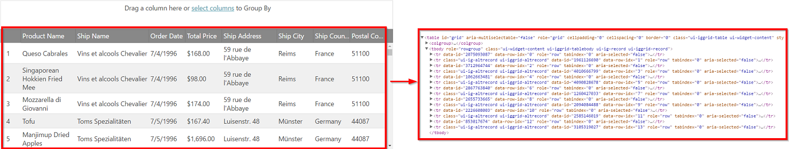

---
title: "仮想化の有効化と構成 (igGrid)"
slug: iggrid-enabling-and-configuring-virtualization
---

# 仮想化の有効化と構成 (igGrid)

## トピックの概要

### 目的

このトピックは、コード例を示して、`igGrid`™ で仮想化機能を有効化して構成する方法を説明します。

### このトピックの内容

このトピックは、以下のセクションで構成されます。

-   [**仮想化の構成 - 概要**](#configuring)
-   [**固定行の仮想化の有効化と構成**](#fixed-row)
    - [行の高さの構成](#fixed-row-configuring)
    - [固定行の仮想化の例](#fixed-row-example)
-   [**列の仮想化の有効化と構成**](#fixed-column)
	-   [列幅の構成](#fixed-configuring-rows-columns)
    -   [列仮想化の例](#fixed-column-example)
-   [**連続行の仮想化の有効化と構成**](#continuous)
    -   [プロパティ設定](#continuous-property-settings)
    -   [例](#continuous-example)
-   [**関連コンテンツ**](#related-content)
    -   [トピック](#topics)


## <a id="configuring"></a> 仮想化の構成 - 概要 

次の表は、仮想化機能の構成可能な設定をリストして、設定を管理するためのプロパティにマップします。

設定 | プロパティ | 説明
-------------------| ------------------- |----------- 
行仮想化|[rowVirtualization](&#123;environment:jQueryApiUrl&#125;/ui.iggrid#options:rowVirtualization)|行のみで仮想化を有効/無効にします。
列仮想化|[columnVirtualization](&#123;environment:jQueryApiUrl&#125;/ui.iggrid#options:columnVirtualization)|列仮想化を有効/無効にします。列仮想化は固定行仮想化に依存関係があり、明示的に有効されていない場合、暗示的に有効されます。
行仮想化および列仮想化|[virtualization](&#123;environment:jQueryApiUrl&#125;/ui.iggrid#options:virtualization)|単一のオプションにより `rowVirtualization` および `columnVirtualization` を設定します。
仮想化モード|[virtualizationMode](&#123;environment:jQueryApiUrl&#125;/ui.iggrid#options:virtualizationMode)|行仮想化モードを決定します。
平均の行の高さ|[avgRowHeight](&#123;environment:jQueryApiUrl&#125;/ui.iggrid#options:avgRowHeight)|固定行仮想化で使用されます。描画する行の数を計算するために使用されるピクセル単位の平均値を決定します。すべての行の高さは自動的にこの値に設定されます。
列の平均幅|[avgColumnWidth](&#123;environment:jQueryApiUrl&#125;/ui.iggrid#options:avgColumnWidth)|列仮想化で使用されます。これは列幅の平均値 (ピクセル単位) です。

## <a id="fixed-row"></a> 固定行の仮想化の有効化と構成

固定行仮想化は、`igGrid` コントロールの [`rowVirtualization`](&#123;environment:jQueryApiUrl&#125;/ui.iggrid#options:rowVirtualization) オプションを `true` に設定することで有効化します。

以下のオプションを設定する必要があります:

- [height](&#123;environment:jQueryApiUrl&#125;/ui.iggrid#options:height)
- [avgRowHeight](&#123;environment:jQueryApiUrl&#125;/ui.iggrid#options:avgRowHeight)

固定行仮想化を使用する場合、すべての行の高さは同じです。その高さは `avgRowHeight` オプションで設定されます。このオプションを計算する方法の詳細については、[「平均の行の高さの構成」](#fixed-row-configuring)セクションを参照してください。
注: 行の平均高さを正しく設定しないと、最後の行がグリッドから切り落とされる (表示されない) 可能性があります。

### <a id="fixed-row-configuring"></a> 平均の行高さの構成

固定仮想化の構成で重要な点として、`avgRowHeight` プロパティの値の決定プロセスがあります。`avgRowHeight` プロパティは、グリッドの表示行の平均高さを決定します。
このオプションの設定の一般則として、常に `avgRowHeight` をグリッドの高さの値で均等に分割できる値に設定します。 
デフォルトで、グリッドは "30px" の行の高さを設定しますが、テキストの折り返しのため、より大きい `avgRowHeight` 値を設定する場合があります。

例:

グリッド高さ: 600px => `avgRowHeight`: 30、または 15、または 60。


### <a id="fixed-row-example"></a> 固定行の仮想化の例

以下の表は、固定行仮想化を構成する方法を紹介します。

プロパティ|値
---|---
[rowVirtualization](&#123;environment:jQueryApiUrl&#125;/ui.iggrid#options:rowVirtualization)|true
[virtualizationMode](&#123;environment:jQueryApiUrl&#125;/ui.iggrid#options:virtualizationMode) (オプション)|"fixed" (デフォルト値)
[height](&#123;environment:jQueryApiUrl&#125;/ui.iggrid#options:height)|"600px"
[avgRowHeight](&#123;environment:jQueryApiUrl&#125;/ui.iggrid#options:avgRowHeight) (オプション)|"30px" (デフォルト値)

#### コード

次のコードで、例の設定を構成します。

**JavaScript の場合:**

```js
$("#grid1").igGrid({
        rowVirtualization: true,
        virtualizationMode: "fixed",
        height: "600px",
        avgRowHeight: "30px"
});
```

**ASPX の場合:**

```csharp
<%=Html.Infragistics().Grid(Model).ID("grid1")
    .LoadOnDemand(false)
    .AutoGenerateColumns(false)
    .AutoGenerateLayouts(false)
    .PrimaryKey("ProjectID")
    .Columns(column => 
    {
        column.For(x => x.ProjectID).HeaderText("ProjectID");
        column.For(x => x.Name).HeaderText("Name");
        column.For(x => x.StartDate).HeaderText("StartDate");
        column.For(x => x.EndDate).HeaderText("EndDate");
    })
    .Height("600px")
    .RowVirtualization(true)
    .VirtualizationMode(VirtualizationMode.Fixed)
    .AvgRowHeight("30px")
}).DataBind().Render() %>
```

以下のサンプルは固定仮想化を紹介します。

<div class="embed-sample">
    [仮想化 (固定)](&#123;environment:SamplesEmbedUrl&#125;/grid/virtualization-fixed)
 </div>

## <a id="fixed-column"></a> 列の仮想化の有効化と構成

列仮想化は、`igGrid` コントロールの [`columnVirtualization`](&#123;environment:jQueryApiUrl&#125;/ui.iggrid#options:columnVirtualization) オプションを `true` に設定することで有効化します。有効な場合、**固定行仮想化も有効にします**。

以下のオプションを設定する必要があります:

- [width](&#123;environment:jQueryApiUrl&#125;/ui.iggrid#options:width)
- [defaultColumnWidth](&#123;environment:jQueryApiUrl&#125;/ui.iggrid#options:defaultColumnWidth) または各列の列 [width](&#123;environment:jQueryApiUrl&#125;/ui.iggrid#options:columns.width)。
- [avgColumnWidth](&#123;environment:jQueryApiUrl&#125;/ui.iggrid#options:avgColumnWidth)
- [height](&#123;environment:jQueryApiUrl&#125;/ui.iggrid#options:height) (行仮想化の自動有効化のため)
- [avgRowHeight](&#123;environment:jQueryApiUrl&#125;/ui.iggrid#options:avgRowHeight) (行仮想化の自動有効化のため)

列の仮想化が有効な場合、表示列の幅の合計がグリッドの幅と等しい必要があります。等しい場合は、表示されているすべての列がビューポートで表示されます。
水平方向のスクロールバーの幅が正しく、最後の表示列までのスクロールを許可するには、`avgColumnWidth` オプションも計算し、設定します。
次のセクションは `avgColumnWidth` オプションを計算する方法を説明します。

### <a id="fixed-configuring-columns"></a> 列の平均幅の構成

`avgColumnWidth` オプションは、グリッドで定義される列の平均幅を決定します。このオプションを現在のグリッド構成にある列の平均幅にピクセル単位で設定します。

例:

グリッドの幅: 300px、4 列の幅の例: 100px, 200px, 100px, 200px => `avgColumnWidth`: 150


### <a id="fixed-column-example"></a> 列仮想化の例

以下の表は、列仮想化を構成する方法を紹介します。

プロパティ|値
---|---
[columnVirtualization](&#123;environment:jQueryApiUrl&#125;/ui.iggrid#options:columnVirtualization)|true
[virtualizationMode](&#123;environment:jQueryApiUrl&#125;/ui.iggrid#options:virtualizationMode) (オプション)|"fixed" (デフォルト値)
[width](&#123;environment:jQueryApiUrl&#125;/ui.iggrid#options:width)|"400px"
[defaultColumnWidth](&#123;environment:jQueryApiUrl&#125;/ui.iggrid#options:defaultColumnWidth) |"200px"
[avgColumnWidth](&#123;environment:jQueryApiUrl&#125;/ui.iggrid#options:avgColumnWidth)|"200px"
[height](&#123;environment:jQueryApiUrl&#125;/ui.iggrid#options:height)|"600px"
[avgRowHeight](&#123;environment:jQueryApiUrl&#125;/ui.iggrid#options:avgRowHeight) (オプション)|"30px" (デフォルト値)

>**注:** `defaultColumnWidth` の代わりに各列に指定した幅を定義できます。

#### コード

次のコードで、例の設定を構成します。

**JavaScript の場合:**

```js
$("#grid1").igGrid({
        columnVirtualization: true,
        width: "400px",
        height: "600px",
        defaultColumnWidth: "200px",
        avgColumnWidth: "200px",
        avgRowHeight: "30px"        
});
```

**ASPX の場合:**

```csharp
<%=Html.Infragistics().Grid(Model).ID("grid1")
    .LoadOnDemand(false)
    .AutoGenerateColumns(false)
    .AutoGenerateLayouts(false)
    .PrimaryKey("ProjectID")
    .Columns(column => 
    {
        column.For(x => x.ProjectID).HeaderText("ProjectID");
        column.For(x => x.Name).HeaderText("Name");
        column.For(x => x.StartDate).HeaderText("StartDate");
        column.For(x => x.EndDate).HeaderText("EndDate");
    })
    .Width("400px")
    .Height("600px")
    .DefaultColumnWidth("200px")
	.ColumnVirtualization(true)
    .AvgRowHeight("30px")
    .AvgColumnWidth("200px")
}).DataBind().Render() %>
```

グリッド ビューポートでは一度に 2 列のみ描画されます。

## <a id="continuous"></a> 連続仮想化の有効化と構成

igGrid コントロールの [rowVirtualization](&#123;environment:jQueryApiUrl&#125;/ui.iggrid#options:rowVirtualization) オプションを `true` に設定し、[virtualizationMode](&#123;environment:jQueryApiUrl&#125;/ui.iggrid#options:virtualizationMode) を "continuous" にすることで、仮想化が継続的になります。

以下のオプションを設定する必要があります:

- [height](&#123;environment:jQueryApiUrl&#125;/ui.iggrid#options:height)

> **注:** 列仮想化は連続仮想化でサポートされていません。

### <a id="continuous-example"></a> 例

次の表は、行の高さが 400 ピクセルの行と列に対し、継続的な仮想化を設定する方法を示します。

プロパティ|値
---|---
[rowVirtualization](&#123;environment:jQueryApiUrl&#125;/ui.iggrid#options:rowVirtualization)|true
[virtualizationMode](&#123;environment:jQueryApiUrl&#125;/ui.iggrid#options:virtualizationMode)|"continuous"
[height](&#123;environment:jQueryApiUrl&#125;/ui.iggrid#options:height)|"400px"




#### コード
次のコードで、例の設定を構成します。

**JavaScript の場合:**

```js
$("#grid1").igGrid({
        rowVirtualization: true,
        virtualizationMode: "continuous",
        height: "400px"
});
```

**ASPX の場合:**

```csharp
<%=Html.Infragistics().Grid(Model).ID("grid1")
    .LoadOnDemand(false)
    .AutoGenerateColumns(false)
    .AutoGenerateLayouts(false)
    .PrimaryKey("ProjectID")
    .Columns(column => 
    {
        column.For(x => x.ProjectID).HeaderText("ProjectID");
        column.For(x => x.Name).HeaderText("Name");
        column.For(x => x.StartDate).HeaderText("StartDate");
        column.For(x => x.EndDate).HeaderText("EndDate");
    })
    .RowVirtualization(true)
    .VirtualizationMode(VirtualizationMode.Continuous)
    .Height("400px")
    .DataBind().Render()
 %>
```

以下のサンプルは連続仮想化を紹介します。

<div class="embed-sample">
   [仮想化 (連続)](&#123;environment:SamplesEmbedUrl&#125;/grid/virtualization-continuous)
</div>

## <a id="related-content"></a> 関連コンテンツ

### <a id="topics"></a> トピック

このトピックに関連する追加情報については、以下のトピックを参照してください。

- [仮想化の概要](/iggrid-virtualization-overview): このトピックは、`igGrid` コントロールの仮想化機能を紹介します。
- [機能互換性マトリックス (igGrid)](/feature-compatibility-matrix(iggrid)).mdx):このトピックは、`igGrid` の機能を同時に有効にした場合の機能間の互換性を示しています。