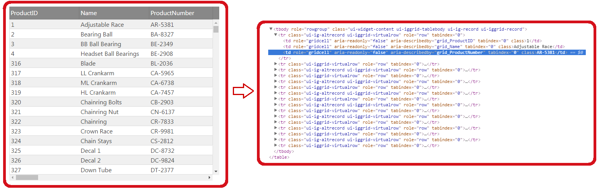
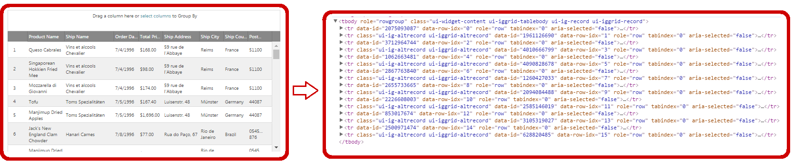

# 仮想化概要 (igGrid)

## このトピックの内容

このトピックは、以下のセクションで構成されます。

-   [**概要**](#introduction)
-   [**サポートされる仮想化のタイプ**](#supported_virtualization_types)
	-   [固定行の仮想化](#fixed-row)
	-   [列の仮想化](#column)
	-   [連続行の仮想化](#continuous)
-   [**キーボード操作**](#keyboard-interactions)
-   [**関連コンテンツ**](#related-content)
    -   [トピック](#topics)

##  概要

仮想化は、数千レコードを含むデータ セットの表示においてパフォーマンスを向上する `igGrid` の機能です。描画時間、スクロール、そしてメモリ使用量を最適化します。インメモリ DOM オブジェクトの数を減らし、ユーザーがデータをスクロールし操作しているときにオブジェクトを再利用します。 

仮想化はローカル機能で、最初にクライアント側ですべてのデータを読み込む必要があります。これがネットワーク トラフィックに影響するため、仮想化が有効な `igGrid` を含む web ページで Web サーバーの Gzip 圧縮を有効にすることを推薦します。仮想化は、1000 ～ 10000 のレコードを処理する場合に便利です。一度にデータ セット全体をクライアントで読み込まない場合は、代わりにリモート ページングを使用してください。

スクロールのパフォーマンスがグリッドの `height` および列数により影響されます。より大きいグリッド `height` の場合、表示されているレコードが多く、新しいデータを再描画する時間がかかります。セルの再描画がブラウザー UI をブロック化するため、スクロール パフォーマンスが低下する場合があります。グリッド `height` 設定を変更し、アプリケーションで適切なパフォーマンスを確認します。

仮想化機能はデフォルトの仮想化されていないグリッドと機能の互換性はありません。たとえば、DOM オブジェクトを承諾または返すすべての API は仮想化されていないグリッドと同様には動作しません。表示されているセルのみの DOM オブジェクトがあるためです。 

> **注**: 仮想化機能は、仮想化されていないグリッドの機能のサブセットをサポートするため、パフォーマンスが必要で、リモート ページングなどのその他のパフォーマンスを向上する機能が適切ではない特定のシナリオのみに使用します。

`igGrid` は行と列の 2 つの仮想化タイプをサポートします。行仮想化が固定または連続モードで操作できます。以下のセクションで説明されます。

## サポートされる仮想化のタイプ

次は、`igGrid` コントロールによってサポートされる仮想化タイプの簡単な説明です。

- [固定行の仮想化](#fixed-row): 表示される行のみグリッドに描画されます。
- [列仮想化](#column): 表示される列のみグリッドに描画されます。
- [連続行の仮想化](#continuous): あらかじめ決められた数の行がグリッドに描画されます。

###  固定行の仮想化 

固定行仮想化で、表示行のみがグリッドに描画されます。この描画される行は、ユーザーがグリッドをスクロールするときに別のデータを表示するために再使用されます。

連続行仮想化と違い、固定行仮想化が列仮想化をサポートします。

固定行仮想化との組み合わせで動作するグリッド機能のリストについては、[機能互換性マトリックス (igGrid)](/feature-compatibility-matrix(iggrid)).mdx) を参照してください。

左に示した図は、500 レコードが読み込まれたグリッドを示します。右に示した図は、仮想化されたグリッドをサポートするために DOM 内に存在する実際の HTML 表要素を示します。

**関連トピック:**

-   [仮想化の有効化と構成 (固定)](/iggrid-enabling-and-configuring-virtualization#fixed-row)

###  列仮想化 

列の仮想化で、表示可能な列のみがグリッドに描画されます。
ユーザーがグリッドで水平方向にスクロールすると表示している列が更新され、関連する DOM 要素は新しく表示しているデータの列データを表示するために再利用されます。

列仮想化は固定行仮想化に依存関係があり、明示的に有効化されていない場合、暗示的に有効化されます。

水平方向のスクロールでコンテンツが列間で移動されますが、表示可能な列幅が変更されないため、列幅を設定してもほとんど効果がありません。

列仮想化との組み合わせで動作するグリッド機能のリストについては、[機能互換性マトリックス (igGrid)](/feature-compatibility-matrix(iggrid)).mdx) を参照してください。

左に示した図は、クライアントで 25 列、500 レコードがロードされたグリッドを示します。右に示した図は、仮想化されたグリッドをサポートするために DOM 内に存在する実際の HTML 表要素を示します。

**関連トピック:**

-   [仮想化の有効化と構成 (列)](/iggrid-enabling-and-configuring-virtualization#column)

###  連続行の仮想化 

連続仮想化では、定義済みの行数が使用されるため、DOM にレンダリングされた行がビューポートには表示されないことがあります。　ユーザーが垂直方向にスクロールすると、仮想化は現在描画されている行が次の/前のレコードのチャンクを表示するのに十分かどうかを判断します。そうでない場合、現在の行のチャンクが破棄され、必要なレコードのチャンクが読み込まれます。スクロールの後に表示する行を決定するために、仮想化は平均行の高さを計算します。ただし、この平均行の高さは、すべての利用可能な行ではなく、現在描画されている行に基づく計算であるため、予測値にすぎません。ここから、スクロールされるたびに、表示される行が推定されます。そのため、スクローラーが最上部または最下部にある時にはスクローラー位置を誤る可能性があります。仮想化は、各スクロール後にチェックをし、必要に応じてスクローラーの位置を修正します。

固定行仮想化と比べて、連続行仮想化はグリッド機能との統合が優れており、構成しやすく、さまざまな行の高さをよりよく処理します。

連続行仮想化と操作するグリッド機能のリストについては、[機能互換性マトリックス (igGrid)](/feature-compatibility-matrix(iggrid)).mdx) を参照してください。

左に示した図は、1 クライアントに関して 500 レコードがロードされたグリッドを示します。右に示した図は、仮想化されたグリッドをサポートするために DOM 内に存在する実際の HTML 表要素を示します。

> **注**: 連続仮想化は、ほとんどの `igGrid` 機能でサポートされるため、仮想化モードとしての選択が推薦されます。ただし、列仮想化をサポートしないため、列仮想化が必要な場合、固定仮想化を使用してください。

**関連トピック:**

-   [仮想化の有効化と構成 (連続)](/iggrid-enabling-and-configuring-virtualization#continuous)

### キーボード操作

仮想化が有効でマウスががグリッド上にある場合、以下のキー操作が可能です。

- UP/DOWN: コンテナーを上または下へスクロール。

##  関連コンテンツ

###  トピック

このトピックに関連する追加情報については、以下のトピックを参照してください。

- [仮想化を有効にし、構成する](/iggrid-enabling-and-configuring-virtualization): このトピックでは、コード例と共に、`igGrid` 内の仮想化機能を有効化し構成する方法について説明します。
- [パフォーマンス ガイド](/iggrid-performance-guide): このトピックは、パフォーマンスを向上するグリッド設定の詳細を説明します。
- [機能互換性マトリックス (igGrid)](/feature-compatibility-matrix(iggrid)).mdx):このトピックは、`igGrid` の互換性のある機能組み合わせを表示します。
- [IIS HTTP 圧縮](https://www.iis.net/configreference/system.webserver/httpcompression?showTreeNavigation=true)
- [Apache で圧縮を有効にする](http://httpd.apache.org/docs/current/mod/mod_deflate.html#enable)

 

 

