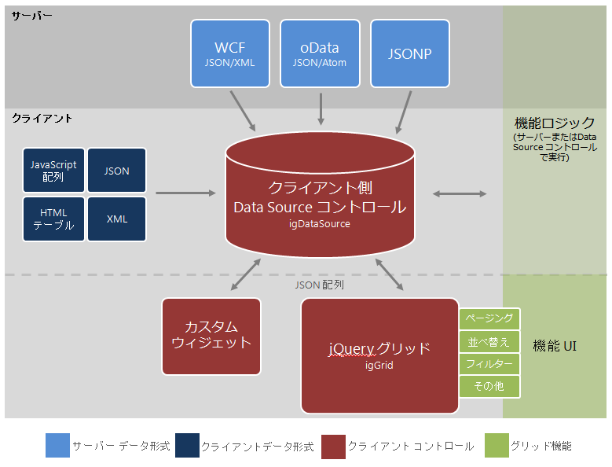

---
title: "igGrid/igDataSource アーキテクチャの概要"
slug: iggrid-igdatasource-architecture-overview
---

# igGrid/igDataSource アーキテクチャの概要

### このトピックの内容

このトピックは、以下のセクションで構成されます。

-   [概要](#overview)
-   [データソース コントロール](#data-source-control)
-   [グリッド コントロール](#grid-control)
-   [構成](#configuration)
-   [機能](#features)
-   [依存関係](#dependencies)
-   [外部参照](#external-references)
-   [関連コンテンツ](#related-content)


## <a id="overview"></a>概要

&#123;environment:ProductName&#125;™ グリッド、つまり `igGrid`™ は JavaScript、HTML、および CSS で完全にビルドされたクライアント側グリッド コントロールです。このコントロールのクライアント特有の性質によりサーバー側の技術に関係なく、PHP、Ruby on Rails®、Java™、Python™、Microsoft® ASP.NET™ などでビルドされ、アプリケーションとシームレスに相互作用を行うことができます。

グリッドはモジュール アーキテクチャを使用して構築されており、データ ソースとオプション機能は論理的にグリッド コントロールとは分離しています。プレゼンテーションのロジックが分離していることで、関連付けられたデータ ソース コントロールがページング、並べ替え、フィルタリングなどの機能の処理を引き受けることができます。一方、グリッド自体はプレゼンテーションの詳細にのみ関係します。グリッドがこのモジュール構造でビルドされている一方、まずデータ ソース、次にグリッドを設定する必要はありません。グリッド コントロールのパブリック インターフェイスを介してデータ ソースを簡単に構成できます。

> **注:** このコンテキストのグリッド「機能」は、ページング、並べ替え、フィルタリング、および他の類似のインタラクティブ属性などのグリッド コントロールの一般特性として定義されます。これらの機能のほとんどはブラウザーで実行される場合が多いのですが、データ ソース コントロールはサーバーにメッセージを送信して、サーバー側の処理に対応することができます。詳細については、以下の「機能」のセクションを参照してください。

グリッドの機能はモジュールで追加され、関連付けられたスクリプトとスタイル シート ファイルは必要な場合のみ、クライアントにオンデマンドで提供されます。グリッド自体は、どのグリッド機能にも依存していません。

グリッドは jQuery UI 基本ウィジェットを拡張し、すべてのグリッド機能も jQuery ウィジェットとして実装されます。基本グリッド コードは `ig.ui.grid.framework.js` (これは結合されていないスクリプト インタスタンスのファイル名です) に実装されています。このスクリプト ファイルには、グリッドの次のビルディング ブロックのコードが含まれています。

-   `igGrid` ウィジェット コード
-   仮想化サポート
-   スクロール サポート
-   描画エンジン
-   クライアント側イベント
-   オプション処理
-   列作成エンジン
-   ディメンション計算機 (高さおよび幅)
-   基本スタイル設定

グリッドは、グリッドにマークアップを注入するためサブスクライブし、使用しているイベントを発行することで、異なるモジュールと通信します。さらに、各機能はグリッド イベントを使用しながら、グリッド API およびオブジェクト モデルにフル アクセスできます。

図 1 は、上位レベルからのグリッド アーキテクチャを示します。クライアント側データ ソース コントロール、つまり `igDataSource`™ はグリッドのコア機能の中心にあります。データは、クライアントまたはサーバーのいずれかからデータ ソースに入り、データ ソース コントロールは、最終描画の処理と準備のためデータをグリッドに公開します。オプション機能がグリッドに追加されると、その論理部分は自動的にデータ ソース コントロールに追加され実行されます。機能のロジックは、データ ソース コントロールの構成方法に応じて、クライアントまたはサーバーで実行できます。



図 1: Infragistics jQuery グリッド アーキテクチャのレイアウト

> **注:** グリッドを取り巻くアーキテクチャが切断されているため、`igDataSource` コントロールを使用してデータ処理する独自のカスタム ウィジェットを開発することもできます。


## <a id="data-source-control"></a>データ ソース コントロール

すでに説明したように、クライアント側のデータ ソースは、グリッドなどクライアント側のデータ バインドされたコンポーネントと実際のデータ ソース間の仲介レイヤーとしての役割を果たします。`igGrid` コントロールと違い、データ ソース コントロールはウィジェットまたは jQuery プラグインではなく、単純な JavaScript クラスとして実装されています。コントロールをそれぞれクラスに構成するには [John Resig](http://ejohn.org/blog/simple-javascript-inheritance/) の単純な継承アプローチを使用します。

#### データ ソース コントロールでは次のデータ形式がサポートされています。

-   サーバー データ (Web サービス)
    -   [REST GET](http://ja.wikipedia.org/wiki/REST)
    -   [WCF REST (JSON & XML)](http://ja.wikipedia.org/wiki/Windows_Communication_Foundation)
    -   JSONP サービス
    -   任意の REST サービス
-   ローカル データ
    -   JSON
    -   XML
    -   JavaScript オブジェクト配列
    -   XML または JSON の文字列
    -   上記の任意の形式のデータを返す JavaScript 関数
    -   既存の HTML 構造 (データの入った HTML テーブルなど)
        -   クライアント側データ ソースは、このデータを抽出し、データを管理します。
-   マッシュアップ シナリオ (`$.ig.MashupDataSource` 拡張子を使用して複数のフラットなデータ ソースの組み合わせを実現するなど)

このアーキテクチャにより、特定の目的を果たすデータ ソースの拡張子を簡単に作成できます。これらのケースの例は、基本データ ソース コントロールを拡張する次のクラスで構成されています。

-   ***$.ig.MashupDataSource***
    -   `dataSource` プロパティは、基点がローカルまたはリモートのサポートされているデータ形式の配列を受け取ります。これらのデータ形式を組み合わせて、プライマリ キーと外部キーの関係を使用してマッシュアップ シナリオを実現しています。
-   ***$.ig.JSONDataSource***
    -   このクラスは特に [JSON](http://ja.wikipedia.org/wiki/JavaScript_Object_Notation) データを処理するようあらかじめ構成されています。
-   ***$.ig.XMLDataSource***
    -   このクラスは特に [XML](http://ja.wikipedia.org/wiki/Extensible_Markup_Language) データを処理するようあらかじめ構成されています。

> **注:** 上記に一覧されたコントロールは、&#123;environment:ProductName&#125; データ ソース JavaScript ライブラリに組み込まれています。

また、高度にカスタマイズされたデータ バインド機能を実現するため、データ ソース コントロールを拡張してそのいずれかの実装をオーバーライドできます。リスト 1 は基本データ ソースを拡張して、JSON データを処理するオプションをあらかじめ構成する方法を示しています。

**リスト 1**: JSON データを処理するオプションを事前設定するための `igDataSource` の拡張 

**JavaScript の場合:**

```js
$.ig.JSONDataSource = $.ig.DataSource.extend({
    init: function (options) {
        if (!options) {
            options = {};
        }
        // set the type to 'json' so you don’t have to explicitly set it later
        options.type = "json";
        this._super(options);
        return this;
    },
});
```

リスト 2 は、Ajax ではなく [Web Sockets](http://en.wikipedia.org/wiki/WebSockets) を使用するようカスタマイズされたデータ ソースを実装する多少複雑な例を示し、データ ソース アーキテクチャの柔軟性を示してます。

**リスト 2**: Web ソケットと相互作用するための `igDataSource` の拡張

**JavaScript の場合:**

```js
(function ($) {
    $.ig.WebSocketsDataSource = $.ig.DataSource.extend({
        
        init: function (options) {
            
            options.responseDataType = "json";
            options.responseContentType = "json";
            options.type = 'remoteUrl';
            this._super(options);
            return this;
        },
        // use the HTML5 WebSockets API here instead of calling $.ajax 
        _processRequest: function (options) {
            if(!("WebSocket" in window)) {
                throw new Error("Sorry, the build of your browser does not support WebSockets. Please use latest Chrome or Webkit nightly.");
            }
            //options.dataSource is the one to initiate the connection to
            var ws = new WebSocket(options.url);
            this.context = this;
            ws.onmessage = $.proxy(this._dataFilter, this);
        },
        _dataFilter: function (evt, type) {
            var resp = this._super(JSON.parse(evt.data), "json");
            if (this.settings.responseBehavior === "append") {
                this._data.push(resp);
                this._dataView.push(resp); 
            } else {
                this._data = [resp];
                this._dataView = [resp];
            }
            this._completeCallback();
        }
    });
}(jQuery));
```

## <a id="grid-control"></a>グリッド コントロール
データ ソース コントロールの目的がデータの処理と管理である場合、グリッド コントロールは主にデータのユーザー インターフェイス レイヤーとしての役割を果たします。データ ソース コントロールにより発行されたイベントに応答する際、グリッドはデータへバインドを行い、JavaScript の必要な DOM 要素を生成して UI を作成します。機能が追加されると、グリッドはそれらの機能で発行されたイベントを使用して、データ ソース アクションに対してさらに UI をカスタマイズします。

```js
var igDs = $('#grid1').data('igGrid').dataSource;
```

## 構成

グリッドは、標準 jQuery プラクティスにしたがって JSON オブジェクトをパラメーターとして渡すことで構成されます。オプション パラメーターの扱い方についての詳細は、[「jQuery UI ウィジェットの処理」](http://wiki.jqueryui.com/w/page/12137708/How%20to%20use%20jQuery%20UI%20widgets)を参照して、jQuery UI ウィジェットの一般的な使用方法に慣れてください。

## <a id="features"></a>機能

グリッド機能は、リスト 3 で示すように、JSON オブジェクトをグリッド パラメーターとして提供することでグリッド初期化中に宣言されます。

**リスト 3**: JSON オブジェクト パラメーターによる `igGrid` コントロールの構成


**JavaScript の場合:**

```js
$("#grid2").igGrid({
dataSource: "/server.php",
columns: [ "<columns definitions>" ],
features: [
    {
        name: "Paging",
        type: "local",
        pageSize: 10
    },
    {
        name: "Sorting",
        type: "local",
        caseSensitive: true,
        columnSettings: [
            {columnKey: "ProductID", allowSorting: true}
        ]
    }
]
});
```

グリッドがいったん jQuery UI Framework でインスタンス化されたら、次に選択されたすべての機能を解析し、適用します。グリッドは機能ごとに内部 jQuery UI ウィジェットをインスタンス化することで開始され、グリッドが元々バインドされていた要素にバインドされます。初期化と作成が終わったら、グリッドのインスタンスを介して任意の機能とそれに関連付けられた API にアクセスできます。

リスト 4 は機能オプションのアクセス方法を示しています。この場合、グリッドの現在のインスタンスから並べ替えを行っています。

**リスト 4**: グリッドから直接機能インスタンスへのアクセス

**JavaScript の場合:**

```js
var sortingObject = $("#grid1").data("igGridSorting");
``` 

リスト 5 は機能 API の操作方法を示しています。最初の例は、並べ替えの大文字小文字の区別を有効にする方法を示しているのに対して、2 つ目の例はデータへの単純な並べ替えを実行しています。

**リスト 5**: 機能 API メンバーの処理

**JavaScript の場合:**

```js
// changes the case sensitive option of the sorting feature. This options works only for local sorting.
$("#grid1").igGridSorting("option", "caseSensitive", true);

// sorts a column
$("#grid1").igGridSorting("sortColumn", … ) ; 
```


## <a id="dependencies"></a>依存関係

`igGrid` コントロールは jQuery ウィジェットとしてビルドされているため、 jQuery UI だけでなく jQuery コア アライブラリに依存しています。特定のバージョンの jQuery UI は必要ではないですが、最適な結果を得るために、次のバージョンを推奨します。 

### 依存しているスクリプトのバージョン

-   jQuery 3.1.1
-   jQuery UI 1.12.*
    
    > **注:** jQueryTemplating を true に設定して jQuery テンプレートを有効にする場合、jquery-tmpl JavaScript ライブラリをアプリケーションに組み込む必要があります。このライブラリーは [https://github.com/jquery/jquery-tmpl](https://github.com/jquery/jquery-tmpl) からダウンロードできます。

## <a id="external-references"></a>外部参照

-   [jQuery UI](http://jqueryui.com/)
-   [jQuery UI - はじめに](http://docs.jquery.com/UI/Getting_Started)
-   [jQuery Themeroller](http://jqueryui.com/themeroller/)
-   [jQuery UI のテーマ設定](http://docs.jquery.com/UI/Theming)
-   [jQuery UI CSS Framework](http://docs.jquery.com/UI/Theming/API)

## <a id="related-content"></a> 関連コンテンツ

### <a id="topics"></a> トピック

-   [パフォーマンス ガイド (igGrid)](/iggrid-performance-guide)
-   [igGrid のスタイル設定](/iggrid-styling-and-theming)
-   [&#123;environment:ProductName&#125; のスタイル設定とテーマ設定](/deployment-guide-styling-and-theming)

 

 


