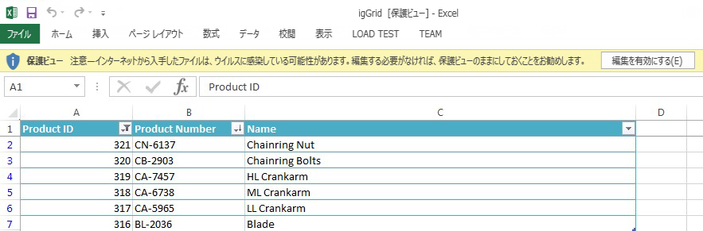

import ApiLink from 'docs-template/components/mdx/ApiLink.astro';

# Grid Excel エクスポーターの概要
`igGridExcelExporter` コンポーネントにより、`igGrid` から Microsoft Excel ドキュメントにデータをエクスポートできます。エクスポートは、テーマとワークブックのカスタマイズをサポートし、並べ替え、フィルタリング、ページングなどの機能によりグリッドで操作されたデータを反映します。以下のスクリーンショットは、エクスポートされた `igGrid` が Excel でどのように表示されるかを示しています。

 

`igGridExcelExporter` には以下の特徴があります。  

 - 全体のテーマのサポート
 - ファイル名とワークシート名の定義をサポート
 - Excel での表スタイルの定義をサポート
 - `igGrid` のフィルタリング、非表示、ページング、並べ替え、集計、および列固定機能のデータおよびレイアウト操作のリフレクションをサポートします。
 - `igGrid` のヘッダーと代替行スタイルをサポート
 - スキップする `igGrid` 列およびフィルター適用しない列の定義をサポートします。
 - `igHierarchicalGrid` からすべてのサブレベル データのエクスポート、または展開された行の下のデータのみのエクスポートをサポートします。
 - エクスポート処理全体でコールバック (イベント) を提供

## 前提条件
- [&#123;environment:ProductName&#125; の概要](/igniteui-for-jquery-overview) - &#123;environment:ProductName&#125;™ ライブラリについての一般的情報。  
- [igGrid の概要](/iggrid-overview) - `igGrid` コントロールについての一般的情報。

## 依存関係

`igGridExcelExporter` は Infragistics JavaScript Excel ライブラリに依存関係があるため、ライブラリの js ファイルおよび `igGridExcelExporter` js ファイルへの参照を追加する必要があります。

```html
<script src="igniteui/js/infragistics.core.js"></script>
<script src="igniteui/js/infragistics.lob.js"></script>
<script src="igniteui/js/infragistics.excel-bundled.js"></script>
<script src="igniteui/js/modules/infragistics.gridexcelexporter.js" type="text/javascript"></script>
```

または、すべての必要な `igGrid` および `igGridExcelExporter` リソースを読み込む `igLoader` を使用します。

```javascript
$.ig.loader({
    scriptPath: "http://localhost/igniteui/js/",
    cssPath: "http://localhost/igniteui/css/",
    resources:'igGrid,' + 'igGridExcelExporter'
});
```

`igGridExcelExporter` にも以下のオープン ソース ライブラリの依存関係があります。

- [FileSaver.js](https://github.com/eligrey/FileSaver.js/): W3C `saveAs` 仕様の polyfill
- [Blob.js](https://github.com/eligrey/Blob.js/): W3C [`Blob`](https://developer.mozilla.org/en-US/docs/Web/API/Blob) インターフェイスの polyfill
  
ページにこのライブラリへの参照も追加します。

```html

<script src="/scripts/lib/FileSaver.js"></script>
<script src="/scripts/lib/Blob.js"></script>
```
  
## igGrid での igGridExcelExporter の使用
エクスポーターの `exportGrid` 静的メソッドにグリッドのインスタンスを渡すことにより、グリッドのコンテンツ全体をエクスポートできます。 

```javascript
$.ig.GridExcelExporter.exportGrid(
    $('#grid'),
    { 	
        fileName: 'igGrid',
        worksheetName: 'Sheet1',
    },
    {
        success: function() {
            alert("exporting has finished!")
        }
    }
);
```
`exportGrid` メソッドは引数として 3 つのオブジェクトを受けます - `igGrid` インスタンス、ユーザー設定オブジェクト (ファイルおよびワークシート名などを含む)、およびイベントのコールバックを含むユーザー コールバック オブジェクト。

> **注:**: エクスポーターに対する唯一の必須引数はグリッドのインスタンスです。他のプロパティはすべて、明示的に値が提供されていない場合、デフォルトが使用されます。

エクスポーターで使用可能なすべてのプロパティの詳細は、 <ApiLink pkg="ig" type="gridexcelexporter" label="API ヘルプ" /> を参照してください。

### <a id="Preview"></a>プレビュー
以下は最終結果のプレビューです。

<div class="embed-sample">
   [&#123;environment:SamplesEmbedUrl&#125;/grid/export-basic-grid](&#123;environment:SamplesEmbedUrl&#125;/grid/export-basic-grid)
</div>

## 関連コンテンツ

### トピック
- [JavaScript Excel ライブラリの使用](../../09_JavaScript Excel Library/01_Using/~Using_The_JavaScript_Excel_Library.mdx)
- [JavaScript Excel ライブラリの概要](../../09_JavaScript Excel Library/00_Understanding/JavaScript_Excel_Library_Overview.mdx)

### <a id="samples"></a> サンプル

-   [基本グリッドを Excel にエクスポート](&#123;environment:SamplesUrl&#125;/grid/export-basic-grid)
-   [機能とグリッドを Excel へエクスポート](&#123;environment:SamplesUrl&#125;/grid/export-feature-rich-grid)
-   [グリッド Excel エクスポートのカスタマイズ](&#123;environment:SamplesUrl&#125;/grid/export-client-events)
-   [進行状況インジケーターとグリッドを Excel へエクスポート](&#123;environment:SamplesUrl&#125;/grid/export-grid-loading-indicator)
