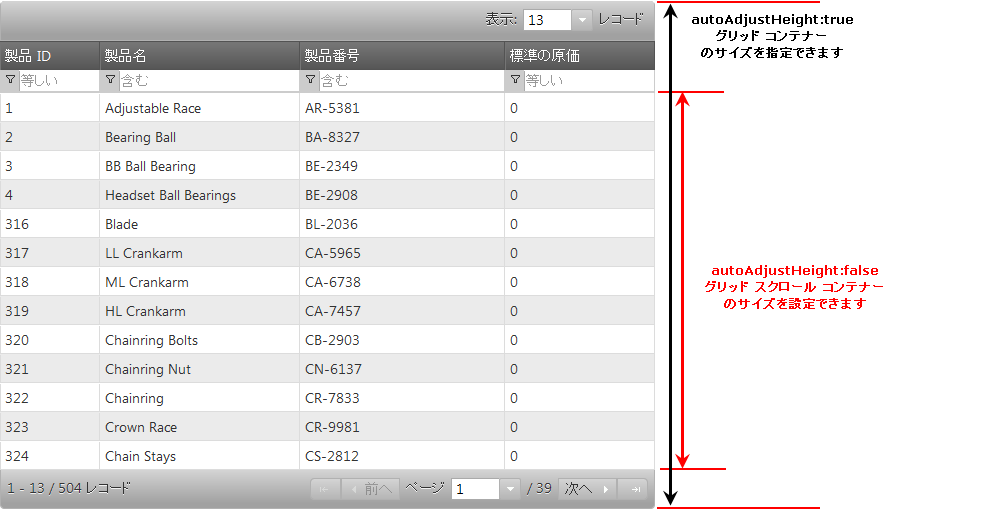

---
title: "パフォーマンス ガイド (igGrid)"
slug: iggrid-performance-guide
---

# パフォーマンス ガイド (igGrid)

## このトピックの内容

このトピックは、以下のセクションで構成されます。

-   [**概要**](#overview)
-   [**描画と再描画**](#rendering)
-   [**データ バインディング**](#data-binding)
-   [**データの書式設定**](#data-formatting)
-   [**グリッドの機能**](#grid-features)
-   [**機能の有効化/無効化 (初期機能のセットアップと描画)**](#toggle-features)
-   [**パフォーマンスに関連するウィジェット プロパティ (オプション)**](#options)
	-   [仮想化 (デフォルト: False)](#options-virtualization)
	-   [Infragistics Templating Engine (columns.template)](#options-column-template)
	-   [autoAdjustHeight (デフォルト: True)](#options-auto-height)
	-   [autoFormat (デフォルト: “date”)](#options-auto-format)
	-   [alternateRowStyles (デフォルト: True)](#options-alt-row)
-   [**機能特定のプロパティ**](#features)
	-   [mode (フィルタリング) (デフォルト: simple)](#filter-mode)
	-   [applySortedColumnCss (並べ替え) (デフォルト: true)](#sorting-style)
-   [**ベスト プラクティス**](#best-practices)
-   [**関連コンテンツ**](#related-content)
    -   [トピック](#topics)

##  概要

&#123;environment:ProductName&#125;® `igGrid` は、デフォルトのままでも非常に優れたパフォーマンスを提供します。特殊なケースでは、設定をデフォルトから変更することで、(機能を犠牲にせずに) グリッドのパフォーマンスがさらに向上します。 

グリッドのパフォーマンスを微調整する方法について学ぶ前に、まず、グリッドの基本的なビルディング ブロックについて理解しましょう。

##  描画と再描画

グリッドの描画のライフサイクルの多くはクライアント上にあるため、処理のオーバーヘッドの大部分はデータの描画と再描画によるものです。描画とは、データ ソース値から HTML マークアップを生成し、このマークアップを HTML データ テーブルに追加することです。データが描画され、(明示的な API 呼び出し、または UI を介した並べ替え/フィルタリング操作などの再バインドのソースに関係なく) グリッドがそれ自体を再バインドする必要がある場合、グリッドの既存コンテンツをクリアしなければなりません。

グリッドをクリアするとき、DOM ツリーから DOM 要素を削除する前に、各 DOM 要素に関連付けられたデータ、バインドされたイベント、または設定された参照を注意深く削除する必要があります。このクリーンアップ処理は、パフォーマンスに影響する一連の操作を伴います。これについては以下で詳しく説明します。

さらに、グリッドは 2 つの描画モードをサポートしています。1 つはカスタムのハイパフォーマンス描画モードで、もう 1 つのモードは、Infragistics Templating Engine を使用します。

> **注:** カスタム列テンプレートが必要な場合、Infragistics Templating Engine は必須です。

##  データ バインディング

データ バインディングによって余分なオーバーヘッドが増えますが、パフォーマンスへの影響は無視できます。最新のブラウザーにはネイティブの JSON 解析機能が備わっています。これは、すべての JSON 解析、トラバーサル、変換が全処理時間のごく一部で処理されることを意味します。

##  データの書式設定

そのままではユーザー向けの描画に適さないデータ値がデータ ソースに含まれている場合、より適切に表示できるようにデータを書式設定する必要があります。`igGrid` コントロールには、数値と日付の両方で使用可能な書式文字列 (パターン) が数多く含まれています。

##  グリッドの機能

フィルタリング、ページング、並べ替えなどのグリッドの機能は、グリッドのパフォーマンスに影響を与えます。フィルタリングや並べ替えなどの操作における処理時間とメモリのオーバーヘッドは、3 つの部分に分解できます。

-   ビジネス ロジックの実行 (データの並べ替えまたはフィルタリングなど)
-   グリッド内の既存レコードのクリア
    -   この操作は、メモリ リークを避けるために適切に実行する必要があり、負荷の原因になる可能性があります。
-   グリッドへの新しいレコードの描画

##  機能の有効化/無効化 (初期機能のセットアップと描画)

パフォーマンスへの影響度は機能により差があります。この違いが生じる理由は、一部の機能が UI 要素を追加するため、初期化時のシーンの背後で余分な処理が必要になるからです。たとえば、ヘッダー インジケーターの並べ替えや行全体のフィルタリング (mode=”simple” のとき) などが初期化中に作業を必要とする機能です。ただし、パフォーマンスへの悪影響は、通常、グリッドの描画/再描画に必要な全処理時間のごく一部です。

以下のセクションでは、各 `igGrid` ウィジェット オプションとそれらのパフォーマンスへの影響を詳しく説明します。

##  パフォーマンスに関連するウィジェット プロパティ (オプション)

**注:** 以下の説明では、パフォーマンスへの影響度を直接反映した順序でプロパティを並べています。最初に挙げてあるオプションほどパフォーマンスに大きな影響があります。

###  仮想化 (デフォルト: False)

仮想化は `igGrid` コントロールの特徴的な機能で、簡単に言うと、グリッドのうちユーザーに見える部分のみを描画する機能です。ユーザーがグリッドをスクロールすると、既存の DOM 要素を再利用します。グリッドがスクロールしてさらにデータを表示するとき、新しいデータがリアルタイムでグリッドに追加されます。ここでの「リアルタイム」とは、最初の描画時に表示されたデータだけでなくすべてのデータがクライアント上に待機しているため、サーバー側の要求が発生しないということを意味しています。

この方法では、データ バインドされるレコード数に関係なく、描画による時間とメモリ使用率のオーバーヘッドが常に一定になります。ユーザー エクスペリエンスは、ユーザーがすべてのデータを一度に表示する場合と変わりません。[`virtualization`](&#123;environment:jQueryApiUrl&#125;/ui.iggrid#options:virtualization) を有効にすることで、処理速度、CPU 使用率、メモリの点でパフォーマンスが著しく向上します。

仮想化は UI の描画全体を制御するので、導入時または開発中に余分な手順が必要になる可能性があることに注意してください。場合によっては、行の平均の高さ ([`avgRowHeight`](&#123;environment:jQueryApiUrl&#125;/ui.iggrid#options:avgRowHeight)) を定義する必要があります。これは、グリッドの高さ設定に強く依存しています (グリッドに高さが設定されていないと [`virtualization`](&#123;environment:jQueryApiUrl&#125;/ui.iggrid#options:virtualization) は機能しません)。

通常、`avgRowHeight` には、グリッドに表示されるレコード数を定義します。例：

-   グリッド高さ: 600, `avgRowHeight`: 30 => ビューポートに表示されるレコード数: 20
-   グリッド高さ: 600, `avgRowHeight`: 60 => ビューポートに表示されるレコード数: 10

通常、グリッドは、`avgRowHeight` を明示的に必要としなくても仮想 UI を十分適切に描画しフィットさせますが、詳細について考慮することが重要です。

つまり、グリッドの高さが大きくなるほど、一度にロードする表示対象レコードの量が増えるので、リアルタイムのスクロール パフォーマンスに影響を与える可能性が大きくなることを考慮しなければなりません。逆に、グリッドの高さが小さくなり、一度に表示されるレコード数が少なくなると、スクロールは高速になります。

仮想化は、1000 ～ 10000 のレコードを処理する場合に便利です。それより大きいレコード数を使用する場合、リモート ページングを使用してください。

> **注:** スクロールのパフォーマンスは、グリッドをロードするブラウザーの影響も受けます。Chrome、WebKit、Opera、FireFox、および IE9 はどれも、IE7 と IE8 に比べて、グリッドに関して良い結果を示す傾向があります。

仮想化がサポートされる機能に制限があるため、グリッド構成のデザインに注意してください。詳細については、[機能互換性マトリックス (igGrid)](/feature-compatibility-matrix(iggrid)).mdx) および[既知の問題と制限 (igGrid)](/iggrid-known-issues) トピックを参照してください。 ページングは仮想化よりも他の igGrid 機能とより良く統合できるため、ローカルまたはリモート ページングの使用を推薦します。

###  Infragistics Templating Engine (columns.template)

columns.template を設定した場合 (デフォルトでは null 値)、Infragistics Templating Engine を使用してグリッドのコンテンツが描画されます。

[`columns.template`](&#123;environment:jQueryApiUrl&#125;/ui.iggrid#options:columns.template) が無効の場合は、高パフォーマンスの手法を使用してデータを描画します。まず、データを構成する文字列と生成されたマークアップを配列に追加します。次に、配列の結合メソッドを呼び出して、最終的なグリッド マークアップを生成します。この方法は、テンプレート解析のオーバーヘッドがないため、Infragistics Templating Engine よりパフォーマンスが高くなります。Infragistics Templating Engine を使用しないと、グリッドに関しておよそ 25% から 50% パフォーマンスが向上します。

> **注:** JavaScript の場合、JavaScript 配列の結合メソッドは、文字列の連結よりも高速に動作します。

> **注:** Infragistics Templating を使用するかどうかにかかわらず、日付と数値のデータ値のフォーマットはデフォルトで暗黙にサポートされています。

###  autoAdjustHeight (デフォルト: True)

[`autoAdjustHeight`](&#123;environment:jQueryApiUrl&#125;/ui.iggrid#options:autoAdjustHeight) が有効の場合 (デフォルト)、グリッド (ある場合) に設定している高さが最上位のグリッド コンテナー DIV に適用されます。さらに、ページングまたはフィルタリングなどの機能が有効の場合、その他のすべての内部コンテナーのサイズが計算され、すべてのデータ行を保持する要素のスクロール コンテナーの高さが計算されます。

この計算により、ドキュメントの [reflow](http://code.google.com/speed/articles/reflow.html) が発生するので、これは最新のブラウザー (特に FireFox と Internet Explorer) にとって負荷の大きい操作です。DOM プロパティの `offsetHeight` は、アクセスするだけでリフローが発生します。そのため、`autoAdjustHeight` を False に設定すると、`igGrid` コントロールの初期描画時間が大幅に低下します。

`autoAdjustHeight` を無効にすると、初期化中にオプションとして指定した高さがスクロール データ コンテナーに直接適用されます。高さの値が確定すると、その他のすべての要素が追加され、グリッドの最終的な高さが得られます。ページングまたはフィルタリングなどの機能が有効かどうか、[`fixedHeaders`](&#123;environment:jQueryApiUrl&#125;/ui.iggrid#options:fixedHeaders) が有効かどうかなどによって、グリッドの最終的な高さが実際の高さ設定よりも大きくなる場合があります。

図 1: `autoAdjustHeight` の描画

###  autoFormat (デフォルト: “date”)

デフォルトで、日付の値は描画の前に自動的に書式設定されます。その他のオプションは [`autoFormat`](&#123;environment:jQueryApiUrl&#125;/ui.iggrid#options:autoFormat) オプションに応じて True または False になります。True に設定すると、グリッドは日付と数値の両方を書式設定します。False の場合は、データ値を一切書式設定しません。`autoFormat` を有効または無効にすることによるパフォーマンスのオーバーヘッドは比較的小さなものです。

###  alternateRowStyles (デフォルト: True)

[`alternateRowStyles`](&#123;environment:jQueryApiUrl&#125;/ui.iggrid#options:alternateRowStyles) が有効の場合 (デフォルト)、すべての奇数行が偶数行と異なるスタイルになります。特定のクラス名をすべての奇数行に設定することでこれを実装できます。この機能を有効にすることによるパフォーマンスのオーバーヘッドは比較的小さなものです。

##  機能特定のプロパティ

###  mode (フィルタリング) (デフォルト: simple)

フィルタリングを有効にすると、フィルタリング [`mode`](&#123;environment:jQueryApiUrl&#125;/ui.iggridfiltering#options:mode) は simple に設定されます。フィルタリング機能は、グリッド ヘッダーの下にフィルター行を描画します。つまり、すべての列に専用のエディターが与えられます。列の数が多くなると、簡易モードに比べて、詳細モードを使用することによるパフォーマンス上のメリットが重要になってきます。

advanced モードの場合、グリッド上にフィルター行が描画されず、すべてのフィルタリングが詳細フィルター ダイアログを介して実行されます。このダイアログを開くには、並べ替えインジケーターの隣の列ヘッダーに描画されるフィルター アイコンをクリックします。

###  applySortedColumnCss (並べ替え) (デフォルト: true)

列を並べ替えると、デフォルトでは、その列内のすべてのセルが特定の CSS クラスを取得し、それが適用されて、並べ替えた列を示すスタイリングが有効になります。場合によっては、[`applySortedColumnCss`](&#123;environment:jQueryApiUrl&#125;/ui.iggridsorting#options:applySortedColumnCss) オプションを無効にすることで、グリッドのパフォーマンスが改善します。このオプションを有効にしたときのオーバーヘッドは通常非常に小さなものです。

##  ベスト プラクティス

-   1,000 を超えるレコードを一度にグリッドにロードする必要があり、ページングや類似の機能を使用しない場合は、行の仮想化を有効にすることを強く推奨します。
-   カスタム テンプレートの必要がない場合、Infragistics Templating Engine を暗黙的に使用するため、columns.template オプションは設定しないでください。
-   20 列を超えるグリッドを構成しなければならない場合は、列の仮想化を有効にすることを検討してください。デフォルトでは、`virtualization` を True に設定すると、行と列の両方に仮想化が適用されます。
-   グリッドのフィルタリングが簡易モードで有効になっていて、20 を超える列をグリッドが描画する場合は、詳細フィルタリング モードの使用を検討してください。詳細フィルタリングでは、フィルタリング エディターを要求に応じて描画します。
-   データ ソースに数千から数百万のレコードが含まれていて、現在バインドされているローカル データをすべて一度に描画したい場合、最良の方法はリモート ページングを有効にすることです。
-   仮想化を有効にしていても、クライアントに転送するデータ量には注意が必要です。クライアントに送る大きなデータ セットが、ページのボトルネックになってしまう場合があります。たとえば、5 列で 10,000 レコードのおおよその JSON サイズは、単一の要求に対して、未圧縮のデータの場合 2 MB を超えます。このタイプの構成に対応するには、大きなページ サイズ (例: 1 ページあたり 1,000 レコード) のページングを有効にし、仮想化を有効にします。この方法では、大量の JSON データが一度にクライアントに転送されないことが保証されます。さらに、ページごとの仮想化を有効にするメリットも得られます。
-   なるべく、Web サーバーで gzip 圧縮を有効にしてください。これはダウンロード時間と帯域幅消費の両方に影響する一般的な指針になります。
-   ご自分のアプリケーションで、グリッドに特定の高さの制約を課さない場合は、なるべく `autoAdjustHeight` オプションを False に設定してください。このオプションを無効にすることで、余分なリフローなしで、ブラウザーがグリッドの内部コンテナーを計算しサイズ調整できることが保証されます。
-   書式設定を追加する必要がある数値列または日付列にグリッドをバインドしない場合は、なるべく `autoFormat` を False に設定してください。最終的に、パフォーマンスの違いはごくわずかです。ただし、パフォーマンスのためにグリッドを微調整する場合は、このオプションを考慮するとよいでしょう。

##  関連コンテンツ

###  トピック

-   [igGrid の概要](/iggrid-overview)
-   [仮想化の概要](/iggrid-virtualization-overview): このトピックは、`igGrid` コントロールの仮想化機能を紹介します。

 

 

