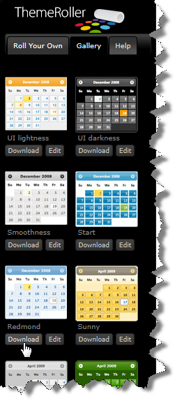
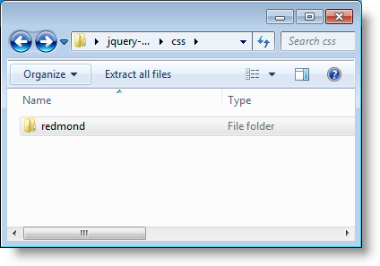
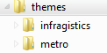
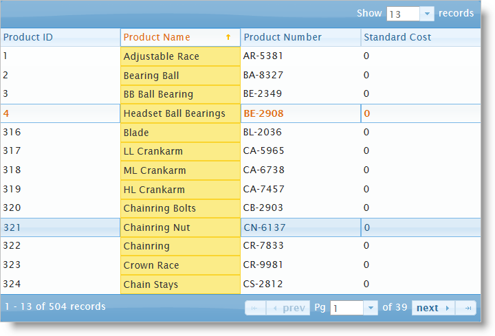

# igGrid のスタイル設定

## 必要な CSS とテーマ

&#123;environment:ProductName&#125;™ グリッド (`igGrid`) は、ほかの jQuery ウィジェットのように、スタイリングに jQuery UI CSS Framework を使用します。&#123;environment:ProductName&#125; には、Infragistics および Metro と呼ばれるカスタム jQuery UI テーマが含まれています。これらのテーマによって、Infragistics ウィジェットおよび標準の jQuery UI ウィジェットが、プロフェッショナルで魅力的な外観になります。

Infragistics および Metro テーマに加えて、Infragistics ウィジェットの基本 CSS レイアウトに必要な structure ディレクトリがあります。

### 必要なテーマの Web サイトへの追加

Infragistics および Metro テーマは、css フォルダー内のインストール ディレクトリに配置されています。テーマをアプリケーションに追加するには、css フォルダー全体 (structure および themes ディレクトリを含む) をサイトの場所にコピーします。

> **注:** Infragistics Loader の使用時は、フォルダー構造を保持する必要があります。このようにすると、ローダーは期待通りに機能します。使用されないテーマがある場合、それらは削除することができますが、その構造は変更してはいけません。

**図 1: 製品インストール時に含まれるテーマ フォルダー**


### Infragistics および Metro テーマ

Infragistics テーマは、jQuery UI テーマに通常存在するすべてのスタイルを含むカスタム テーマです。このテーマは、別のテーマで置き換えることができますが、jQuery ウィジェットを正しく表示するには、*&#123;IG Resources ルート&#125;\css\structure\infragistics.css* ファイルへの参照が必要です。

Metro テーマは、クリーン、モダンかつ高速な Metro デザイン言語の実装です。これには、Infragistics テーマと同様に、*&#123;IG Resources ルート&#125;\css\structure\infragistics.css* と同じ要件があります。

Infragistics (または Metro) テーマ以外のテーマを使うと、グリッドにスタイリング ポイントがいくつか追加されるため、完璧なデザインを実現するには、カスタマイズが必要になる場合があります (グリッドで有効にしている機能とテーマによります)。

`igGrid` コントロールには、標準の jQuery UI テーマのスタイルシートへのリンクが必要です。IG テーマの場合、テーマのスタイルシートへの参照をページに含める必要があります。

### リスト 1: Infragistics テーマへの手動 CSS 参照

**HTML の場合:**

```html
<link href="css/themes/infragistics/infragistics.theme.css" rel="stylesheet" type="text/css" />
<link href="css/structure/modules/infragistics.ui.grid.css" rel="stylesheet" type="text/css" />
```

### リスト 2: ASP.NET MVC の Infragistics テーマへの CSS 参照

**HTML の場合:**

```html
<%@ Import Namespace="Infragistics.Web.Mvc" %>
<!DOCTYPE html>
<html>
<head runat="server">
<link href="<%= Url.Content("~/css/themes/infragistics/infragistics.theme.css") %>” rel="stylesheet" type="text/css" />
<link href="<%= Url.Content("~/css/structure/modules/infragistics.ui.grid.css") %>” rel="stylesheet" type="text/css" />
```


### リスト 3: Metro テーマへの手動 CSS 参照

Metro テーマは、jQuery テーマの後に参照されます。`igGrid` コントロールを使用する場合、次のスタイルシートが必要です。

**HTML の場合:**

```html
<link href="css/themes/metro/infragistics.theme.css " rel="stylesheet" type="text/css" />
<link href="css/structure/modules/infragistics.ui.grid.css" rel="stylesheet" type="text/css" />
```

### リスト 4: ASP.NET MVC の Metro テーマへの CSS 参照

**HTML の場合:**

```html
<%@ Import Namespace="Infragistics.Web.Mvc" %>
<!DOCTYPE html>
<html>
<head runat="server">
<link href="<%= Url.Content("~/css/themes/metro/infragistics.theme.css ") %>” rel="stylesheet" type="text/css" />
<link href="<%= Url.Content("~/css/structure/modules/infragistics.ui.grid.css") %>” rel="stylesheet" type="text/css" />
```

## ThemeRoller の使用

ThemeRoller は jQuery UI が提供するツールで、これを使用すると、jQuery UI ウィジェットと互換性のあるカスタム テーマを簡単に作成できるようになります。数々のビルド済みテーマをご自分の Web サイトにダウンロードして、組み込むことができます。&#123;environment:ProductName&#125; ウィジェットでは、ThemeRoller テーマをサポートしています。 

個々のテーマを組み込めるだけでなく、[jQuery UI Theme Switcher ウィジェット](http://docs.jquery.com/UI/Theming/ThemeSwitcher)を使用して、ビルド済みの jQuery UI テーマをブラウザー内で動的に変更できます。ThemeRoller と Theme Switcher ウィジェットの詳細については、下記の[**外部参照**](#external-references)を参照してください。

> **注:** Infragistics と Metro テーマは、他の ThemeRoller テーマと一緒に使用できません。なぜなら、infragistics.theme.css および最終オーバーライドを含むすべての css は ThemeRoller と互換性がありません。アプリケーションが ThemeRoller を使用する場合、css ファイルは *jquery.ui.theme.css* だけが許されます。

ローダーからこれを修正するには、*theme* オプションを “” (空の文字列) に設定します。するとローダーはデフォルトのテーマ (jQuery ウィジットでは *Infragistics*) を読み込みません。

### カスタム jQuery UI テーマの追加

カスタム テーマを追加する方法は、*Infragistics* テーマの追加と似ています。

1.  Theme Roller Web サイトに移動して、Gallery タブをクリックし、ダウンロードするテーマを見つけます。

	

2.  Redmond テーマの隣の Download をクリックします。ダウンロードの完了後、圧縮フォルダーをファイル システムに解凍します。
3.  ZIP ファイルに、css ディレクトリがあります。このディレクトリに、テーマ名 redmond が付いたフォルダーがあります。

	

3.  このディレクトリを自分の Web サイトのテーマ ディレクトリにドラッグします。

	

4.  CSS リンクを更新して、Infragistics テーマを Redmond テーマに置き換えます。

	#### リスト 5: Redmond テーマへの手動 CSS 参照
	
	**HTML の場合:**
	
```html
	<link href="/css/themes/redmond/jquery-ui-1.8.13.custom.css" rel="stylesheet" type="text/css" />
    <link href="/css/structure/modules/infragistics.ui.grid.css" rel="stylesheet" type="text/css" />
```
	
	#### リスト 6: ASP.NET MVC の Redmond テーマへの CSS 参照
	
	**HTML の場合:**
	
```html
	<%@ Import Namespace="Infragistics.Web.Mvc" %>
    <!DOCTYPE html>
    <html>
    <head runat="server">
    <link href="<%= Url.Content("~css/themes/redmond/jquery-ui-1.8.13.custom.css") %>” rel="stylesheet" type="text/css" />
    <link href="<%= Url.Content("~/css/structure/modules/infragistics.ui.grid.css") %>” rel="stylesheet" type="text/css" />
```

5.  最後に、Web ページを実行すると、`igGrid` が Redmond テーマを使用して描画を行います。

	

## 外部参照

-   [jQuery UI](http://www.jqueryui.com)
-   [jQuery ウィジェットの活用](http://wiki.jqueryui.com/w/page/12138135/Widget%20factory)
-   [jQuery ThemeRoller](http://jqueryui.com/themeroller/)
-   [jQuery UI Theme Switcher](http://docs.jquery.com/UI/Theming/ThemeSwitcher)

## 関連コンテンツ

### トピック

-   [スタイル設定とテーマ設定](/deployment-guide-styling-and-theming)

### サンプル

-   [Windows UI テーマのサンプル](&#123;environment:SamplesUrl&#125;/grid/windows-ui-theme)

 

 


