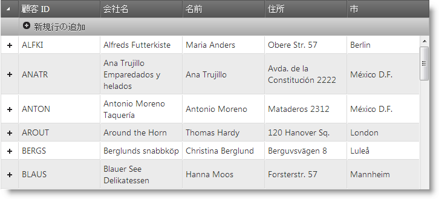

---
title: "igHierarchicalGrid を REST サービスへバインド"
slug: ighierarchicalgrid-binding-to-rest-services
---

# igHierarchicalGrid を REST サービスへバインド

## トピックの概要

### 目的

このトピックでは、igHierarchicalGrid™ を REST サービスにバインドする方法を説明します。

### 必要な背景

以下は、このトピックを理解するための前提条件として必要な概念、トピック、および記事の一覧です。

- [REST の更新 (igGrid)](/iggrid-rest-updating): このトピックでは、REST サービスでの igGrid サポートについて説明します。
- [igHierarchicalGrid の概要](/ighierarchicalgrid-overview): このトピックでは、機能、データ ソースへのバインド、要件、テンプレート、相互作用に関する情報を含めて、`igHierarchicalGrid` コントロールの概要を示します。
- [igHierarchicalGrid の初期化](/ighierarchicalgrid-initializing): このトピックでは、jQuery と MVC 両方の igHierarchicalGrid の初期化方法を示しています。
- [ロードオンデマンド (igHierarchicalGrid)](/ighierarchicalgrid-load-on-demand): このトピックでは、データを一度にオン デマンドで `igHierarchicalGrid` に読み込む 2 とおりの方法を示します。


### このトピックの内容

このトピックは、以下のセクションで構成されます。

-   [概要](#introduction)
-   [JavaScript での REST サービスのバインディング例](#binding-to-rest-services)
-   [関連コンテンツ](#related-content)


## <a id="introduction"></a> 概要

### igHierarchicalGrid の REST サービスへのバインディングの概要

igHierarchicalGrid REST サポートには、igGrid REST サポートと比較すると、さらに詳細を検討する必要があります。

igHierarchicalGrid に対して REST サポートを有効にするには、[rest](&#123;environment:jQueryApiUrl&#125;/ui.ighierarchicalgrid#options) オプションを `true` に設定する必要があります。ロード オン デマンドのシナリオ (`initialDataBindDepth=-1`) の場合、ルート レイアウト REST 設定 `url` が定義されると、子レイアウトは [restSettings](&#123;environment:jQueryApiUrl&#125;/ui.iggrid#options) から URL を継承しません。その代わり、URL はルート `restSettings` および子レイアウト構成の両方から生成されます。

子レイアウトの要求 URL は以下のように構築されます。

```
Url/RootPrimaryKeyID/Child1LayoutName/Child1PrimaryKeyID/Child2LayoutName/Child2PrimaryKeyID
```

例: 

```
/api/customers/ANATR/orders/10308
```

ここで、

```
Url = /api/customers/,	
RootPrimaryKeyID = ANATR,
Child1LayoutName = orders,
Child1PrimaryKeyID = 10308
```

子レイアウトの場合、[batch](&#123;environment:jQueryApiUrl&#125;/ui.iggrid#options) および [template](&#123;environment:jQueryApiUrl&#125;/ui.iggrid#options) オプションを定義できます。子レイアウトにテンプレートを使用したい場合、ルート `restSettings` のテンプレートも定義する必要があります。これは、子レイアウトのテンプレートはルート テンプレートと連結されるためです。

> 注: 子レイアウトの Batch オプションはルート `restSettings` からコピーされません。グリッド全体に対して batch モードが必要な場合は、`restSettings` を各子レイアウトに定義し、その Batch オプションを `true` に設定します。

リモート バインディングでロード オン デマンドをサポートするために、GET 要求で送信される`dbdepth` パラメーターがあります。これを使用して、グリッドに返すデータのレベル数を決定します。このパラメーターは `igHierarchicalGrid.initialDataBindDepth` オプションに相当します。

注: igHierarchicalGrid `restSettings` は動的に設定できません。`restSettings` を変更したい場合は、グリッドを作り直す必要があります。

以下のスクリーンショットでは、[`saveChanges`](&#123;environment:jQueryApiUrl&#125;/ui.ighierarchicalgrid#methods) メソッドの実行時に igHierarchicalGrid が REST 要求を行っているのが分かります。


## <a id="binding-to-rest-services"></a> JavaScript での REST サービスのバインディング例

### 概要

この手順では、*igHierarchicalGrid*  を構成して REST サービスにバインドする方法を説明します。グリッド REST サポートはサーバーに依存しないため、サーバー側の実装は説明されていません。

*igHierarchicalGrid* は、`Northwind` データベースの `Customers` および `Orders` テーブルからのデータを公開する REST サービスを使用するように構成されます。

REST サービスは、`Customers` データに対して以下の URL を受け入れます。

HTTP メソッド/動詞|要求本体|URL パラメーター プレースホルダー|例
------------- | ------------- | ------------- | -------------
GET|配列|/api/customers |/api/customers
POST|シングル オブジェクト|/api/customers |/api/customers
PUT|シングル オブジェクト|/api/customers/&#123;customerId&#125;|/api/customers/ALFKI
DELETE|空|/api/customers/&#123;customerId&#125;|/api/customers/ALFKI

REST サービスは、`Orders` データに対して以下の URL を受け入れます。

HTTP メソッド/動詞|要求本体|URL パラメーター プレースホルダー|例
------------- | ------------- | ------------- | -------------
GET|配列|/api/customers/&#123;customerId&#125;/orders|/api/customers/ALFKI/orders
POST|シングル オブジェクト|/api/customers/&#123;customerId&#125;/orders|/api/customers/ALFKI/orders
PUT|シングル オブジェクト|/api/customers/&#123;customerId&#125;/orders/&#123;orderId&#125;|/api/customers/ALFKI/orders/10643
DELETE|空|/api/customers/&#123;customerId&#125;/orders/&#123;orderId&#125;|/api/customers/ALFKI/orders/10643

### プレビュー

以下のスクリーンショットは最終結果のプレビューです。



### 前提条件

この手順を実行するには、以下のリソースが必要です。

-   &#123;environment:ProductName&#125; JavaScript とテーマ ファイル

## 手順

以下の手順では、*igHierarchicalGrid*  を構成して REST サービスにバインドする方法を説明します。

### 手順 1: 必要な JavaScript ファイルを参照します。

必要な JavaScript 参照を含めます。

**HTML の場合:**

```html
<script src="js/jquery.min.js"></script>
<script src="js/jquery-ui.min.js"></script>
<script src="js/infragistics.loader.js"></script>
```

### 手順 2: HTML プレースホルダーを *igHierarchicalGrid* に対して定義します。

ページの `BODY` 内部に `TABLE` 要素を作成します。ID 属性を値「`grid1`」に割り当てます。

**HTML の場合:**

```html
<table id="grid1"></table>
```

### 手順 3: Infragistics Loader を初期化します。

**JavaScript の場合:**

```js
$.ig.loader({
    scriptPath: 'js',
    cssPath: 'css',
    resources: 'igHierarchicalGrid.Updating'
});
```

> **注:** Infragistics Loader は、必要なファイルを素早く効果的に参照するための方法です。ただし、ファイルは手動で参照することができます。詳細については、[関連コンテンツ](#related-content)セクションの「[&#123;environment:ProductName&#125; の JavaScript リソースの使用](/deployment-guide-javascript-resources)」トピック を参照してください。

### 手順 4:*igHierarchicalGrid* を初期化します。

1. ルート レイアウトとオプションを定義します

**JavaScript の場合:**

```js
$.ig.loader(function () {
    $("#grid1").igHierarchicalGrid({
        dataSource: "/api/customers/",
        primaryKey: "CustomerID",
        initialDataBindDepth: 0,
        rest: true,
        autoGenerateColumns: false,
        width: "700px",
        height: "400px",
        defaultColumnWidth: "140px",
        columns: [
            { headerText: "Customer ID", key: "CustomerID", dataType: "string", width: "100px" },
            { headerText: "Company Name", key: "CompanyName", dataType: "string", width: "150px" },
            { headerText: "Contact Name", key: "ContactName", dataType: "string", width: "150px" },
            { headerText: "Address", key: "Address", dataType: "string", width: "150px" },
            { headerText: "City", key: "City", dataType: "string", width: "100px" }
        ],
        features: [
            {
                name: "Updating",
                editMode: 'row',
                columnSettings: [{
                    columnKey: 'CustomerID',
                    readOnly: true
                }]
            }
        ]
    });
});
```

上のコードでは、`igHierarchicalGrid` が、更新された行と共に構成されています。グリッドの GET 要求は、`dataSource` を「`/api/customers/`」に設定することによって構成されます。REST サポートは、rest を true に設定することによって有効になります。グリッドは、`initialDataBindDepth` を `0` に設定することによって、ロード オン デマンド モードで構成されます。

> **注:** REST GET 要求は `restSettings` オプションでは定義されませんが、その代わりに `dataSource` を使用します。

2. ルート レイアウトの REST 設定を定義します

- 以下のコードを *igHierarchicalGrid* 構成に追加します。

**JavaScript の場合:**

```js
restSettings: {
    create: {
        url: "/api/customers/"
    },
    update: {
        url: "/api/customers/"
    },
    remove: {
        url: "/api/customers/"
    }
}
```

`url` が REST 設定で定義されている場合、*igHierarchicalGrid* は自動的に要求 URL を構築します（[はじめに](#introduction) セクションを参照）。

カスタム要求 URL を定義したい場合は、すべてのレイアウトでテンプレートプロパティを定義する必要があります（手順 3 と手順 5 を参照）。

3. （オプション）テンプレートを使用してルート レイアウトの REST 設定を定義します

 - 以下のコードを *igHierarchicalGrid* 構成に追加します。

**JavaScript の場合:**

```js
restSettings: {
    create: {
        template: "/api/customers/"
    },
    update: {
        template: "/api/customers${id}"
    },
    remove: {
        template: "/api/customers${id}"
    }
}
```

上のコードでは、デフォルト要求 URL が、テンプレートを使用してアーカイブされています。REST サービスの URL スキームが、*igHierarchicalGrid* が生成したデフォルトの URL に一致しない場合にテンプレートを使用できます。

> **注:** テンプレートを使用する場合は、igHierarchicalGrid の各レベルに対してテンプレートを定義する必要があります。

4. 子レイアウトとオプションを定義します。

以下のコードを *igHierarchicalGrid* 構成に追加します。

**JavaScript の場合:**

```js
columnLayouts: [
    {
        key: "Orders",
        foreignKey: "CustomerID",
        primaryKey: "OrderID",
        width: "100%",
        autoGenerateColumns: false,
        columns: [
            { headerText: "OrderID", key: "OrderID", width: "10%", dataType: "number" },
            { headerText: "ShipName", key: "ShipName", width: "10%", dataType: "string" },
            { headerText: "ShipAddress", key: "ShipAddress", width: "10%", dataType: "string" }
        ],
        features: [
            {
                name: "Updating",
                editMode: 'row',
                columnSettings: [{
                    columnKey: 'OrderID',
                    readOnly: true
                }]
            }
        ]
    }
]
```

Orders 子レイアウトはまた、行更新機能と共に定義されます。`restSettings` はルート レイアウトから継承されるため、定義されません。

5. （オプション）テンプレートを使用して子レイアウトの REST 設定を定義します
 
- 以下のコードを Orders レイアウト構成に追加します。

**JavaScript の場合:**

```js
restSettings: {
    create: {
        template: "orders/"
    },
    update: {
        template: "orders${id}"
    },
    remove: {
        template: "orders${id}"
    }
}
```

ルート `restSettings` をテンプレートを使用して定義した場合、子レイアウトでもテンプレートを使用する必要があります。この手順は手順 3 の追加事項です。子レイアウト要求 URL は、親レベルの各レベルでテンプレートを連結させることによって構築されます。このため、orders `restSettings` のテンプレートには、`Url` の orders 部分しか含まれません。

> **注:** テンプレートでは、`${id}` プレースホルダーのみ使用できます。このプレースホルダーは、それぞれのレイアウトのプライマリ キーにマップされます。

## <a id="related-content"></a> 関連コンテンツ

### トピック

このトピックの追加情報については、以下のトピックも合わせてご参照ください。

- [REST の更新 (igGrid)](/iggrid-rest-updating): このトピックでは、REST サービスでの *igGrid* サポートについて説明します。
- [ASP.NET MVC Web API へのバインド (igHierarchicalGrid)](/ighierarchicalgrid-binding-to-webapi): このトピックでは、igHierarchicalGrid を Web API サービスにバインドする方法を説明します。

### リソース

以下の資料 (Infragistics のコンテンツ ファミリー以外でもご利用いただけます) は、このトピックに関連する追加情報を提供します。

- [ASP.NET Web API を使用した作業の開始](http://www.asp.net/web-api): ASP.NET Web API は、ブラウザーやモバイル デバイスを含めた広範なクライアントから利用できる HTTP サービスの構築を容易にするフレームワークです。ASP.NET Web API は、REST を多用したアプリケーションを .NET フレームワーク上で構築するための理想的なプラットフォームです。


 

 


