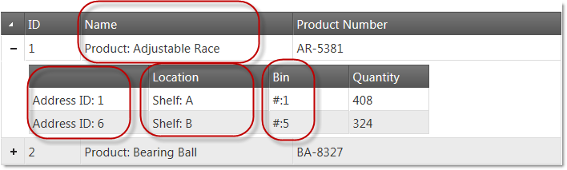

# igHierarchicalGrid での基本的な列テンプレートの作成

## トピックの概要

### 目的
このトピックでは、`igHierarchicalGrid` に対する基本列テンプレートの作成方法につぃて説明します。

## igHierarchicalGrid での基本的な列テンプレートの作成


## 概要
この例では、基本的な列テンプレートを階層グリッドに適用します。赤で囲まれた列にのみ列テンプレートが適用されます。

### プレビュー

以下のスクリーンショットは最終結果のプレビューです。



#### 手順

以下のステップでは、igHierarchicalGrid の基本的な列テンプレートを作成する方法を紹介します。

1. HTML ページを準備

	HTML ページを準備するには、igLoader を追加し、igHierarchicalGrid リソースをロードするよう構成します。

	**JavaScript の場合:**

```js
	<script src="http://localhost/ig_ui/js/infragistics.loader.js"></script>
	<script type="text/javascript">
	$.ig.loader({
		scriptPath: "http://localhost/ig_ui/js/",
		cssPath: "http://localhost/ig_ui/css/",
		resources: "igHierarchicalGrid"
	});
	</script>
```

2. 列テンプレートを追加して適用

  - ページにサンプル データを追加し、ページの本文にテーブル タグ付けします。

**JavaScript の場合:**

```js
<script type="text/javascript">
 var productsInventories = [{
      "ProductID": 1,
      "Name": "Adjustable Race",
      "ProductNumber": "AR-5381",
      "ProductInventories": {
            "Records": [
				{"ProductID": 1, "LocationID": 1, "Shelf": "A", "Bin": 1, "Quantity": 408}, 
                {"ProductID": 1, "LocationID": 6, "Shelf": "B", "Bin": 5, "Quantity": 324}             ]
      }
}, {
      "ProductID": 2,
      "Name": "Bearing Ball",
      "ProductNumber": "BA-8327",
      "ProductInventories": {
            "Records": [
				{"ProductID": 2, "LocationID": 1, "Shelf": "A","Bin": 2, "Quantity": 427}
			]
      }
}]</script>
```

**HTML の場合:**

```html
<body>
<table id="grid1"></table>
</body>
```

 - ルートと子レベルで列テンプレートを設定した `igHierarchicalGrid`  を追加します。

**JavaScript の場合:**

```js
<script type="text/javascript">
$.ig.loader(function () {
      $("#grid1").igHierarchicalGrid({
            initialDataBindDepth: 1,
            odata: true,
            dataSource: productsInventories,
            dataSourceType: "json",
            width: "700",
            autoGenerateColumns: false,
            autoGenerateLayouts: false,
            primaryKey: "ProductID",
            columns: [
                  { key: "ProductID", headerText: "ID ", width: "70px" },
                  { key: "Name", headerText: "Name", width: "265px", template: "Product: ${Name}" },
                  { key: "ProductNumber", headerText: "Product Number", dataType: "string", width: "150px" }
            ],
            columnLayouts: [
                  {
                        key: "ProductInventories",
                        responseDataKey: "Records",
                        autoGenerateColumns: false,
                        autoGenerateLayouts: false,
                        generateCompactJSONResponse: false,
                        primaryKey: "LocationID",
                        foreignKey: "ProductID",
                        columns: [
                            { key: "LocationID", headerText: " ", width: "150px", template: "Address ID: ${LocationID}" },
                            { key: "Shelf", headerText: "Location", width: "150px", template: "Shelf: ${Shelf}" },
                            { key: "Bin", headerText: "Bin", width: "100px", template: "#:${Bin}" },
                            { key: "Quantity", headerText: "Quantity", width: "100px" }
                        ]
                  }
            ]
      });
});</script>
```


## 関連コンテンツ
- [Infragistics テンプレート エンジン](../../../../06_Infragistics-Templating-Engine/01_igTemplating Overview.mdx): このセクションには、Infragistics® テンプレート エンジンの使用に関するトピックが含まれています。
