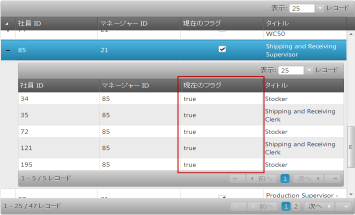

import ApiLink from 'docs-template/components/mdx/ApiLink.astro';

# 列とレイアウト (igHierarchicalGrid)

## トピックの概要

### 目的

このトピックでは、自動生成などで igHierarchicalGrid™ の列およびレイアウトを定義する方法を示しています。

### このトピックの内容

このトピックは、以下のセクションで構成されます。

-   [機能の概要](#overview)
-   [列の定義](#defining-columns)
-   [レイアウトの定義](#layouts)
-   [の列とレイアウトを自動生成する](#auto)
-   [列をチェックします](#checkbox-column)
-   [関連トピック](#related-topics)

## <a id="overview"></a> 機能の概要

以下のリストは、igHierarchicalGrid の Columns 機能の概要を示しています。

- <ApiLink type="ighierarchicalgrid" label="Columns" />: グリッドの列を定義します。
- <ApiLink type="ighierarchicalgrid" label="Layouts" />: グリッドのレイアウトを定義します。

## <a id="defining-columns"></a> 列の定義

列を定義する場合、データ バインディング、ヘッダー テキスト、列の幅など列設定を個々に構成できます。使用できるオプションの詳細については、Columns プロパティを参照してください。以下のコードは、列を定義する際のいくつかの基本的なオプション設定を示しています。

**JavaScript の場合:**

```js
$("#hgrid1").igHierarchicalGrid({
       autogenerateColumns: false,
       columns: [
           { key: "OrderID", headerText: "OrderID", dataType: "number"},
           { key: "Name", headerText: "MovieName", type: "string"},
           { key: "Date", headerText: "Date", type: "date"}
       ]
});
```

**ASPX の場合:**

```csharp
<%= Html.Infragistics().Grid(Model)
        .ID("grid1")
        .AutoGenerateColumns(false)
        .Columns(column =>
        {
                column.For(x => x.OrderID).HeaderText("OrderID").DataType("number");
                column.For(x => x.Name).HeaderText("Name"). DataType("string");
                column.For(x => x.Date).HeaderText("Date").HeaderText("date");
        })
        .DataBind()
        .Render()%>
```

**注:** グリッドで日付を正しく表示するには、以下の要件を満たす必要があります。

-   列の型は date 型でなければなりません
-   Microsoft .NET JSON シリアライザー形式に準拠した着信データ

たとえば、上記の要件を満たしている場合、以下の着信データ文字列

```
/Date(1097655307263)/
```

は igHierarchicalGrid により


## <a id="layouts"></a> レイアウトの定義

### 概要

レイアウトは特定のレベルの子グリッドの列構造および機能の定義である、と解釈されます。レイアウトでは、igGrid 定義プラス親 igGrid との関係を記述するいくつかのプロパティと同じオプションを定義できます。子レイアウトは、複数レベル レイアウト階層を作成できるレイアウト内で定義できます。

### プロパティ設定
子レイアウトは「`columnLayouts`」と呼ばれる igHierarchicalGrid のプロパティから定義されます。(「複数レベルとレイアウト」のサンプルを参照してください。)

### コード例
以下のコードは子レイアウトを定義する方法を示しています。

**JavaScript の場合:**

```js
$("#grid1").igHierarchicalGrid({
    autoGenerateColumns: true,
    childrenDataProperty: "Orders",
    autoGenerateLayouts: false,
    columnLayouts: [
        {
            key: "Orders",
            responseDataKey: 'd.results',
            autoGenerateColumns: true
        }
    ]
});
```

**ASPX の場合:**

```csharp
<%= Html.Infragistics()
        .Grid(Model)
        .ID("grid1")
        .AutoGenerateLayouts(false)
        .ColumnLayouts(layouts => {
             layouts.For(x => x.ProductInventories)
                .PrimaryKey("LocationID")
                .ForeignKey("ProductID")
                .AutoGenerateColumns(true)
             });
        })
        .DataBind()
        .Render()%>
```

### ロード オン デマンドに関する考慮事項
igHierarchicalGrid のデータをオン デマンドで読み込むには、すべてのレイアウトのプライマリ キーと外部キーを明示的に定義する必要があります。ロード オン デマンド機能を使用する場合に igHierarchicalGrid が正しい要求を形成できる方法はこれしかありません。

## <a id="auto"></a> 列とレイアウトを自動生成する

### 概要
列もレイアウトも定義する必要がない場合は、igHierarchicalGrid に自動的に列とレイアウトを構成させることができます。グリッドが自動的にレイアウトを自動生成する場合、添付されたデータ ソースの構造が必要です。これは、クライアントまたはサーバーで行うことができます。

### プロパティの設定
レイアウトの自動生成は、データ ソース構造を再帰的に分析することで行われます。オブジェクトの型に IEnumerable/IQueryable 型のパブリック プロパティが含まれている場合、親子関係が定義されているため、これらの関係のレイアウトが生成されると想定されます。たとえば、Customers のリストにバインドでき、そのリストには「`Orders`」という型が IQueryable のプロパティがあります。

### コード例
以下のコードは、jQuery および MVC で列を自動生成する方法を示しています。このコード例が動作しているところを見るには、Auto-generate サンプルを参照してください。

**JavaScript の場合:**

```js
$("#grid1").igHierarchicalGrid({
    autoGenerateColumns: true,
    autoGenerateLayouts: true,
});
```

**ASPX の場合:**

```csharp
<%= Html.Infragistics()
        .Grid(Model)
        .ID("grid1")
        .AutoGenerateColumns(true)
        .AutoGenerateLayouts(true)
        .DataBind()
        .Render()%>
```

### その他の考慮事項
`autogenerate` 列と `autogenerate` レイアウトを使用すると実装時間が短縮され、それらはサイトの開発中に使用できることを理解することが重要です。しかし、アプリケーションが実稼働環境で動作している場合、常に列とレイアウトを手動で定義するのが良いでしょう。これはパフォーマンスが向上し、クライアントに描画されるデータを制御できるためです。

**注:** 更新機能を使用するには、`autoGenerateColumns` が false に設定される場合、`dataType` プロパティを設定する必要があります。更新機能は、グリッドおよび基本データ ソースの間でレコードを同期するためにプライマリ キーを使用します。プライマリ キーは値およびタイプによって比較されます。

## <a id="checkbox-column"></a> 列のチェックボックスのレンダリング
ブール データ型を含む列の場合、デフォルトでは igHierarchicalGrid は true または false の文字列を示します。ただし、igHierarchicalGrid 列がブール データを表示するかどうかを選択するチェックボックスのオプションがあり、チェックの有無に応じて、それぞれ true または false になります。`renderCheckboxes` プロパティを true に設定すると、列のチェックボックスがレンダリングされます。チェックボックスをレンダリングするには、列の `dataType` プロパティをブール値に設定する必要があります。

右の図では、次のコード例が Current Flag 列のチェックボックスをレンダリングする様子を示しています。

チェックボックス付き|チェックボックスなし
---------------- | ---------------- 
 | 

**JavaScript の場合:**

```js
$("#hierarchicalGrid1").igHierarchicalGrid({
            // enabling render checkboxes on a column
            renderCheckboxes: true,
            columns: [ { 
                    key: "ProductID", 
                    headerText: "ProductID", 
                    dataType: "number" 
                }, { 
                    key: "Code", 
                    headerText: "Code", 
                    dataType: "string" 
                }, { 
                    key: "InStock", 
                    headerText: "In Stock", 
                    dataType: "bool"
                }, {
                    headerText: "Order Date", 
                    key: "OrderDate", 
                    dataType: "date"
                }, {
                    headerText: "List Price", 
                    key: "ListPrice", 
                    dataType: "number", 
                    format: "currency"
                }
            ],
            columnLayouts: [ {
                    // enabling render checkboxes on a column
                    renderCheckboxes: true,
                    columns: [ { 
                            key: "ProductID", 
                            headerText: "ProductID", 
                            dataType: "number" 
                        }, { 
                            key: "StoreCode", 
                            headerText: "Store Code", 
                            dataType: "string" 
                        }, { 
                            key: "Quantity", 
                            headerText: "Quantity",
                            dataType: "number"
                        }, { 
                            key: "Ship", 
                            headerText: "Quantity", 
                            // note: rendering checkboxes on a column required to set dataType to "bool"
                            dataType: "bool"
                        }
                    ]
                }
            ]
        });
```

**ASPX の場合:**

```csharp
<%= Html.Infragistics().Grid(Model).ID("hierarchicalGrid1").LoadOnDemand(false).AutoGenerateColumns(false).AutoGenerateLayouts(false).PrimaryKey("EmployeeID").RenderCheckboxes(true).Columns(column => 
            {
                column.For(x => x.EmployeeID).HeaderText(this.GetGlobalResourceObject("HierarchicalGrid", "EmployeeID").ToString()).DataType("number");
                column.For(x => x.ManagerID).HeaderText(this.GetGlobalResourceObject("HierarchicalGrid", "ManagerID").ToString()).DataType("number");
                column.For(x => x.Title).HeaderText(this.GetGlobalResourceObject("HierarchicalGrid", "Title").ToString()).DataType("string");
                column.For(x => x.CurrentFlag).HeaderText(this.GetGlobalResourceObject("HierarchicalGrid", "CurrentFlag").ToString()).DataType("bool");
                column.For(x => x.SalariedFlag).HeaderText(this.GetGlobalResourceObject("HierarchicalGrid", "SalariedFlag").ToString()).DataType("bool");
            })
            .ColumnLayouts(layouts => {
                layouts.For(x => x.Employees).ForeignKey("EmployeeID").AutoGenerateColumns(false).AutoGenerateLayouts(false).RenderCheckboxes(true).Columns(childcolumn =>
                    {
                        childcolumn.For(x => x.EmployeeID).HeaderText(this.GetGlobalResourceObject("HierarchicalGrid", "EmployeeID").ToString()).DataType("number");
                        childcolumn.For(x => x.ManagerID).HeaderText(this.GetGlobalResourceObject("HierarchicalGrid", "ManagerID").ToString()).DataType("number");
                        childcolumn.For(x => x.Title).HeaderText(this.GetGlobalResourceObject("HierarchicalGrid", "Title").ToString()).DataType("string");
                        childcolumn.For(x => x.CurrentFlag).HeaderText(this.GetGlobalResourceObject("HierarchicalGrid", "CurrentFlag").ToString()).DataType("bool");
                        childcolumn.For(x => x.SalariedFlag).HeaderText(this.GetGlobalResourceObject("HierarchicalGrid", "SalariedFlag").ToString()).DataType("bool");
                    })
                    .Features(features => {
                        features.Selection().Mode(SelectionMode.Row);
                        features.Updating().EnableAddRow(false).EditMode(GridEditMode.Row).EnableDeleteRow(false).ColumnSettings(columnSettings =>
                        {
                            columnSettings.ColumnSetting().ColumnKey("EmployeeID").ReadOnly(true);
                            columnSettings.ColumnSetting().ColumnKey("ManagerID").ReadOnly(true);
                        });
                        features.Paging().Type(OpType.Local);
                        features.Sorting();
                    });
            })
            .Features(features => {
                    features.Selection().Mode(SelectionMode.Row);
                    features.Updating().EnableAddRow(false).EditMode(GridEditMode.Row).EnableDeleteRow(false).ColumnSettings(columnSettings =>
                    {
                        columnSettings.ColumnSetting().ColumnKey("EmployeeID").ReadOnly(true);
                        columnSettings.ColumnSetting().ColumnKey("ManagerID").ReadOnly(true);
                    });
                    features.Paging().Type(OpType.Local);
                    features.Sorting();
            }).DataBind().Height("500px").Render()
            %>
```

## <a id="related-topics"></a> 関連トピック

以下は、その他の役立つトピックです。

- [igHierarchicalGrid の初期化](/ighierarchicalgrid-initializing)
- <ApiLink type="ighierarchicalgrid" label="igHierarchicalGrid プロパティ リファレンス" />

 

 


