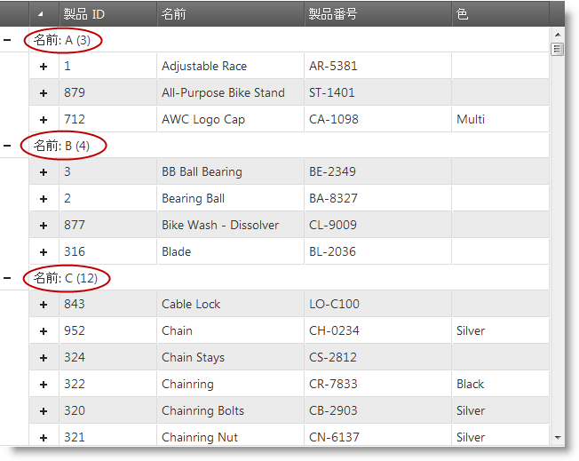

# カスタム グループ化の構成 (igHierarchicalGrid)


## トピックの概要
#### 目的

`groupComparerFunction` オプションを使用してカスタム グループ化関数を構成する方法を示します。

#### 前提条件

以下の表は、このトピックを理解するための前提条件として必要なトピックを示しています。

トピック|目的
---|---
[igHierarchicalGrid の概要](/ighierarchicalgrid-overview)|igHierarchicalGrid™ の概要で機能、データ ソースへのバインド、要件、テンプレート、および相互作用などの情報を含みます。
[igHierarchicalGrid の初期化](/ighierarchicalgrid-initializing)|jQuery と MVC による igHierarchicalGrid の初期化方法を示します。
[グループ化の概要 (igHierarchicalGrid)](/ighierarchicalgrid-grouping-overview)|igHierarchicalGrid コントロールのグループ化関数を紹介します。


#### このトピックの内容

このトピックは、以下のセクションで構成されます。

-   [カスタム グループ化関数の構成](#configure)
-   [関連コンテンツ](#related-content)

## <a id="configure"></a> カスタム グループ化関数の構成
#### 概要

igHierarchicalGrid コントロールを構成してカスタム グループ化関数を使用する手順の紹介。

この例では、行をその最初の文字でグループ化する `comparer` 関数を作成します。

#### プレビュー

以下のスクリーンショットはその結果を示します。



#### 手順

以下の手順は、カスタム グループ化関数を作成してそれを階層グリッドのグループ化機能に割り当てる方法を示します。

1. カスタム グループ化関数を作成します。

 以下のコードの関数は、値をその最初の文字でグループ化します。

 カスタム グループ化関数のインタフェースは 3 つの引数で構成されています。

  -   `columnSetting`: カスタム グループ化が構成されている列の列設定オブジェクト (以下の例では、これは Name 列に割り当てられた `columnSettings`、この手順のステップ 2 を参照)
  -   `val1`: 比較する最初の値
  -   `val2`: 比較する 2 番目の値

 **JavaScript の場合:**

```js
    function firstLetterGroupComparer(columnSetting, val1, val2) {
        if (val1 !== null && val2 !== null && val1.substring(0, 1) === val2.substring(0, 1)) {
            columnSetting.customGroupName = val1.substring(0, 1);
            return true;
        } else if (val1 !== null && val2 !== null && val1.substring(0, 1) !== val2.substring(0, 1)) {
            columnSetting.customGroupName = val1.substring(0, 1);
            return false;
        } else if (val1 === null && val2 !== null) {
            columnSetting.customGroupName = val2.substring(0, 1);
            return false;
        } else if (val1 !== null && val2 === null) {
            columnSetting.customGroupName = val1.substring(0, 1);
            return false;
        }
        return false;
    }
```

 if と最初の else if ステートメントのカスタム ロジックを除いて、最後の 2 つの else if ステートメントに注目する必要があります。これらは、1 つの値のみ定義され他が未定義のケースをカバーします。これは、比較演算子関数を作成するとき常に考慮する必要があります。

2. カスタム関数を使用するグリッドを構成します。

 グリッド内にカスタム グループ化関数を構成し、データをグループ化するときコントロールから呼び出せるようにします。

  - JavaScript
        
  Name 列の `groupComparerFunction: "firstLetterGroupComparer"` 割当てにおいてグリッド オブジェクトの構成は、Name 列のデータのグループ化を行うとき常に `firstLetterGroupComparer()` 関数を呼び出します。

  **JavaScript の場合:**

```js
        ...
        features: [
        {
            name: "GroupBy",
            type: "local",
            groupByAreaVisibility: "hidden",
            inherit: true,
            columnSettings: [{
                    columnKey: "Name",
                    isGroupBy: true,
                    groupComparerFunction: "firstLetterGroupComparer",
                    allowGrouping: false
            }]
        }]
        ...
```

  - ASP.NET MVC
 
  上記の JavaScript の例と同様、ここでグリッド ラッパーのメソッド呼び出し `GroupByComparerFunction("firstLetterGroupComparer")` は、 Name 列のグループ化に `firstLetterGroupComparer()` 関数を使用するようグリッドを構成します。

  **ASPX の場合:**

```csharp
        ...
        .Features(feature => {
            feature.GroupBy().Type(OpType.Local).Inherit(true)
                .GroupByAreaVisibility(GroupAreaVisibility.Hidden)
                .ColumnSettings(setting =>
                {
                    setting.ColumnSetting().ColumnKey("Name")
                        .IsGroupBy(true)
                        .GroupByComparerFunction("firstLetterGroupComparer")
                        .AllowGrouping(false);
                });
        })
        ...
```


## <a id="related-content"></a> 関連コンテンツ
#### トピック

以下のトピックでは、このトピックに関連する追加情報を提供しています。

- [グループ化の有効化と構成](/ighierarchicalgrid-grouping-enabling-and-configuring): このトピックでは、igHierarchicalGrid コントロールにグループ化機能を追加する方法を説明します。