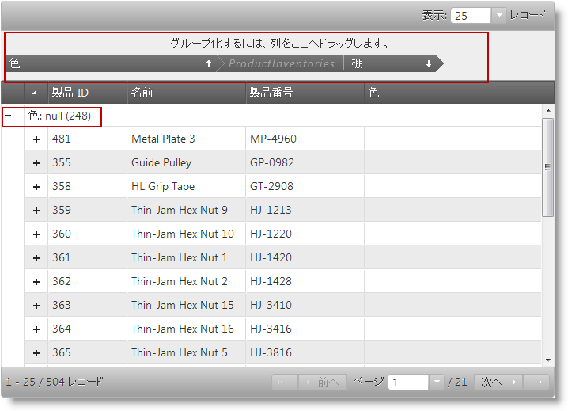

# 仮想化の有効化と設定 (igHierarchicalGrid)

## トピックの概要

### 目的

このトピックでは、コード例を使用して、 jQuery および MVC の両方で igHierarchicalGrid™ コントロールのグループ化機能を有効にして構成する方法を示します。

#### 前提条件

以下は、このトピックを理解するための前提条件として必要なトピックを示しています。

- [igHierarchicalGrid の概要](/ighierarchicalgrid-overview): このトピックでは、機能、データ ソースへのバインド、要件、テンプレート、相互作用に関する情報を含めて、igHierarchicalGrid コントロールの概要を示します。
- [igHierarchicalGrid の初期化](/ighierarchicalgrid-initializing): このトピックでは、jQuery と MVC 両方の igHierarchicalGrid の初期化方法を示しています。

#### このトピックの内容

このトピックは、以下のセクションで構成されます。

-   [グループ化の有効化と構成 - 概念的概要](#concepts)
-   [コード例: jQuery でのグループ化の有効化と構成](#jquery-example)
-   [コード例: MVC でのグループ化の有効化と構成](#mvc-example)
-   [関連コンテンツ](#related-content)

## <a id="concepts"></a> グループ化の有効化と構成 - 概念的概要
#### グループ化の有効化と構成 - 概要

グループ化は、標準グリッド機能でオプション name を “`GroupBy`” に設定してグリッド機能オブジェクトをアクセスすることで構成します。この名前で機能オブジェクトを提供して他に何も設定しないと、 GroupBy エリアが表示されるグリッド コントロールを得ますが、これは標準 (非グループ化) 状態です。エンド ユーザーは、列をこのエリアにドラッグするか、GroupBy ダイアログから列を選択して特定の列によるグループ化を行うことができます。

開始時にグリッドを何らかの列でグループ化する必要がある場合、グループ化する列を明示的に設定する必要があります。また、構成する他のプロパティを設定することもできます。例えば、グループ内の並べ替え方向、初期展開状態、空のグループ領域テキストなど。

階層グリッドは、 1 つのグループ領域のみ持つことができ、これはすべてのレイアウトのグループ化列を表示および管理します。特定のレイアウトのグループ化のみ有効な階層グリッドを作成することはできません。

以下の図は、ルート レベルの Color 列の値を使用してグリッド内のデータをグループ化および配置する階層グリッドを示しています。つまり、グリッドはそのルート レベルの Color 列でグループ化されています。グリッドの子レベルは Shelf 列のデータをもとにグループ化した `ProductInventories` テーブルのデータを示します。グループ化条件となる列は、その値がグループ ヘッダー行とグループ領域 (エリアが有効な場合) に表示されます。



グループ化は、type プロパティを設定してローカルまたはリモート (サーバー上で) に実行できます。グループ化 type の設定は必須ではありません。なぜなら、コントロールは、割り当てられたデータ ソースをもとに自動的にグループ化タイプ設定を割り当てます。データ ソースがローカルなら、グループ化もローカルに行われます。データ ソースがリモートなら、グループ化もリモートに行われます。


## <a id="jquery-example"></a> コード例: jQuery でのグループ化の有効化と構成
### 説明

jQuery で階層グリッドのグループ化機能を有効化し、いくつかの一般的なオプションを設定する方法を示します。

この例では、ユーザーは igHierarchicalGrid コントロールを作成する一般的な方法と、組み込むべきスクリプトと CSS リソースを理解していることを前提としています。詳細については、「igHierarchicalGrid の概要」のトピックを参照してください。

### コード

この例のコードは、階層データ グリッドを初期化し、それをテーブルの 2 レベルの階層 (ルート レベルの Products と 子レベルの `ProductInventories`) を持つ配列オブジェクトにバインドします。

グリッドと `columnLayout` それぞれの features オプションに機能オブジェクトを割当て、ルート レベルと子レベルで Grouping 機能を構成します。ここでは、コントロールに特定のレベルのグループ化を有効にするよう指定する割当て name: "GroupBy" が重要な設定です。

ルート レベルの Grouping 機能オブジェクトは以下を指定します。

-   グループ化はローカルに行う必要があります (`type: "local"`)。
-   グループ化エリアは、グリッドの上部に表示する必要があります (`groupByAreaVisibility: "top"`)。
-   GroupBy 関連オプションは、適用可能であれば子レベルまで伝搬する必要があります (`inherit: true`)。
-   Color 列は、最初にグループ化する必要があります (`columnKey: "Color",` `isGroupBy: true`)。
-   ユーザーによる Name 列のグループ化は禁止する必要があります (`columnKey: "Name",` `allowGrouping: false`)。

ルート レベルの Grouping 機能オブジェクトは以下を指定します。

-   グループ化はローカルに行う必要があります (`type: "local"`)。
-   Shelf 列は、最初にグループ化する必要があります (`columnKey: "Shelf",` `isGroupBy: true`)。

**JavaScript の場合:**

```js
$("#grid").igHierarchicalGrid({
    initialDataBindDepth: 1,
    dataSource: productsInventories,
    dataSourceType: 'json',
    responseDataKey: "Records",
    autoGenerateColumns: false,
    autoGenerateLayouts: false,
    columns: [
        { key: "ProductID", headerText: 'Product ID', width: "150px" },
        { key: "Name", headerText: 'Name', width: "265px" },
        { key: "ProductNumber", headerText: 'ProductNumber', dataType: "string",            width: "150px" },
        { key: "Color", headerText: 'Color', dataType: "string", width: "150px" },
    ],
    columnLayouts: [
        {
            key: "ProductInventories",
            responseDataKey: "Records",
            autoGenerateColumns: false,
            primaryKey: "ProductID,LocationID",
            foreignKey: "ProductID",
            columns: [
                { key: "ProductID", headerText: 'ProductID', width: "130px" },
                { key: "LocationID", headerText: 'AddressID', width: "130px" },
                { key: "Shelf", headerText: 'Shelf', width: "100px" },
                { key: "Bin", headerText: 'Bin', width: "60px" },
                { key: "Quantity", headerText: 'Quantity', width: "80px" },
            ],
            features: [{
                name: "GroupBy",
                type: "local",
                columnSettings: [{ columnKey: "Shelf", isGroupBy: true }]
            }]
        }
    ],
    features: [{
            name: "GroupBy",
            type: "local",
            groupByAreaVisibility: "top",
            inherit: true,
            columnSettings: [
                { columnKey: "Color", isGroupBy: true },
                { columnKey: "Name", allowGrouping: false }
            ]
    }]
});
```


## <a id="mvc-example"></a> コード例: MVC でのグループ化の有効化と構成
### 説明

ASP.NET MVC で階層グリッドのグループ化機能を有効化していくつかの一般的なオプションを設定する方法を示します。

この例では、ユーザーは ASP.NET MVC で igHierarchicalGrid コントロールを作成する方法と、組み込むべきスクリプトと CSS リソースを理解していることを前提としています。詳細については、「[igHierarchicalGrid の概要](/ighierarchicalgrid-overview)」のトピックを参照してください。

### コード

この例のコードは、階層データ グリッドを初期化し、それをテーブルの 2 レベルの階層 (ルート レベルの Products と 子レベルの ProductInventories) を持つビュー モデル配列オブジェクトにバインドします。

グリッド ヘルパー の Features メソッドと ColumnLayout に GridGroupByWrapper オブジェクトを渡して、ルート レベルと子レベルで Grouping 機能を構成します。ここでは、コントロールに特定のレベルのグループ化を有効にするよう指定する GroupBy() メソッドの呼び出しが重要な設定です。

ルート レベルの GroupBy ラッパー オブジェクトは以下を指定します。

-   グループ化エリアは、グリッドの上部に表示する必要があります (`GroupByAreaVisibility(GroupAreaVisibility.Top)`)。
-   GroupBy 関連オプションは、適用可能であれば子レベルまで伝搬する必要があります (`Inherit: true`)。
-   Color 列は、最初にグループ化する必要があります: `settings.ColumnSetting().ColumnKey("Color").IsGroupBy(true)`。
-   ユーザーによる Name 列のグループ化は禁止する必要があります  (`settings.ColumnSetting().ColumnKey("Name").AllowGrouping(false)`)。

ルート レベルの Grouping 機能オブジェクトは以下を指定します。

-   グループ化はローカルに行う必要があります (`Type(OpType.Local)`)。
-   Shelf 列は、最初にグループ化する必要があります (`setting.ColumnSetting().ColumnKey("Shelf").IsGroupBy(true)`)。

**ASPX の場合:**

```csharp
<%= Html.Infragistics().Grid(Model).ID("grid")
    .AutoGenerateLayouts(false)
    .AutoGenerateColumns(false)
    .ColumnLayouts(layouts => {
        layouts.For(x => x.ProductInventories).Columns(inventories =>
        {
            inventories.For(x => x.ProductID).Width("100px").HeaderText("ProductID"));            inventories.For(x => x.Bin).Width("100px").HeaderText("Bin"));            inventories.For(x => x.Quantity).Width("100px").HeaderText("Quantity"));            inventories.For(x => x.Shelf).Width("100px").HeaderText("Shelf"));        })
        .Features(feature => {
            feature.GroupBy().ColumnSettings(setting =>
            {
                setting.ColumnSetting().ColumnKey("Shelf").IsGroupBy(true);
            });
        });
    })
    .Columns(cols => {
        cols.For(x => x.ProductID).Width("100px").HeaderText("ProductID"));        cols.For(x => x.Name).Width("150px").HeaderText("Name"));        cols.For(x => x.ProductNumber).Width("150px").HeaderText("ProductNumber"));        cols.For(x => x.Color).Width("100px").HeaderText("Color"));
    })
    .Features(feature => {
        feature.GroupBy()
            .GroupByAreaVisibility(GroupAreaVisibility.Top)
            .Inherit(true)
            .ColumnSettings(settings => {
                settings.ColumnSetting().ColumnKey("Color").IsGroupBy(true);
                settings.ColumnSetting().ColumnKey("Name").AllowGrouping(false);
            });
    })
    .DataBind()
    .Render() 
%>
```


## <a id="related-content"></a> 関連コンテンツ

このトピックの追加情報については、以下のトピックも合わせてご参照ください。

- [igHierarchicalGrid の概要](/ighierarchicalgrid-overview): このトピックでは、機能、データ ソースへのバインド、要件、テンプレート、相互作用に関する情報を含めて、igHierarchicalGrid コントロールの概要を示します。
- [igHierarchicalGrid の初期化](/ighierarchicalgrid-initializing): このトピックでは、jQuery と MVC 両方の igHierarchicalGrid の初期化方法を示しています。


 

 


