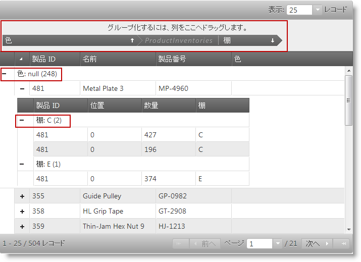

import ApiLink from 'docs-template/components/mdx/ApiLink.astro';

# グループ化の概要 (igHierarchicalGrid)

## トピックの概要
### 目的

igHierarchicalGrid™ コントロールのグループ化機能を紹介し、この機能の設定項目に関する概要を示します。

#### このトピックの内容

このトピックは、以下のセクションで構成されます。

-   [概要](#introduction)
-   [グループ化構成の概要](#summary)
-   [関連コンテンツ](#related-content)

##  概要

### igHierarchicalGrid におけるグループ化の概要

igHierarchicalGrid コントロールは、連携して機能するフラットなグリッド オブジェクトの集合体 (igGrid™) として実装されています。グループ機能は、階層グリッド内でフラットなグリッドがいくつもネスティングされているという状況にも対処できるように強化されています。

igHierarchicalGrid コントロールは列グループ化機能をサポートしています。ユーザーは、1 つまたは複数の列値をグループ化の基準 (たとえば、第 1 基準、第 2 基準、…等々) にしてグリッド列をグループ化することができ、複数の列値をグループ化の基準として選択した場合には、さらに各グループ内のレコードをグループ化することもできます。

igHierarchicalGrid におけるグループ化の仕組みは、Microsoft® Office Outlook® のグループ化機能と同じです。グループ化の基準として使用したい列をグリッドの上にある特別なグループ化基準領域にドラッグしてください。すると、選択した列値によってグリッド列がグループ化されて並べ替えられます　(グループは、当該の列値の種類と同じ数だけ作成されます)。また、各グループの内部でもレコードの並び替えが行われます。すでに存在するグループに追加の列をドロップすると、さらに各グループが細かくグループ化されます。

igGridGroupBy™ ウィジェットを使用することにより、カスタムのグループ化メソッドを定義/実装/管理できます。

次のスクリーンショットは、ルート レベルで Color 列の値を使用してグリッド内のデータをグループ化して並べ替えた階層グリッドを示したものです。つまり、このグリッドはルート レベルで Color 列によってグループ化されています。このグリッドの子のレベルに表示されているデータは、Shelf 列によるグループ化が設定されている ProductInventories テーブルのデータです。グループ化基準領域 (この領域が有効になっている場合) とグループ ヘッダー行には、グループ化の基準として使用されている列が、それぞれの列値とともに表示されます。

##  グループ化構成の概要
#### グループ化構成の概要図

igHierarchicalGrid コントロールに関連した igGridGroupBy ウィジェットのユーザー設定オプション。

| 構成可能な要素 | 詳細 | プロパティ |
| --- | --- | --- |
| グループ化モード | igGridGroupBy ウィジェットはローカルおよびリモートのグループ化モードに対応しています。 | jQuery: <ApiLink type="iggridselection_hg" label="type" /> MVC: [Type](Infragistics.Web.Mvc~Infragistics.Web.Mvc.GridGroupBy~Type.html) |
| 列の設定 | このオプションを使用すると、各列のグループ化基準を別個に設定できます。 | jQuery: <ApiLink type="iggridselection_hg" label="columnSettings" /> MVC: [ColumnSettings](Infragistics.Web.Mvc~Infragistics.Web.Mvc.GridGroupBy~ColumnSettings.html) |
| グループの集計 | グループの集計には、個々のグループに固有な情報 (たとえば、そのグループに含まれる列数といった情報) が表示されます。 | jQuery: <ApiLink type="iggridselection_hg" label="summarySettings" /> MVC: [SummarySettings](Infragistics.Web.Mvc~Infragistics.Web.Mvc.GridGroupBy~SummarySettings.html) |
| グループ化される行テキストのテンプレート | グループ化される行テキストのテンプレート。 | jQuery: <ApiLink type="iggridselection_hg" label="groupedRowTextTemplate" /> MVC: [GroupedRowTextTemplate](Infragistics.Web.Mvc~Infragistics.Web.Mvc.GridGroupBy~GroupedRowTextTemplate.html) |
| クライアント イベント | igGridGroupBy ウィジェットには、そのライフサイクル中に処理できる特殊なイベントがあります。こうしたイベントは、次のような場合に発生します。 グループ化アクションが開始したとき。(キャンセル可能) グループ化アクションが終了したとき。 | jQuery: <ApiLink type="iggridselection_hg" label="groupedColumnsChanging" /> <ApiLink type="iggridselection_hg" label="groupedColumnsChanged" /> |
| 外観 | グループ インジケーターのルック アンド フィールや各インジケーターのテキストを変更するための機能が数多く用意されています。 | jQuery: <ApiLink type="iggridselection_hg" label="groupByAreaVisibility" /> <ApiLink type="iggridselection_hg" label="initialExpand" /> <ApiLink type="iggridselection_hg" label="emptyGroupByAreaContent" /> <ApiLink type="iggridselection_hg" label="expansionIndicatorVisibility" /> <ApiLink type="iggridselection_hg" label="groupByLabelWidth" /> <ApiLink type="iggridselection_hg" label="labelDragHelperOpacity" /> <ApiLink type="iggridselection_hg" label="indentation" /> <ApiLink type="iggridselection_hg" label="expandTooltip" /> <ApiLink type="iggridselection_hg" label="collapseTooltip" /> <ApiLink type="iggridselection_hg" label="removeButtonTooltip" /> MVC: [GroupByAreaVisibility](Infragistics.Web.Mvc~Infragistics.Web.Mvc.GridGroupBy~GroupByAreaVisibility.html) [InitialExpand](Infragistics.Web.Mvc~Infragistics.Web.Mvc.GridGroupBy~InitialExpand.html) [EmptyGroupByAreaContent](Infragistics.Web.Mvc~Infragistics.Web.Mvc.GridGroupBy~EmptyGroupByAreaContent.html) [ExpansionIndicatorVisibility](Infragistics.Web.Mvc~Infragistics.Web.Mvc.GridGroupBy~ExpansionIndicatorVisibility.html) [GroupByLabelWidth](Infragistics.Web.Mvc~Infragistics.Web.Mvc.GridGroupBy~GroupByLabelWidth.html) [LabelDragHelperOpacity](Infragistics.Web.Mvc~Infragistics.Web.Mvc.GridGroupBy~LabelDragHelperOpacity.html) [Indentation](Infragistics.Web.Mvc~Infragistics.Web.Mvc.GridGroupBy~Indentation.html) [ExpandTooltip](Infragistics.Web.Mvc~Infragistics.Web.Mvc.GridGroupBy~ExpandTooltip.html) [CollapseTooltip](Infragistics.Web.Mvc~Infragistics.Web.Mvc.GridGroupBy~CollapseTooltip.html) [RemoveButtonTooltip](Infragistics.Web.Mvc~Infragistics.Web.Mvc.GridGroupBy~RemoveButtonTooltip.html) |

##  関連コンテンツ

### トピック
このトピックの追加情報については、以下のトピックも合わせてご参照ください。

- [グループ化の有効化と構成](/ighierarchicalgrid-grouping-enabling-and-configuring): このトピックでは、コード例を使用して、 jQuery および MVC の両方で igHierarchicalGrid™ コントロールのグループ化機能を有効にして構成する方法を示します。
- <ApiLink type="iggridselection_hg" label="igGridGroupBy jQuery リファレンス" />: igGridGroupBy コントロールに関する jQuery オプション、メソッド、イベント、およびスタイル クラスのリファレンスです。

