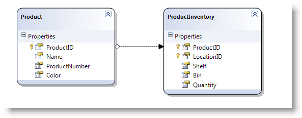

import ApiLink from 'docs-template/components/mdx/ApiLink.astro';

# ロードオンデマンド (igHierarchicalGrid)


## トピックの概要
## 目的
このトピックでは、オン デマンドでデータを一度に *igHierarchicalGrid*™ に読み込む方法を 2 通り紹介します。

## このトピックの内容
このトピックは、以下のセクションで構成されます。

-   [概要](#introduction)
-   [データ セット全体の読み込み](#wholeDataSet)
    -   [jQuery でのデータ セット全体の読み込み](#wholeDataSetJQuery)
    -   [MVC でのデータ セット全体の読み込み](#wholeDataSetMVC)
-   [データのオン デマンド読み込み](#loadOnDemand)
    -   [jQuery でのデータのオン デマンド読み込み](#loadOnDemandJQuery)
    -   [MVC でのデータのオン デマンド読み込み](#loadOnDemandMVC)
        -   [MVC でのロード オン デマンド パラメーターの読み込み](#loadOnDemandParams)
-   [関連トピック](#relTopics)
-   [関連サンプル](#relSamples)

## <a id="introduction"></a> 概要
ロード オン デマンドがクライアントで無効になっている場合、データ セット全体がサーバーから取得されます。ロード オン デマンドが有効な場合、必要なデータ セットのみ取得されます。JSON 形式では、ロード オン デマンドが有効な場合、子データのない JSON ファイルが生成されます。

&#123;environment:ProductName&#125; または &#123;environment:ProductNameMVC&#125; のどちらかが使用されているかにより、igHierarchicalGrid に対するロード オン デマンドの動作が異なります。ウィジェットにはロード オン デマンドの特定のプロパティはありませんが、oData プロトコルを使用してこの効果を得ることができます。つまり、データはそのプロトコルをサポートしているリモート サーバーから取得される必要があります。

一方 &#123;environment:ProductNameMVC&#125; Hierarchical Grid には Load On Demand プロパティがあり、そのプロパティが true に設定されている場合、コントロールは要求されたレイアウトのデータのみをクライアントに送信します。

次に続くテキスト ブロックは、これら 2 種類のアプローチをそれぞれ実装する方法を示しています。

## <a id="wholeDataSet"></a> データ セット全体の読み込み 
### <a id="wholeDataSetJQuery"></a> jQuery でのデータ セット全体の読み込み 
jQuery でデータ セット全体を一度に読み込むには、次が必要です。

-   階層 Adventureworks データなど JSON の階層データ ソース
-   バインド レベルの設定

 

**JavaScript の場合:**

```js
$("#gridAllData").igHierarchicalGrid({
    odata: false,
    initialDataBindDepth: 1,
    dataSource: jsonAllData
}
```

**注:**

データ ソースの階層レベルも `1` の場合、`initialDataBindDepth` の値を `1` に設定します。データ ソースのレベル数がわからない場合、値を `-1` に設定します。これは、igHierarchicalGrid がすべてのレベルをバインドすることを意味します。

### <a id="wholeDataSetMVC"></a> MVC でのデータ セット全体の読み込み 
MVC の場合は、データをオン デマンドで読み込まないよう構成します (`LoadOnDemand = false`)。

**C# の場合:**

```csharp
GridModel allDataGridModel = new GridModel();
allDataGridModel.LoadOnDemand = false;
```

## <a id="loadOnDemand"></a> データのオン デマンド読み込み 
### <a id="loadOnDemandJQuery"></a> jQuery でのデータのオン デマンド読み込み 
jQuery のすべてのデータをオン デマンドで読み込むには、次が必要です。

-   oData Adventureworks Data など JSON の階層データ ソース
-   「`oData`」プロパティを `true` に設定します。これは、oData プロトコルを使用してデータをオン デマンドで読み込むことを意味します。
-   データをオン デマンドで読み込む場合、最初に親データのみ読み込まれるため、igHierarchicalGrid のバインド レベルをゼロに設定します。

     

**JavaScript の場合:**

```js
$("#gridAllData").igHierarchicalGrid({
    odata: true,
    initialDataBindDepth: 0,
    dataSource: jsonoData
});
```


### <a id="loadOnDemandMVC"></a> MVC でのデータのオン デマンド読み込み 
MVC でロード オン デマンドを構成する場合、igHierarchicalGrid は View で初期化できません。代わりに、すべての igHierarchicalGrid プロパティを Controller または Model のいずれかで設定する必要があります。jQuery のすべてのデータをオン デマンドで読み込むには、`LoadOnDemand` プロパティを `true` に設定し、`GetData` メソッドを呼び出します。

レイアウトごとに、必要なデータを返すメソッドを用意します。これは、2 つのレベルの階層を持つ igHierarchicalGrid がある場合、親データを返すメソッドが 1 つ、子レイアウトのデータを返すメソッドが 1 つ必要なことを意味します。

**C# の場合:**

```csharp
public ActionResult Index()
{
    GridModel productModel = GetProductModel();
    return View(productModel);
}
/* configures the parent layout */ 
private GridModel GetProductModel()
{
    GridModel gridModel = new GridModel();
    gridModel.AutoGenerateColumns = true;
    gridModel.AutoGenerateLayouts = false;
    gridModel.LoadOnDemand = true;
    gridModel.DataSourceUrl = Url.Action("BindProduct");
    GridColumnLayoutModel childModel = GetProductInventoryModel();
    gridModel.ColumnLayouts.Add(childModel);
    
    return gridModel;
}


/* configures the child layout */ 


private GridColumnLayoutModel GetProductInventoryModel()
{
    GridColumnLayoutModel childModel = new GridColumnLayoutModel();
    childModel.Key = "ProductInventory";
    childModel.PrimaryKey = "LocationId";
    childModel.ForeignKey = "ProductId";
    childModel.DataSourceUrl = Url.Action("BindProductInventory");


    return childModel;
}
```

`DataSourceUrl` メソッドは、igHierarchicalGrid で必要なため `JSONResult` 形式でデータを返すはずです。igHierarchicalGrid にはそのような機能を備えたメソッド [GetData()](Infragistics.Web.Mvc~Infragistics.Web.Mvc.GridModel~GetData%28%29.html) があります。したがって、ソースからデータを取得し、そのデータを igHierarchicalGrid に設定して、そのメソッドを呼び出すだけです。

**コード リスト 1**: 親レベルのデータを返すメソッド

**C# の場合:**

```csharp
public JsonResult BindProduct()
{
    var ctx = new AdventureWorksDataContext(@"ConnString");
    var ds = ctx.Products.Take(3);
    GridModel productModel = GetProductModel();
    productModel.DataSource = ds;
    return productModel.GetData();
}
```

**コード リスト 2**: 子レベルのデータを返すメソッド

**C# の場合:**

```csharp
public JsonResult BindProductInventory(string path, string layout)
{
    var ctx = new AdventureWorksDataContext(@"ConnString");
    var ds = ctx.ProductInventories;
    GridColumnLayoutModel productInventoryModel = GetProductInventoryModel();
    productInventoryModel.DataSource = ds;
    return productInventoryModel.GetData(path, layout);
}
```

子レイアウトをオンデマンドでバインドする場合、**コード リスト 2** のように子の `GridColumnLayoutModel` インスタンスを使用する必要があります。 

### <a id="loadOnDemandParams"></a> MVC でのロード オン デマンド パラメーターの読み込み 

igHierarchicalGrid がオン デマンドでデータを読み込む場合、内部要求を行い、必要なパラメーターを設定します。これらのパラメーターは、どのレイアウト データが必要かメソッドに指示します。MVC igHierarchicalGrid ラッパーはこれを内部処理するため、これらのパラメーターを指定したデータ メソッドを定義し、それらを `GetData` メソッドに渡すだけです。(コード リスト 2) パラメーター:

-   パス
-   レイアウト

パスの形式は `PrimaryKeyID/ChildKeyID1/childKeyID2[layout_name]` です。たとえば、パスの形式が「`1[0]/2[0]`」の場合、2 番目の親行の最初のレイアウトの 3 番目の子行の最初の子レイアウトを指定していることになります。

空のルートはルート グリッドを返すため、親グリッドのデータ メソッドを呼び出す場合 (コード リスト 1)、パラメーターを指定する必要はありません。

上記 2 つの例 (コード リスト 1 およびコード リスト 2) では、データの関係は次のとおりです。



## <a id="relTopics"></a> 関連トピック 
- [igHierarchicalGrid の概要](/ighierarchicalgrid-overview)
- [igHierarchicalGrid の初期化](/ighierarchicalgrid-initializing)
- <ApiLink type="ighierarchicalgrid" label="igHierarchicalGrid プロパティ リファレンス" />

## <a id="relSamples"></a> 関連サンプル 
- [igHierarchicalGrid ロード オン デマンド](&#123;environment:SamplesUrl&#125;/hierarchical-grid/load-on-demand)
