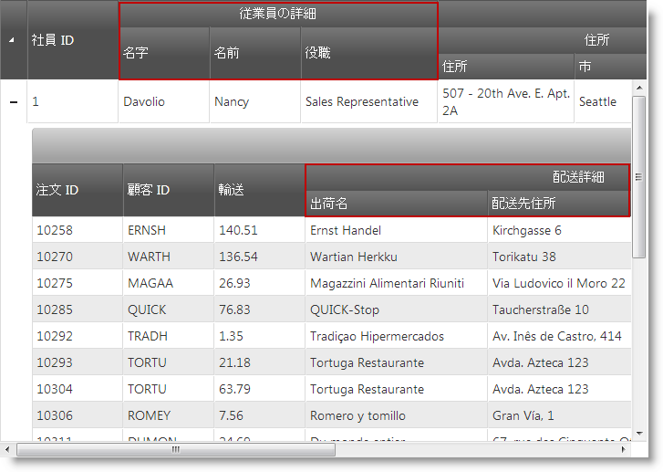
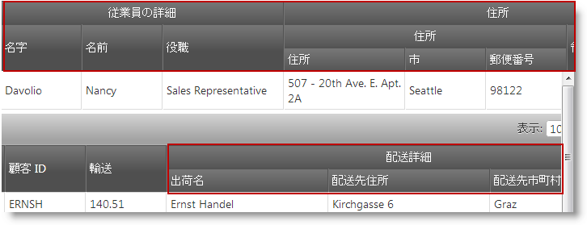
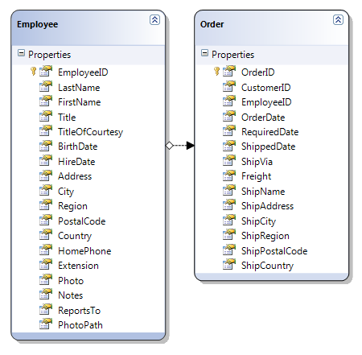

import ApiLink from 'docs-template/components/mdx/ApiLink.astro';

# 複数列ヘッダーの構成 (igHierarchicalGrid)


## トピックの概要
### 目的

このトピックでは、igHierarchicalGrid™ 複数列ヘッダー機能の構成方法について説明します。

#### 前提条件

このトピックを理解するために、以下のトピックを参照することをお勧めします。

- [igHierarchicalGrid の概要](/ighierarchicalgrid-overview): このトピックでは、機能、データ ソースへのバインド、要件、テンプレート、相互作用に関する情報を含めて、*igHierarchicalGrid* コントロールの概要を示します。
- [igHierarchicalGrid の初期化](/ighierarchicalgrid-initializing): このトピックでは、jQuery と MVC 両方の *igHierarchicalGrid* の初期化方法を示しています。
- [複数列ヘッダー (igGrid)](/iggrid-multicolumnheaders-multicolumnheaders): このトピックでは、*igGrid* の複数列ヘッダー機能について説明します。

#### このトピックの内容

このトピックは、以下のセクションで構成されます。

-   [概要](#introduction)
-   [JavaScript での複数列ヘッダーの構成](#headers-in-javascript)
-   [ASP.NET MVC での複数列ヘッダーの構成](#headers-in-mvc)
-   [関連コンテンツ](#related-content)

## 概要

### 複数列ヘッダーの概要

複数列ヘッダー機能は、ヘッダーのグループ化機能を実現します。*columns* 配列で、各オブジェクトには <ApiLink type="iggrid_hg" label="group" /> という新しいオプションがあります。このオプションには、列定義の配列を指定できます。group オプションはカスケードしています。つまり、複数列ヘッダーをまとめてグループ化できるということです。グループ化された列を定義する場合、<ApiLink type="iggrid_hg" label="headerText" />、<ApiLink type="iggrid_hg" label="key" />、および <ApiLink type="iggrid_hg" label="rowspan" /> の各オプションを設定できます。`headerText` オプションを使用してグループ キャプションを設定します。key を使用して列グループを特定し、`rowspan` を使用してグループ ヘッダー セルの範囲を調整できます。この機能は、columns 配列のオブジェクトから公開されています。ただし、他の機能と同様、複数列ヘッダー機能を features 配列に追加し、またその機能固有の必要な JavaScript ファイルを参照する必要があります。以下のスクリーンショットでは、igHierarchicalGrid のルート レイアウトに FirstName、`LastName`、および Title の各列に構成された複数列ヘッダーがあります。子レイアウトでは、`ShipName`、`ShipAddress`、`ShipCity`、および `ShipCountry` の各列に構成された複数列ヘッダーがあります。



> 注: 階層グリッド `columns` オプション API `$(“.selector”).igHierarchicalGrid(“option”, “columns”)` および `columnLayouts` オプション API `$(“.selector”).igHierarchicalGrid(“option”, “columnLayouts”)` を使用して、複数列ヘッダー階層を取得できます。

## JavaScript での複数列ヘッダーの構成
### 概要

ここでは、igHierarchicalGrid で複数列ヘッダーを構成するプロセスの手順について説明します。

### プレビュー

以下のスクリーンショットは最終結果のプレビューです。



### 手順

以下の手順は、igHierarchicalGrid における複数列ヘッダーの構成方法を示します。


1. 必要な JavaScript および CSS ファイルを参照します。

	以下のコード スニペットは、Infragistics Loader を使用して複数列ヘッダー機能を参照しています。
	
	**HTML の場合:**
	
```html
	<script src="jquery.min.js" type="text/javascript"></script>
	<script src="jquery-ui.min.js" type="text/javascript"></script> 
	<script src="infragistics.loader.js"></script>
```
	
	**JavaScript の場合:**
	
```js
	<script type="text/javascript">
	    $.ig.loader({
	        scriptPath: "http://localhost/ig_ui/js/",
	        cssPath: "http://localhost/ig_ui/css/",
	        resources: "igHierarchicalGrid.MultiColumnHeaders"
	    });
	</script>
```

2. サンプル データを定義します。

	次、オブジェクトの JavaScript 配列を作成し、igHierarchicalGrid をバインドします。
	
	**JavaScript の場合:**
	
```js
	var northwind = [{
	      "EmployeeID": 1,
	      "LastName": "Davolio",
	      "FirstName": "Nancy",
	      "Title": "Sales Representative",
	      "TitleOfCourtesy": "Ms.",
	      "BirthDate": "/Date(-664761600000)/",
	      "HireDate": "/Date(704678400000)/",
	      "Address": "507 - 20th Ave. E.rnApt. 2A",
	      "City": "Seattle",
	      "Region": "WA",
	      "PostalCode": "98122",
	      "Country": "USA",
	      "HomePhone": "(206) 555-9857",
	      "Extension": "5467",
	      "Notes": "Education includes a BA in psychology from Colorado State University in 1970.",
	      "ReportsTo": 2,
	      "PhotoPath": "http://accweb/emmployees/davolio.bmp",
	      "Orders": [{
	                  "OrderID": 10258,
	                  "CustomerID": "ERNSH",
	                  "EmployeeID": 1,
	                  "OrderDate": "/Date(837561600000)/",
	                  "RequiredDate": "/Date(839980800000)/",
	                  "ShippedDate": "/Date(838080000000)/",
	                  "ShipVia": 1,
	                  "Freight": "140.5100",
	                  "ShipName": "Ernst Handel",
	                  "ShipAddress": "Kirchgasse 6",
	                  "ShipCity": "Graz",
	                  "ShipRegion": null,
	                  "ShipPostalCode": "8010",
	                  "ShipCountry": "Austria"
	            }
	    ]}, {
	      "EmployeeID": 2,
	      "LastName": "Fuller",
	      "FirstName": "Andrew",
	      "Title": "Vice President, Sales",
	      "TitleOfCourtesy": "Dr.",
	      "BirthDate": "/Date(-563846400000)/",
	      "HireDate": "/Date(713750400000)/",
	      "Address": "908 W. Capital Way",
	      "City": "Tacoma",
	      "Region": "WA",
	      "PostalCode": "98401",
	      "Country": "USA",
	      "HomePhone": "(206) 555-9482",
	      "Extension": "3457",
	      "Notes": "Andrew received his BTS commercial in 1974.",
	      "ReportsTo": null,
	      "PhotoPath": "http://accweb/emmployees/fuller.bmp",
	      "Orders": [{
	                  "OrderID": 10265,
	                  "CustomerID": "BLONP",
	                  "EmployeeID": 2,
	                  "OrderDate": "/Date(838252800000)/",
	                  "RequiredDate": "/Date(840672000000)/",
	                  "ShippedDate": "/Date(839808000000)/",
	                  "ShipVia": 1,
	                  "Freight": "55.2800",
	                  "ShipName": "Blondel pu00e8re et fils",
	                  "ShipAddress": "24, place Klu00e9ber",
	                  "ShipCity": "Strasbourg",
	                  "ShipRegion": null,
	                  "ShipPostalCode": "67000",
	                  "ShipCountry": "France"
	        }
	    ]}];
```

3. HTML プレースホルダーを定義

	**HTML の場合:**
	
```html
	<table id="grid1"></table>
```

4. igHierarchicalGrid のインスタンスを作成します

	以下のコードでは、ルート レイアウトに 2 つのグループが定義されています。最初のグループは「**Employee Details**」という名前で、`LastName` 列と `FirstName` 列が入っています。
	
	2 番目のグループは「**Address Information**」という名前で、`Country` 列と `Region` 列、さらに別のグループ列が入っています。インナー グループは「**Local Address**」というグループで、`Address`、`City`、および `PostalCode` という列が含まれています。
	
	**Orders** レイアウトでは、複数列ヘッダー グループは 1 つです。その名前は「**Ship Details**」で、`ShipName`、`ShipAddress`、`ShipCity`、および `ShipCountry` の各列が入っています。
	
	**JavaScript の場合:**
	
```js
	$.ig.loader(function () {
	    $("#grid1").igHierarchicalGrid({
	        features: [
	            {
	                name: "MultiColumnHeaders",
	                inherit: true
	            }
	        ],
	        initialDataBindDepth: -1,
	        dataSource: northwind,
	        autoGenerateColumns: false,
	        primaryKey: "EmployeeID",
	        columns: [
	            { key: "EmployeeID", headerText: "Employee ID", dataType: "number", width: "100px" },
	            { headerText: "Employee Details",
	                group: [
	                    { key: "LastName", headerText: "Last Name", width: "100px" },
	                    { key: "FirstName", headerText: "First Name", width: "100px" }
	                ]
	            },
	            { headerText: "Address Information",
	            group: [
	                { headerText: "Local Address",
	                group: [
	                { headerText: "Address", key: "Address", width: "150px" },
	                { headerText: "City", key: "City", width: "100px" },
	                { headerText: "Postal Code", key: "PostalCode", width: "100px" }
	                ]},
	                { headerText: "Region", key: "Region", width: "80px" },
	                { headerText: "Country", key: "Country", width: "80px" }
	            ]}
	        ],
	        childrenDataProperty: "Orders",
	        autoGenerateLayouts: false,
	        columnLayouts: [
	            {
	                key: "Orders",
	                autoGenerateColumns: false,
	                primaryKey: "OrderID",
	                columns: [
	                    { key: "OrderID", headerText: "Order ID", width: "60px" },
	                    { headerText: "Ship Details",
	                        group: [
	                            { key: "ShipName", headerText: "Ship Name", width: "200px" },
	                            { key: "ShipAddress", headerText: "Ship Address", width: "200px" },
	                            { key: "ShipCity", headerText: "Ship City", width: "100px" },
	                            { key: "ShipCountry", headerText: "Ship Country", width: "100px" }
	                        ]
	                    },
	                    { key: "Freight", headerText: "Freight", width: "100px" }
	                ]
	            }
	        ]
	    });
	});
```


## ASP.NET MVC での複数列ヘッダーの構成
### 概要

ここでは、igHierarchicalGrid で複数列ヘッダーを構成するプロセスの手順について説明します。

### プレビュー

以下のスクリーンショットは最終結果のプレビューです。


### 要件

この手順を実行するには、以下が必要です。

-   Microsoft® Visual Studio 2012 またはそれ以降のバージョンのインストール
-   MVC 4 Framework 以降のインストール
-   Northwind データベースのインストール
-   ASP.NET MVC プロジェクトに追加された Infragistics.Web.Mvc.dll
-   ASP.NET MVC プロジェクトに追加された &#123;environment:ProductName&#125; JavaScript およびテーマ ファイル

### 手順

以下の手順は、igHierarchicalGrid で複数列ヘッダーの構成方法を示します。

1. 必要な JavaScript および CSS ファイルを参照する。

	`Index.cshtml` ビューで、必要な JavaScript 参照を追加して、Infragistics ローダーのインスタンスを作成します。

	次のコード スニペットは、Infragistics Loader を使用して複数列ヘッダー機能を参照しています。

	**HTML の場合:**

```html
	<script src="jquery.min.js" type="text/javascript"></script>
	<script src="jquery-ui.min.js" type="text/javascript"></script> 
	<script src="infragistics.loader.js"></script>
```

	**C# の場合:**

```csharp
	@Html.Infragistics()
	.Loader()
	.ScriptPath("http://localhost/ig_ui/js/")
	.CssPath("http://localhost/ig_ui/css/")
	.Resources("igGrid.MultiColumnHeaders")
	.Render()
```

2. モデルを定義する。

	Northwind Database に Employees テーブルと Orders テーブルの ADO.NET Entity Data Model を追加して `NorthwindModel` という名前を付けます。

	

3. ビューを定義する。

	`Index.cshtml` ビューを開き、以下のコードを追加します。

	コードでは、ルート レイアウトに 2 つのグループが定義されています。最初のグループは「**Employee Details**」という名前で、`LastName` 列と `FirstName` 列が入っています。

	2 番目のグループは「**Address Information**」という名前で、`Country` 列と `Region` 列、さらに別のグループ列が入っています。インナー グループは「**Local Address**」というグループで、`Address`、`City`、および `PostalCode` という列が含まれています。

	Orders レイアウトでは、複数列ヘッダー グループは 1 つです。その名前は「**Ship Details**」で、`ShipName`、`ShipAddress`、`ShipCity`、および `ShipCountry` の各列が入っています。

	**C# の場合:**

```csharp
	@Html.Infragistics().Grid(Model)
	.ID("grid1")
	.LoadOnDemand(false)
	.AutoGenerateLayouts(false)
	.AutoGenerateColumns(false)
	.ColumnLayouts(layouts =>
	{
		layouts.For(x => x.Orders)
		.AutoGenerateColumns(false)
		.AutoGenerateLayouts(false)
		.Columns(cols =>
		{
			cols.For(x => x.OrderID).Width("100px").HeaderText("Order ID");
			cols.MultiColumnHeader().HeaderText("Ship Details").Group(c =>
			{
				c.For(x => x.ShipName).Width("200px").HeaderText("Ship Name");
				c.For(x => x.ShipAddress).Width("200px").HeaderText("Ship Address");
				c.For(x => x.ShipCity).Width("100px").HeaderText("Ship City");
				c.For(x => x.ShipCountry).Width("100px").HeaderText("Ship Country");
			});
			cols.For(x => x.Freight).Width("100px").HeaderText("Freight");
		})
		.Features(feature =>
		{
			feature.MultiColumnHeaders();
		});
	})
	.Columns(cols =>
	{
		cols.For(x => x.EmployeeID).Width("100px").HeaderText("Employee ID");
		cols.MultiColumnHeader().HeaderText("Employee Details").Group(c =>
		{
			c.For(x => x.LastName).Width("100px").HeaderText("Last Name");
			c.For(x => x.FirstName).Width("100px").HeaderText("FirstName");
		});
		cols.MultiColumnHeader().HeaderText("Address Information").Group(c =>
		{
			c.MultiColumnHeader().HeaderText("Local Address").Group(c2 =>
			{
				c2.For(x => x.Address).Width("150px").HeaderText("Address");
				c2.For(x => x.City).Width("100px").HeaderText("City");
				c2.For(x => x.PostalCode).Width("100px").HeaderText("Postal Code");
			});
			c.For(x => x.Region).Width("80px").HeaderText("Region");
			c.For(x => x.Country).Width("100px").HeaderText("Country");
		});
	})
	.Features(feature => 
	{ 
		feature.MultiColumnHeaders(); 
	})
	.Height("500px")
	.Width("100%")
	.DataBind()
	.Render()
```

4. コントローラーを定義する。

	Home コントローラーの `Index` アクション メソッドで、Northwind データベースから Employees および Orders データを抽出し、それをビューで返します。

	**C# の場合:**

```csharp
	public ActionResult Index()
	{
		var dataContext = new NorthwindDataContext();
		var employees = dataContext.Employees.AsQueryable();
		return View(employees);
	}
```

## 関連コンテンツ
### トピック

このトピックの追加情報については、以下のトピックも合わせてご参照ください。

- [igHierarchicalGrid 機能](/ighierarchicalgrid-features-landingpage): igHierarchicalGrid 機能に関連するトピックのランディング ページです。
- [igHierarchicalGrid 機能の継承](/ighierarchicalgrid-feature-inheritance): igHierarchicalGrid の子レイアウトの機能を継承する方法を示します。
- [行セレクター](/ighierarchicalgrid-row-selectors-landingpage): igHierarchicalGrid 行セレクター機能に関連するトピックのランディング ページです。
- [選択](/jquery-ighierarchical-grid-selection-landing-page): igHierarchicalGrid 選択機能に関連するトピックのランディング ページです。
- [グループ化の概要](/ighierarchicalgrid-grouping-overview): igHierarchicalGrid コントロールのグループ化機能を紹介し、この機能の設定項目に関する概要を示します。

