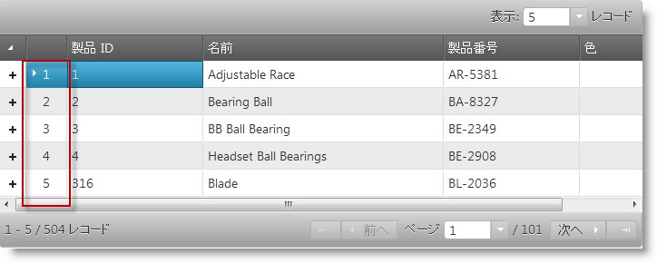
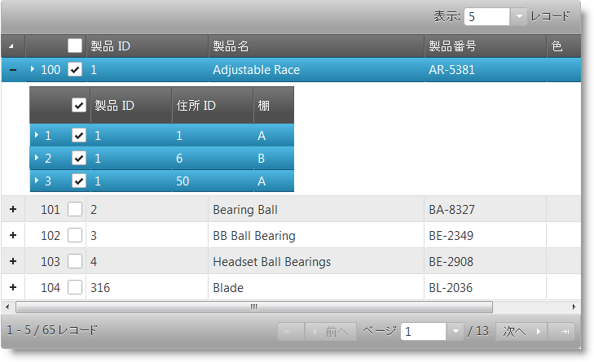
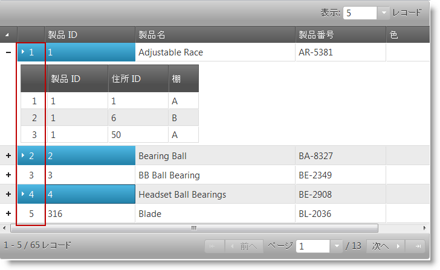
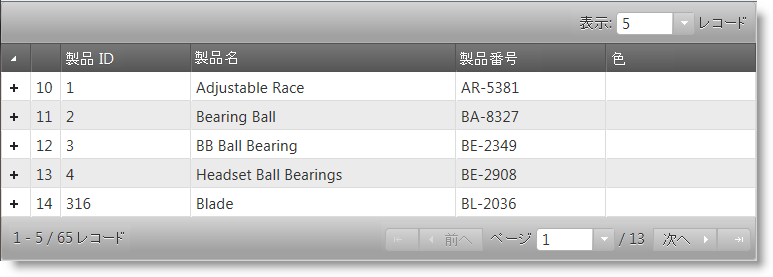
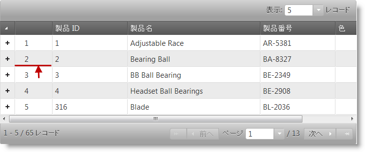

import ApiLink from 'docs-template/components/mdx/ApiLink.astro';

# 行セレクターの構成 (igHierarchicalGrid)

## トピックの概要

### 目的
コード例を使用して、igHierarchicalGrid™ コントロールの行セレクター機能を構成する方法を説明します。

### 前提条件
以下は、このトピックを理解するための前提条件として必要なトピックを示しています。

- [igHierarchicalGrid の概要](/ighierarchicalgrid-overview): 機能、データ バインディング、要件、テンプレート、やりとりを含む、igHierarchicalGrid コントロールについての概念的情報を提供します。
- [igHierarchicalGrid の初期化](/ighierarchicalgrid-initializing): jQuery と MVCの両方を用いた igHierarchicalGrid を初期化する方法を説明します。
- [igHierarchicalGrid 内で行選択を有効にする](/ighierarchicalgrid-enabling-rowselectors): jQuery と ASP.NET MVCの両方を用いた *igHierarchicalGrid* コントロールの行選択を有効にする方法説明します。

### このトピックの内容

このトピックは、以下のセクションで構成されます。

-   [行選択構成の概要](#summary)
-   [複数行選択を有効にする](#enabling-multiple-row-selection)
-   [選択チェックボックスを追加する](#adding-selection-checkboxes)
-   [行の番号付けを有効にする](#enabling-row-numbering)
-   [シードをデフォルト番号付けに構成する](#configuring-seed)
-   [行セレクター列の幅を設定する](#setting-row-selector-column-width)
-   [関連コンテンツ](#related-content)


## <a id="summary"></a> 行選択構成の概要

### 行選択構成チャート

行選択機能の構成可能な側面を示します。これらの側面は、igGridRowSelectors ウィジェットの関連するプロパティを通じて管理されます。ウィジェットの動きと機能についての詳細な説明といくつかの例を表に続けます。

構成可能な要素|詳細|プロパティ
-------------------- | ------- | -----------
複数列の選択|デフォルトでは、複数列の選択は有効化されています。これは igGridSelection コントロールを付いじてコントロールされます。|<ApiLink type="iggridselection_hg" label="multipleSelection" /> (igGridSelection™)
チェックボックスのついた選択|行選択列のチェックボックスを有効にします。|<ApiLink type="iggridrowselectors_hg" label="enableCheckBoxes" />
行の番号付け|有効化されると、行セレクター列の行番号付けが可能です。|<ApiLink type="iggridselection_hg" label="enableRowNumbering" />
行番号開始値|行番号がカスタム値から開始されることを許可|<ApiLink type="iggridselection_hg" label="rowNumberingSeed" />
行セレクター列の幅|行セレクター列の幅を設定する|<ApiLink type="iggridselection_hg" label="rowSelectorColumnWidth" />
構成には選択が必要です。|選択機能が無効になっている場合には、コントロールが例外をスローします。|<ApiLink type="iggridselection_hg" label="requireSelection" />

> **注**: `RowSelectors` の動作はレイアウトによって設定されます。レイアウトは一度に 1 つのみ選択できます。他のレイアウトの行を選択 / チェックする場合、以前のレイアウトで選択した行は選択解除になります。詳細については、[既知の問題と制限 (igHierarchicalGrid)](/ighierarchicalgrid-known-issues) トピックを参照してください。

## <a id="enabling-multiple-row-selection"></a> 複数行選択を有効にする

### 概要

グリッドに対する選択機能を初期化することで、*igHierarchicalGrid* コントロールの行選択機能を用いたセルまたは行の選択が可能になります。これは自動的に選択機能を初期化するわけではないので、必要な場合にそれを有効化する必要があります。行選択は選択機能なしでも、たとえば行番号付けに使うことができます。

### 例

下図において、行選択と選択機能は有効になっています。赤い四角形は行セレクターの列を表します。



### コード

**JavaScript の場合:**

```javascript
$(function () {
    $("#grid").igHierarchicalGrid({
        initialDataBindDepth: 1,
        dataSource: data,
        dataSourceType: "json",
        responseDataKey: "Records",
        autoGenerateColumns: true,
        autoGenerateLayouts: true,
        primaryKey: "ID",
        features: [
            {
                name: "RowSelectors",
                inherit: true
            },
            {
                name: "Selection",
                multipleSelection: true,
                mode: "row"
            }
        ]
    });
});
```

**ASPX の場合:**

```csharp
<%= Html.Infragistics()
        .Grid(Model)
        .ID("grid")
        .Features(features =>
            {
                features.RowSelectors().Inherit(true);
                features.Selection().Mode(SelectionMode.Row).MultipleSelection(true);
                features.Paging().Type(OpType.Local).PageSize(5);
            })
        .AutoGenerateColumns(true)
        .AutoGenerateLayouts(true)
        .DataBind()
        .Render()
%>
```


## <a id="adding-selection-checkboxes"></a> 選択チェックボックスを追加する

### 概要

チェックボックスは、igGridRowSelectors コントロールの `enableCheckBoxes` プロパティを true に設定することで追加されます。チェックボックスが有効になっている時は複数選択を使用することを推奨します。これにより、ユーザーは Ctrl キーを押し続けなくても複数行を選択できるようになります。行セレクター チェックボックスが有効になっている時は、複数選択がページをまたいで続きます。

### 例

下図は、行セレクター チェックボックスが有効な階層的グリッドを示します。赤マルで囲まれた部分は最初の2つのマスター行の上にあるチェックボックスを示します。



### コード

**HTML の場合:**

```html
<script type="text/javascript">
    $(function () {
        $("#grid").igHierarchicalGrid({
            initialDataBindDepth: 1,
            dataSource: data,
            dataSourceType: "json",
            responseDataKey: "Records",
            autoGenerateColumns: true,
            autoGenerateLayouts: true,
            primaryKey: "ID",
            features: [
                {
                    name: "RowSelectors",
                    enableCheckBoxes: true
                    inherit: true
                },
                {
                    name: "Selection",
                    multipleSelection: true,
                    mode: "row"
                },
                {
                    name: "Paging",
                    type: "local"
                }
            ]
        });
    });
</script>
```

**ASPX の場合:**

```csharp
<%= Html.Infragistics()
    .Grid(Model)
    .ID("grid")
    .Features(features =>
        {
            features.RowSelectors().EnableCheckBoxes(true).Inherit(true);
            features.Selection().Mode(SelectionMode.Row).MultipleSelection(true);
            features.Paging().Type(OpType.Local);
        })
    .AutoGenerateColumns(true)
    .AutoGenerateLayouts(true)
    .DataBind()
    .Render()
%>
```


## <a id="enabling-row-numbering"></a> 行の番号付けを有効にする

### 概要

グリッド内の行セレクター列にあるすべての行に連続した行番号をつけることもできます。これは `igGridRowSelectors` ウィジェットの `rowNumbering` オプションを通じて管理されます。

### 例

次のスクリーンショットは、行番号が有効にされたグリッドの表示を示しています。



### コード

**HTML の場合:**

```html
<script type="text/javascript">
    $(function () {
        $("#grid").igHierarchicalGrid({
            initialDataBindDepth: 1,
            dataSource: data,
            dataSourceType: "json",
            responseDataKey: "Records",
            autoGenerateColumns: true,
            autoGenerateLayouts: true,
            primaryKey: "ID",
            features: [
                {
                    name: "RowSelectors",
                    enableRowNumbering: true
                    inherit: true
                },
                {
                    name: "Selection",
                    multipleSelection: true,
                    mode: "row"
                }
            ]
        });
    });
</script>
```

**ASPX の場合:**

```csharp
<%= Html.Infragistics()
    .Grid(Model)
    .ID("grid")
    .Features(features =>
        {
            features.RowSelectors().EnableRowNumbering(true).Inherit(true);
            features.Selection().Mode(SelectionMode.Row).MultipleSelection(true);
            features.Paging().Type(OpType.Local);
        })
    .AutoGenerateColumns(true)
    .AutoGenerateLayouts(true)
    .DataBind()
    .Render()
%>
```


## <a id="configuring-seed"></a> シードをデフォルト番号付けに構成する

### 概要

連続した行番号の先頭番号は、シード値を手動で設定することで行えます。これは`igGridRowSelectors` ウィジェットの `rowNumberingSeed` オプションを通じて管理されます。

### 例

以下のスクリーンショットは、オフセット行番号付けされたグリッドの見え方を示しています。



### コード

**HTML の場合:**

```html
<script type="text/javascript">
    $(function () {
        $("#grid").igHierarchicalGrid({
            initialDataBindDepth: 1,
            dataSource: data,
            dataSourceType: "json",
            responseDataKey: "Records",
            autoGenerateColumns: true,
            autoGenerateLayouts: true,
            primaryKey: "ID",
            features: [
                {
                    name: "RowSelectors",
                    enableRowNumbering: true,
                    rowNumberingSeed: 9,
                    inherit: true
                },
                {
                    name: "Selection",
                    multipleSelection: true,
                    mode: "row"
                }
            ]
        });
    });
</script>
```

**ASPX の場合:**

```csharp
<%= Html.Infragistics()
    .Grid(Model)
    .ID("grid")
    .Features(features =>
        {
            features.RowSelectors().Inherit(true)
                .EnableRowNumbering(true).RowNumberingSeed(9);
            features.Selection().Mode(SelectionMode.Row)
                .MultipleSelection(true);
            features.Paging().Type(OpType.Local);
        })
    .AutoGenerateColumns(true)
    .AutoGenerateLayouts(true)
    .DataBind()
    .Render()
%>
```

## <a id="setting-row-selector-column-width"></a> 行セレクター列の幅を設定する

### 概要

igGridRowSelectors ウィジェットの `rowSelectorColumnWidth` オプションで行セレクター列の幅を設定します。幅の設定はピクセル (`75px`) かまたはパーセント (`10%`) で行われます。値が設定されていなければ、ウィジェットは自動的に適切な値に幅を設定します。

### 例

次のスクリーンショットは、グリッドの行セレクター列の描画を 75 ピクセルの幅に設定しています。幅が拡大されて赤い矢印と線が強調されています。



### コード

**HTML の場合:**

```html
<script type="text/javascript">
    $(function () {
        $("#grid").igHierarchicalGrid({
            initialDataBindDepth: 1,
            dataSource: data,
            dataSourceType: "json",
            responseDataKey: "Records",
            autoGenerateColumns: true,
            autoGenerateLayouts: true,
            primaryKey: "ID",
            features: [
                {
                    name: "RowSelectors",
                    enableRowNumbering: true,
                    rowSelectorColumnWidth: "75px",
                    inherit: true
                },
                {
                    name: "Selection",
                    multipleSelection: true,
                    mode: "row"
                }
            ]
        });
    });
</script>
```

**ASPX の場合:**

```csharp
<%= Html.Infragistics()
    .Grid(Model)
    .ID("grid")
    .Features(features =>
        {
            features.RowSelectors().Inherit(true)
                .EnableRowNumbering(true).RowSelectorsColumnWidth("75px");
            features.Selection().Mode(SelectionMode.Row).MultipleSelection(true);
            features.Paging().Type(OpType.Local);
        })
    .AutoGenerateColumns(true)
    .AutoGenerateLayouts(true)
    .DataBind()
    .Render()
%>
```

## <a id="related-content"></a> 関連コンテンツ

### トピック

このトピックの追加情報については、以下のトピックも合わせてご参照ください。

- [行セレクターを有効にする](/ighierarchicalgrid-enabling-rowselectors): コード例で jQuery および ASP.NET MVC における行選択機能を有効にする方法を示します。
- [既知の問題と制限 (igHierarchicalGrid)](/ighierarchicalgrid-known-issues): このトピックでは、igHierarchicalGrid コントロールの既知の問題と制限事項を説明します。

### サンプル
このトピックについては、以下のサンプルも参照してください。

- [行セレクター](&#123;environment:SamplesUrl&#125;/hierarchical-grid/selection-rowselectors): igHierarchicalGrid で `RowSelectors` を使用する用法について説明します。
