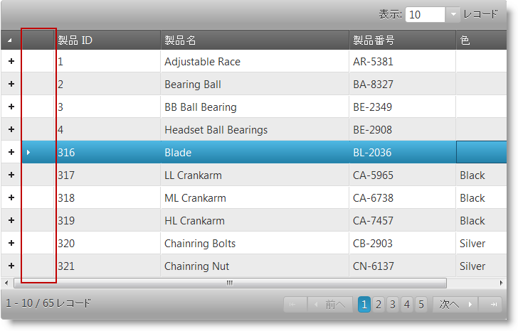

# 行セレクターの有効化 (igHierarchicalGrid)

## トピックの概要

### 目的
コード例を使用して jQuery および ASP.NET MVC で igHierarchicalGrid™ コントロールの行セレクターを有効にする方法を説明します。

### 前提条件
以下の表は、このトピックを理解するための前提条件として必要なトピックを示しています。

トピック|目的
----- | ---------
[igHierarchicalGrid の概要](/ighierarchicalgrid-overview)|機能、データ ソースへのバインド、要件、テンプレート、および相互作用などの情報を含む、igHierarchicalGrid コントロールの概念情報を説明します。
[igHierarchicalGrid の初期化](/ighierarchicalgrid-initializing)|jQuery と MVC による igHierarchicalGrid の初期化方法を示します。

### このトピックの内容
-   [概要](#introduction)
-   [コード例: JQuery における RowSelectors の有効化](#enabling-rowselectors-in-jquery)
-   [コード例: MVC における RowSelectors の有効化](#enabling-rowselectors-in-mvc)
-   [関連コンテンツ](#related-content)

## <a id="introduction"></a> 概要

### 行セレクターの紹介
igRowSelectors™ ウィジットは、別の行選択列を表示してユーザーの行選択を簡単にします。ルートおよび子ビューで最初のデータ列の右に表示される特殊行選択列は、チェックボックス (複数選択を簡単にするため) または／および連続行番号を含むよう構成できます。行セレクターは、ユーザー インターフェイスおよびユーザーのグリッドとの相互作用の点でユーザー エクスペリエンスに関する機能です。実際の選択動作は `igGridRowSelectors` 機能で行います。行セレクター機能は、通常、選択機能と一緒に使用しますが、行の番号付け機能のために単独で使用することもできます。構成すると、選択機能がアクティブになり、ユーザーが行選択セルをクリックするか行選択チェックボックスをチェックすると対応する行を選択します。

以下のスクリーンショットは、行選択が有効なとき *igHierarchicalGrid* コントロールがデータ グリッドを描画する方法を示しています。以下に示すように 行セレクター列は強調のため赤い楕円で囲まれています。



行セレクター機能は、igHierarchicalGrid の features オプションの `name` プロパティで管理されています。行セレクターを有効にするには、name プロパティが `name: RowSelectors` を指すようにします。以下に示すように行セレクターは、有効にしていると、グリッドの展開／縮小ボタン列の右の行選択列の存在で示されます。

行セレクター列は、別の選択機能の構成に応じてユーザーが現在の行を選択するか現在の行の最初のセルをクリックして選択できるようにします。このイベントに対するグリッドの応答は、選択機能の `mode` 設定 `row` または `cell` に依存します。さらに、行選択列にチェックボックスが描画されることがあります。これで複数選択が簡単になります。最後に、一般的なビジネス要件である行の連番をグリッドで描画できます。

> 注: `RowSelectors` の動作はレイアウトによって設定されます。レイアウトは一度に 1 つのみ選択できます。他のレイアウトの行を選択 / チェックする場合、以前のレイアウトで選択した行は選択解除になります。

## <a id="enabling-rowselectors-in-jquery"></a> コード例: JQuery における RowSelectors の有効化

### 説明
jQuery を使用して簡単なデータ配列を作成し、行セレクターを有効にして igHierarchicalGrid をインスタンス化します。

#### コード
次のコードは、グリッドに表示する階層 JavaScript オブジェクトを準備する方法を示します。

**HTML の場合:**

```html
<script type="text/javascript">
    var data = {
        "Records": [{
            "ProductID": 1,
            "Name": "Adjustable Race",
            "ProductNumber": "AR-5381",
            "Color": null,
            "ProductInventories": {
                "Records": [
                    { "ProductID": 1, "LocationID": 1, "Shelf": "A", "Bin": 1, "Quantity": 408 },
                    { "ProductID": 1, "LocationID": 6, "Shelf": "B", "Bin": 5, "Quantity": 324 },
                    { "ProductID": 1, "LocationID": 50, "Shelf": "A", "Bin": 5, "Quantity": 353 }
                ],
                "TotalRecordsCount": 0,
                "Metadata": {}
            }
        }, {
            "ProductID": 2,
            "Name": "Bearing Ball",
            "ProductNumber": "BA-8327",
            "Color": null,
            "ProductInventories": {
                "Records": [
                    { "ProductID": 2, "LocationID": 1, "Shelf": "A", "Bin": 2, "Quantity": 427 },
                    { "ProductID": 2, "LocationID": 6, "Shelf": "B", "Bin": 1, "Quantity": 318 },
                    { "ProductID": 2, "LocationID": 50, "Shelf": "A", "Bin": 6, "Quantity": 364 }
                ],
                "TotalRecordsCount": 0,
                "Metadata": {}
            }
        }]
    };
</script>
```

まず、`$(document).ready()` イベント ハンドラーの中に igHierarchicalGrid コントロールを作成し、その行選択機能を呼び出します。最善の結果を得るにはコントローラの選択機能を有効にすることを推奨します。

> **注:** 選択を無効にしても行セレクターを使用できることに注意してください。これが便利な例の 1 つに行番号の描画があります。例外が発生するのを防ぐため、この構成を使用するとき `requiredSelection()` オプションを false に設定します。

**JavaScript の場合:**

```js
$(function () {
    $("#grid").igHierarchicalGrid({
        initialDataBindDepth: 1,
        dataSource: data,
        dataSourceType: "json",
        responseDataKey: "Records",
        autoGenerateColumns: false,
        autoGenerateLayouts: false,
        primaryKey: "ProductID",
        columns: [
            { key: "ProductID", headerText: "ID", width: "130px" },
            { key: "Name", headerText: "Product Name", width: "265px" },
            { key: "ProductNumber", headerText: "SKU #", width: "150px" },
            { key: "Color", headerText: "Color", width: "150px"}
        ],
        columnLayouts: [
            {
                key: "ProductInventories",
                responseDataKey: "Records",
                autoGenerateColumns: false,
                autoGenerateLayouts: false,
                primaryKey: "LocationID",
                foreignKey: "ProductID",
                columns: [
                    { key: "ProductID", headerText: "ID", width: "100px" },
                    { key: "LocationID", headerText: "Location", width: "100px" },
                    { key: "Shelf", headerText: "Shelf", width: "100px" },
                    { key: "Bin", headerText: "Bin", width: "100px" },
                    { key: "Quantity", headerText: "Quantity", width: "100px" }
                ]
            }
        ],
        features: [
            {
                name: 'RowSelectors',
                enableCheckBoxes: false,
                enableRowNumbering: true,
                inherit: true
            },
            {
                name: 'Selection',
                multipleSelection: true,
                mode: 'row'
            }
        ]
    });
});
```


## <a id="enabling-rowselectors-in-mvc"></a> コード例: MVC における RowSelectors の有効化

### 説明
MVC ヘルパーを使用してコントローラー メソッドを作成して MVC ビューにデータを供給し、行セレクターを有効にして igHierarchicalGrid をインスタンス化します。

### コード
MVC Controller メソッドを作成し、Model からデータを取得して View を呼び出します。

**C# の場合:**

```csharp
public ActionResult Default()
{
    var context = new AdventureWorksDataContext(this.DataRepository.GetDataContext().Connection);
    return View(context.Products);
}
```

**Visual Basic の場合:**

```vb
Public Function [Default]() As ActionResult
    Dim context = New AdventureWorksDataContext(Me.DataRepository.GetDataContext().Connection)
    Return View(context.Products)
End Function
```

行セレクター機能を有効にし igHierarchicalGrid をインスタンス化します。

> **注:** 選択を無効にしても行セレクターを使用できることに注意してください。これが便利な例の 1 つに行番号の描画があります。例外が発生するのを防ぐため、この構成を使用するとき `requiredSelection()` オプションを false に設定します。

**ASPX の場合:**

```csharp
 <%= Html.Infragistics()
        .Grid(Model)
        .ID("grid")
        .Features(features => 
        {
            features.RowSelectors().Inherit(true);
            features.Selection().Mode(SelectionMode.Row).MultipleSelection(true);
        })
        .AutoGenerateColumns(false)
        .Columns(column =>
        {
            column.For(x => x.ProductID).HeaderText("ID").Width("130px");
            column.For(x => x.Name).HeaderText("Name").Width("265px");
            column.For(x => x.ProductNumber).HeaderText("SKU #").Width("150px");
            column.For(x => x.Color).HeaderText("Color").Width("150px");
        })
        .PrimaryKey("ProductID")
        .AutoGenerateLayouts(false)
        .ColumnLayouts(layouts =>
        {
            layouts.For(x => x.ProductInventories)
                .PrimaryKey("LayoutID")
                .ForeignKey("ProductID")
                .AutoGenerateColumns(false)
                .Columns(column =>
                    {
                        column.For(x => x.LocationID).HeaderText("Location");
                        column.For(x => x.Shelf).HeaderText("Shelf");
                        column.For(x => x.Bin).HeaderText("Bin");
                        column.For(x => x.Quantity).HeaderText("Quantity");
                    });
        })
        .DataBind()
        .Render()
%>
```


## <a id="related-content"></a> 関連コンテンツ

### トピック
このトピックに関連する情報を提供する追加トピック。

- [行セレクターの構成 (igHierarchicalGrid)](/ighierarchicalgrid-configuring-rowselectors): コード例を使用して、igHierarchicalGrid コントロールの行セレクター機能を構成する方法を説明します。
- [列とレイアウト (igHierarchicalGrid)](/ighierarchicalgrid-columns-and-layouts): 自動構成を含めて、igHierarchicalGrid コントロールを使用して列とレイアウトを定義する各種の方法を説明します。 

### サンプル
このトピックについては、以下のサンプルも参照してください。

- [行セレクター](&#123;environment:SamplesUrl&#125;/hierarchical-grid/selection-rowselectors): igHierarchicalGrid で RowSelectors を使用する用法について説明します。

