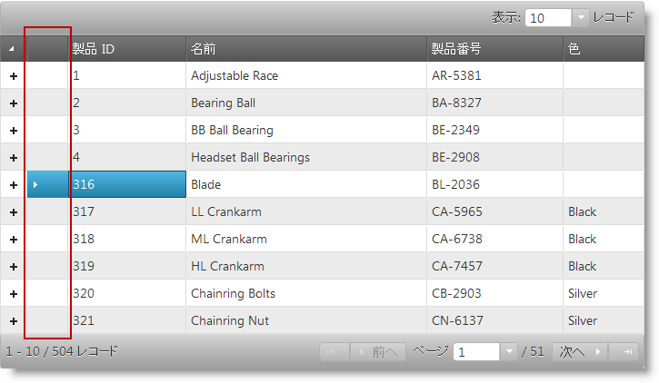

# 行セレクター (igHierarchicalGrid)

## このグループのトピックについて
行セレクターは igHierarchicalGrid™ コントロールの機能です。これは別の行選択列を表示してユーザーの行選択を簡単にします。ルートおよび子ビューで最初のデータ列の右に表示される特殊行選択列は、チェックボックス (複数選択を簡単にするため) または／および連続行番号を含むよう構成できます。行セレクターは、ユーザー インターフェイスおよびユーザーのグリッドとの相互作用の点でユーザー エクスペリエンスに関する機能です。実際の選択動作は `igGridRowSelectors` 機能で行います。行セレクターは通常選択機能と一緒に使用しますが、行の番号付け機能のために単独で使用することもできます。構成すると、選択機能がアクティブになり、ユーザーが行選択セルをクリックするか行選択チェックボックスをチェックすると対応する行を選択します。

以下のスクリーンショットは、行選択が有効なとき igHierarchicalGrid コントロールがデータ グリッドを描画する方法を示しています。以下に示すように 行セレクター列は強調のため赤い楕円で囲まれています。

#### トピック

行セレクター機能の実装を扱う追加トピック。

- [行セレクターを有効にする](/ighierarchicalgrid-enabling-rowselectors): コード例を使用して jQuery および ASP.NET MVC で行セレクターを有効にする方法を説明します。
- [行セレクターの構成](/ighierarchicalgrid-configuring-rowselectors): コード例を使用して、igHierarchicalGrid コントロールの行セレクター機能を構成する方法を説明します。
- [行セレクター イベント](/ighierarchicalgrid-rowselectors-events): igHierarchicalGrid コントロールの行セレクター機能に関連するイベントの追加の参照および使用情報です。
