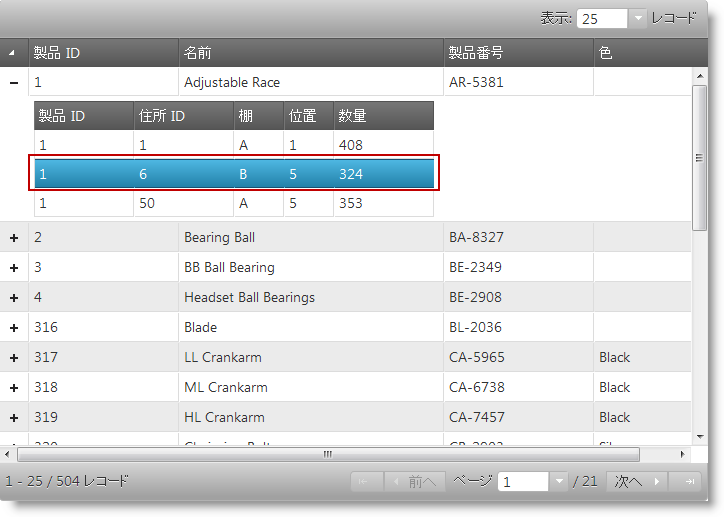
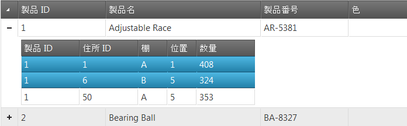
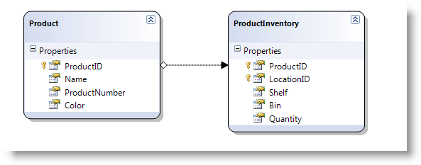

---
title: "選択の有効化 (igHierarchicalGrid)"
slug: jquery-ighierarchical-grid-features-selection-enabling-ighierarchical-grid-selection
---

# 選択の有効化 (igHierarchicalGrid)

## トピックの概要
### 目的

このトピックでは、jQuery と ASP.NET MVC の両方の選択機能を使用した igHierarchicalGrid™ の構成方法について説明します。

### 前提条件

このトピックを理解するためには、以下のトピックを理解しておく必要があります。

- [igHierarchicalGrid の概要](/ighierarchicalgrid-overview): このトピックでは、機能、データ ソースへのバインド、要件、テンプレートなどの情報を含む、igCombo コントロールの概念情報を説明します。
- [igHierarchicalGrid の初期化](/ighierarchicalgrid-initializing): このトピックでは、jQuery と MVC 両方の igHierarchicalGrid™ の初期化方法を示しています。

### このトピックの内容

このトピックは、以下のセクションで構成されます。

-   [概要](#introduction)
-   [JQuery での選択の有効化](#jquery)
-   [ASP.NET MVC での選択の有効化](#mvc)
-   [関連コンテンツ](#related-content)

## <a id="introduction"></a> 概要
### igHierarchicalGrid 選択について

選択機能によって `igHierarchicalGrid` コントロールの行とセルの選択が可能になります。



## <a id="jquery"></a> JQuery での選択の有効化
### 概要
この手順では、JavaScript データ オブジェクトを作成し、jQuery で選択機能を有効にして `igHierarchicalGrid` のインスタンスを作成する方法を示します。

### プレビュー
以下のスクリーンショットは最終結果のプレビューです。



#### 手順

以下の手順では、`igHierarchicalGrid` で選択を有効にする方法を紹介します。

1. スクリプトとスタイル参照の追加

	igHierarchicalGrid を使用するには、結合した `infragistics.lob.js` ファイルにあるそのコード、`infragistics.css` ファイルにあるそのスタイルシート定義、`infragistics.theme.css` にあるテーマ情報を追加する必要があります。また、インフラジスティックス コントロールが依存する jQuery フレームワーク、jQuery UI フレームワーク、および Modernizr も追加する必要があります。そのためには以下のコードを使用します。

	**HTML の場合:**

```html
	<link rel="stylesheet" href="infragistics.css" />
	<link rel="Stylesheet" href="infragistics.theme.css" />
	<link rel="Stylesheet" href="jquery.ui.all.css" />
	<script src="modernizr-1.7.min.js"></script>
	<script src="jquery.min.js"></script>
	<script src="jquery-ui.min.js"></script>
	<script src="infragistics.core.js"></script><script src="infragistics.lob.js"></script>
```

2. データ ソースの設定

	この例で使用するデータ ソースは Java Script オブジェクトです。このオブジェクトには、配列型の 1 つの Records プロパティがあります。プロパティ名として Records を使用することは必須ではありません。プロパティ名は、igHierarchicalGrid で、`responseDataKey` プロパティを通じて構成します。階層を作成するために、サブ オブジェクト中に同じ名前のプロパティを持つオブジェクトを定義する必要があります。以下の例で、data 変数はオブジェクトであり、配列型の 1 つのプロパティ Records を持ちます。オブジェクトの階層を定義するために、Records 配列には、それ自身がオブジェクトである `ProductInventories` プロパティと、Records プロパティがあります。

	**JavaScript の場合:**

```js
	<script type="text/javascript">
		var data = {
			"Records": [{
				"ProductID": 1,
				"Name": "Adjustable Race",
				"ProductNumber": "AR-5381",
				"Color": null,
				"ProductInventories": {
					"Records": [
						{ "ProductID": 1, "LocationID": 1, "Shelf": "A", "Bin": 1, "Quantity": 408 },
						{ "ProductID": 1, "LocationID": 6, "Shelf": "B", "Bin": 5, "Quantity": 324 },
						{ "ProductID": 1, "LocationID": 50, "Shelf": "A", "Bin": 5, "Quantity": 353 }
					],
					"TotalRecordsCount": 0,
					"Metadata": {}
				}
			}, {
				"ProductID": 2,
				"Name": "Bearing Ball",
				"ProductNumber": "BA-8327",
				"Color": null,
				"ProductInventories": {
					"Records": [
						{ "ProductID": 2, "LocationID": 1, "Shelf": "A", "Bin": 2, "Quantity": 427 },
						{ "ProductID": 2, "LocationID": 6, "Shelf": "B", "Bin": 1, "Quantity": 318 },
						{ "ProductID": 2, "LocationID": 50, "Shelf": "A", "Bin": 6, "Quantity": 364 }
					],
					"TotalRecordsCount": 0,
					"Metadata": {}
				}
			}]
		};
	</script>
```

3. HTML プレースホルダーの定義

	igHierarchicalGrid を保持するために使用する HTML の TABLE 要素を定義します。

	**HTML の場合:**

```html
	<table id="grid"></table>
```      

4. 選択機能を有効にした igHierarchicalGrid の作成

	`$(document).ready()` イベント ハンドラーの中で、igHierarchicalGrid のインスタンスを作成し、features 配列中に `Selection` 機能オブジェクトを定義します。階層を担うプロパティ名は、`responseDataKey` で定義されます。

	**JavaScript の場合:**

```js
	<script type="text/javascript">
	$(function () {
		$("#grid").igHierarchicalGrid({
			initialDataBindDepth: 1,
			dataSource: data,
			dataSourceType: "json",
			responseDataKey: "Records",
			autoGenerateColumns: true,
			autoGenerateLayouts: true,
			primaryKey: "ProductID",
			features: [
				{
					name: 'Selection',
					multipleSelection: true,
					mode: 'row'
				}
			]
		});
	});
	</script>
```

## <a id="mvc"></a> ASP.NET MVC での選択の有効化
### 概要

この手順は、ASP.NET MVC で選択機能を有効にして igHierarchicalGrid を作成する方法を示します。

#### プレビュー

以下のスクリーンショットは最終結果のプレビューです。


#### 要件

この手順を実行するには以下のエンティティが必要です。

-   ASP.NET MVC3
-   AdventureWorks データベース

### 手順

以下の手順では、ASP.NET MVC で igHierarchicalGrid の選択機能を有効にする方法を紹介します。


1)  プロジェクトの設定
  1.  新しい MVC 3 プロジェクトを作成します。
  2.  Infragistics.Web.Mvc.dll への参照を追加します。
  3.  プロジェクトに AdventureWorks データベースを追加します。
  4.  以下のコードに示すように、スクリプトとスタイルの参照を追加します。

**HTML の場合:**

```html
<link rel="stylesheet" href="infragistics.css" />
<link rel="Stylesheet" href="infragistics.theme.css" />
<link rel="Stylesheet" href="jquery.ui.all.css" />
<script src="modernizr-1.7.min.js"></script>
<script src="jquery.min.js"></script>
<script src="jquery-ui.min.js"></script>
<script src="infragistics.core.js"></script><script src="infragistics.lob.js"></script>
```

2)  LINQ to SQL モデルの作成

AdventureWorks データベースから LINQ to SQL モデルを作成します。`Product` テーブルと `ProductInventories` テーブルを使用します。



3)  MVC コントローラー メソッドの作成

モデルからデータを取得してビューを呼び出す MVC Controller メソッドを作成します。

**C# の場合:**

```csharp
public ActionResult Default(){
    var ctx = new AdventureWorksDataContext("ConnString");
    var ds = ctx.Products;
    return View("Products", ds);
}
```

4)  選択機能を有効にした igHierarchicalGrid の定義

以下のコードを追加し、選択機能を有効にして igHierarchicalGrid を定義します。

**ASPX の場合:**

```csharp
<%= Html.Infragistics()
        .Grid(Model)
        .ID("grid")
        .Features(features =>
        {
         features.Selection().Mode(SelectionMode.Row).MultipleSelection(true);
        })
        .AutoGenerateColumns(false)
        .AutoGenerateLayouts(false)
        .PrimaryKey("ProductID")
        .DataBind()
        .Render()
%>
```

## <a id="related-content"></a> 関連コンテンツ
### トピック

このトピックの追加情報については、以下のトピックも合わせてご参照ください。

- [igHierarchicalGrid 選択の概要](/jquery-ighierarchical-grid-selection-overview): igHierarchicalGrid の選択機能について説明します。
- [igHierarchicalGrid の列とレイアウト](/ighierarchicalgrid-columns-and-layouts): 自動構成により igHierarchicalGrid の列およびレイアウトを定義する方法を示します。
- [igHierarchicalGrid 機能の継承](/ighierarchicalgrid-feature-inheritance): igHierarchicalGrid の子レイアウトの機能を継承する方法を示します。

### サンプル

このトピックについては、以下のサンプルも参照してください。

- [選択](&#123;environment:SamplesUrl&#125;/hierarchical-grid/selection-rowselectors): このサンプルでは、igHierarchicalGrid の選択の構成について紹介します。
