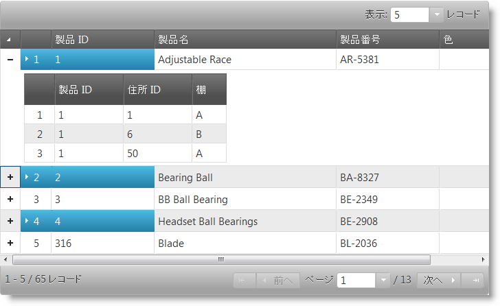

# 選択 (igHierarchicalGrid)

## 概要

選択機能によって、igHierarchicalGrid™ コントロールの行およびセルの選択が可能になります。その機能は Microsoft® Windows Explorer™ および Microsoft® Excel™ の選択およびアクティブ化動作を厳密に踏襲したものです。

階層グリッド選択は、堅牢なクライアント側イベント サポートに付属し、実行時にコントロール動作の管理に必要なツールを提供します。

## トピック

igHierarchicalGrid 選択についての詳細情報は、以下のトピックおよびセクションで説明します。

- [igHierarchicaGrid 選択の概要](/jquery-ighierarchical-grid-selection-overview): このトピックでは、igHierarchicalGrid™ の選択機能の概要について説明します。
- [igHierarchicalGrid 選択の有効化](/jquery-ighierarchical-grid-features-selection-enabling-ighierarchical-grid-selection): このトピックでは、jQuery と ASP.NET MVC の両方の選択機能を使用した igHierarchicalGrid™ の構成方法について説明します。
- [igHierarchicalGrid の行とセルのプログラムによる選択および選択解除](/jquery-ighierarchical-grid-selecting-and-deselecting-rows-and-cell-programmatically-in-ighierarchicalgrid): このトピックでは、igHierarchicalGrid™ の行とセルを選択および選択解除するための API の使用方法について説明します。
