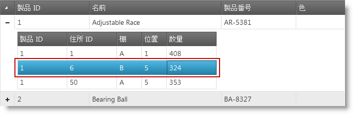
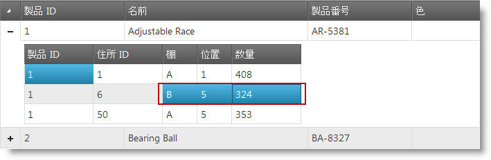

# 選択の概要 (igHierarchicalGrid)

## トピックの概要
### 目的

このトピックでは、igHierarchicalGrid™ の選択機能の概要について説明します。

### 前提条件

このトピックを理解するためには、以下のトピックを理解しておく必要があります。

- [igHierarchicalGrid の概要](/ighierarchicalgrid-overview): このトピックでは、機能、データ ソースへのバインド、要件、テンプレートなどの情報を含む、igCombo コントロールの概念情報を説明します。
- [igHierarchicalGrid の初期化](/ighierarchicalgrid-initializing): このトピックでは、jQuery と MVC 両方の igHierarchicalGrid™ の初期化方法を示しています。

### このトピックの内容

このトピックは、以下のセクションで構成されます。

-   [概要](#introduction)
-   [機能](#features)
    -   [行の選択](#row-selection)
    -   [セル選択](#cell-selection)
-   [関連コンテンツ](#related-content)
  
##  概要

選択機能によって、igHierarchicalGrid™ コントロールの行およびセルの選択が可能になります。その機能は Microsoft® Windows Explorer™ および Microsoft® Excel™ の選択およびアクティブ化動作を厳密に踏襲したものです。

階層グリッド選択は、堅牢なクライアント側イベント サポートに付属し、実行時にコントロール動作の管理に必要なツールを提供します。

> **注:** タッチ式装置でのドラッグ選択機能を有効にするには、自分のページに [jQuery Mobile](http://jquerymobile.com/) ライブラリを含める必要があります。

##  機能

###  行の選択

行の選択を有効にするには、mode プロパティに row を設定することで、選択機能を有効にする必要があります (行の選択はデフォルトの動作であることに注意してください)。

行選択を有効にすると、ユーザーはいずれかの行のセルをクリックして、行を選択できます。activation プロパティに true を設定した場合、キーボードを使用して行を選択できます。行は、API を使用してコードで選択できます。

#### 関連トピック:

-   [igHierarchicalGrid 選択の有効化](/jquery-ighierarchical-grid-features-selection-enabling-ighierarchical-grid-selection)

###  セル選択

セルの選択を有効にするには、選択動作を初期化する際に選択の mode プロパティに cell を設定する必要があります。

セル選択を有効にした後でセルを選択する方法はいくつかあります。まず、セルをクリックするか、キーボードでセルまでナビゲートすることでセルを選択できます。キーボード ナビゲーションは、activation プロパティに true を設定することで有効になります。また、API を使用して、コードでセルを選択および選択解除することもできます。

#### 関連トピック:

-   [igHierarchicalGrid 選択の有効化](/jquery-ighierarchical-grid-features-selection-enabling-ighierarchical-grid-selection)

##  関連コンテンツ
### トピック

このトピックの追加情報については、以下のトピックも合わせてご参照ください。

- [igHierarchicalGrid 選択の有効化](/jquery-ighierarchical-grid-features-selection-enabling-ighierarchical-grid-selection): このトピックでは、jQuery と ASP.NET MVC の両方の選択機能を使用した igHierarchicalGrid™ の構成方法について説明します。
- [igHierarchicalGrid の行とセルのプログラムによる選択および選択解除](/jquery-ighierarchical-grid-selecting-and-deselecting-rows-and-cell-programmatically-in-ighierarchicalgrid): このトピックでは、igHierarchicalGrid の行とセルを選択および選択解除するための API の使用方法について説明します。
- [igGrid 選択](/iggrid-selection-overview): このトピックでは、igGrid の選択機能について説明します。

### サンプル

以下のサンプルでは、このトピックに関連する情報を提供しています。

- [選択](\{environment:SamplesUrl\}/hierarchical-grid/selection-rowselectors): このサンプルでは、igHierarchicalGrid の選択機能の構成について紹介します。

### リソース

以下の資料 (Infragistics のコンテンツ ファミリー以外でもご利用いただけます) は、このトピックに関連する追加情報を提供します。

- [jQuery Mobile](http://jquerymobile.com): jQuery Mobile JavaScript ライブラリのホームページ
