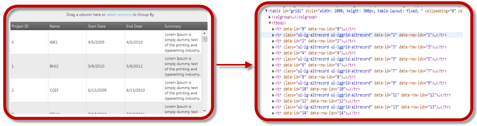

import ApiLink from 'docs-template/components/mdx/ApiLink.astro';

# 仮想化の有効化と構成 (igHierarchicalGrid)

## トピックの概要

### 目的
このトピックでは、コード例と共に、igHierarchicalGrid™ 内の連続仮想化機能を有効化し構成する方法について説明します。


### 仮想化を有効にする方法の概要

#### 仮想化を有効にする方法の概要
- 仮想化は <ApiLink type="iggrid_hg" label="virtualization" /> プロパティを `true` に設定することで有効になります。仮想化のタイプは、<ApiLink type="iggrid_hg" label="virtualizationMode" /> プロパティを continuous に設定することで指定できます。
- 仮想化をタイプの指定をせずに有効化すると、`Continuous` (仮想化タイプのデフォルト) に設定されます。
- 仮想化機能はグリッドで高さが定義されていなければ動作しません。

## 連続仮想化の有効化と構成

### 概要

igGrid コントロールの `virtualization` オプションを `true` に設定し、`virtualization` モードを `continuous` にすることで、仮想化が継続的になります。グリッドの高さは構成可能です。

### 例

次の表は、行の高さが 400 ピクセルの行と列に対し、 `Continuous` 仮想化を設定する方法を示します。

プロパティ|値
-------- | --------
<ApiLink type="iggrid_hg" label="virtualization" />|true
<ApiLink type="iggrid_hg" label="virtualizationMode" />|continuous
<ApiLink type="iggrid_hg" label="height" />|400px



### コード

次のコードは、例 における設定を構成するものです。

**JavaScript の場合:**

```js
$("#hierarchicalGrid1").igHierarchicalGrid({
        virtualization: true,
        virtualizationMode: 'continuous',
        height: '400px'
});
```

**ASPX の場合:**

```csharp
<%= Html.Infragistics().Grid(Model).ID("hierarchicalGrid1").LoadOnDemand(false).AutoGenerateColumns(false).AutoGenerateLayouts(false).PrimaryKey("ProjectID").Columns(column => 
            {
                column.For(x => x.ProjectID)
                  .HeaderText(this.GetGlobalResourceObject("HierarchicalGrid", "ProjectID")
                  .ToString());
                column.For(x => x.Name)
                  .HeaderText(this.GetGlobalResourceObject("HierarchicalGrid", "Name")
                  .ToString());
                column.For(x => x.StartDate)
                  .HeaderText(this.GetGlobalResourceObject("HierarchicalGrid", "StartDate")
                  .ToString());
                column.For(x => x.EndDate)
                  .HeaderText(this.GetGlobalResourceObject("HierarchicalGrid", "EndDate")
                  .ToString());
            })
            .Virtualization(true)
            .VirtualizationMode(VirtualizationMode.Continuous)
            .ColumnLayouts(layouts => {
                layouts.For(x => x.Scrums)
                   .PrimaryKey("ScrumID")
                   .ForeignKey("ProjectID")
                   .AutoGenerateColumns(false)
                   .AutoGenerateLayouts(false)
                  .Columns(childcolumn =>
                    {
                        childcolumn.For(x => x.ScrumID)
                  .HeaderText(this.GetGlobalResourceObject("HierarchicalGrid", "ScrumID")
                  .ToString());
                        childcolumn.For(x => x.ProjectID)
                  .HeaderText(this.GetGlobalResourceObject("HierarchicalGrid", "ProjectID")
                  .ToString());
                        childcolumn.For(x => x.Summary)
                  .HeaderText(this.GetGlobalResourceObject("HierarchicalGrid", "Summary")
                  .ToString());
                        childcolumn.For(x => x.Notes)
                  .HeaderText(this.GetGlobalResourceObject("HierarchicalGrid", "Notes")
                  .ToString());
                    })
                    .Virtualization(true)
                    .VirtualizationMode(VirtualizationMode.Continuous)
                    .Height("400px")
}).DataBind().Height("500px").Render()
%>
```

## 関連コンテンツ

### トピック
このトピックの追加情報については、以下のトピックも合わせてご参照ください。

- [仮想化の概要](/ighierarchicalgrid-virtualization-overview): このトピックでは、igHierarchicalGrid コントロールの仮想化機能について紹介します。


 

 


