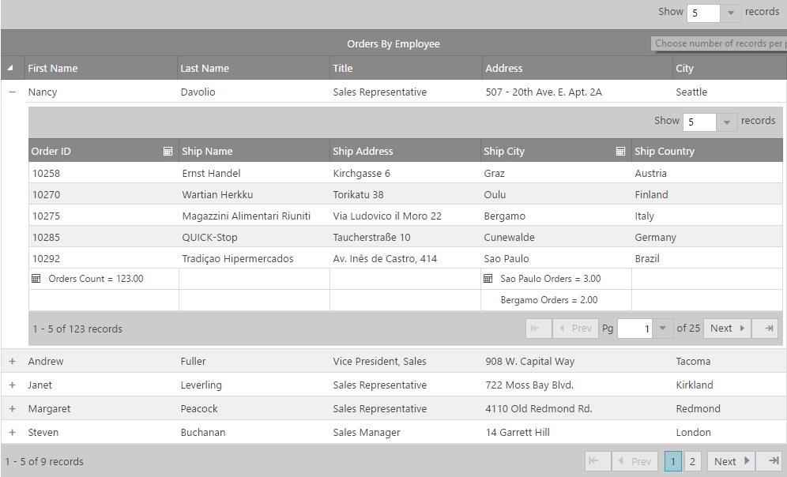

import ApiLink from 'docs-template/components/mdx/ApiLink.astro';

# igHierarchicalGrid の初期化


## トピックの概要

### 目的
このトピックでは、jQuery と MVC 両方の igHierarchicalGrid™ の初期化方法を示しています。

### このトピックの内容
このトピックは、以下のセクションで構成されます。

-   [概要](#introduction)
-   [プレビュー](#preview)
-   [要件](#requirements)
-   [jQuery igHierarchicalGrid の初期化](#initializing-jquery)
-   [MVC igHierarchicalGrid の初期化](#initializing-mvc)
-   [関連トピック](#related-topics)

## <a id="introduction"></a> 概要
以下に示すのは、初期化で一般的に使用される主な igHierarchicalGrid プロパティです。これらのプロパティはフラット igGrid のプロパティと同じです。

-   `key` - 列レイアウトの ID
-   `dataSource` - igHierarchicalGrid のデータ取得元となるデータ ソース
-   `initialDataBindDepth` - igHierarchicalGrid が最初にデータ ソースをバインドする階層のレベル
-   `responseDataKey` - 行要素のコレクションを保持するオブジェクト。
-   `primaryKey` - 子レイアウトのプライマリ キー
-   `foreignKey` - 子レイアウトの外部キー

これらのプロパティは、次に示すプロシージャ例で使用されています。

## <a id="preview"></a> プレビュー
以下は最終結果のプレビューです。



## <a id="requirements"></a> 要件
### 一般的な要件 
-   jQuery の要件

    -   グリッドがデータ ソースに接続されている HTML 形式の Web ページであること
    -   グリッドのコンテナとして機能するテーブル タグが HTML ページの本文に含まれていること

    **HTML の場合:**

```html
    <table id="hierarchicalGrid">
    </table>
```

-   MVC 固有の要件
    -   グリッドがデータ ソースに接続されている MS Visual Studio® の MVC 2 または MVC 4、MVC 5 または ASP.NET Core プロジェクトであること
    -   (MVC IG ラッパーが納められた) MVC dll への参照があること

### スクリプティング要件 
&#123;environment:ProductNameMVC&#125; が jQuery ウィジェットを再描画するため、jQuery と MVC 両方のサンプルに必要なスクリプトは同じです。次が必要になります。

グリッドとそのグループ化機能を実行するためには以下のスクリプトが必要とされます。

-   jQuery ライブラリ スクリプト
-   jQuery User Interface (UI) ライブラリ スクリプト
-   IG ライブラリ スクリプト (これはコントロールのコードを難読化したものです)

次のコード サンプルは、HTML ファイルのヘッダー コードに追加されるスクリプトです。

**HTML の場合:**

```html
<script type="text/javascript" src="jquery.min.js"></script>
<script type="text/javascript" src="jquery-ui.min.js"></script>
<script type="text/javascript" src="infragistics.core.js"></script><script type="text/javascript" src="infragistics.lob.js"></script>
```

### データベース要件 
このサンプルでは以下が使用されています。

-   jQuery – Northwind データベース

-   MVC - Adventure Works データベース。

## <a id="initializing-jquery"></a> jQuery igHierarchicalGrid の初期化 
以下のサンプルでは、igHierarchicalGrid コントロールを JSON データ ソースにバインドする方法を紹介します。

<div class="embed-sample">
   [igHierarchicalGrid JSON のバインド](&#123;environment:SamplesEmbedUrl&#125;/hierarchical-grid/json-binding)
</div>

## <a id="initializing-mvc"></a> MVC igHierarchicalGrid の初期化 
1.  SQL モデルへの LINQ を作成します。 
2.  MVC Controller メソッドを作成します。

    MVC Controller メソッドを作成し、SQL Model からデータを取得して、View を呼び出します

    **MVC の場合:**

```csharp
    public ActionResult Default()
    {
        var ctx = new AdventureWorksDataContext("ConnString");
        var ds = ctx.Products;

        return View("Events", ds);
     }
```

3.  igHierarchicalGrid を定義します。

    **ASPX の場合:**

```csharp
    <%= Html.Infragistics()
    .Grid(Model)
    .ID("grid1")
    .LoadOnDemand(false)
    .AutoGenerateColumns(true)
    .PrimaryKey("ProductID")
    .AutoGenerateLayouts(false)
    .ColumnLayouts(layouts => {
        layouts.For(x => x.ProductInventories)
            .PrimaryKey("LocationID")
            .ForeignKey("ProductID")
            .AutoGenerateColumns(false)
            .Columns(childcols1 =>
            {
                childcols1.For(x => x.ProductID);
                childcols1.For(x => x.LocationID);
                childcols1.For(x => x.Shelf);
                childcols1.For(x => x.Bin);
                childcols1.For(x => x.Quantity);
            });
    })
    .Width("750px")
    .DataBind()
    .Render()%>
```    

4.  プロジェクトを保存します。
5.  (オプション) 結果を確認します。

結果を検証するために、アプリケーションを実行します。上記のプレビューで示すように、igHierarchicalGrid が確認できるはずです。

## <a id="related-topics"></a> 関連トピック 
以下は、その他の役立つトピックです。

-   [igHierarchicalGrid の概要](/ighierarchicalgrid-overview)
-   <ApiLink type="igGrid" label="グリッド プロパティ参照" />
-   <ApiLink type="ighierarchicalgrid" label="igHierarchicalGrid プロパティ リファレンス" />

 

 


