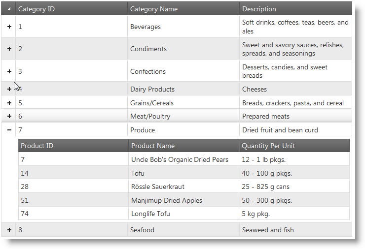

# igHierarchicalGrid の概要

## 目的

このトピックでは、機能、データ ソースへのバインド、要件、テンプレートなどの情報を含む、igCombo コントロールの概念情報を説明します。

## このトピックの内容

このトピックは、以下のセクションで構成されます。

-   主要機能
    -   [機能の概要](#features-overview)
    -   [列とレイアウト](#columns-layouts)
    -   [ロード オン デマンド](#load-on-demand)
    -   [継承](#inheritance)
    -   [イベント API](#events-api)
    -   [スタイル設定とテーマ設定](#styling-theming)
-   [\{environment:ProductFamilyName\} CLI で igHierarchicalGrid を追加](#adding-using-CLI)
	-	[\{environment:ProductFamilyName\} CLI で Excel エクスポートが構成された igHierarchicalGrid を追加](#exporting-with-CLI)
-   [\{environment:ProductNameMVC\}](#aspnet-mvc-helper)
-   [バインド要件](#binding-requirements)

# 概要

`igHierarchicalGrid` は、複数レベルおよび複数レイアウト (との関係) の階層データを同じレベルで表示するコントロールです。`igHierarchicalGrid` は内部でフラット `igGrid` を使用するため、そのすべての機能が `igHierarchicalGrid` にも使用できます。このトピックでは `igHierarchicalGrid` 固有の機能を説明し、`igGrid` 固有機能にはリンクのみ記載します。

以下の図は、行の 1 つが展開された状態の `igHierarchicalGrid` を示しています。



## 主要機能

### <a id="features-overview"></a> 機能の概要

以下の表は、`igHierarchicalGrid` 固有の主要機能の概要を説明します。 

- [列](): 手作業で列を定義するか、igHierarchicalGrid で自動的に定義するか選択できます。
- [列のレイアウト](): レイアウトを作成するか、igHierarchicalGrid で自動的に作成します。
- [ロード オン デマンド](): 行を展開したときにデータを行に読み込みます。
- [継承](): 子レイアウトはその親の機能を継承できます。
- [イベント](): igHierarchicalGrid には、子行を展開および縮小し、子レイアウトを事前に設定するイベントがあります。
 - rowExpanding
 - rowExpanded
 - rowCollapsing
 - rowCollapsed
 - childrenPopulating
 - childrenPopulated
- [アニメーションとスタイル設定](): 展開/縮小アニメーションを変更できる API プロパティのセット。

特定の機能への追加機能である igHierarchicalGrid はすべての igGrid 機能を使用します。

-   [ページング]()
-   [並べ替え]()
-   [フィルタリング]()
-   [更新]()
-   [選択]()
-   [集計]()
-   [行セレクター]()
-   [グループ化]()
-   [サイズ変更]()
-   [非表示]()
-   [ツールチップ]()
-   [機能セレクター]()

## <a id="columns-layouts"></a> 列とレイアウト
列の定義はフラット グリッドの列の定義と同じです。列コレクション内で、列設定とともに表示する列を定義します。

親から継承されていないレイアウト オプションの設定に使用するプロパティを columnLayouts と呼びます。このオブジェクト内で、子レイアウト オブジェクトとその該当オプションを定義できます。

### 関連トピック

[列とレイアウト]()

## <a id="load-on-demand"></a>ロード オン デマンド

表示データのみ読み込む場合、igHierarchicalGrid によりまず親データのみ読み込んで、その後に列レイアウト データをすべて読み込むことでこれが可能です。

### 関連トピック
- [igHierarchicalGrid ロード オン デマンド](/ighierarchicalgrid-load-on-demand)

### 関連サンプル
- [igHierarchicalGrid ロード オン デマンド](\{environment:SamplesUrl\}/hierarchical-grid/load-on-demand)

## <a id="inheritance"></a> 継承

親に構成されているのと同じ機能を子レイアウトにも必要な場合、継承を使用できます。その機能を親レイアウトに定義し、下位レベルの継承を有効にします。

### 関連トピック
- [igHierarchicalGrid 機能の継承](/ighierarchicalgrid-feature-inheritance)

## <a id="events-api"></a> イベント API

igHierarchicalGrid はすべての igGrid 機能イベントを内部で使用します。さらに、行を展開および縮小し、子グリッドを事前に設定する特定のイベントを備えています。

### 関連トピック
- [igHierarchicalGrid イベント API](/ighierarchicalgrid-events-api)

## <a id="styling-theming"></a> スタイル設定とテーマ設定

igHierarchicalGrid には、子レイアウトを展開および縮小したときにアニメーション ビヘイビアーを変更できる多数のプロパティが備わっています。また、jQuery UI CSS Framework のすべてのクラスをサポートしています。これにより、jQuery Theme Switcher などのサード パーティ ツールを使用してスタイルを適用できます。

### 関連トピック
- [igHierarchicalGrid のスタイル設定およびテーマ設定](/ighierarchicalgrid-styling-and-theming)

## <a id="adding-using-CLI"></a> \{environment:ProductFamilyName\} CLI で igHierarchicalGrid を追加

\{environment:ProductFamilyName\} CLI で新しい igHierarchicalGrid を簡単にアプリケーションに追加できます。

\{environment:ProductFamilyName\} CLI のインストール:

```
npm install -g igniteui-cli
```

\{environment:ProductFamilyName\} CLI インストール後、\{environment:ProductName\} プロジェクトを生成し、新しい igHierarchicalGrid コンポーネントを追加してプロジェクトをビルドおよび公開するには、以下のコマンドを使用します。

```
ig new <project name> --framework=jquery
cd <project name>
ig add hierarchical-grid newHierarchicalGrid
ig start
```

また、更新機能が構成されている igHierarchicalGrid を以下のコマンドで追加できます。

```
ig add hierarchical-grid-editing newHierarchicalGridEditing
```

すべての利用可能なコマンドおよび詳細な情報については、[「\{environment:ProductFamilyName\} CLI の使用」](/Using-Ignite-UI-CLI)のトピックを参照してください。

## <a id="exporting-with-CLI"></a> \{environment:ProductFamilyName\} CLI で Excel エクスポートが構成された igHierarchicalGrid を追加

\{environment:ProductFamilyName\} CLI を使用してエクスポートが構成された新しい igHierarchicalGrid を簡単に追加できます。

\{environment:ProductFamilyName\} CLI のインストール:

```
npm install -g igniteui-cli
```

\{environment:ProductFamilyName\} CLI インストール後、\{environment:ProductName\} プロジェクトを生成し、Excel エクスポートが構成された新しい igHierarachicalGrid を追加してプロジェクトをビルドおよび公開するには、以下のコマンドを使用します。

```
ig new <project name> --framework=jquery
cd <project name>
ig add hierarchical-grid-export newHierarchicalGridExport
ig start
``` 

すべての利用可能なコマンドおよび詳細な情報については、[「\{environment:ProductFamilyName\} CLI の使用」](/Using-Ignite-UI-CLI)のトピックを参照してください。

## <a id="aspnet-mvc-helper"></a> ASP.NET MVC ヘルパー

マネージ コード言語の \{environment:ProductNameMVC\} を使用して、igHierarchical コントロールを構成できます。igHierarchicalGrid の MVC ラッパーは、フラット igGrid ラッパーと同じコードを使用します。フラット igGrid の場合のように、機能のロジックが MVC ラッパーで自動的に処理され、ページング、並べ替え、フィルタリング、集計などの機能からの要求は内部処理されるため、これらの機能を実装する必要がないのはそのためです。

### 関連トピック
- [igHierarchicalGrid の初期化](/ighierarchicalgrid-initializing)

## <a id="binding-requirements"></a> バインド要件

igHierarchicalGrid コントロールは jQuery UI ウィジェットであるため、jQuery コアおよび jQuery UI JavaScript ライブラリに依存しています。また、igHierarchicalGrid が機能の共有やデータのバインドを行うために使用する \{environment:ProductName\} JavaScript リソースもいくつかあります。これらの JavaScript 参照は igHierarchicalGrid が JavaScript または ASP.NET MVC のいずれで使用されていても必要です。igHierarchicalGrid を ASP.NET MVC で使用する場合、igHierarchicalGrid を .NET 言語で構成するために Infragistics.Web.Mvc アセンブリが必要です。

データ構造は下のいずれかの形態を使用できます。
- ローカルで提供された、あるいは oData プロトコルをサポートするサーバーなどの Web サーバーから整形式 JSON または XML。
- ASP.NET MVC における IQueryable


