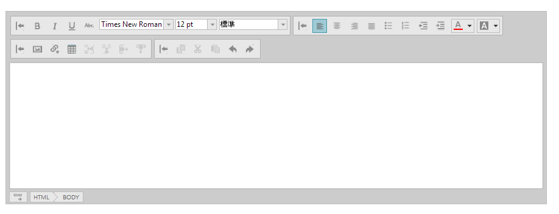

# igHtmlEditor の追加


##トピックの概要


### 目的

このトピックでは、`igHtmlEditor`™ を Web ページに追加する方法について説明します。

### 必要な背景

以下の表は、このトピックを理解するための前提条件として必要なトピックを示しています。


-	[igHtmlEditor の概要](/ightmleditor-overview): このトピックは、`igHtmlEditor` およびその機能の概要を説明します。

-	[Infragistics Loader の使用](/using-infragistics-loader): このトピックでは、Infragistics Loader を使用して、&#123;environment:ProductName&#125; で作業するために必要なリソースを管理する方法について説明します。


##igHtmlEditor を Web ページに追加


### 概要

この手順では、`igHtmlEditor` を Web ページに追加する方法を手順ごとに示します。

### プレビュー

以下のスクリーンショットは最終結果のプレビューです。



### 概要

以下はプロセスの概念的概要です。

[1. 必要な JavaScript ファイルの参照](#reference-scripts)

[2. JavaScript での igHtmlEditor の初期化](#initialize-htmlEditor)

[3. (オプション) ASP.NET MVC Razor View での igHtmlEditor の初期化](#mvc-initialize-htmlEditor)

### 手順

以下の手順では、`igHtmlEditor` を Web ページに追加する方法を示します。


1. <a id="reference-scripts"></a> 必要な JavaScript ファイルを参照します。

	必要な JavaScript 参照を含めます。

	**HTML の場合:**

```html
	<script src="js/jquery.min.js"></script>
    <script src="js/jquery-ui.min.js"></script>
    <script src="js/infragistics.loader.js"></script>
```

2. <a id="initialize-htmlEditor"></a> JavaScript で igHtmlEditor を初期化します。

	Infragistics &#123;environment:ProductNameMVC&#125; を使用している場合、手順 3 に示されているように、`igHtmlEditor` in ASP.NET MVC View をインスタンス化する必要があります。

	1. HTML プレースホルダーをエディターに対して定義します。

		**HTML の場合:**

```html
		<div id="htmlEditor"></div>
```
	
	2. Infragistics Loader を初期化します

		**JavaScript の場合:**

```js
		$.ig.loader({
	        scriptPath: 'js',
	        cssPath: 'css',
	        resources: 'igHtmlEditor'
	    });
```

		>**注:** Infragistics Loader は、必要なファイルを素早く効果的に参照するための方法です。ただし、ファイルは手動で参照することができます。詳細については、[関連コンテンツ](#related-content)セクションの「[&#123;environment:ProductName&#125; の JavaScript リソースの使用](/deployment-guide-javascript-resources)」トピック を参照してください。

	3. igHtmlEditor を初期化します

		**JavaScript の場合:**

```js
		$.ig.loader(function () {
	        $('#htmlEditor').igHtmlEditor({inputName: "Post"});
	    });
```

3. <a id="mvc-initialize-htmlEditor"></a> (オプション) ASP.NET MVC Razor View での igHtmlEditor を初期化します。

	この例では、Infragistics Loader を使用して ASP.NET MVC アプリケーションで `igHtmlEditor` を初期化する方法を示します。

	1. Infragistics Loader を初期化します

		**C# の場合:**
	
```csharp
		 @(Html.Infragistics().Loader().ScriptPath(Url.Content ("js")).CssPath(Url.Content("css")).Render())
```

		&#123;environment:ProductNameMVC&#125; Loader を使用している場合、Resources メソッドの呼び出しは必要ありません。これは、ローダーは、特定のビューで使用される他の &#123;environment:ProductNameMVC&#125; ヘルパーに基づいて、含めるリソースを推測するためです。これは、&#123;environment:ProductName&#125; コントロールも &#123;environment:ProductNameMVC&#125; を使用してインスタンス化された場合にのみ有効です。

	2. igHtmlEditor を初期化します

		**C# の場合:**

```csharp
		@Html.Infragistics().HtmlEditor().ID("igHtmlEditor").Render()
```


## <a id="related-content"></a> 関連コンテンツ


### トピック

このトピックの追加情報については、以下のトピックも合わせてご参照ください。

-	[igHtmlEditor の操作](/ightmleditor-working-with-ightmleditor): これは、`igHtmlEditor` を構成し、それをプログラム的に管理する方法を説明する一連のトピックです。

-	[スタイル設定およびテーマ設定 (igHtmlEditor)](/ightmleditor-styling-and-theming): このトピックは、`igHtmlEditor` のルック アンド フィールをカスタマイズする方法をコード例を用いて説明しています。

-	[&#123;environment:ProductName&#125; で JavaScript リソースを使用](/deployment-guide-javascript-resources): このトピックでは、Web アプリケーションで &#123;environment:ProductName&#125; を操作して、必要なリソースを管理する方法について説明します。


### サンプル

このトピックについては、以下のサンプルも参照してください。

-	[内容を編集する](&#123;environment:SamplesUrl&#125;/html-editor/edit-content): このフォーラム投稿のサンプルでは、HTML エディターでコンテンツを提供します。

-	[カスタム ツールバーおよびボタン](&#123;environment:SamplesUrl&#125;/html-editor/custom-toolbars-and-buttons): このサンプルでは、HtmlEditor コントロールを電子メール クライアントとして実装します。署名をメッセージに追加するカスタム ツールバーがあります。


 

 


