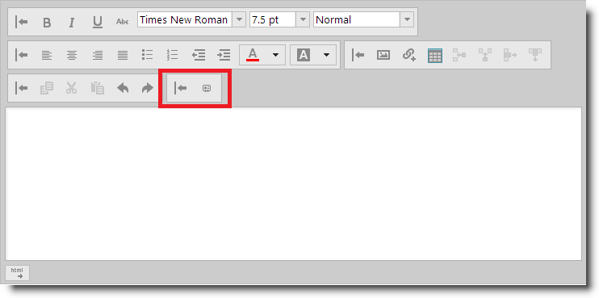

---
title: "カスタム ツールバーへのボタンの追加"
slug: ightmleditor-adding-button-to-custom-toolbar
---

# カスタム ツールバーへのボタンの追加


##トピックの概要


### 目的

このトピックでは、`igHtmlEditor`™ のカスタム ツールバーにボタンを追加する方法を説明します。

### 前提条件

このトピックを理解するために、以下のトピックを参照することをお勧めします。


-	[igHtmlEditor の概要](/ightmleditor-overview): このトピックでは、`igHtmlEditor` の各種機能について説明します。

-	[igHtmlEditor の追加](/ightmleditor-adding-ightmleditor): このトピックでは、`igHtmlEditor` を Web ページに追加する方法について説明します。

-	[ツールバーとボタンの構成](/ightmleditor-configuring-toolbars-and-buttons): このトピックでは、`igHtmlEditor` のツールバーとボタンを構成する方法について説明します。

-	[カスタム ツールバーの構成](/ightmleditor-configuring-custom-toolbars): このトピックでは、`igHtmlEditor` のカスタム ツールバーを構成する方法について説明します。


### このトピックの内容

このトピックは、以下のセクションで構成されます。

-   [概要](#introduction)
-   [コントロールの構成の概要](#config-summary)
-   [ウォークスルー: JavaScript によるカスタム ツールバーへのボタンの追加](#walkthrough)
    -   [概要](#walkthrough-introduction)
    -   [プレビュー](#preview)
    -   [概要](#overview)
    -   [手順](#steps)
-   [関連コンテンツ](#related-content)
    -   [トピック](#topics)
    -   [サンプル](#samples)


##<a id="introduction"></a>概要


### igHtmlEditor のカスタム ツールバーの紹介

`igHtmlEditor` コントロールにはカスタム ツールバーを追加することができます。現時点で、カスタム ツールバーは次の 2 種類のコントロールに対応しています。

-   ボタン
-   コンボ

以下のスクリーンショットはボタンを 1 つ定義したカスタム ツールバーがある `igHtmlEditor` です。




##<a id="config-summary"></a>コントロールの構成の概要


以下の表では、カスタム ボタンを `igHtmlEditor` コントロールに追加するときの構成可能な要素をまとめました。このメソッドについては、表の下にある解説も参照してください。


| 構成可能な要素 | 詳細 | オプション |
| --- | --- | --- |
| カスタム ツールバーにボタンを追加 | カスタム ツールバーにボタンを定義するには、プロパティとともにオブジェクト リテラルを customToolbars オプションの項目配列の右に追加します。 | `name` - このプロパティはボタン名を定義します。`type` - このプロパティは「button」に設定してください。`scope` - このプロパティは「this」に設定してください。`handler` - これは、ボタンをクリックしたときに起動する機能の名前です。`props` - ネストしたオブジェクトがあるオブジェクト リテラル。 ネストされる各オブジェクトには、value と action という 2 つのプロパティを定義できます。 |


##<a id="walkthrough"></a>ウォークスルー: JavaScript によるカスタム ツールバーへのボタンの追加


###<a id="walkthrough-introduction"></a> 概要

この手順では、`igHtmlEditor` のカスタム ツールバーにボタンを追加します。

この例では、エディターは、電子メール エディターとして使用し、カスタム ツールバーとボタンを定義します。これは電子メールの署名をエディターのコンテンツに挿入するコントロールです。

###<a id="preview"></a> プレビュー

以下のスクリーンショットは最終結果のプレビューです。


###<a id="overview"></a> 概要

以下はプロセスの概念的概要です。

[1. 必要なスクリプトの参照](#reference-scripts)

[2. ボタンの CSS の定義](#define-css)

[3. igHtmlEditor の初期化](#initialize-editor)

[4. カスタム ツールバーの定義](#define-custom-toolbar)

[5. ボタンの定義](#define-the-button)

[6. ボタン クリック ハンドラーの定義](#define-the-click-handler)

###<a id="steps"></a> 手順

以下のステップでは、カスタム ツールバーにボタンを追加する方法を紹介します。


1. <a id="reference-scripts"></a>必要なスクリプトを参照します。

	1. 必須参照先を追加します。

		jQuery ファイルと jQuery UI JavaScript ファイルの参照情報は必須です。また、Infragistics Loader の参照情報があれば必要な Infragistics リソースを簡単に読み込むことができます。

		**HTML の場合:**

```html
		<script type="text/javascript" src="jquery.min.js"></script>
	    <script type="text/javascript" src="jquery-ui.min.js"></script>
	    <script type="text/javascript" src="infragistics.loader.js"></script>
```

	2. Infragistics Loader で `igHtmlEditor` ファイルを読み込みます。

		必要な `igHtmlEditor` ファイルを参照するようにローダーを定義します。

		**JavaScript の場合:**

```js
		<script type="text/javascript">
	        $.ig.loader({
	            scriptPath: "js",
	            cssPath: "css",
	            resources: "igHtmlEditor"
	        });
	    </script>
```

2. <a id="define-css"></a>ボタンの CSS を定義

	ボタンの背景として適用する CSS ルールを定義します。

	**CSS の場合:**

```css
	<style type="text/css">
        span.ui-icon.ui-icon-contact
        {
            background-image: url(../content/theme/images/ui-icons_222222_256x240.png); 
            background-position: -192px -128px;
        }
    </style>
```

3. <a id="initialize-editor"></a>`igHtmlEditor` を初期化します。

	以下のコードは、ローダーのコールバック機能の `igHtmlEditor` を初期化します。

	**JavaScript の場合:**

```js
	<script type="text/javascript">
        $.ig.loader(function () {
            $("#htmlEditor").igHtmlEditor({
                width: "100%",
                inputName: "htmlEditor"
            });
        });
    </script>
```

4. <a id="define-custom-toolbar"></a>カスタム ツールバーを定義します。

	"eMailSignature" カスタム ツールバーを定義します。このツールバーにはエディター コンテンツに電子メール署名を追加するボタンを配置します。

	**JavaScript の場合:**

```js
	<script type="text/javascript">
        $.ig.loader(function () {
            $("#htmlEditor").igHtmlEditor({
                width: "100%",
                inputName: "htmlEditor",
                customToolbars: [
                {
                    name: "eMailSignature",
                    collapseButtonIcon: "ui-igbutton-collapse",
                    expandButtonIcon: "ui-igbutton-expand",
                    items: []
                }]
            });
        });
    </script>
```

5. <a id="define-the-button"></a>ボタンの定義

	以下のコードは、エディターのコンテンツに電子メール署名を追加するボタンを定義します。

	カスタム ボタンはいずれもカスタム ツールバーの項目配列に定義してください。

	以下に示したのは、ボタン オプションの説明です。

	-   `name` - このオプションはボタン名を定義します。
	-   `type` - このオプションは、定義されるツールバー項目の種類を定義します。ボタンを定義するときは、これを「button」を設定してください。
	-   `scope` - このオプションは、ボタンのクリック ハンドラーの実行範囲を定義します。「this」に設定してください。
	-   `handler` - このオプションはクリック ハンドラーを定義します。これは、クリック イベントを操作する定義の名前に設定してください。
	-   `props` - ボタン機能のほとんどを定義する複合オブジェクト プロパティです。次のような形で定義します。

```
		<customDefinedIdentifier> : {			
			value: <valueToBePassedToTheActionHandler>,			
			action: "<predefinedActionHandler>"			
		},
```

	ここで:

	-	`<customDefinedIdentifier>` は API 操作に使用するカスタム文字列リテラルです。

	-	`<predefinedActionHandler>` はハンドラーの名前であり、以下のいずれかにします。

		-   "_tooltipAction" - ツールチップ文字列を受け付けます。
		-   "_isSelectedAction" - ブール型値を受け付けます。
		-   "_buttonIconAction" - ボタンに適用した CSS クラス名と一致する文字列を受け付けます。

	-	`<valueToBePassedToTheActionHandler>` は、アクション ハンドラーに渡す値です。

	**JavaScript の場合:**
```js	
	    items: [{
	        
			name: "appendSignature",
       		type: "button",
        	handler: appendSignature,
        	scope: this,
        	props: {
            	isImage: {
                	value: false,
                	action: '_isSelectedAction'
            	},
            	imageButtonTooltip: {
                	value: "Insert signature",
                	action: '_tooltipAction'
            	},
            	imageButtonIcon: {
                	value: "ui-icon-contact",
                	action: '_buttonIconAction'
            	}
        	}
	    }]
```	

6. <a id="define-the-click-handler"></a>ボタン クリック ハンドラーを定義

	ボタンのクリック ハンドラーを定義します。この機能は、定義済みの文字列をエディターのコンテンツに追加します。

	**JavaScript の場合:**

```js
	<script type="text/javascript">
        function appendSignature(ui) {
            var currentContent = $("#htmlEditor").igHtmlEditor("getContent", "html");
            var signature = "Jon Doe<br/>Acme Corp<br/>555-1111";
            $("#htmlEditor").igHtmlEditor("setContent", currentContent + signature, "html");
        }
    </script>
```


##<a id="related-content"></a>関連コンテンツ


###<a id="topics"></a> トピック

このトピックの追加情報については、以下のトピックも合わせてご参照ください。


-	[カスタム ツールバーへのコンボ ボックスの追加](/ightmleditor-adding-combo-to-custom-toolbar): このトピックでは、`igHtmlEditor` のカスタム ツールバーにコンボ ボックスを追加する方法を説明します。


###<a id="samples"></a> サンプル

このトピックについては、以下のサンプルも参照してください。

-	[カスタム ツールバーおよびボタン](&#123;environment:SamplesUrl&#125;/html-editor/custom-toolbars-and-buttons): このサンプルでは、HtmlEditor コントロールを電子メール クライアントとして実装します。署名をメッセージに追加するカスタム ツールバーがあります。


 

 


