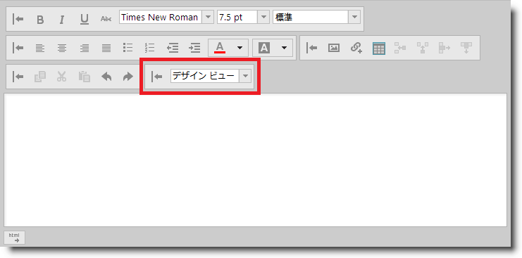

---
title: "カスタム ツールバーへのコンボ ボックスの追加"
slug: ightmleditor-adding-combo-to-custom-toolbar
---

# カスタム ツールバーへのコンボ ボックスの追加


##トピックの概要


### 目的

このトピックでは、`igHtmlEditor`™ のカスタム ツールバーにコンボ ボックスを追加する方法について説明します。

### 前提条件

このトピックを理解するために、以下のトピックを参照することをお勧めします。


-	[igHtmlEditor の概要](/ightmleditor-overview): このトピックでは、`igHtmlEditor` の各種機能について説明します。

-	[igHtmlEditor の追加](/ightmleditor-adding-ightmleditor): このトピックでは、`igHtmlEditor` を Web ページに追加する方法について説明します。

-	[ツールバーとボタンの構成](/ightmleditor-configuring-toolbars-and-buttons): このトピックでは、`igHtmlEditor` のツールバーとボタンを構成する方法について説明します。

-	[カスタム ツールバーの構成](/ightmleditor-configuring-custom-toolbars): このトピックでは、`igHtmlEditor` のカスタム ツールバーを構成する方法について説明します。


### このトピックの内容

このトピックは、以下のセクションで構成されます。

-   [概要](#introduction)
-   [コントロールの構成の概要](#config-summary)
-   [チュートリアル: JavaScript でカスタム ツールバーにコンボを追加する手順](#walkthrough)
    -   [概要](#introduction)
    -   [プレビュー](#preview)
    -   [概要](#overview)
    -   [手順](#steps)
-   [関連コンテンツ](#related-content)
    -   [トピック](#topics)
    -   [サンプル](#samples)


##<a id="introduction"></a>概要


### igHtmlEditor のカスタム ツールバーの紹介

`igHtmlEditor` コントロールにはカスタム ツールバーを追加することができます。現時点で、カスタム ツールバーは次の 2 種類のコントロールに対応しています。

-   ボタン
-   コンボ

次のスクリーンショットは、カスタム ツールバーにコンボ ボックスを定義した `igHtmlEditor` です。




##<a id="config-summary"></a>コントロールの構成の概要

次の表は、`igHtmlEditor` コントロールにカスタム コンボを追加する際に構成可能な項目の一覧です。このメソッドについては、表の下にある解説も参照してください。


| 構成可能な要素 | 詳細 | オプション |
| --- | --- | --- |
| カスタム ツールバーへのコンボの追加 | カスタム ツールバーにコンボを定義するには、右の欄に示したオプションを指定してオブジェクト リテラルを `customToolbars` オプションの項目配列に追加します。 | `name` - このプロパティは、コンボの名前を定義します。`type` - このプロパティは combo に設定する必要があります。`scope` - このプロパティは this に設定してください。`handler` - このプロパティは、コンボで選択されるハンドラーを定義します。このプロパティ値には、当該のイベントを処理する関数の名前を指定します。`props` - 複数のオブジェクトがネストされているオブジェクト リテラル。ネストされる各オブジェクトには、value と action という 2 つのプロパティを定義できます。 |


##<a id="walkthrough"></a>チュートリアル: JavaScript でカスタム ツールバーにコンボを追加する手順


###<a id="walkthrough-introduction"></a> 概要

ここでは、`igHtmlEditor` のカスタム ツールバーにコンボを追加する手順について説明します。

この例では、エディターのソース ビューとデザイン ビューとを切り替えるコンボがカスタム ツールバーに収められています。

###<a id="preview"></a> プレビュー

以下のスクリーンショットは最終結果のプレビューです。


###<a id="overview"></a> 概要

以下はプロセスの概念的概要です。

[1. 必要なスクリプトの参照](#reference-scripts)

[2. igHtmlEditor の初期化](#initialize-editor)

[3. カスタム ツールバーの定義](#define-custom-toolbar)

[4. コンボの定義](#define-the-button)

[5. コンボで選択されるハンドラーの定義](#define-the-click-handler)

###<a id="steps"></a> 手順

カスタム ツールバーにコンボを追加する手順を以下に示します。

1. <a id="reference-scripts"></a> 必要なスクリプトを参照します。

	1. 必須参照先を追加します。

		jQuery と jQuery UI は必須です。また、Infragistics Loader への参照も追加して、必要なリソースを簡単に参照できるようにしておきます。

		**HTML の場合:**

```html
		<script type="text/javascript" src="jquery.min.js"></script>
	    <script type="text/javascript" src="jquery-ui.min.js"></script>
	    <script type="text/javascript" src="infragistics.loader.js"></script>
```

	2. Infragistics Loader で `igHtmlEditor` ファイルを読み込みます。

		必要な `igHtmlEditor` リソースを参照するローダーを定義します。
	
		**JavaScript の場合:**
	
```js
		<script type="text/javascript">
	        $.ig.loader({
	            scriptPath: "js",
	            cssPath: "css",
	            resources: "igHtmlEditor"
	        });
	    </script>
```

2. <a id="initialize-editor"></a> `igHtmlEditor` を初期化します。

	次のコードは、ローダー コールバック関数で `igHtmlEditor` を初期化します。

	**JavaScript の場合:**

```js
	<script type="text/javascript">
        $.ig.loader(function () {
            $("#htmlEditor").igHtmlEditor({
                width: "100%",
                inputName: "htmlEditor"
            });
        });
    </script>
```

3. <a id="define-custom-toolbar"></a> カスタム ツールバーを定義します。

	エディターのデザイン ビューと HTML ビューとを切り替えるコンボが収められた codeView というカスタム ツールバーを定義します。

	**JavaScript の場合:**

```js
	<script type="text/javascript">
        $.ig.loader(function () {
            $("#htmlEditor").igHtmlEditor({
                width: "100%",
                inputName: "htmlEditor",
                customToolbars: [
                {
                    name: "codeView",
                    collapseButtonIcon: "ui-igbutton-collapse",
                    expandButtonIcon: "ui-igbutton-expand",
                    items: []
                }
                ]
            });
        });
    </script>
```

4. <a id="define-the-button"></a> コンボを定義します。

	次のコードは、エディターのデザイン ビューと HTML ビューとを切り替えるコンボを定義しています。

	各カスタム コンボをカスタム ツールバーの *items* 配列に定義しておく必要があります。

	以下は、コンボの各オプションの説明です。

	-   `name` - このオプションはコンボの名前を定義します。
	-   `type` - このオプションは、定義されるツールバー項目の種類を定義します。コンボを定義するには、このオプション値を combo に設定してください。
	-   `scope` - このプロパティは、コンボで選択されたハンドラーの実行スコープを定義します。このプロパティは this に設定してください。
	-   `handler` - このプロパティは、コンボで選択されるハンドラーを定義します。このプロパティ値には、当該のイベントを処理する関数の名前を指定します。
	-   `props` - コンボ機能のほとんどを定義する複合オブジェクト プロパティです。次のような形で定義します。

```
		<customDefinedIdentifier> : {			
			value: <valueToBePassedToTheActionHandler>,			
			action: "<predefinedActionHandler>"			
		}, 
```
		ここで: 
	
		-	`<customDefinedIdentifier>` は、API 操作に使用できるカスタム文字列リテラルです。
	
		-	`<predefinedActionHandler>` は、内部 `igCombo` のオプションを設定する内部関数の名前です。これには、次のいずれかの関数を指定できます。

			-   _comboDataSourceAction - テキスト/値プロパティを備えた複数のオブジェクトのコレクションをデータ ソースとして指定できます。この関数は igCombo.dataSource オプションを設定します。
			-   _comboWidthAction - コンボの幅を指定できます。この関数は igCombo.width オプションを設定します。
			-   _comboHeightAction - コンボの高さを指定できます。この関数は igCombo.height オプションを設定します。
			-   _comboDropDownListWidth - コンボのドロップダウン リストの幅をピクセル単位で指定できます。この関数は igCombo.dropDownWidth オプションを設定します。
			-   _comboSelectedItem - コンボで選択された値を取り込みます。この関数は igCombo.selectedItems オプションを設定します。
	
		-	`<valueToBePassedToTheActionHandler>` はアクション アンドラーに渡される値 (引数) です。
	
		**JavaScript の場合:**
	
```js
	    items: [{
	        name: "toggleViewSource",
	        type: "combo",
	        handler: switchView,
	        scope: this,
	        props: {
	        toggleViewSourceComboWidth: {
	            value: 115,
	            action: "_comboWidthAction"
	        },
	        toggleViewSourceItemsListWidth: {
	            value: 115,
	            action: "_comboDropDownListWidth"
	        },
	        toggleViewSourceDataSource: {
	            value: [{text: "HTML View", value: "HTML View"}, {text: "Design View", value: "Design View"}],
	            action: "_comboDataSourceAction"
	        },
	        selectedToggleViewSourceItem: {
	            value: "Design View",
	            action: "_comboSelectedItem"
	        }
	        }
	    }]
```

	上記の例では、`toggleViewSourceComboWidth` プロパティによって、コンボの幅が 115 ピクセルに設定されています。`toggleViewSourceItemsListWidth` プロパティでは、コンボのドロップダウン リストの幅が 115 ピクセルに設定されています。この
	`toggleViewSourceDataSource` プロパティはコンボのデータ ソースを設定し、`selectedToggleViewSourceItem` はコンボの選択項目を Design View　に設定しています。

5. <a id="define-the-click-handler"></a> コンボで選択されたハンドラーを定義します。

	コンボで選択されたハンドラーを定義します。この関数は、デザイン ビューと HTML ビューを切り替えるボタンのクリック イベントを発生させます。
	
	**JavaScript の場合:**

```js
	<script type="text/javascript">
        function switchView(el, obj) {
            //find the toggle viewsource button and simulate click
            $(".ui-igbutton-viewsource-icon").click();
            //enable combo from the custom toolbar, because it's disabled when editor is in HTML view
            $("#htmlEditor_toolbars_toggleViewSourceToolbar_item_toggleViewSource").igCombo("enable");
        } 
    </script>
```


##<a id="related-content"></a>関連コンテンツ

###<a id="topics"></a> トピック

このトピックの追加情報については、以下のトピックも合わせてご参照ください。


-	[カスタム ツールバーへのボタンの追加](/ightmleditor-adding-button-to-custom-toolbar): このトピックでは、`igHtmlEditor` のカスタム ツールバーにボタンを追加する方法について説明します。


###<a id="samples"></a> サンプル

このトピックについては、以下のサンプルも参照してください。

-	[カスタム ツールバーおよびボタン](&#123;environment:SamplesUrl&#125;/html-editor/custom-toolbars-and-buttons): このサンプルでは、HtmlEditor コントロールを電子メール クライアントとして実装します。署名をメッセージに追加するカスタム ツールバーがあります。


 

 


