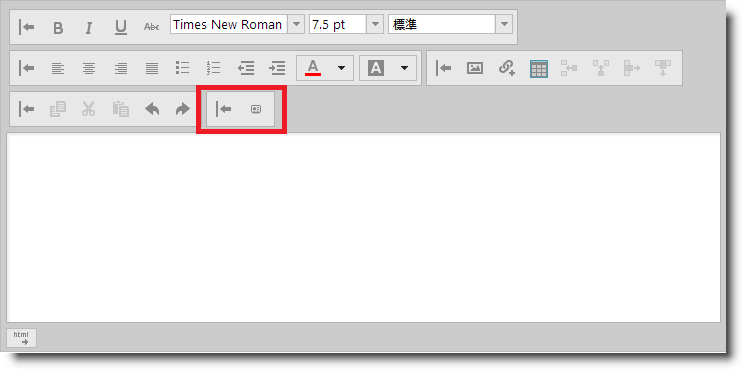
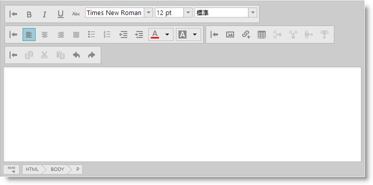
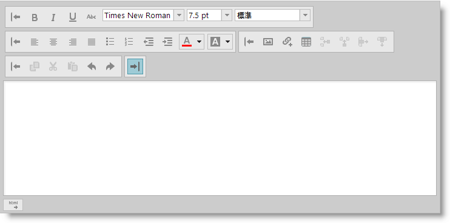

---
title: "カスタム ツールバーの構成"
slug: ightmleditor-configuring-custom-toolbars
---

# カスタム ツールバーの構成


##トピックの概要


### 目的

このトピックは、`igHtmlEditor` のカスタム ツールバーの構成方法について説明します。

### 前提条件

このトピックを理解するために、以下のトピックを参照することをお勧めします。

-	[igHtmlEditor の概要](/controls/ightmleditor/overview): このトピックでは、`igHtmlEditor` の各種機能について説明します。

-	[igHtmlEditor の追加](/controls/ightmleditor/adding-ightmleditor): このトピックでは、igHtmlEditor を Web ページに追加する方法について説明します。

-	[ツールバーとボタンの構成](/controls/ightmleditor/working/configuring-toolbars-and-buttons): このトピックでは、`igHtmlEditor` のツールバーとボタンを構成する方法について説明します。


### このトピックの内容

このトピックは、以下のセクションで構成されます。

-   [概要](#introduction)
-   [コントロールの構成の概要](#config-summary)
-   [カスタム ツールバーを追加する](#add-custom-toolbar)
-   [カスタム ツールバーを非表示にする](#hide-custom-toolbar)
-   [カスタム ツールバーを縮小する](#collapse-custom-toolbar)
-   [関連コンテンツ](#related-content)


##<a id="introduction"></a>概要


### igHtmlEditor のカスタム ツールバーの紹介

igHtmlEditor コントロールにはカスタム ツールバーを追加することができます。カスタム ツールバーは標準ツールバーによく似ています。これらは表示または非表示、展開または折り畳みの状態にすることができます。

現時点で、カスタム ツールバーは次の 2 種類のコントロールに対応しています。

-   ボタン
-   コンボ

以下のスクリーンショットはカスタム ツールバーがある igHtmlEditor です。ツールバーはボタンとコンボを含みます。


##<a id="config-summary"></a>コントロールの構成の概要


以下の表では、カスタム ボタンを `igHtmlEditor` コントロールに追加するときの構成可能な要素をまとめました。このメソッドについては、表の下にある解説も参照してください。


| 構成可能な要素 | 詳細 | プロパティ |
| --- | --- | --- |
| [カスタム ツールバーを追加する](#add-custom-toolbar) | カスタム ツールバーを定義するには、customToolbars 配列を使用します。 | customToolbars customToolbars.name customToolbars.collapseButtonIcon customToolbars.expandButtonIcon customToolbars.items |
| [カスタム ツールバーを非表示にする](#hide-custom-toolbar) | `show` の自動作成したプロパティを使用します。 | show |
| [カスタム ツールバーを縮小する](#collapse-custom-toolbar) | カスタム ツールバー リテラルの *expanded* プロパティを使用します。 | customToolbars.expanded |


##<a id="add-custom-toolbar"></a>カスタム ツールバーを追加する


### 概要

カスタム ツールバーを作成するには、`igHtmlEditor` の `customToolbars` オプションを定義します。カスタム ツールバーは、標準ツールバーのすべての機能を搭載できます。たとえば、カスタム ツールバーを展開または縮小するか、表示するか、非表示します。カスタム ツールバーには、ボタンまたはコンボ コントロールを含めることができます。このコントロールを `items` プロパティに定義します。

### プロパティ設定

以下の表では、目的の構成をプロパティ設定にマップしています。

目的:|使用するプロパティ:|設定の選択肢:
---|---|---
ツールバーの名前を設定|name|カスタム定義された文字列例： "myCustomToolbar"
ツールバーの初期状態を展開に設定|expanded|true
[縮小] ボタンのアイコンを設定|collapseButtonIcon|"ui-igbutton-collapse"
[展開] ボタンのアイコンを設定|expandButtonIcon|"ui-igbutton-expand"
ツールバーに項目を追加|items|オブジェクト リテラルの配列オブジェクト プロパティの詳細については、[カスタム ツールバーへのボタンの追加](/controls/ightmleditor/custom-toolbars/adding-button-to-custom-toolbar)および[カスタム ツールバーにコンボ ボックスの追加](/controls/ightmleditor/custom-toolbars/adding-combo-to-custom-toolbar)トピックを参照してください。


### 例

以下のスクリーンショットは、以下の設定の結果、`igHtmlEditor` がどのように表示されるかを示しています。

プロパティ|値
---|---|---
name|"customToolbar"
collapseButtonIcon|"ui-igbutton-collapse"
expandButtonIcon|"ui-igbutton-expand"




>**注:** ツールバーにはコントロールがありません。定義されるコントロールはありません。[カスタム ツールバーへのボタンの追加](/controls/ightmleditor/custom-toolbars/adding-combo-to-custom-toolbar#walkthrough)および[カスタム ツールバーにコンボ ボックスの追加](/controls/ightmleditor/custom-toolbars/adding-combo-to-custom-toolbar#walkthrough)セクションを参照してください。

以下のコードは、項目を含まない customToolbar の名前付きのカスタム ツールバーを定義します。

**JavaScript の場合:**

```js
<script type="text/javascript">
$("#htmlEditor").igHtmlEditor({
    customToolbars: [
    {
        name: "customToolbar",
        collapseButtonIcon: "ui-igbutton-collapse",
        expandButtonIcon: "ui-igbutton-expand",
        items: [
           //define items here
        ]
    }]
});
<script>
```


##<a id="hide-custom-toolbar"></a>カスタム ツールバーを非表示にする


### 概要

カスタム ツールバーを非表示にするには、この作成されたプロパティを使用します。

`show< customToolbarName >`

ここで、`<customToolbarName>` はカスタム ツールバーの名前です。

### プロパティ設定

以下の表では、目的の構成をプロパティ設定にマップしています。

目的:|使用するプロパティ:|設定の選択肢:
---|---|---
カスタム ツールバーを非表示にする|show`&lt;customToolbarName&gt;`|false


### 例

以下のスクリーンショットは、以下の設定の結果、`igHtmlEditor` がどのように表示されるかを示しています。

プロパティ|値
---|---
showMyCustomToolbar|false
customToolbars.name|"myCustomToolbar"
collapseButtonIcon|"ui-igbutton-collapse"
expandButtonIcon|"ui-igbutton-expand"




>**注:** スクリーンショットでカスタム ツールバーは非表示になったので、表示されません。

以下にコードを示します。

**JavaScript の場合:**

```js
<script type="text/javascript">
$("#htmlEditor").igHtmlEditor({
    showMyCustomToolbar: false,
    customToolbars: [
    {
        name: "myCustomToolbar",
        collapseButtonIcon: "ui-igbutton-collapse",
        expandButtonIcon: "ui-igbutton-expand"
        // toolbar definition here
    }]
});
<script>
```


##<a id="collapse-custom-toolbar"></a>カスタム ツールバーを縮小する


### 概要

カスタム ツールバーを縮小するには、expanded プロパティを false に設定します。

### プロパティ設定

以下の表では、目的の構成をプロパティ設定にマップしています。

目的:|使用するプロパティ:|設定の選択肢:
---|---|---
カスタム ツールバーを縮小する|expanded|false


### 例

以下のスクリーンショットは、以下の設定の結果、`igHtmlEditor` がどのように表示されるかを示しています。

プロパティ|値
---|---
name|"customToolbar"
expanded|false
collapseButtonIcon|"ui-igbutton-collapse"
expandButtonIcon|"ui-igbutton-expand"




以下にコードを示します。

**JavaScript の場合:**

```js
<script type="text/javascript">
$("#htmlEditor").igHtmlEditor({
    customToolbars: [
    {
        name: "customToolbar",
        expanded: false,
        collapseButtonIcon: "ui-igbutton-collapse",
        expandButtonIcon: "ui-igbutton-expand",
        items: [
           //define items here
        ]
    }]
});
<script>
```


##<a id="related-content"></a>関連コンテンツ


### トピック

このトピックの追加情報については、以下のトピックも合わせてご参照ください。

-	[カスタム ツールバーへのボタンの追加](/controls/ightmleditor/custom-toolbars/adding-button-to-custom-toolbar): このトピックは、igHtmlEditor のカスタム ツールバーにボタンを追加する方法について説明します。

-	[カスタム ツールバーへのコンボ ボックスの追加](/controls/ightmleditor/custom-toolbars/adding-combo-to-custom-toolbar): このトピックは、igHtmlEditor のカスタム ツールバーにコンボ ボックスを追加する方法について説明します。


### サンプル

このトピックについては、以下のサンプルも参照してください。

-	[カスタム ツールバーおよびボタン](&#123;environment:SamplesUrl&#125;/html-editor/custom-toolbars-and-buttons): このサンプルでは、HtmlEditor コントロールを電子メール クライアントとして実装します。署名をメッセージに追加するカスタム ツールバーがあります。


 

 

