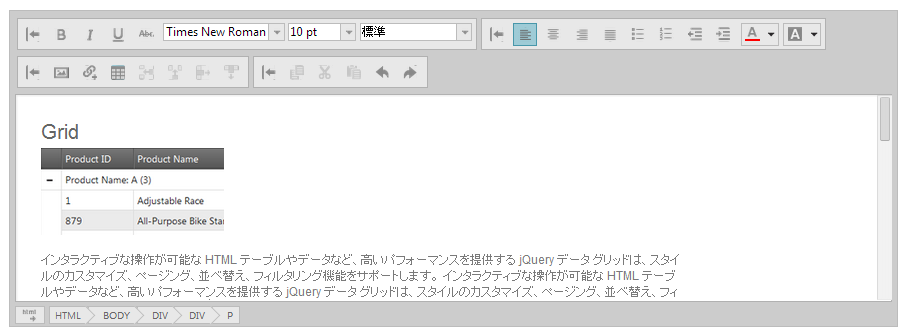

---
title: "igHtmlEditor"
slug: ightmleditor-ightmleditor
---

# igHtmlEditor

##このグループのトピックについて

### 概要

`igHtmlEditor` コントロールは、オンライン コンテンツの作成および書式設定のためのテキスト エディター コントロールです。標準の HTML 編集機能を備えています。

そのオプションには、フォント フェースおよびサイズ、テキスト配置、画像の管理だけでなく、画像、ハイパーリンク、テーブルのサポートがあります。これらのオプションは、テキスト ツールバー、書式設定ツールバー、オブジェクトの挿入ツールバー、コピー/貼り付けツールバーの 4 つのツールバーに分かれています。カスタム ツールバーを作成して `igHtmlEditor` 機能を拡張できます。

### トピック

このセクションには、`igHtmlEditor` 機能を説明するトピックが含まれています。

-	[igHtmlEditor の概要](/ightmleditor-overview): このトピックでは、`igHtmlEditor` の機能について説明します。

-	[igHtmlEditor の追加](/ightmleditor-adding-ightmleditor): このトピックでは、`igHtmlEditor` を Web ページに追加する方法について説明します。 

-	[igHtmlEditor の操作](/ightmleditor-working-with-ightmleditor): このセクションでは、`igHtmlEditor` の使用方法について説明します。

-	[ツールバーとボタンの構成](/ightmleditor-configuring-toolbars-and-buttons): このトピックでは、`igHtmlEditor` のツールバーとボタンを構成する方法について説明します。

-	[HTML コンテンツをコードで保存](/ightmleditor-saving-html-content): このトピックでは、`igHtmlEditor` コンテンツをサーバーに保存する方法について説明します。

-	[プログラムによるコンテンツの変更](/ightmleditor-modifying-contents-programmatically): このトピックでは、API を使用して `igHtmlEditor` のコンテンツを修正する方法について説明します。

-	[カスタム ツールバー](./03_Custom Toolbars/~igHtmlEditor_Custom_Toolbars.mdx): このトピックでは、`igHtmlEditor` のカスタム ツールバー機能を紹介します。

-	[カスタム ツールバーの構成](./03_Custom Toolbars/00_igHtmlEditor_Configuring_Custom_Toolbars.mdx): このトピックでは、`igHtmlEditor` のカスタム ツールバーを構成する方法について説明します。

-	[カスタム ツールバーへのボタンの追加](./03_Custom Toolbars/01_igHtmlEditor_Adding_Button_to_Custom_Toolbar.mdx): このトピックでは、`igHtmlEditor` のカスタム ツールバーへボタンを追加する方法について説明します。

-	[カスタム ツールバーへのコンボ ボックスの追加](./03_Custom Toolbars/02_igHtmlEditor_Adding_Combo_to_Custom_Toolbar.mdx): このトピックでは、`igHtmlEditor` のカスタム ツールバーへコンボを追加する方法について説明します。

-	[スタイル設定とテーマ設定](/ightmleditor-styling-and-theming): このトピックでは、`igHtmlEditor` コントロールにスタイルを適用する方法について説明します。

-	[MVC ヘルパー API 参照リンク](/ightmleditor-asp-net-mvc-helper-api): このトピックでは、`igHtmlEditor` コントロールの ASP.NET MVC ヘルパー クラスの API ドキュメントへのリンクを提供します。

-	[アクセシビリティ準拠](/ightmleditor-accessibility-compliance): このトピックでは、`igHtmlEditor` のアクセシビリティ機能について説明し、コントロールを含むページのアクセシビリティ準拠を実現する方法について助言をします。

-	[既知の問題と制限](/ightmleditor-known-issues): このトピックでは、`igHtmlEditor` コントロールのすべての既知の問題と制限事項を示します。

 

 

