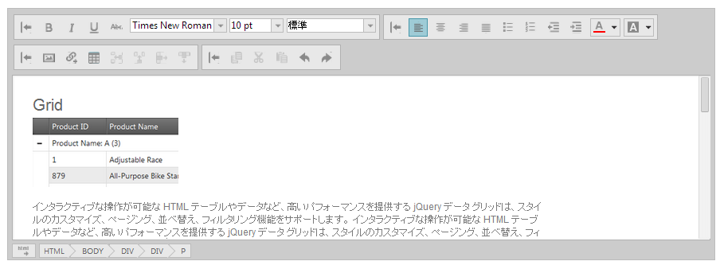
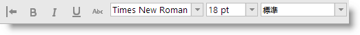
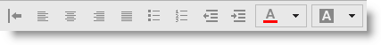
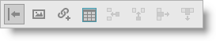

---
title: "igHtmlEditor の概要"
slug: ightmleditor-overview
---

# igHtmlEditor の概要

##トピックの概要

### 目的

このトピックは、`igHtmlEditor`™ およびその機能の概要を説明します。

### このトピックの構成

このトピックは、以下のセクションで構成されます。

-   [概要](#introduction)
-   [ツールバーの概要](#overview)
    -   [テキスト ツールバー](#text-toolbar)
    -   [書式設定ツールバー](#formatting-toolbar)
    -   [オブジェクトの挿入ツールバー](#inset-object)
    -   [コピー/貼り付けツールバー](#copy-paste)
    -   [カスタム ツールバー](#custom-toolbar)
-   [関連コンテンツ](#related-content)
    -   [トピック](#topics)
    -   [サンプル](#samples)
    -   [リソース](#resources)

##概要

### igHtmlEditor の概要

`igHtmlEditor` は、オンライン コンテンツの作成および書式設定のためのテキスト エディター コントロールです。標準の HTML 編集機能を備えています。

そのオプションには、フォント フェースおよびサイズ、テキスト配置、画像の管理だけでなく、画像、ハイパーリンク、テーブルのサポートがあります。これらのオプションは、テキスト ツールバー、書式設定ツールバー、オブジェクトの挿入ツールバー、コピー/貼り付けツールバーの 4 つのツールバーに分かれています。ツールバーは、展開および縮小、また表示/非表示が可能です。また、各ツールバー内でツールバー コントロールを有効/無効、または表示/非表示ができます。

カスタム ツールバーを作成して `igHtmlEditor` 機能を拡張できます。

`igHtmlEditor` コントロールには 2 つのモードがあります。1 つ目はデザイン モード、いわゆる WYSIWYG (What You See Is What You Get) モードです。2 つ目はソース ビュー モードです。ユーザーは、コントロールの左下端にある [HTML] ボタンを押して、モード間を切り替えることができます。

`igHtmlEditor` コントロールは、IFRAME 要素として実装されています。編集機能は、IFRAME の BODY 要素の [contenteditable](http://blog.whatwg.org/the-road-to-html-5-contenteditable) 属性を true に設定すると有効になります。

##ツールバーの概要

以下の表は、`igHtmlEditor` コントロールの主な機能をまとめています。追加の詳細は、以下の概要表の下に示します。

機能|説明
---|---
[テキスト ツールバー](#text-toolbar)|文字レベルでテキストを書式設定するためのボタンとドロップダウンが入っています。
[書式設定ツールバー](#formatting-toolbar)|パラグラフ レベルでテキストを書式設定し、テキストと背景色を管理するためのボタンが入っています。
[オブジェクトの挿入ツールバー](#inset-object)|各種コンテンツを挿入するためのボタンが入っています。
[コピー/貼り付けツールバー](#copy-paste)|クリップボード機能 (切り取り/コピー/貼り付け) と一般的な編集オプションのボタンが入っています。
[カスタム ツールバー](#custom-toolbar)|カスタム ツールバーを作成して igHtmlEditor のデフォルト機能を拡張できます。

### 関連トピック

-   [ツールバーとボタンの構成](/controls/ightmleditor/working/configuring-toolbars-and-buttons)

### テキスト ツールバー

テキスト ツールバーには、文字レベルでテキストを書式設定するためのボタンとドロップダウンが入っています。

そのデフォルトのボタンとドロップダウンは、(左から右へ) 以下のように配置されています。

-   太字
-   斜体
-   下線
-   取り消し線
-   フォント サイズを大きくする
-   フォント サイズを小さくする
-   フォント フェース ドロップダウン
-   フォント サイズ ドロップダウン
-   見出しドロップダウン

### 書式設定ツールバー

書式設定ツールバーには、パラグラフ レベルでテキストを書式設定し、テキストと背景色を管理するためのボタンが入っています。

そのデフォルトのボタンとドロップダウン ボタンは、(左から右へ) 以下のように配置されています。

-   左揃え
-   中央揃え
-   右揃え
-   両端揃え
-   行頭文字およびナンバリング ドロップダウン ボタン
-   インデント ドロップダウン ボタン
-   フォント カラー ドロップダウン ボタン
-   背景色ドロップダウン ボタン

### オブジェクトの挿入ツールバー

オブジェクトの挿入ツールバーには、各種コンテンツを挿入するためのボタンが入っています。

そのデフォルトのボタンは、(左から右へ) 以下のように配置されています。

-   画像を挿入
-   リンクの挿入
-   表の挿入
-   行の追加
-   列を追加する
-   行を削除する
-   列を削除する

###コピー/貼り付けツールバー

コピー/貼り付けツールバーには、クリップボード機能 (切り取り/コピー/貼り付け) と一般的な編集オプション (元に戻す/やり直し) のボタンが入っています。

そのデフォルトのボタンは、(左から右へ) 以下のように配置されています。

-   コピー
-   切り取り
-   貼り付け
-   元に戻す
-   やり直し

### カスタム ツールバー

カスタム ツールバーを作成して igHtmlEditor のデフォルト機能を拡張できます。カスタム ツールバーには、ボタンまたはコンボ ボックスを含めることができます。

カスタム ツールバーは、標準ツールバーのすべての機能を搭載できます。ツールバーを展開/縮小したり、表示/非表示したり、またはツールバー内のコントロールを有効または無効にできます。カスタム ツールバーは、オブジェクト リテラルを `customToolbars` 配列に追加して作成されます。

##関連コンテンツ

### トピック

このトピックの追加情報については、以下のトピックも合わせてご参照ください。

-	[igHtmlEditor の追加](/controls/ightmleditor/adding-ightmleditor): このトピックでは、`igHtmlEditor` を Web ページに追加する方法について説明します。

-	[igHtmlEditor の操作](/controls/ightmleditor/working/working-with-ightmleditor): これは、`igHtmlEditor` を構成し、それをプログラム的に管理する方法を説明する一連のトピックです。

### サンプル

このトピックについては、以下のサンプルも参照してください。

-	[内容を編集する](&#123;environment:SamplesUrl&#125;/html-editor/edit-content): このフォーラム投稿のサンプルでは、HTML エディターでコンテンツを提供します。

-	[カスタム ツールバーおよびボタン](&#123;environment:SamplesUrl&#125;/html-editor/custom-toolbars-and-buttons): このサンプルでは、HtmlEditor コントロールを電子メール クライアントとして実装します。署名をメッセージに追加するカスタム ツールバーがあります。

-	[API およびイベント](/controls/ightmleditor/working/modifying-contents-programmatically#api-and-events-demo): このサンプルでは、HTML エディター コントロールのイベントを処理する方法を紹介し、API を使用する方法を紹介します。

### リソース

以下の資料 (Infragistics のコンテンツ ファミリー以外でもご利用いただけます) は、このトピックに関連する追加情報を提供します。

-	[HTML 5 への道のり: contentEditable](http://blog.whatwg.org/the-road-to-html-5-contenteditable): これは、ブラウザーでリッチ テキスト編集機能を実現する場合に使用する contentEditable 属性を説明したブログ投稿です。

 

 

