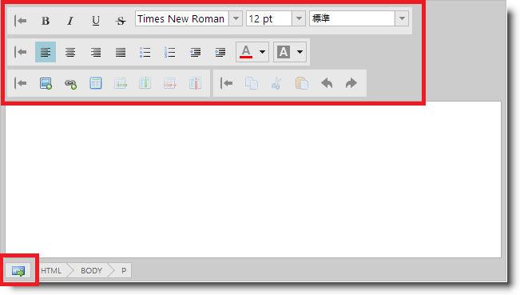

# スタイル設定とテーマ設定

##トピックの概要

### 目的

このトピックでは、`igHtmlEditor`™ コントロールにスタイルを適用する方法について説明します。

### 前提条件

以下の表は、このトピックを理解するための前提条件として必要なトピック、概念、および記事の一覧です。

-   CSS スプライト

**トピック**

-	[igHtmlEditor の概要](/ightmleditor-overview): このトピックでは、`igHtmlEditor` の各種機能について説明します。

-	[igHtmlEditor の追加](/ightmleditor-adding-ightmleditor): このトピックでは、`igHtmlEditor` を Web ページに追加する方法について説明します。

-	[ツールバーとボタンの構成](/ightmleditor-configuring-toolbars-and-buttons): このトピックでは、`igHtmlEditor` のツールバーとボタンを構成する方法について説明します。

-	[&#123;environment:ProductName&#125; のスタイル設定とテーマ設定](/deployment-guide-styling-and-theming): このトピックでは、デザイン段階でのアプリケーションのセットアップ手順について説明し、実稼働環境で CSS を使用するためのオプションを紹介すると同時に、テーマの作成またはカスタマイズについての概要を示します。

**外部リソース**

-   [CSS スプライト: 画像スライシングの圧倒的魅力](http://www.alistapart.com/articles/sprites/)
-   [CSS スプライト: その正体と魅力と使い方](http://css-tricks.com/css-sprites/)

### このトピックの内容

このトピックは、以下のセクションで構成されます。

-   [概要](#introduction)
-   [テーマの概要](#overview)
-   [ボタン スタイル リファレンス](#style-reference)
-   [関連コンテンツ](#related-content)

##概要

### igHtmlEditor のスタイル設定とテーマ設定の概要

`igHtmlEditor` には、インフラジスティックスによって提供される 2 つのテーマを適用できます。Infragistics テーマと Metro テーマです。さらに、適切なスタイルを使用することにより、ボタンの背景画像を変更できます。

次のスクリーンショットは、カスタム ボタン アイコンをアイコンの境界線なしで適用した `igHtmlEditor` です。

##テーマの概要

### 概要

&#123;environment:ProductName&#125;™ はスタイルやテーマの設定に jQuery UI CSS フレームワークを利用します。Infragistics と Metro は、アプリケーションでの使用を目的として Infragistics によって提供される jQuery UI テーマです。

こうしたテーマの適用に関する詳細については、[&#123;environment:ProductName&#125; のスタイル設定とテーマ設定](/deployment-guide-styling-and-theming)トピックをご覧ください。

`igHtmlEditor` ボタンのスタイルは jQuery UI テーマのスタイルによってオーバーライドされ、その結果、jQuery UI テーマとは異なるボタン アイコンが表示されることになるため、厳密には、`igHtmlEditor` が jQuery UI のテーマやテーマ ローラー ツールでサポートされているとはいえません。

しかし、下記のリファレンス情報を参考にして Infragistics のテーマをオーバーライドすれば、`igHtmlEditor` に適用されるスタイルをカスタマイズできるようになります。

### テーマの概要

次の表は、`igHtmlEditor` で使用できるテーマをまとめたものです。

<table cellspacing="0" cellpadding="0" class="table">
	<tbody>
		<tr>
			<th colspan="2">テーマ</th>
			<th>説明</th>
</tr>

		<tr>
			<td>IG テーマ</td>
			<td>パス: &#123;IG CSS root&#125;/themes/Infragistics/ ファイル: infragistics.theme.css</td>
			<td>このテーマは、すべての &#123;environment:ProductName&#125; コントロールの一般的なビジュアル機能を定義します。</td>
</tr>

		<tr>
			<td>Metro テーマ</td>
			<td>パス: &#123;IG CSS root&#125;/themes/metro/ ファイル: infragistics.theme.css</td>
			<td>Metro テーマは、クリーンでモダンかつ高速な Metro デザイン言語の実装です。</td>
</tr>
	</tbody>
</table>

Metro テーマは、クリーンでモダンかつ高速な Metro デザイン言語の実装です。

##ボタン スタイル リファレンス

### ボタン スタイル リファレンスの概要

次の表は、`igHtmlEditor` コントロールの主なボタン スタイルの目的と機能をまとめたものです。

>**注:** 複数のボタン背景画像を適用する際の手段としては、[スプライトの使用](http://www.alistapart.com/articles/sprites/)が最も効率的です。

スタイル|説明
---|---
.ui-igbutton .ui-igbutton-collapse|[縮小] ボタンの背景画像を定義します。
.ui-igbutton .ui-igbutton-expand|[展開] ボタンの背景画像を定義します。
.ui-igbutton .ui-igbutton-redo|[再実行] ボタンの背景画像を定義します。
.ui-igbutton .ui-igbutton-undo|[元に戻す] ボタンの背景画像を定義します。
.ui-igbutton .ui-igbutton-increasefontsize|[フォント サイズ拡大] ボタンの背景画像を定義します。
.ui-igbutton .ui-igbutton-decreasefontsize|[フォント サイズ縮小] ボタンの背景画像を定義します。
.ui-igbutton .ui-igbutton-viewsource-icon|[ビュー ソース] ボタンの背景画像を定義します。
.ui-igbutton .ui-igbutton-addimage|[画像の追加] ボタンの背景画像を定義します。
.ui-igbutton .ui-igbutton-addlink|[リンクの追加] ボタンの背景画像を定義します。
.ui-igbutton .ui-igbutton-copy|[コピー] ボタンの背景画像を定義します。
.ui-igbutton .ui-igbutton-cut|[切り取り] ボタンの背景画像を設定します。
.ui-igbutton .ui-igbutton-paste|[貼り付け] ボタンの背景画像を定義します。
.ui-igbutton .ui-igbutton-table|[テーブル] ボタンの背景画像を定義します。
.ui-igbutton .ui-igbutton-addrow|[行の追加] ボタンの背景画像を定義します。
.ui-igbutton .ui-igbutton-addcolumn|[列の追加] ボタンの背景画像を定義します。
.ui-igbutton .ui-igbutton-removerow|[行の削除] ボタンの背景画像を定義します。
.ui-igbutton .ui-igbutton-removecolumn|[列の削除] ボタンの背景画像を定義します。
.ui-igbutton .ui-igbutton-justifyleft|[左揃え] ボタンの背景画像を定義します。
.ui-igbutton .ui-igbutton-justifycenter|[中央揃え] ボタンの背景画像を定義します。
.ui-igbutton .ui-igbutton-justifyright|[右揃え] ボタンの背景画像を定義します。
.ui-igbutton .ui-igbutton-justifyfull|[両端揃え] ボタンの背景画像を定義します。
.ui-igbutton .ui-igbutton-forecolor|[前景色] ボタンの背景画像を定義します。
.ui-igbutton .ui-igbutton-backcolor|[背景色] ボタンの背景画像を定義します。
.ui-igbutton .ui-igbutton-bold|[太字] ボタンの背景画像を定義します。
.ui-igbutton .ui-igbutton-italic|[斜体] ボタンの背景画像を定義します。
.ui-igbutton .ui-igbutton-underline|[下線] ボタンの背景画像を定義します。
.ui-igbutton .ui-igbutton-strikethrough|[取り消し線] ボタンの背景画像を定義します。
.ui-igbutton .ui-igbutton-indent|[インデント] ボタンの背景画像を定義します。
.ui-igbutton .ui-igbutton-removeindent|[インデント解除] ボタンの背景画像を定義します。
.ui-igbutton .ui-igbutton-unorderedlist|[番号なしリスト] ボタンの背景画像を定義します。
.ui-igbutton .ui-igbutton-orderedlist|[番号付きリスト] ボタンの背景画像を定義します。

##関連コンテンツ

### トピック

このトピックの追加情報については、以下のトピックも合わせてご参照ください。

-	[既知の問題と制限 (igHtmlEditor)](/ightmleditor-known-issues): このドキュメントでは、`igHtmlEditor` の既知の問題と制限について説明します。

### サンプル

このトピックについては、以下のサンプルも参照してください。

-	[カスタム アイコンとスタイル設定](&#123;environment:SamplesUrl&#125;/html-editor/custom-icons-and-styles): スタイル設定で `igHtmlEditor` コントロールは jQuery UI CSS フレームワークをサポートしません。標準の Infragistics テーマおよび Windows UI テーマはサポートされます。このサンプルは、CSS スタイルを使用して `igHtmlEditor` のルック アンド フィールをカスタマイズする方法を示します。

 

 

