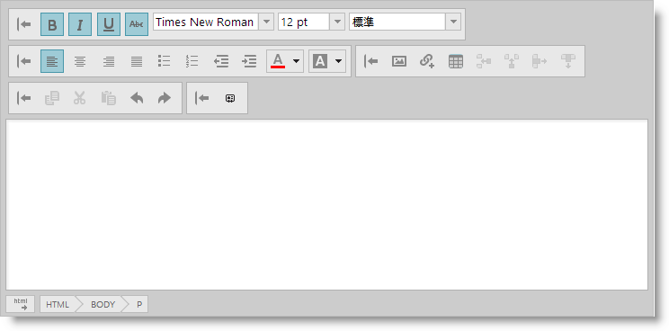
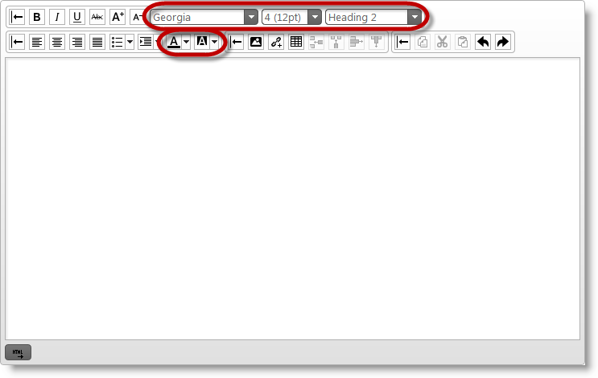

---
title: "ツールバーとボタンの構成"
slug: ightmleditor-configuring-toolbars-and-buttons
---

# ツールバーとボタンの構成


##トピックの概要


### 目的

このトピックでは `igHtmlEditor`™ のツールバーおよびボタンの構成方法を説明します。

### 必要な背景

以下の表は、このトピックを理解するための前提条件として必要なトピックを示しています。


-	[igHtmlEditor の概要](/controls/ightmleditor/overview): このトピックでは、`igHtmlEditor` の機能について説明します。

-	[igHtmlEditor の追加](/controls/ightmleditor/adding-ightmleditor): このトピックでは、`igHtmlEditor` を Web ページに追加する方法について説明します。


### このトピックの構成

このトピックは、以下のセクションで構成されます。

-   [コントロールの構成の概要](#config-summary)
-   [ツールバーを非表示にする](#hide-toolbar)
-   [ツールバーを折り畳む](#collapse-toolbar)
-   [ボタン状態の切り替え](#toggle-button)
-   [ボタン ツールチップの設定](#set-button)
-   [テキスト オプションの構成](#config-text-options)
-   [関連コンテンツ](#related-content)


##<a id="config-summary"></a>コントロールの構成の概要


### コントロールの構成の概要

以下の表は、`igHtmlEditor` コントロール ツールバーの構成可能な要素を示しています。詳細は、概要表の後に記載されています。


| 構成可能な要素 | 詳細 | プロパティ |
| --- | --- | --- |
| [ツールバーを非表示にする](#hide-toolbar) | ツールバーは表示または非表示にできます。すべてのツールバーは最初は表示されています。右側のプロパティを使用してツールバーの表示状態を切り替えることができます。 | showTextToolbar showFormattingToolbar showInsertObjectToolbar showCopyPasteToolbar |
| [ツールバーを折り畳む](#collapse-toolbar) | ツールバーは展開または折り畳むことができます。すべてのツールバーは最初は展開されています。 右側のプロパティを使用して、ツールバーの展開/折り畳み状態を切り替えることができます。 | toolbarSettings expanded |
| [ボタン状態の切り替え](#toggle-button) | ツールバー ボタンの一部は初期化時に切り替えることができます。 たとえば、太字、斜体、下線ボタンを初期化時に切り替えることができます | isBold isItalic isUnderline isStrikethrough isJustifyleft isJustifycenter isJustifyright isJustifyfull |
| [ボタン ツールチップの設定](#set-button) | 各ツールバー ボタンにはツールチップがあります。右側のプロパティを使用して、ボタンのツールチップを変更します。 **注:** ツールチップはローカライズ可能です。`igHtmlEditor` をローカライズしたい場合、Infragistics Loader のロケール コードを設定します。 | italicButtonTooltip boldButtonTooltip underlineButtonTooltip decreaseFontTooltip increaseFontTooltip fontSizeComboTooltip fontFamilyComboTooltip textColorPickerTooltip textBackgroundColorPickerTooltip formatListTooltip bulletsTooltip numbersTooltip alignmentTooltip leftAlignmentTooltip centerAlignmentTooltip rightAlignmentTooltip indentTooltip decreaseIndentTooltip increaseIndentTooltip spacingTooltip tableTooltip rowsLabel columnsLabel tableRowsLabelTooltip tableColumnsLabelTooltip insertImageTooltip insertUrlTooltip insertVideoTooltip |
| [テキスト オプションの構成](#config-text-options) | 以下のための最初のテキストを構成できます。 フォント ファミリー フォント サイズ テキストの色 テキスト背景色 選択したフォーマット（見出し） | selectedFontFamily selectedFontSize selectedTextColor selectedTextBackgroundColor selectedFormat |


##<a id="hide-toolbar"></a>ツールバーを非表示にする


### 概要

ツールバーを非表示にするには、show`<toolbarName>` オプションを false に設定します。ここで `<toolbarName>` はツールバーの名前であり、以下の値を持つことができます。

-   TextToolbar
-   FormattingToolbar
-   InsertObjectToolbar
-   CopyPasteToolbar
-   `<CustomToolbarName>`

カスタム ツールバーを定義した場合、show`<CustomToolbarName>` オプションを使用してその表示状態を設定します。

### オプションの設定

以下の表は、必要な構成とオプション設定の対応です。

目的:|使用するオプション|設定の選択肢:
---|---|---
テキスト ツールバーを非表示にする|showTextToolbar|false
書式設定ツールバーを非表示にする|showFormattingToolbar|false
オブジェクトの挿入ツールバーを非表示にする|showInsertObjectToolbar|false
コピー/貼り付けツールバーを非表示にする|showCopyPasteToolbar|false
カスタム ツールバーを非表示にする|show`&lt;MyCustomToolbarName&gt;`|false


### 例

以下のスクリーンショットは、以下の設定の結果、igHtmlEditor がどのように表示されるかを示しています。

プロパティ|値
---|---
showTextToolbar|false
showFormattingToolbar|false
showInsertObjectToolbar|false
showInsertObjectToolbar|false
show`<MyCustomToolbarName>`|false


すべての標準ツールバーが非表示であるため、ツールバー領域は空です。以下は、これを達成するためのコードです。

**JavaScript の場合:**

```js
$('#htmlEditor').igHtmlEditor({
    showTextToolbar: false,
    showFormattingToolbar: false,
    showInsertObjectToolbar: false,
    showCopyPasteToolbar: false,
    showMyCustomToolbar: false,
    customToolbars: [{
        name: "myCustomToolbar",
        // myCustomToolbar definition
    }]
});
```


##<a id="collapse-toolbar"></a>ツールバーを折り畳む


### 概要

テキスト ツールバーを初期に折り畳むためには、expanded オプションを false に設定します。オブジェクト リテラルを `toolbarSettings` で定義し、その name オプションをツールバーの名前に設定する必要があります。それから、expanded オプションを使ってツールバーの展開/折り畳みを行います。

ツールバー名:

-   textToolbar
-   formattingToolbar
-   insertObjectToolbar
-   copyPasteToolbar
-  ` <customToolbarName>`

ここで、`<customToolbarName>` はカスタム ツールバーの名前です。

### プロパティ設定

以下の表では、目的の構成をプロパティ設定にマップしています。

目的:|使用するプロパティ:|設定の選択肢:
---|---|---
テキスト ツールバーを折り畳む|expanded|false
書式設定ツールバーを折り畳む|expanded|false
オブジェクトの挿入ツールバーを折り畳む|expanded|false
コピー/貼り付けツールバーを折り畳む|expanded|false
カスタム ツールバーを縮小する|expanded|false


### 例

以下のスクリーンショットは、以下の設定の結果、`igHtmlEditor` がどのように表示されるかを示しています。

プロパティ|値
---|---
expanded|false


上記の例では、標準ツールバーは折り畳まれています。以下は、これを達成するためのコードです。

**JavaScript の場合:**

```js
$('#htmlEditor').igHtmlEditor({
    toolbarSettings: [
    {
        name: "textToolbar",
        expanded: false
    },
    {
        name: "formattingToolbar",
        expanded: false
    },
    {
        name: "insertObjectToolbar",
        expanded: false
    },
    {
        name: "copyPasteToolbar",
        expanded: false
    }],
    customToolbars: [{
        name: "myCustomToolbar",
        expanded: false,
        // myCustomToolbar settings
    }]
});
```


##<a id="toggle-button"></a>ボタン状態の切り替え


### 概要

ツールバーのボタンの一部は切り替えることができます。切り替えオプションは、それぞれのツールバー オブジェクトにあります。

### プロパティ設定

以下の表では、目的の構成をプロパティ設定にマップしています。

テキスト ツールバーオブジェクト内:

目的:|使用するプロパティ:|設定の選択肢:
---|---|---
太字ボタンをオンに切り替える|isBold|true
斜体ボタンをオンに切り替える|isItalic|true
下線ボタンをオンに切り替える|isUnderline|true
取り消し線ボタンをオンに切り替える|isStrikethrough|true


書式設定ツールバー内:

目的:|使用するプロパティ:|設定の選択肢:
---|---|---
左揃えボタンをオンに切り替える|isJustifyleft|true
右揃えボタンをオンに切り替える|isJustifyright|true
中央揃えボタンをオンに切り替える|isJustifycenter|true
両端揃えボタンをオンに切り替える|isJustifyfull|true


>**注:** テキスト配置オプションは 1 つだけ適用されます。すなわち、これらは相互に排他的です。

### 例

以下のスクリーンショットは、以下の設定の結果、`igHtmlEditor` がどのように表示されるかを示しています。

プロパティ|値
---|---
isJustifycenter|true
isBold|true
isItalic|true
isUnderline|true
isStrikethrough|true




上記の例では、切り替え可能なすべてのテキスト ツールバー ボタンが押されています。これは、これらのボタンはお互いに独立して機能するためです。書式設定ツールバーについては、`isJustifycenter` オプションのみがオンに切り替えられます。以下は、これを達成するコードです。

**JavaScript の場合:**

```js
$('#htmlEditor').igHtmlEditor({
    toolbarSettings: [
    {
        name: "textToolbar",
        isBold: true,
        isItalic: true,
        isUnderline: true,
        isStrikethrough: true
    },
    {
        name: "formattingToolbar",
        isJustifycenter: true,
    }]
});
```


##<a id="set-button"></a>ボタン ツールチップの設定


### 概要

各ツールバー ボタンにはツールチップがあります。以下は、ボタンのリストと、ツールバーごとにグループ化されたそれぞれのプロパティです。

>**注:** ツールチップはローカライズ可能です。`igHtmlEditor` をローカライズしたい場合、Infragistics Loader のロケールコードを設定します。

### オプションの設定

以下の表は、必要な構成とオプション設定の対応です。

テキスト ツールバー オブジェクト:

目的:|使用するオプション|設定の選択肢:
---|---|---
太字ボタン ツールチップを設定する|boldButtonTooltip|Bold
斜体ボタン ツールチップを設定する|italicButtonTooltip|Italic
下線ボタン ツールチップを設定する|underlineButtonTooltip|Underline
取り消し線ボタン ツールチップを設定する|strikethroughButtonTooltip|Strikethrough
縮小ボタン ツールチップを設定する|decreaseFontButtonTooltip|Decrease font
拡大ボタン ツールチップを設定する|increaseFontButtonTooltip|Increase font


書式設定ツールバー内:

目的:|使用するプロパティ:|設定の選択肢:
---|---|---
「テキストを左揃え」ボタン ツールチップの設定|justifyleftButtonTooltip|Align Text Left
「テキストを中央揃え」ボタン ツールチップの設定|justifycenterButtonTooltip|Center
「テキストを右揃え」ボタン ツールチップの設定|justifyrightButtonTooltip|Align Text Right
「行端揃え」ボタン ツールチップの設定|justifyfullButtonTooltip|Justify


オブジェクトの挿入ツールバー オブジェクト:

目的:|使用するプロパティ:|設定の選択肢:
---|---|---
「画像の挿入」ボタン ツールチップの設定|imageButtonTooltip|Insert Picture
「ハイパーリンクの挿入」ボタン ツールチップの設定|linkButtonTooltip|Insert Hyperlink
「表」ボタン ツールチップの設定|tableButtonTooltip|Table
「行の追加」ボタン ツールチップの設定|addRowButtonTooltip|Add Row
「列の追加」ボタン ツールチップの設定|addColumnButtonTooltip|Add Column
「行の削除」ボタン ツールチップの設定|removeRowButtonTooltip|Remove Row
「列の削除」ボタン ツールチップの設定|removeColumnButtonTooltip|Remove Column


コピー/貼り付けツールバー オブジェクト:

目的:|使用するプロパティ:|設定の選択肢:
---|---|---
「コピー」ボタン ツールチップの設定|copyButtonTooltip|Copy
「切り取り」ボタン ツールチップの設定|cutButtonTooltip|Cut
「貼り付け」ボタン ツールチップの設定|pasteButtonTooltip|Paste
「元に戻す」ボタン ツールチップの設定|undoButtonTooltip|Undo
「やり直し」ボタン ツールチップの設定|redoButtonTooltip|Redo


### 例

以下の例は、ボタン ツールチップの設定方法を示しています。

**JavaScript の場合:**

```js
$('#htmlEditor').igHtmlEditor({
    toolbarSettings: [
    {
        name: "textToolbar",
        boldButtonTooltip: "Bold",
        italicButtonTooltip: "Italic",
        underlineButtonTooltip: "Underline",
        strikethroughButtonTooltip: "Strikethrough",
        decreaseFontButtonTooltip: "Decrease font",
        increaseFontButtonTooltip: "Increase font",
    },
    {
        name: "formattingToolbar",
        justifyleftButtonTooltip: "Align Text Left",
        justifycenterButtonTooltip: "Center",
        justifyrightButtonTooltip: "Align Text Right",
        justifyfullButtonTooltip: "Justify"
    },
    {
        name: "insertObjectToolbar",
        imageButtonTooltip: "Insert Picture",
        linkButtonTooltip: "Insert Hyperlink",
        tableButtonTooltip: "Table",
        addRowButtonTooltip: "Add Row",
        addColumnButtonTooltip: "Add Column",
        removeRowButtonTooltip: "Remove Row",
        removeColumnButtonTooltip: "Remove Column"
    },
    {
        name: "copyPasteToolbar",
        copyButtonTooltip: "Copy",
        cutButtonTooltip: "Cut",
        pasteButtonTooltip: "Paste",
        undoButtonTooltip: "Undo",
        redoButtonTooltip: "Redo"
    }
    ]
});
```


##<a id="config-text-options"></a>テキスト オプションの構成


### 概要

以下のためのテキスト オプションを構成できます。

-   フォント ファミリー
-   フォント サイズ
-   テキストの色
-   テキスト背景色

### オプションの設定

以下の表は、必要な構成とオプション設定の対応です。

目的:|使用するオプション|設定の選択肢:
---|---|---
テキスト フォント ファミリーを設定します|selectedFontFamily|Georgia
テキスト フォント サイズを設定します|selectedFontSize|"4"
テキストの色を設定します|selectedTextColor|"black"
テキスト背景色を設定します|selectedTextBackgroundColor|"white"
テキスト フォーマットを設定します|selectedFormat|"h2"


### 例

以下のスクリーンショットは、以下の設定の結果、`igHtmlEditor` がどのように表示されるかを示しています。

プロパティ|値
---|---
selectedFontFamily|Georgia
selectedFontSize|"4"
selectedTextColor|"black"
selectedTextBackgroundColor|"white"
selectedFormat|"h2"




以下は、これを達成するコードです。

**JavaScript の場合:**

```js
$('#htmlEditor').igHtmlEditor({
    toolbarSettings: [
    {
        name: "textToolbar",
        selectedFontFamily: "Georgia",
        selectedFontSize: "4",
        selectedFormat: "h2"
    },
    {
        name: "formattingToolbar",
        selectedTextColor: "black",
        selectedTextBackgroundColor: "white"
    },
    ]
});
```


##<a id="related-content"></a>関連コンテンツ


### トピック

このトピックの追加情報については、以下のトピックも合わせてご参照ください。

-	[HTML コンテンツをコードで保存](/controls/ightmleditor/working/saving-html-content): このトピックでは `igHtmlEditor` のコンテンツを Web サーバーに保存する方法を説明します。

-	[プログラムによるコンテンツの変更](/controls/ightmleditor/working/modifying-contents-programmatically): このトピックでは、API を使用して `igHtmlEditor` のコンテンツを修正する方法について説明します。


### サンプル

このトピックについては、以下のサンプルも参照してください。

-	[内容を編集する](&#123;environment:SamplesUrl&#125;/html-editor/edit-content): このフォーラム投稿のサンプルでは、HTML エディターでコンテンツを提供します。

-	[カスタム ツールバーおよびボタン](&#123;environment:SamplesUrl&#125;/html-editor/custom-toolbars-and-buttons): このサンプルでは、HtmlEditor コントロールを電子メール クライアントとして実装します。署名をメッセージに追加するカスタム ツールバーがあります。

-	[API およびイベント](/controls/ightmleditor/working/modifying-contents-programmatically#api-and-events-demo): このサンプルでは、HTML エディター コントロールのイベントを処理する方法を紹介し、API を使用する方法を紹介します。


 

 


