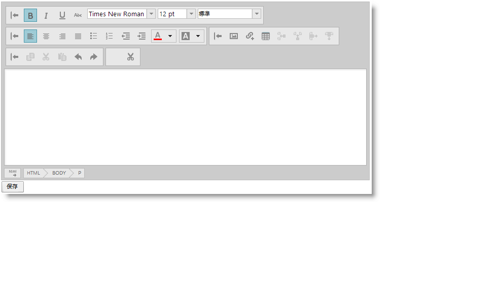

# HTML コンテンツをコードで保存


## トピックの概要


### 目的

このトピックでは、`igHtmlEditor`™ コンテンツを Web サーバーに保存する方法について説明します。

### 必要な背景


-   ASP.NET Request Validation

**トピック**

-	[igHtmlEditor の概要](/ightmleditor-overview): このトピックでは、`igHtmlEditor` の機能について説明します。

-	[igHtmlEditor の追加](/ightmleditor-adding-ightmleditor): このトピックでは、`igHtmlEditor` を Web ページに追加する方法について説明します。

**外部リソース**

-   ASP.NET MVC 3 の Request Validation の理解
-   Request Validation - スクリプト攻撃の防御


### このトピックの構成

このトピックは、以下のセクションで構成されます。

-   [ASP.NET MVC フォームでの HTML コンテンツの投稿](#asp-net-mvc-form)
    -   [概要](#asp-net-mvc-introduction)
    -   [プレビュー](#asp-net-mvc-preview)
    -   [要件](#asp-net-mvc-requirements)
    -   [概要](#asp-net-mvc-overview)
    -   [手順](#asp-net-mvc-steps)
-   [AJAX 呼び出しでの HTML コンテンツの送信](#ajax-call)
    -   [概要](#ajax-call-introduction)
    -   [プレビュー](#ajax-call-review)
    -   [要件](#ajax-call-requirements)
    -   [概要](#ajax-call-overview)
    -   [手順](#ajax-call-steps)
-   [関連コンテンツ](#related-content)
    -   [トピック](#topics)
    -   [サンプル](#samples)


## ASP.NET MVC フォームでの HTML コンテンツの投稿


### 概要

この手順は、ASP.NET MVC アプリケーションで `igHtmlEditor` を構成する方法を示します。`igHtmlEditor` には HTML コードが含まれているため、ASP.NET Request Validation を操作する必要があります。Request Validation はセキュリティ機能で、ユーザーが JavaScript や HTML など悪意のある可能性があるコードをサーバーに投稿できないようにします。

ASP.NET MVC 3 で、プロパティ単位で Request Validation をオフにできます。これを行うには、`AllowHtml` 属性を `igHtmlEditor` コンテンツを保存するプロパティに追加します。

ASP.NET MVC 2 で、オブジェクト単位で Request Validation をオフにできます。`ValidateInput` 属性をコントローラー メソッドに追加します。

### プレビュー

以下のスクリーンショットは最終結果のプレビューです。



### 要件

この手順を実行するには、以下が必要です。

-   &#123;environment:ProductName&#125; リソースが組み込まれた ASP.NET MVC 3 プロジェクト

### 概要

このトピックでは、ASP.NET MVC 3 フォームで `igHtmlEditor` を構成する方法を手順ごとに示します。以下はプロセスの概念的概要です。

[1. Model の定義](#mvc-define-model)

[2. Controller の定義](#mvc-define-controller)

[3. View で igHtmlEditor の定義](#mvc-define-view)

### 手順

以下の手順は、ASP.NET MVC 3 プロジェクトで `igHtmlEditor` を構成する方法を示しています。

1. <a id="mvc-define-model"></a>モデルを定義する

	a. *ForumPost* クラスを作成します。

	**C# の場合:**

```csharp
	public class ForumPost
    {
        public int Id { get; set; }
        public string User { get; set; }
        public string Title { get; set; }
        public DateTime DatePosted { get; set; }
        public string Post { get; set; }
    }
```

	b. `AllowHtml` 属性を Post プロパティに追加します。

	**C# の場合:**

```csharp
    [AllowHtml]
	public string Post { get; set; }
```

2. <a id="mvc-define-controller"></a>コントローラーを定義します。

	a. `AddPost` アクション メソッドをコントローラーで定義します。

	このメソッドは、デフォルト ビューを返します。

	**C# の場合:**

```csharp
	public ActionResult AddPost()
    {
        return View();
    }
```

	b. `SavePost` アクション メソッドをコントローラーで定義します。

	このメソッドには、モデル クラス `ForumPost` のオブジェクト インスタンスであるパラメーターが 1 つあります。`SaveForumPost` はヘルパー メソッドで、コンテンツをデータベースに保存します。フォーラム投稿を保存した後、ユーザーには `ListForumPosts` ビューが表示され、フォーラム投稿のリストを表示します。

	MVC 3 の場合

	**C# の場合:**

```csharp
	public ActionResult SavePost(ForumPost forumPost)
    {
        SaveForumPost(forumPost);
        return View("ListForumPosts");
    }
    private void SaveForumPost(ForumPost forumPost)
    {
        //Save forum post to database
    }
```

	MVC 2 の場合

	**C# の場合:**

```csharp
	[ValidateInput(false)]
    public ActionResult SavePost(ForumPost forumPost)
    {
        SaveForumPost(forumPost);
        return View("ListForumPosts");
    }
```

3. <a id="mvc-define-view"></a>ビューで `igHtmlEditor` を定義する

	`AddPost` ビューを定義します。

	a. 厳密に型指定されたモデルをビューに追加します。

	このモデルにより、ASP.NET MVC モデル バインドのある `HtmlEditorFor` ヘルパー メソッドを使用できます。

	**C# の場合:**

```csharp
    @model igHtmlEditor.Models.ForumPost
```

	b. igHtmlEditor をビューで初期化します。

	HtmlEditorFor を使用して、モデルの特定フィールドの `igHtmlEditor` を初期化します。

	**C# の場合:**

```csharp
    @Html.Infragistics().HtmlEditorFor(m => m.Post).ID("igHtmlEditor").Width("500px").Height("500px").Render()
```


## AJAX 呼び出しでの HTML コンテンツの送信


### 概要

この手順は、AJAX 呼び出しの `igHtmlEditor` コンテンツを ASP.NET MVC 3 アクションに投稿する方法を示します。ASP.NET Request Validation もここで適用されます。

>**注:** ASP.NET Web Forms プロジェクトでこのコードを簡単に使用できます。

### プレビュー

以下のスクリーンショットは最終結果のプレビューです。


### 要件

この手順を実行するには、以下が必要です。

-   &#123;environment:ProductName&#125; リソースが組み込まれた ASP.NET MVC 3 プロジェクト

### 概要

このトピックでは、AJAX 呼び出しの `igHtmlEditor` コンテンツを送信する方法を手順ごとに示します。以下はプロセスの概念的概要です。

[1. フォームの定義](#define-form)

[2. igHtmlEditor の初期化](#init-editor)

[3. AJAX 関数の定義](#define-ajax-function)

[4. サーバー アクション メソッドの定義](#define-server-action)

### 手順

以下の手順は、ASP.NET MVC 3 プロジェクトの `igHtmlEditor` が AJAX POST 要求で使用されるように構成する方法を示しています。

1. <a id="define-form"></a>フォームを定義する

	フォームを HTMLで定義します。

	**HTML の場合:**

```html
	<form id="forumPostForm" method="post" action="/Home/SavePost">
        <div id="htmlEditor"></div>
        <input type="button" onclick="postHtmlEditorContent();" value="Save" />
    </form>
```

	または Razor で定義します。

	**C# の場合:**

```csharp
	@using (Html.BeginForm("SavePost", "Home", FormMethod.Post, new { id = "forumPostForm" }))
    {
        @Html.Infragistics().HtmlEditorFor(m => m.Post).ID("htmlEditor").Render()
        <input type="button" onclick="postHtmlEditorContent();" value="Save" />
    }
```

2. <a id="init-editor"></a>igHtmlEditor を初期化します

	指定されたアクション パラメーターまたはモデル フィールドのコンテンツを取得するために、Infragistics Loader で初期化し、`inputName` オプションを設定します。

	**JavaScript の場合:**

```js
	$.ig.loader(function () {
        $('#htmlEditor').igHtmlEditor({inputName: "Post"});
    });
```

	Razor で HtmlEditorFor メソッドを使用して初期化し、エディターをモデル フィールドにバインドします。

	**C# の場合:**

```csharp
    @Html.Infragistics().HtmlEditorFor(m => m.Post).ID("htmlEditor").Render()
```

3. <a id="define-ajax-function"></a>Ajax 関数を定義する

	JavaScript 関数を定義し、フォームを AJAX 呼び出しで投稿します。モデル バインドを使用する場合、モデル オブジェクトがメソッド パラメーターとしてそのまま構築されます。

	**JavaScript の場合:**

```js
	function postHtmlEditorContent() {
        // serialize the form
        var data = $("#forumPostForm").serialize();
        // post the form as an ajax call
        $.ajax({
            type: "POST",
            url: "/Home/SavePost",
            data: data,
            dataType: "text"
        });
    }
```

4. <a id="define-server-action"></a>サーバー アクション メソッドを定義する

	`ForumPost` パラメーターで定義されたアクション メソッドを作成します。AJAX call 呼び出しが処理されると、フォームの値が入力された `ForumPost` インスタンスが作成されます。`SaveForumPost` メソッドを使用して、永続ストレージに保存します。

	**C# の場合:**

```csharp
	public ActionResult SavePost(ForumPost forumPost)
    {
        SaveForumPost(forumPost);
        return View("ListForumPosts");
    }
    private void SaveForumPost(ForumPost forumPost)
    {
        //Save forum post to database
    }
```


## 関連コンテンツ


### トピック

このトピックの追加情報については、以下のトピックも合わせてご参照ください。

-	[ツールバーとボタンの構成](/ightmleditor-configuring-toolbars-and-buttons): このトピックでは、`igHtmlEditor` のツールバーとボタンを構成する方法について説明します。

-	[プログラムによるコンテンツの変更](/ightmleditor-modifying-contents-programmatically): このトピックでは、API を使用して `igHtmlEditor` のコンテンツを修正する方法について説明します。


### サンプル

このトピックについては、以下のサンプルも参照してください。

-	[内容を編集する](&#123;environment:SamplesUrl&#125;/html-editor/edit-content): このフォーラム投稿のサンプルでは、HTML エディターでコンテンツを提供します。


 

 


