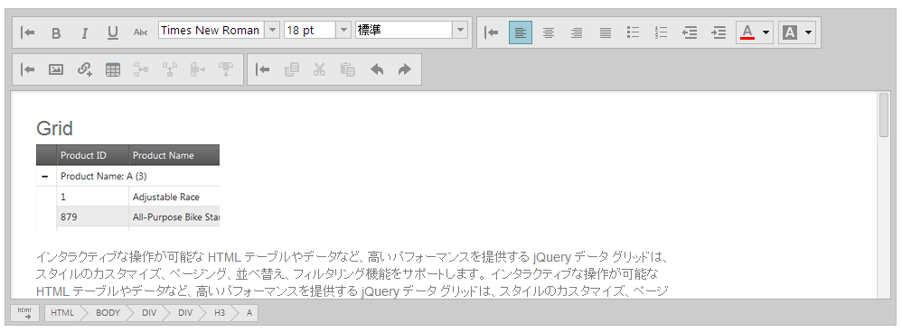

# igHtmlEditor の操作

### 概要

このセクションは、`igHtmlEditor`™ の使用方法について説明します。

### トピック

`igHtmlEditor` の使用に関する詳しい情報については、次のトピックを参照してください。

-	[ツールバーとボタンの構成](/ightmleditor-configuring-toolbars-and-buttons): このトピックでは、`igHtmlEditor` のツールバーとボタンを構成する方法について説明します。

-	[HTML コンテンツをコードで保存](/ightmleditor-saving-html-content): このトピックでは、`igHtmlEditor` コンテンツをサーバーに保存する方法について説明します。

-	[プログラムによるコンテンツの変更](/ightmleditor-modifying-contents-programmatically): このトピックでは、API を使用して `igHtmlEditor` のコンテンツを修正する方法について説明します。

 

 

