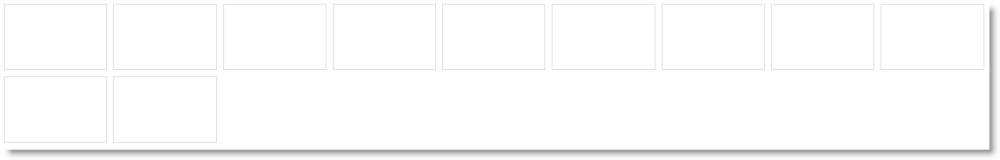

# igLayoutManager の追加

import ApiLink from 'docs-template/components/mdx/ApiLink.astro';

# igLayoutManager の追加


##トピックの概要


### 目的

このトピックではコード例を使用して、実際の HTML または JavaScript のいずれかの実装で、`igLayoutManager`™ コントロールを HTML ページに追加する方法を説明します。

### 前提条件

このトピックを理解するために、以下のトピックを参照することをお勧めします。

-	[igLayoutManager の概要](/iglayoutmanager-overview): このトピックでは、`igLayoutManager` コントロールの概念について説明し、サポートされているレイアウトやその使用についての情報を提供します。


### このトピックの内容

このトピックは、以下のセクションで構成されます。

-   [igLayoutManager の追加 - 概要](#conceptual-overview)
    -   [igLayoutManager の追加の概要](#summary)
    -   [要件](#requirements)
    -   [手順](#steps)
-   [igLayoutManager の HTML マークアップへの追加 - 手順](#adding-igLayoutManager)
    -   [概要](#introduction)
    -   [プレビュー](#preview)
    -   [前提条件](#prerequisites)
    -   [手順](#html-markup-steps)
-   [igLayoutManager の HTML マークアップへの追加 - JavaScript を使用する場合 - 手順](#js-procedure)
    -   [概要](#js-introduction)
    -   [プレビュー](#js-preview)
    -   [前提条件](#js-prerequisites)
    -   [手順](#js-steps)
-   [ASP.NET MVC での igLayoutManager の追加 - 手順](#mvc-procedure)
    -   [概要](#mvc-introduction)
    -   [プレビュー](#mvc-preview)
    -   [前提条件](#mvc-prerequisites)
    -   [手順](#mvc-steps)
-   [関連コンテンツ](#related-content)
    -   [トピック](#topics)
    -   [サンプル](#samples)


##<a id="conceptual-overview"></a>igLayoutManager の追加 - 概要


### <a id="summary"></a>igLayoutManager の追加の概要

`igLayoutManager` は、番号なしリスト (``) の要素上で、リスト項目 (`- `) 要素または `&lt;div>` 要素で初期化します。リストは、以下の方法のいずれかの方法で作成できます。

-   HTML マークアップ内で直接作成する `
- `  または `&lt;div>` 要素は、ホスト要素の HTML マークアップ内で定義でき、また初期化する場合にコントロールがそれぞれの CSS クラスを追加します。
-   コントロール オプション内で、項目オブジェクトの配列として作成する

この方法は、<ApiLink type="iglayoutmanager" label="items" /> コレクションと <ApiLink type="iglayoutmanager" label="itemCount" /> プロパティ が使用され、 また `igLayoutManager` が対応するマークアップを生成します。

>**注:** `itemCount` プロパティを使用して項目数を定義する場合、いずれの項目もマークアップで定義しないでください。`itemCount` を設定するとともにマークアップ内で項目を定義する方法は未定義のシナリオで、`itemCount` プロパティで定義された項目を、マークアップ内で定義された項目に追加します。

### <a id="requirements"></a>要件

以下の表で、`igLayoutManager` コントロールの要件を簡単に説明します。


|  |  |  |
| --- | --- | --- |
| 要件 / 必要なリソース | 説明 | 必要な作業 |
| jQuery および jQuery UI JavaScript リソース | environment:ProductName は、これらのフレームワークの最上位にビルドされます。 [jQuery](http://jquery.com/) [jQuery UI](http://jqueryui.com/) | ページの &lt;head&gt; セクションで両方のライブラリにスクリプト参照を追加します。 |
| igLayoutManager JavaScript リソース | environment:ProductName ライブラリの igLayoutManager 機能は、複数のファイルで配布されます。必要なリソースは以下の方法で読み込むことができます。 (推奨) [**Infragistics Loader (igLoader™) を使用します**](/using-infragistics-loader) 。ページ上に igLoader へのスクリプト参照を含めるのみです。 必要なリソースを手動で読み込みます。以下の表にリストされる依存関係を使用する必要があります。 以下の表は、igLayoutManager コントロール関連の environment:ProductName ライブラリの依存関係を示します。これらのリソースは、リソースを手動で取り込むことを選択する場合は明示的に参照される必要があります (igLoader は使用しない)。, JS リソース - infragistics.ui.layoutmanager.js 説明 - igLayoutManager コントロール | 以下のいずれかを追加します。 igLoader への参照 すべての必要な JavaScript ファイルへの参照 (左側の表に一覧表示) |
| IG テーマ *（オプション）* | このテーマには、environment:ProductName ライブラリ用のビジュアル スタイルが含まれます。テーマ ファイル: &#123;IG CSS root&#125;/themes/Infragistics/infragistics.theme.css |  |
| igLayoutManager の構造 | 以下の CSS ファイルからのスタイルは、コントロールの各種要素のレンダリングに使用されます。 &#123;IG CSS root&#125;/structure/modules/infragistics.ui.layout.css | ページのファイルにスタイル参照を追加します。 |


>**注:** JavaScript と CSS リソースを読み込むためには `igLoader` コンポーネントを使うことを推奨します。この方法の詳細は、[Infragistics Loader による必要なリソースの自動追加](/using-infragistics-loader)のトピックを参照してください。さらに、オンラインの [\{environment:ProductName\} サンプル ブラウザー](\{environment:SamplesUrl\}) には、`igLayoutManager` コンポーネントで `igLoader` を使用する方法の具体的な例が記載されています。

### <a id="steps"></a>手順

`igLayoutManager` を HTML ページに追加する一般的な手順を簡単に示すと、以下のようになります。

1. `igLayoutManager` コントロールをホストするための HTML 要素の追加

2. `igLayoutManager` のインスタンスの作成、およびレイアウトの指定


##<a id="adding-igLayoutManager"></a>igLayoutManager の HTML マークアップへの追加 - 手順


### <a id="introduction"></a>概要

ここでは、フロー レイアウトとデフォルト設定を持つ `igLayoutManager` コントロールを HTML ページに追加する手順について説明します。ここでは、実際の HTML/JavaScript を実装します。これは、`igLayoutManager` コントロールによって必要とされるすべての \{environment:ProductName\} リソースを読み込むために、Infragistics Loader (`igLoader`) コンポーネントを使用します。マークアップについても、HTML ページに定義されています。`igLayoutManager` は、HTML マークアップ内で (すなわち、`` 要素のある `- ` 要素) 直接、初期化します。

その他のシナリオについては、[igLayoutManager の構成](/iglayoutmanager-configuring-layouts)を参照してください。

### <a id="preview"></a>プレビュー

以下のスクリーンショットは結果のプレビューです。



### <a id="prerequisites"></a>前提条件

必要なリソースが追加され、適切に参照されていること。(リソースの概要については、[**要件**](#requirements)を参照してください。)以下が含まれます。

-   適切な場所に追加された必要なファイル:
    -   Web ページと同じディレクトリにある Scripts という名前のフォルダーに追加された必要な jQuery および jQueryUI JavaScript リソース
    -   ig という名前のフォルダーに追加された \{environment:ProductName\} CSS ファイル (詳細は、[**\{environment:ProductName\} のスタイル設定とテーマ設定**](/deployment-guide-styling-and-theming)のトピックを参照してください。)
    -   Web サイトまたはアプリケーションにある Scripts/ig という名前のフォルダーに追加された \{environment:ProductName\} JavaScript ファイル (詳細は、[**\{environment:ProductName\} での JavaScript リソースの使用**](/deployment-guide-javascript-resources)のトピックを参照してください。)
-   ページの `<head>` セクションで参照される、必要な JavaScript リソース。

    **HTML の場合:**

```html
    <script  type="text/javascript" src="Scripts/jquery.js"></script>
    <script  type="text/javascript" src="Scripts/jquery-ui.js"></script>
```

-   ページで参照される `igLoader` コンポーネント。

    **HTML の場合:**

```html
    <script  type="text/javascript" src="Scripts/ig/infragistics.loader.js"></script>
```

-   インスタンスが作成された `igLoader` **コンポーネント**:

    **HTML の場合:**

```html
    <script type="text/javascript">
        $.ig.loader({
            scriptPath: "Scripts/ig/",
            cssPath: "Content/ig/",
            resources: "igLayoutManager"
        });
    </script>
```

### <a id="html-markup-steps"></a>手順

以下の手順は、基本的な `igLayoutManager` コントロールを、フロー レイアウトで Web ページに追加する方法を示します。

1. `igLayoutManager` コントロールをホストするための HTML 要素を追加します。

	HTML ページ上で、`igLayoutManager` コントロールをホストするために、HTML `` 要素を追加します。

	**HTML の場合:**

```html
	<ul id="layout">
        <li></li>
        <li></li>
        <li></li>
        <li></li>
        <li></li>
        <li></li>
        <li></li>
        <li></li>
        <li></li>
        <li></li>
        <li></li>
    </ul>
```

2. `igLayoutManager` のインスタンスの作成、およびレイアウトを指定します。

	HTML ページのスクリプト要素に初期化コードを追加します。初期化コードは、手順 1 で追加された `` 要素に `igLayoutManager` インスタンスを作成します。

	以下のコードは、`igLayoutManager` コントロールのインスタンスを作成します。

	**JavaScript の場合:**

```js
	$.ig.loader(function () {
        //  Create a basic igLayoutManager control
        $("#layout").igLayoutManager({
            layoutMode: "flow"
        });
    });
```


##<a id="js-procedure"></a>igLayoutManager を、JavaScript を使用して HTML マークアップに追加する - 手順


### <a id="js-introduction"></a>概要

この手順は、実際の HTML/JavaScript 実装を使用して、基本機能を持つ `igLayoutManager` コントロールを HTML ページへ追加する手順を説明します。`igLayoutManager` コントロールで必要なすべての \{environment:ProductName\} リソースを読み込むための Infragistics Loader コンポーネントを使用します。`igLayoutManager` は、コントロール オプション内の項目オブジェクトの配列として初期化します (すなわち、ブランクの `` 要素で、<ApiLink type="iglayoutmanager" label="itemCount" /> プロパティを使用して、`igLayoutManager` のインスタンス内部で項目数を提供します)。

### <a id="js-preview"></a>プレビュー

以下のスクリーンショットは最終結果のプレビューです。


### <a id="js-prerequisites"></a>前提条件

必要なリソースが追加され、適切に参照されていること。(リソースの概要については、[要件](#requirements)を参照してください。)以下が含まれます。

-   適切な場所に追加された必要なファイル:
    -   Web ページと同じディレクトリにある Scripts という名前のフォルダーに追加された必要な jQuery および jQueryUI JavaScript リソース
    -   ig という名前のフォルダーに追加された \{environment:ProductName\} CSS ファイル (詳細は、[**\{environment:ProductName\} のスタイル設定とテーマ設定**](/deployment-guide-styling-and-theming)のトピックを参照してください。)
    -   Web サイトまたはアプリケーションにある Scripts/ig という名前のフォルダーに追加された \{environment:ProductName\} JavaScript ファイル (詳細は、[**\{environment:ProductName\} での JavaScript リソースの使用**](/deployment-guide-javascript-resources)のトピックを参照してください。)
-   ページの `<head>` セクションで参照される、必要な JavaScript リソース。

    **HTML の場合:**

```html
    <script  type="text/javascript" src="Scripts/jquery.js"></script>
    <script  type="text/javascript" src="Scripts/jquery-ui.js"></script>
```

-   ページで参照される `igLoader` コンポーネント。

    **HTML の場合:**

```html
    <script  type="text/javascript" src="Scripts/ig/infragistics.loader.js"></script>
```

-   インスタンスが作成された `igLoader` コンポーネント:

    **HTML の場合:**

```html
    <script type="text/javascript">
        $.ig.loader({
            scriptPath: "Scripts/ig/",
            cssPath: "Content/ig/",
            resources: "igLayoutManager"
        });
    </script>
```

### <a id="js-steps"></a>手順

以下の手順は、フロー レイアウトを備えた基本的な `igLayoutManager` コントロールを、JavaScript の実装を使用して HTML ページに追加する方法を示します。その他のシナリオについては、[igLayoutManager の構成](/iglayoutmanager-configuring-layouts)を参照してください。


1. `igLayoutManager` をホストするためにのHTML 要素の追加。

	HTML ページ上で、`igLayoutManager` をホストするために、HTML `` 要素を追加します。

	**HTML の場合:**

```html
	<ul id="layout">
    </ul>
```

2. `igLayoutManager` のインスタンスの作成、およびレイアウトを指定します。

	HTML ページのスクリプト要素に初期化コードを追加します。初期化コードは、手順 1 で追加された `` 要素に `igLayoutManager` インスタンスを作成します。

	以下のコードは、`igLayoutManager` コントロールのインスタンスを作成します。

	**JavaScript の場合:**

```js
	$.ig.loader(function () {
        //  Create a basic igLayoutManager control
        $("#layout").igLayoutManager({
            layoutMode: "flow",
            itemCount: 11,
        });
    });
```

#### itemRendered イベントを使用する際の代替方法を示すサンプル:

以下のサンプルでは、<ApiLink type="iglayoutmanager" member="itemRendered" section="events" label="itemRendered" /> イベントの処理や作成した領域へのコンテンツの割り当てによって、レイアウト マネージャー コントロールの境界線レイアウトを JavaScript から初期化する方法を紹介します。

<div class="embed-sample">
   [\{environment:SamplesEmbedUrl\}/layout-manager/border-layout](\{environment:SamplesEmbedUrl\}/layout-manager/border-layout)
</div>

##<a id="mvc-procedure"></a>ASP.NET MVC での igLayoutManager の追加 - 手順 

### <a id="mvc-introduction"></a>概要

この手順は、基本的な機能を備えた `igLayoutManager` を ASP.NET MVC View に追加する方法を示します。この例では、必要なローダーの構成とともに ASP.NET MVC 構文を使用します。`igLayoutManager` は、コントロール オプション内の項目オブジェクトの配列として初期化します (すなわち、ブランクの `` 要素で、<ApiLink type="iglayoutmanager" label="itemCount" /> プロパティを使用して、`igLayoutManager` のインスタンス内部で項目数を提供します)。

### <a id="mvc-preview"></a>プレビュー

以下のスクリーンショットは最終結果のプレビューです。


### <a id="mvc-prerequisites"></a>前提条件

必要なリソースが追加され、適切に参照されていること。(これらのリソースの概念については、「要件」を参照してください。)以下が含まれます。

-   適切な場所に追加された必要なファイル:
    -   Web ページと同じディレクトリにある Scripts という名前のフォルダーに追加された必要な jQuery および jQueryUI JavaScript リソース
    -   ig という名前のフォルダーに追加された \{environment:ProductName\} CSS ファイル (詳細は、[**\{environment:ProductName\} のスタイル設定とテーマ設定**](/deployment-guide-styling-and-theming)のトピックを参照してください。)
    -   Web サイトまたはアプリケーションにある Scripts/ig という名前のフォルダーに追加された \{environment:ProductName\} JavaScript ファイル (詳細は、[**\{environment:ProductName\} での JavaScript リソースの使用**](/deployment-guide-javascript-resources)のトピックを参照してください。)
-   ページの `<head>` セクションで参照される、必要な JavaScript リソース。

    **HTML の場合:**

```html
    <script  type="text/javascript" src="Scripts/jquery.js"></script>
    <script  type="text/javascript" src="Scripts/jquery-ui.js"></script>
```

-   ページで参照される `igLoader` コンポーネント。

    **HTML の場合:**

```html
    <script  type="text/javascript" src="Scripts/ig/infragistics.loader.js"></script>
```

-   ASP.NET ビューでインスタンスを作成した `igLoader` コンポーネント:

    **ASPX の場合:**

```csharp
    @(Html.Infragistics()
            .Loader()     
            .ScriptPath("http://localhost/ig_ui/js/")
            .CssPath("http://localhost/ig_ui/css/")
            .Render()
    )
```

### <a id="mvc-steps"></a>手順

以下の手順は、基本的な `igLayoutManager` コントロールをフロー レイアウトで ASP.NET MVC アプリケーションに追加する方法を示します。


1.  `igLayoutManager` コントロールを追加します。

	HTML ページ上で、`igLayoutManager` をホストするために、HTML `` 要素を追加します。

	**HTML の場合:**

```html
    <ul id="layout"></ul>
```

2. `igLayoutManager` のインスタンス作成

	以下のコードは、`igLayoutManager` コントロールのインスタンスを作成します。

	**ASPX の場合:**

```csharp
	@(Html.Infragistics()
        .ID("layout")
        .LayoutMode("flow")
        .ItemCount(11)
        .Render()
    )
```


##<a id="related-content"></a>関連コンテンツ


### <a id="topics"></a>トピック

このトピックの追加情報については、以下のトピックも合わせてご参照ください。

-	[igLayoutManager の構成](/iglayoutmanager-configuring-layouts): このトピックではコード例を使用して、`igLayoutManager` コントロールがサポートする別のレイアウトを設定する方法を説明します。

-	[イベント処理 (igLayoutManager)](/iglayoutmanager-handling-events): このトピックではコード例を使用して、`igLayoutManager` にイベント ハンドラーをアタッチする方法を説明します。

-	[igLayoutManager アクセシビリティの遵守](/iglayoutmanager-accessibility-compliance): このトピックは、`igLayoutManager` コントロールのアクセシビリティ機能を説明し、このコントロールを含むページのアクセシビリティ遵守を実現する方法に関する情報を提供します。

-	[既知の問題と制限 (igLayoutManager)](/iglayoutmanager-known-issues-and-limitations): このトピックでは、`igLayoutManager` コントロールの既知の問題と制限に関する情報を提供します。

-	[jQuery および MVC API リファレンス リンク (igLayoutManager)](igLayoutManager-jQuery-and-ASP.NET-MVC-Helper-API-Links-.html): このトピックでは、`igLayoutManager` コントロールの jQuery および ASP.NET MVC ヘルパー クラスの API ドキュメントへのリンクを提供します。


### <a id="samples"></a>サンプル

このトピックについては、以下のサンプルも参照してください。

-	[ASP.NET MVC の基本的な使用方法](\{environment:SamplesUrl\}/layout-manager/aspnet-mvc-helper): このサンプルでは、レイアウト マネージャー コントロールの ASP.NET MVC ヘルパーを使用する方法を紹介します。

-	[HTML マークアップからの境界線のレイアウト](\{environment:SamplesUrl\}/layout-manager/border-layout-markup): このサンプルでは、「*center*」/「*left*」/「*right*」/「*header*」/「*footer*」 の各 CSS クラスを割り当て、HTML マークアップから `igLayoutManager` コントロールの境界線レイアウトを初期化する方法を紹介します。

-	[レスポンシブ列レイアウト](\{environment:SamplesUrl\}/layout-manager/column-layout-markup): このサンプルでは、項目にクラスを割り当て、その内容がまたがる領域を指定して、`igLayoutManager` コントロールの列レイアウトを使用する方法を紹介します。このサンプルは JavaScript の初期化コードを使用しません。CSS および HTML のみで実装されています。

-	[レスポンシブ フロー レイアウト](\{environment:SamplesUrl\}/layout-manager/flow-layout): このサンプルは、さまざまな項目のサイズがピクセルまたはパーセンテージで設定された `igLayoutManager` コントロールのフロー レイアウトの応答について、また初期化のマークアップの必要なしで `igLayoutManager` のオプションに項目数を設定する方法を紹介します。

-	[colspan および rowspan 対応のグリッド レイアウト](\{environment:SamplesUrl\}/layout-manager/grid-layout): このサンプルは、定義済みのサイズのグリッドに項目を任意の位置に配置できる `igLayoutManager` コントロールのグリッド レイアウトの機能を紹介します。rowspan や colspan がさまざまに設定された項目があります。

-	[カスタム サイズのグリッド レイアウト](\{environment:SamplesUrl\}/layout-manager/grid-layout-custom-size): このサンプルは、`igLayoutManager` コントロールのグリッド レイアウトで各列に特定の幅および高さを指定する機能を紹介します。

-	[レスポンシブ垂直レイアウト](\{environment:SamplesUrl\}/layout-manager/vertical-layout): このサンプルは、さまざまな項目のサイズがピクセルまたはパーセンテージで設定された `igLayoutManager` コントロールの垂直レイアウトの応答について、また初期化のマークアップの必要なしで `igLayoutManager` のオプションに項目数を設定する方法を紹介します。


 

 


