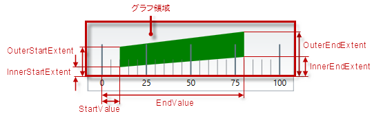
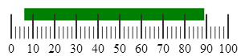

# 比較範囲の構成 (igLinearGauge)

import ApiLink from 'docs-template/components/mdx/ApiLink.astro';

# 比較範囲の構成 (igLinearGauge)


##トピックの概要

### 目的

このトピックではコード例を使用して、`igLinearGauge`™ コントロールの範囲を構成する方法を説明します。説明には、範囲の数、位置、長さ、幅、および書式設定が含まれます。

### 前提条件

このトピックを理解するために、以下のトピックを参照することをお勧めします。

-	[igLinearGauge の概要](/iglineargauge-overview): このトピックは、主要機能、最小要件およびユーザー機能性など、`igLinearGauge` コントロールの概念的な情報を提供します。

-	[igLinearGauge の追加](/iglineargauge-adding): このトピック グループでは、`igLinearGauge` コントロールを HTML ページと ASP.NET MVC アプリケーションに追加する方法を説明します。

### このトピックの内容

このトピックは、以下のセクションで構成されます。

-   [比較範囲の構成](#configuring-comparative-ranges)
    -   [比較範囲構成の概要](#comparative-ranges-summary)
    -   [比較範囲構成の概要表](#comparative-ranges-summary-chart)
    -   [プロパティ設定](#property-settings)
    -   [例](#example)
-   [関連コンテンツ](#related-topics)
    -   [トピック](#topics)
    -   [サンプル](#samples)


##<a id="configuring-comparative-ranges"></a>比較範囲の構成


### <a id="comparative-ranges-summary"></a>比較範囲構成の概要

`igLinearGauge` コントロールは、その範囲オブジェクトをインスタンス化することで複数の比較範囲をサポートします。



各範囲は、スケールのメジャーでの開始値や終了値、塗りつぶし色、および境界線の幅や色を指定することで個別に構成できます。スケール全域での比較範囲のサイズは、内側と外側の余白を調整して構成します。

### <a id="comparative-ranges-summary-chart"></a>比較範囲構成の概要表

以下の表で、`igLinearGauge` コントロールの比較範囲で構成できる要素を簡単に説明し、構成に使用するプロパティにマップします。

<table class="table table-bordered">
    <thead>
        <tr>
            <th colspan="2">構成可能な要素</th>
            <th>プロパティ</th>
            <th>デフォルト値</th>
</tr>
    </thead>
    <tbody>
        <tr>
            <th colspan="2">グラフに表示する範囲の数値</th>
            <td><ApiLink type="igLinearGauge" member="ranges" section="options" label="ranges" /></td>
            <td>設定されていません</td>
</tr>
        <tr>
            <th rowspan="6" colspan="2">長さ、幅、位置</th>
            <td><ApiLink type="igLinearGauge" member="startValue" section="options" label="startValue" /></td>
            <td>設定されていません</td>
</tr>
        <tr>
            <td><ApiLink type="igLinearGauge" member="endValue" section="options" label="endValue" /></td>
            <td>設定されていません</td>
</tr>
        <tr>
            <td><ApiLink type="igLinearGauge" member="innerStartExtent" section="options" label="innerStartExtent" /></td>
            <td>設定されていません</td>
</tr>
        <tr>
            <td><ApiLink type="igLinearGauge" member="innerEndExtent" section="options" label="innerEndExtent" /></td>
            <td>設定されていません</td>
</tr>
        <tr>
            <td><ApiLink type="igLinearGauge" member="outerStartExtent" section="options" label="outerStartExtent" /></td>
            <td>設定されていません</td>
</tr>
        <tr>
            <td><ApiLink type="igLinearGauge" member="outerEndExtent" section="options" label="outerEndExtent" /></td>
            <td>設定されていません</td>
</tr>
        <tr>
            <th rowspan="3">ルック アンド フィール</th>
            <th>塗りつぶし色</th>
            <td><ApiLink type="igLinearGauge" member="ranges.brush" section="options" label="brush" /></td>
            <td>デフォルトのテーマで定義済み</td>
</tr>
        <tr>
            <th>境界線の色</th>
            <td><ApiLink type="igLinearGauge" member="ranges.outline" section="options" label="outline" /></td>
            <td>デフォルトのテーマで定義済み</td>
</tr>
        <tr>
            <th>境界線の線幅</th>
            <td><ApiLink type="igLinearGauge" member="ranges.strokeThickness" section="options" label="strokeThickness" /></td>
            <td>1.0</td>
</tr>
        <tr>
            <th colspan="2">ツールチップ</th>
            <td><ApiLink type="igLinearGauge" member="rangeToolTipTemplate" section="options" label="rangeToolTipTemplate" /></td>
            <td>ハイフン (-) で区切られた範囲の開始値と終了値です。</td>
</tr>
    </tbody>
</table>


>**注: **各範囲の brush および outline プロパティに明示的に値を設定しない場合、値は `igLinearGauge` の `rangeBrushes` および `rangeOutlines` オブジェクトの値から読み取られます。値は、各範囲の色やアウトラインの塗りつぶしの設定に継続して使用するブラシ セットの事前定義にも使用できます。

### <a id="property-settings"></a>プロパティ設定

以下の表では、任意の動作と各プロパティ設定のマップを示します。

<table class="table table-bordered">
    <thead>
        <tr>
            <th colspan="3">構成の目的:</th>
            <th rowspan="2">使用するプロパティ:</th>
            <th rowspan="2">設定の選択肢:</th>
</tr>
    </thead>
    <tbody>
        <tr>
            <th colspan="2">要素</th>
            <th>詳細</th>
</tr>
        <tr>
            <th colspan="2">名前</th>
            <td>範囲の名前。 ツールチップで表示するために使用。</td>
            <td><ApiLink type="igLinearGauge" member="caption" section="options" label="caption" /></td>
            <td>範囲の名前を表す文字列</td>
</tr>
        <tr>
            <th rowspan="2">[]()スケールに沿った位置</th>
            <th>範囲開始</th>
            <td>スケールで範囲を開始する位置</td>
            <td><ApiLink type="igLinearGauge" member="startValue" section="options" label="startValue" /></td>
            <td>スケールのメジャーにおける任意の値</td>
</tr>
        <tr>
            <th>範囲終了</th>
            <td>スケールで範囲を終了する位置</td>
            <td><ApiLink type="igLinearGauge" member="endValue" section="options" label="endValue" /></td>
            <td>スケールのメジャーにおける任意の値</td>
</tr>
        <tr>
            <th rowspan="4">幅と位置 <br /> (スケール全域)</th>
            <th>範囲の始点側の端の内側の頂点</th>
            <td>[予約領域](/iglineargauge-overview#graph-area)の端からのスケール全域における始点側の端の内側の頂点位置。 (内側の頂点は、予約領域の端に最も近い始点側の端の地点です。)</td>
            <td><ApiLink type="igLinearGauge" member="innerStartExtent" section="options" label="innerStartExtent" /></td>
            <td>方向 (水平 / 垂直) に応じた、[グラフ領域](/iglineargauge-overview#graph-area)の高さと幅の相対部分として望ましい値。小数で指定 (例: 0.2)</td>
</tr>
        <tr>
            <th>範囲の終点側の端の内側の頂点</th>
            <td>予約領域の端からのスケール全域における終点側の端の内側の頂点位置。</td>
            <td><ApiLink type="igLinearGauge" member="innerEndExtent" section="options" label="innerEndExtent" /></td>
            <td>方向 (水平 / 垂直) に応じた、グラフ領域の高さと幅の相対部分として望ましい値。小数で指定 (例: 0.3)</td>
</tr>
        <tr>
            <th>範囲の始点側の端の外側の頂点</th>
            <td>予約領域の端からのスケール全域における始点側の端の外側の頂点位置。 (外側の頂点は、予約領域の端に最も近い始点側の端の地点です。)</td>
            <td><ApiLink type="igLinearGauge" member="outerStartExtent" section="options" label="outerStartExtent" /></td>
            <td>方向 (水平 / 垂直) に応じた、グラフ領域の高さと幅の相対部分として望ましい値。小数で指定 (例: 0.7)</td>
</tr>
        <tr>
            <th>範囲の終点側の端の外側の頂点</th>
            <td>予約領域の端からのスケール全域における終点側の端の外側の頂点位置。</td>
            <td><ApiLink type="igLinearGauge" member="outerEndExtent" section="options" label="outerEndExtent" /></td>
            <td>方向 (水平 / 垂直) に応じた、グラフ領域の高さと幅の相対部分として望ましい値。小数で指定 (例: 0.8)</td>
</tr>
        <tr>
            <th rowspan="3">ルック アンド フィール</th>
            <th>塗りつぶし色</th>
            <td>範囲の塗りつぶし色</td>
            <td><ApiLink type="igLinearGauge" member="brush" section="options" label="brush" /></td>
            <td>任意の色</td>
</tr>
        <tr>
            <th>境界線の線幅</th>
            <td>範囲の境界線の幅</td>
            <td><ApiLink type="igLinearGauge" member="strokeThickness" section="options" label="strokeThickness" /></td>
            <td>任意の値 (ピクセル)</td>
</tr>
        <tr>
            <th>境界線の色</th>
            <td>範囲の境界線の色</td>
            <td><ApiLink type="igLinearGauge" member="ranges.outline" section="options" label="outline" /></td>
            <td>任意の色</td>
</tr>
        <tr>
            <th colspan="2">ツールチップ</th>
            <td>比較範囲のツールチップの内容</td>
            <td><ApiLink type="igLinearGauge" member="rangeToolTipTemplate" section="options" label="rangeToolTipTemplate" /></td>
            <td>任意のテンプレート (詳細は、[ツールチップの構成 (LinearGauge)](/iglineargauge-configuring-the-tooltips) を参照)</td>
</tr>
    </tbody>
</table>


### <a id="example"></a>例

以下のスクリーンショットは、以下の設定の結果、`igLinearGauge` に追加した比較範囲の外観がどのようになるか示しています。

プロパティ|値
---|---
<ApiLink type="igLinearGauge" label="brush" />|"Green"
<ApiLink type="igLinearGauge" label="caption" />|"range1"
<ApiLink type="igLinearGauge" label="startValue" />|“6”
<ApiLink type="igLinearGauge" label="endValue" />|“89”
<ApiLink type="igLinearGauge" label="innerStartExtent" />|“0.5”
<ApiLink type="igLinearGauge" label="innerEndExtent" />|“0.5”
<ApiLink type="igLinearGauge" label="outerStartExtent" />|“0.8”
<ApiLink type="igLinearGauge" label="outerEndExtent" />|“0.8”
<ApiLink type="igLinearGauge" label="outline" />|"Black"




以下のコードはこの例を実装します。

**JavaScript の場合:**

```js
$(function () {
    $("#linearGauge").igLinearGauge({
        width: "300px",
        height: "70px",
        ranges: [{
             name: 'range1',
             brush:'#008000',
             startValue:"6",
             endValue:"89",
             innerStartExtent:"0.5",
             innerEndExtent:"0.5",
             outerStartExtent:"0.8",
             outerEndExtent:"0.8"
        }]    
	});
});
```


##<a id="related-topics"></a>関連コンテンツ

### <a id="topics"></a>トピック

このトピックの追加情報については、以下のトピックも合わせてご参照ください。

-	[スケールの構成 (igLinearGauge)](/iglineargauge-configuring-the-scale): このトピックではコード例を使用して、`igLinearGauge` コントロールのスケールを構成する方法を説明します。説明には、コントロール内のスケールの配置、スケールの目盛およびラベルの構成が含まれます。

-	[針の構成 (igLinearGauge)](/iglineargauge-configuring-the-needle): このトピックではコード例を使用して、`igLinearGauge` コントロールの針を構成する方法を説明します。説明には、針が示す値、幅、位置、および書式設定が含まれます。

-	[背景の構成 (igLinearGauge)](/iglineargauge-configuring-the-background): このトピックではコード例を使用して、リニア ゲージの背景を構成する方法を説明します。説明には、背景のサイズ、位置、色、および境界線の設定が含まれます。

-	[ツールチップの構成 (igLinearGauge)](/iglineargauge-configuring-the-tooltips): このトピックではコード例を使用して、`igLinearGauge` コントロールのツールチップを有効にする方法および表示する遅延時間を設定する方法を説明します。


### <a id="samples"></a>サンプル

このトピックについては、以下のサンプルも参照してください。

-	[範囲設定](\{environment:SamplesUrl\}/linear-gauge/range-settings): このサンプルでは、`igLinearGauge` コントロールで比較範囲を設定する方法を紹介します。


 

 


