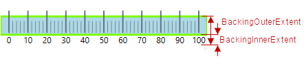
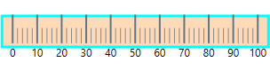

---
title: "背景の構成 (igLinearGauge)"
slug: iglineargauge-configuring-the-background
---

# 背景の構成 (igLinearGauge)


##トピックの概要


### 目的

このトピックではコード例を使用して、リニア ゲージの背景を構成する方法を説明します。説明には、背景のサイズ、位置、色、および境界線の設定が含まれます。

### 前提条件

このトピックを理解するために、以下のトピックを参照することをお勧めします。

-	[igLinearGauge の概要](/iglineargauge-overview): このトピックは、主要機能、最小要件およびユーザー機能性など、`igLinearGauge` コントロールの概念的な情報を提供します。

-	[igLinearGauge の追加](/iglineargauge-adding): このトピック グループでは、`igLinearGauge` コントロールを HTML ページと ASP.NET MVC アプリケーションに追加する方法を示します。


### このトピックの内容

このトピックは、以下のセクションで構成されます。

-   [背景の構成](#configuring-background)
    -   [背景構成の概要](#background-config-summary)
    -   [背景構成の概要表](#background-congic-chart)
    -   [プロパティ設定](#property-settings)
    -   [例](#example)
-   [関連コンテンツ](#related-content)
    -   [トピック](#topics)


##<a id="configuring-background"></a>背景の構成

### <a id="background-config-summary"></a>背景構成の概要

`igLinearGauge` コントロールの背景は、スプレッドと位置、およびルック アンド フィール (塗りつぶしと境界線) の構成が可能です。スプレッドおよび位置は、スケール全域のディメンションで [backingInnerExtent](&#123;environment:jQueryApiUrl&#125;/ui.igLinearGauge#options:backingInnerExtent) および [backingOuterExtent](&#123;environment:jQueryApiUrl&#125;/ui.igLinearGauge#options:backingOuterExtent) プロパティを介して構成できます。背景はスケールに沿って、常にコントロールの一方の端から他方の端に広がります。塗りつぶし色および境界線は、スタイル テンプレートで利用できるプロパティのセットにより管理されます。

以下の図は、背景がオレンジ色で境界線が線幅 3 ピクセルのシアン色の構成を示しています。背景の範囲は [backingInnerExtent](&#123;environment:jQueryApiUrl&#125;/ui.igLinearGauge#options:backingInnerExtent) および [backingOuterExtent](&#123;environment:jQueryApiUrl&#125;/ui.igLinearGauge#options:backingOuterExtent) プロパティで値を指定すると小さくなります。



### <a id="background-congic-chart"></a>背景構成の概要表

以下の表で、`igLinearGauge` コントロールの背景で構成できる要素を簡単に説明し、構成に使用するプロパティにマップします。

<table class="table table-bordered">
    <thead>
        <tr>
            <th colspan="2">構成可能な要素</th>
            <th>プロパティ</th>
            <th>デフォルト値</th>
</tr>
    </thead>
    <tbody>
        <tr>
            <th rowspan="2" colspan="2">スプレッドおよび位置 <br /> (スケール全域)</th>
            <td>[backingInnerExtent](&#123;environment:jQueryApiUrl&#125;/ui.igLinearGauge#options:backingInnerExtent)</td>
            <td>0</td>
</tr>
        <tr>
            <td>[backingOuterExtent](&#123;environment:jQueryApiUrl&#125;/ui.igLinearGauge#options:backingOuterExtent)</td>
            <td>1.0</td>
</tr>
        <tr>
            <th rowspan="3">ルック アンド フィール</th>
            <th>塗りつぶし色</th>
            <td>[backingBrush](&#123;environment:jQueryApiUrl&#125;/ui.igLinearGauge#options:backingBrush)</td>
            <td>デフォルトのテーマで定義済み</td>
</tr>
        <tr>
            <th>境界線の色</th>
            <td>[backingOutline](&#123;environment:jQueryApiUrl&#125;/ui.igLinearGauge#options:backingOutline)</td>
            <td>デフォルトのテーマで定義済み</td>
</tr>
        <tr>
            <th>境界線の線幅</th>
            <td>[backingStrokeThickness](&#123;environment:jQueryApiUrl&#125;/ui.igLinearGauge#options:backingStrokeThickness)</td>
            <td>2.0</td>
</tr>
    </tbody>
</table>


### <a id="property-settings"></a>プロパティ設定

以下の表では、任意の動作と各プロパティ設定のマップを示します。

<table class="table table-bordered">
    <tbody>
        <tr>
            <th colspan="3">構成の目的:</th>
            <th rowspan="2">使用するプロパティ:</th>
            <th rowspan="2">設定の選択肢:</th>
</tr>
        <tr>
            <th colspan="2">要素</th>
            <th>詳細</th>
</tr>
        <tr>
            <th rowspan="2">スプレッドおよび位置 <br /> (スケール全域)</th>
            <th>下端 / 左端の位置</th>
            <td>水平方向で[グラフ領域](/iglineargauge-overview#graph-area)の下端または垂直方向でグラフ領域の左端に対する背景の下端 (水平方向) または左端 (垂直方向) の位置。</td>
            <td>[backingInnerExtent](&#123;environment:jQueryApiUrl&#125;/ui.igLinearGauge#options:backingInnerExtent)</td>
            <td>方向に応じた、グラフ領域の高さと幅の相対部分として望ましい値。小数で指定 (例: 0.2)</td>
</tr>
        <tr>
            <th>上端 / 左端の位置</th>
            <td>水平方向でグラフ領域の下端または垂直方向でグラフ領域の左端に対する背景の上端 (水平方向) または右端 (垂直方向) の位置。</td>
            <td>[backingOuterExtent](&#123;environment:jQueryApiUrl&#125;/ui.igLinearGauge#options:backingOuterExtent)</td>
            <td>方向に応じた、グラフ領域の高さと幅の相対部分として望ましい値。小数で指定 (例: 0.2)</td>
</tr>
        <tr>
            <th rowspan="3">ルック アンド フィール</th>
            <th>塗りつぶし色</th>
            <td>背景の塗りつぶし色</td>
            <td>[backingBrush](&#123;environment:jQueryApiUrl&#125;/ui.igLinearGauge#options:backingBrush)</td>
            <td>任意の色</td>
</tr>
        <tr>
            <th>境界線の線幅</th>
            <td>背景の境界線幅</td>
            <td>[backingStrokeThickness](&#123;environment:jQueryApiUrl&#125;/ui.igLinearGauge#options:backingStrokeThickness)</td>
            <td>任意の値 (ピクセル)</td>
</tr>
        <tr>
            <th>境界線の色</th>
            <td>背景の境界線色</td>
            <td>[backingOutline](&#123;environment:jQueryApiUrl&#125;/ui.igLinearGauge#options:backingOutline)</td>
            <td>任意の色</td>
</tr>
    </tbody>
</table>


### <a id="example"></a>例

以下のスクリーンショットは、以下の設定の結果、`igLinearGauge` の外観がどのようになるか示しています。

プロパティ|値
---|---
[backingBrush](&#123;environment:jQueryApiUrl&#125;/ui.igLinearGauge#options:backingBrush)|'#FFDAB9'
[backingOutline](&#123;environment:jQueryApiUrl&#125;/ui.igLinearGauge#options:backingOutline)|'#00FFFF'
[backingStrokeThickness](&#123;environment:jQueryApiUrl&#125;/ui.igLinearGauge#options:backingStrokeThickness)|“3”
[backingInnerExtent](&#123;environment:jQueryApiUrl&#125;/ui.igLinearGauge#options:backingInnerExtent)|“0.2”
[backingOuterExtent](&#123;environment:jQueryApiUrl&#125;/ui.igLinearGauge#options:backingOuterExtent)|“0.7”



以下のコードはこの例を実装します。

**JavaScript の場合:**

```js
 $(function () {             
    $("#linearGauge").igLinearGauge({
        width: "300px",
        height: "70px",
        backingBrush:'#FFDAB9',
        backingOutline: '#00FFFF',
        backingStrokeThickness: "3",
        backingInnerExtent:"0.2",
        backingOuterExtent:"0.7"
  });
```


##<a id="related-content"></a>関連コンテンツ

### <a id="topics"></a>トピック

このトピックの追加情報については、以下のトピックも合わせてご参照ください。

-	[スケールの構成 (igLinearGauge)](/iglineargauge-configuring-the-scale): このトピックではコード例を使用して、`igLinearGauge` コントロールのスケールを構成する方法を説明します。説明には、コントロール内のスケールの配置、スケールの目盛およびラベルの構成が含まれます。

-	[針の構成 (igLinearGauge)](/iglineargauge-configuring-the-needle): このトピックではコード例を使用して、`igLinearGauge` コントロールの針を構成する方法を説明します。説明には、針が示す値、幅、位置、および書式設定が含まれます。

-	[比較範囲の構成 (igLinearGauge)](/iglineargauge-configuring-comparative-ranges): このトピックではコード例を使用して、`igLinearGauge` コントロールの範囲を構成する方法を説明します。説明には、範囲の数、位置、長さ、幅、および書式設定が含まれます。

-	[ツールチップの構成 (igLinearGauge)](/iglineargauge-configuring-the-tooltips): このトピックではコード例を使用して、`igLinearGauge` コントロールのツールチップを有効にする方法および表示する遅延時間を設定する方法を説明します。


 

 


